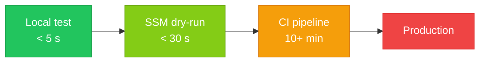

# Knowledge Base Schema

This is a personal knowledge base built on the **LLM Wiki** pattern. The LLM reads raw source documents from projects and incrementally builds a structured, interlinked wiki of markdown files. The human curates sources and directs exploration; the LLM does all summarizing, cross-referencing, filing, and maintenance.

## Domain

DevOps, System Design, Software Engineering, **AI Engineering** — drawn from real project implementations. The wiki serves three downstream uses:

1. **Portfolio articles** — polished content for public consumption
2. **Chatbot Q&A** — a queryable knowledge base on a portfolio site
3. **Documentation** — troubleshooting steps, design decisions, executable commands

## Architecture

### Layer 1: Raw Sources (`raw/`)

Immutable source documents. The LLM reads from these but **never modifies them**. These are `.md` files copied from project repositories — structured knowledge base docs covering code implementation, system design, DevOps workflows, and related topics.

Organize by project:

```
raw/
├── project-name-1/
│   ├── overview.md
│   ├── architecture.md
│   └── ...
├── project-name-2/
│   └── ...
└── assets/         # images referenced by source docs
```

### Layer 2: The Wiki (`wiki/`)

LLM-generated and LLM-maintained markdown files. Organized by type:

```
wiki/
├── projects/          # one page per project — summary, architecture, tech stack, links
├── concepts/          # system design & engineering concepts (e.g., event-driven-architecture.md)
├── tools/             # technology & tool pages (e.g., docker.md, terraform.md, kubernetes.md)
├── patterns/          # design & architectural patterns (e.g., circuit-breaker.md, cqrs.md)
├── troubleshooting/   # problem → diagnosis → solution pages
├── commands/          # executable command references grouped by tool or workflow
├── comparisons/       # side-by-side analyses (e.g., ecs-vs-eks.md)
└── ai-engineering/    # LLM system design, inference-time techniques, prompt engineering, RAG patterns
```

### Layer 3: This File (`CLAUDE.md`)

The schema. Defines conventions, page formats, and workflows. Co-evolved by the human and LLM over time.

## Page Conventions

### Frontmatter

Every wiki page starts with YAML frontmatter:

```yaml
---
title: Page Title
type: project | concept | tool | pattern | troubleshooting | command | comparison | source-summary
tags: [relevant, tags]
sources: [source-file-paths]    # which raw sources informed this page
created: YYYY-MM-DD
updated: YYYY-MM-DD
---
```

### Links

Use Obsidian-style wikilinks: `[[page-name]]`. When referencing a page in a subdirectory, use `[[projects/my-project]]` or just `[[my-project]]` if the name is unique.

Cross-reference aggressively. Every mention of a known project, tool, concept, or pattern should be a link. This is what makes the wiki valuable — the connections are pre-built.

### Diagrams

Use **Mermaid** for any visual representation. Never use ASCII art or plain-text spacing to convey structure.

Fenced code blocks with ` ```mermaid ` are rendered as interactive SVG diagrams in portfolio-doc (dark mode aware, responsive).

| Content | Mermaid type |
|---------|-------------|
| Pipelines, flows, step sequences | `flowchart LR` or `flowchart TD` |
| Cost / complexity spectrums | `flowchart LR` with colour-coded nodes |
| Architecture overviews | `flowchart TD` |
| State machines, lifecycle | `stateDiagram-v2` |
| Request / interaction sequences | `sequenceDiagram` |
| Timelines | `timeline` |
| Comparisons (2 options) | `flowchart LR` with two parallel branches |

**Spectrum example** (replacing plain-text "cheapest → most expensive" lines):



**Rules:**
- Always add `style` directives for colour — unlabelled nodes blend into the background.
- Use `\n` for multi-line node labels, not `<br>`.
- Keep node labels short (≤ 4 words or one short metric). Put detail in prose below the diagram.
- Do not embed Mermaid in tables or nested lists — place diagrams at the section level.

### Writing Style

- **Factual and direct.** No filler, no marketing language.
- **Implementation-focused.** Emphasize how things actually work, not abstract theory.
- **Source-grounded.** Claims should trace back to raw sources or direct observation.
- **Code snippets welcome.** Include relevant config, commands, or code when they clarify.

## Operations

### 1. Ingest

When told to ingest a source (a `.md` file or set of files from a project repo):

1. Read the source document(s) fully.
2. Discuss key takeaways with the user — what's notable, what's new, what contradicts existing wiki content.
3. Create or update a **source summary** noting what was ingested and key facts extracted.
4. Create or update the **project page** in `wiki/projects/`.
5. Create or update relevant **concept**, **tool**, **pattern**, **troubleshooting**, and **command** pages across the wiki.
6. Add wikilinks in all directions — new pages link to existing ones, existing pages get updated to link to new ones.
7. Update `index.md`.
8. Append to `log.md`.

A single source may touch 5–15 wiki pages. That's expected and desired.

### 2. Query

When asked a question:

1. Read `index.md` to find relevant pages.
2. Read those pages.
3. Synthesize an answer with `[[wikilinks]]` to relevant pages.
4. If the answer produces something worth keeping (a comparison, an analysis, a connection), offer to file it as a new wiki page.

### 3. Lint

When asked to health-check the wiki:

- Find contradictions between pages.
- Find stale claims superseded by newer sources.
- Find orphan pages (no inbound links).
- Find concepts mentioned but lacking their own page.
- Find missing cross-references.
- Suggest new questions to investigate or sources to add.
- Check that `index.md` is complete and accurate.

### 4. Generate

When asked to generate content for downstream use (portfolio articles, chatbot training data, documentation pages):

1. Identify relevant wiki pages.
2. Synthesize content in the requested format.
3. Cite source wiki pages so the output is traceable.
4. Offer to save the generated content if it belongs in the wiki.

## Special Files

### `index.md`

Content catalog of all wiki pages. Organized by category. Each entry: link + one-line summary. The LLM reads this first when answering queries. Updated on every ingest.

### `log.md`

Append-only chronological record. Format:

```markdown
## [YYYY-MM-DD] operation | Description
- Details of what was done
- Pages created or updated
```

Parseable with: `grep "^## \[" log.md | tail -5`

## Conventions

- File names: `kebab-case.md` (e.g., `event-driven-architecture.md`)
- One concept per page. If a page covers two distinct things, split it.
- Prefer updating existing pages over creating new ones when the content belongs together.
- When in doubt about where something goes, ask the user.
- Tag pages consistently. Common tags: `aws`, `docker`, `kubernetes`, `terraform`, `ci-cd`, `networking`, `security`, `databases`, `architecture`, `python`, `typescript`, `golang`.
