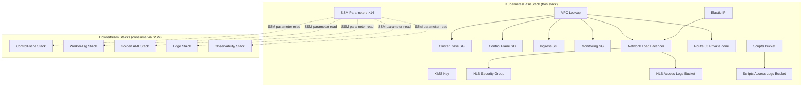
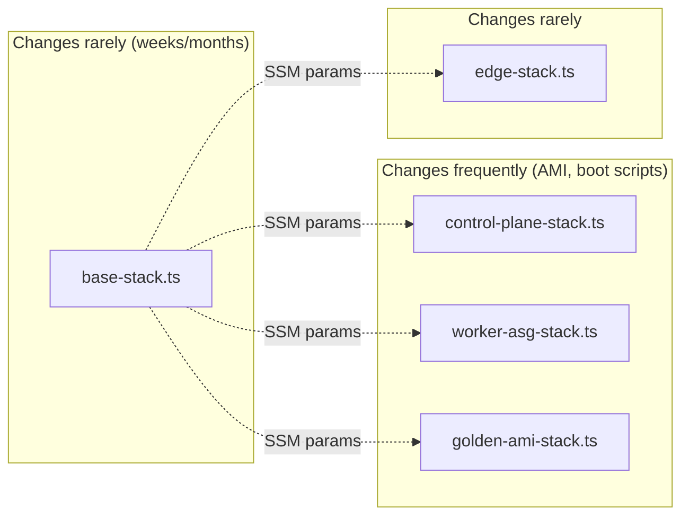
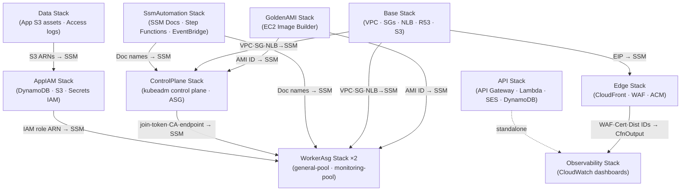
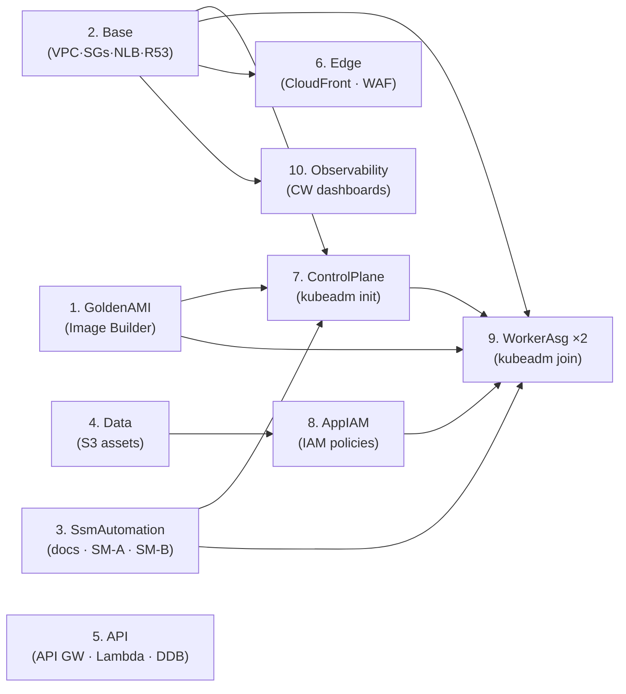

# KubernetesBaseStack — CDK Architecture Review

> **File**: [base-stack.ts](file:///Users/nelsonlamounier/Desktop/portfolio/cdk-monitoring/infra/lib/stacks/kubernetes/base-stack.ts)
> **Lines**: 561 | **Resources Created**: ~15 AWS resources | **SSM Outputs**: 14

> [!NOTE]
> **Last reviewed against source:** April 2026.
> The legacy standalone `ec2.Volume` + EBS-detach Lambda pattern has been **replaced** by a
> second block-device EBS volume (`/dev/xvdf`) declared directly in the `LaunchTemplate`.
> Cluster state is recovered from **S3-based etcd snapshots** on node replacement — the data
> volume itself is ephemeral (`deleteOnTermination: true`). The EIP is attached to the **NLB
> via SubnetMapping** — persistent connectivity flows through the NLB, not via direct
> `ec2:AssociateAddress` on instance boot.

---

## 1. What Is This Stack?

The `KubernetesBaseStack` is the **foundation layer** of the Kubernetes infrastructure. It provisions all the **long-lived, rarely-changing resources** that the cluster depends on — networking, security, DNS, and load balancing.

It is deliberately **decoupled from the compute layer** (EC2 instances, ASGs, AMIs) so that:
- Updating an AMI or changing a boot script **does not** trigger a CloudFormation update on VPC, SGs, or the NLB
- Destroying the compute/control-plane stacks **does not** destroy networking infrastructure
- The base resources remain stable for **weeks/months** between changes



---

## A. IaC Primer — AWS CDK Concepts Used in This Codebase

> [!NOTE]
> **New to CDK or IaC?** This section explains the key concepts before you read the stack documentation.
> **Already familiar?** Skip straight to [§2. Services Created](#2-services-created--full-breakdown).

### Solo-Developer Environment & Account Strategy

> [!IMPORTANT]
> Understanding this section explains many design decisions throughout the codebase —
> why configs exist for three environments but only one is actively deployed.

#### Original Design: 3-Account AWS Organisation Model

The infrastructure was originally designed for a **4-account AWS Organisation**:

| Account | Purpose | Account ID | Status |
|---|---|---|---|
| **Management / Root** | AWS Org root, SCPs, Budgets, GuardDuty aggregation | `711387127421` | Active (org management only) |
| **Development** | Developer testing, short-lived infra, lax policies | `771826808455` | **Active — current live environment** |
| **Staging** | Pre-production mirror, production-like policies | `692738841103` | Configured, not deployed |
| **Production** | Live site, strict policies, `RETAIN` on all state | `607700977986` | Configured, not deployed |

This is the **AWS Well-Architected account vending model** — each environment has blast-radius isolation, separate IAM boundaries, separate billing, and separate CloudTrail. A buggy CDK deploy against `development` cannot touch `production` state.

The account IDs are hard-coded in `environments.ts` — deliberately, not via environment variables — because the account identity of each environment is **infrastructure constants**, not secrets:

```typescript
// lib/config/environments.ts
const environments: Record<Environment, EnvironmentConfig> = {
    [Environment.DEVELOPMENT]: {
        account: '771826808455',  // ← dev account
        region: 'eu-west-1',
        edgeRegion: 'us-east-1',
    },
    [Environment.STAGING]: {
        account: '692738841103',  // ← staging account (configured, not active)
        region: 'eu-west-1',
        edgeRegion: 'us-east-1',
    },
    [Environment.PRODUCTION]: {
        account: '607700977986',  // ← production account (configured, not active)
        region: 'eu-west-1',
        edgeRegion: 'us-east-1',
    },
    [Environment.MANAGEMENT]: {
        account: fromEnv('ROOT_ACCOUNT') ?? '711387127421',  // ← management
        region: 'eu-west-1',
        edgeRegion: 'us-east-1',
    },
};
```

The management account is also special: its ID can be overridden via `ROOT_ACCOUNT` env var — useful if the management account ever needs to rotate without a code change.

#### Current Reality: Development Account as Live Production

As a **solo developer**, maintaining 3 active AWS accounts means:
- 3× the AWS support plan costs
- 3× the baseline service overhead (CloudTrail, Config, GuardDuty per account)
- 3× the CI/CD credential sets to maintain
- No team requiring blast-radius isolation between people

The strategic decision was made to **run the live portfolio site (`nelsonlamounier.com`) from the `development` account** (`771826808455`) while the `staging` and `production` accounts remain provisioned but idle.

> [!CAUTION]
> This means `development` account infrastructure carries **real user traffic**. The Kubernetes
> cluster, CloudFront distribution, NLB, and all API Gateway endpoints in this document are
> running under account `771826808455`. "Development" is purely a CDK context label — it does
> not mean "not production traffic".

#### What Remains Configured for Future Migration

The entire 3-environment config surface is **fully maintained in the codebase** so that migrating to a true multi-account deployment requires zero code changes — only CI/CD credential rotation:

**Behaviour differences encoded per environment** (in `lib/config/nextjs.ts`):

| Configuration | `development` (current live) | `staging` (ready) | `production` (ready) |
|---|---|---|---|
| `removalPolicy` | `DESTROY` | `DESTROY` | `RETAIN` |
| `isProduction` | `false` | `false` | `true` |
| `deletionProtection` (ALB) | `false` | `false` | `true` |
| `enableLogEncryption` | `false` (cost) | `true` | `true` |
| `enableCircuitBreaker` | `false` (fast iteration) | `true` | `true` |
| `logRetention` | `ONE_MONTH` | `THREE_MONTHS` | `ONE_YEAR` |
| `minHealthyPercent` (deploy) | `0` | `50` | `50` |
| CloudFront `priceClass` | `PRICE_CLASS_100` (EU only) | `PRICE_CLASS_200` | `PRICE_CLASS_ALL` |
| Default domain | `dev.nelsonlamounier.com` | `staging.nelsonlamounier.com` | `nelsonlamounier.com` |

> [!TIP]
> When the time comes to activate `staging` or `production`, the steps are:
> 1. Add AWS credentials for the target account to GitHub Secrets
> 2. Point `DOMAIN_NAME`, `HOSTED_ZONE_ID`, `CROSS_ACCOUNT_ROLE_ARN` at the target account
> 3. Run `cdk deploy -c project=kubernetes -c environment=staging` (or `production`)
> 4. All resource behaviour (retention, deletion protection, log encryption) automatically
>    upgrades to the environment's pre-configured policy

#### How This Affects CDK Synth

When CI runs `cdk deploy -c project=kubernetes -c environment=development`, the `cdkEnvironment()` helper resolves the stack `env` prop:

```typescript
// lib/config/environments.ts
export function cdkEnvironment(env: Environment): cdk.Environment {
    const config = environments[env];
    return {
        account: config.account,  // → '771826808455'
        region: config.region,    // → 'eu-west-1'
    };
}
```

This is passed to every stack in the factory:

```typescript
// lib/projects/kubernetes/factory.ts
const env = cdkEnvironment(environment);  // { account: '771826808455', region: 'eu-west-1' }

const baseStack = new KubernetesBaseStack(scope, 'Kubernetes-Base-development', {
    env,  // ← CloudFormation deploys to this specific AWS account + region
    ...
});
```

CloudFormation uses the `account` field to validate that the deploying credentials match the target account. If you accidentally deploy `development` config with `production` account credentials, CloudFormation will reject the deployment — the account isolation is enforced at the CloudFormation API layer, not just by convention.

#### The `management` Account and the `org` Project

The 4th account — `management` (`711387127421`) — is active but serves a different purpose. It hosts the `org` project (`-c project=org`), which contains:

- AWS Organizations SCPs (service control policies)
- AWS Budgets and cost alerts (`SharedProjectFactory` → `FinOpsStack`)
- GuardDuty + Security Hub organisation-level aggregation
- Cross-account trust policies for the `Org` project

The `OrgProjectFactory` is the only factory that **must be deployed to the management account**. All other factories deploy to the account that matches their `environment` parameter.

```typescript
// lib/projects/org/factory.ts — note: always targets management account
// Deploy this project to the management/root account only.
env: {
    account: process.env.ROOT_ACCOUNT || process.env.CDK_DEFAULT_ACCOUNT,
    region: 'eu-west-1',
}
```

---

### What is Infrastructure as Code (IaC)?

IaC means defining and managing cloud infrastructure using **code** instead of clicking in the AWS Console. The code is version-controlled, reviewed like any other software, and deployed by a CI/CD pipeline — not by hand.

This project uses **AWS CDK (Cloud Development Kit)** as its IaC tool.

### Why CDK over Terraform or plain CloudFormation?

| Alternative | Why CDK wins for this project |
|---|---|
| **AWS Console (clicking)** | Not reproducible, not versionable, error-prone at scale |
| **CloudFormation YAML/JSON** | Verbose, no type-safety, no loops or conditionals |
| **Terraform** | Multi-cloud generalist — excellent, but no native AWS type system |
| **AWS CDK** | TypeScript with full AWS type-safety, IDE autocomplete, reusable constructs, synthesises to CloudFormation |

### The CDK Mental Model: Synthesise → Deploy

```
TypeScript Code  →  cdk synth  →  CloudFormation Template JSON  →  cdk deploy  →  AWS Resources
     (you write)       (CDK)              (generated)                 (CDK)          (live infra)
```

1. **You write TypeScript** — classes, loops, conditions, functions — all normal code
2. **`cdk synth`** compiles your TypeScript into one or more CloudFormation JSON templates
3. **`cdk deploy`** sends those templates to AWS CloudFormation, which creates/updates/deletes real AWS resources

The CloudFormation JSON is an **implementation detail** — you never write or read it directly.

### CDK Construct Levels (L1 / L2 / L3)

CDK wraps AWS resources at three levels of abstraction:

| Level | Description | Example in this codebase |
|---|---|---|
| **L1 (Cfn\*)** | 1:1 mapping to a CloudFormation resource. Raw, maximum control, verbose. | `ec2.CfnEIP` — the Elastic IP (`base-stack.ts:325`) |
| **L2** | Opinionated wrapper with safe defaults, helper methods, TypeScript types. | `ec2.SecurityGroup`, `kms.Key`, `s3.Bucket`, `elbv2.NetworkLoadBalancer` |
| **L3 (Patterns)** | Multi-resource combinations (e.g., an ECS service + ALB together). Rare here. | The custom `NetworkLoadBalancerConstruct`, `SecurityGroupConstruct`, `S3BucketConstruct` in `lib/constructs/` |

**When to use L1?** Only when the L2 doesn't expose a feature you need. In this codebase there is exactly **one** deliberate L1 choice:

```typescript
// base-stack.ts:325 — ec2.CfnEIP (L1) instead of an L2 EIP wrapper
// Reason: CDK's L2 equivalent is ec2.CfnEIP at the time of writing — no wrapping L2 exists.
// CfnEIP.attrAllocationId is then passed to the NLB SubnetMapping.
this.elasticIp = new ec2.CfnEIP(this, 'K8sElasticIp', {
    domain: 'vpc',
    tags: [{ key: 'Name', value: `${namePrefix}-k8s-eip` }],
});
```

### Custom Constructs — The `lib/constructs/` Library

This project has its own **L3 construct library** under `infra/lib/constructs/`:

```
lib/constructs/
├── compute/         ← LaunchTemplateConstruct (EC2 launch template + IAM role)
├── networking/      ← NetworkLoadBalancerConstruct, SecurityGroupConstruct
├── storage/         ← S3BucketConstruct
├── ssm/             ← SsmParameterStoreConstruct (batch SSM parameter creation)
├── iam/             ← helpers for typed IAM policies
└── observability/   ← CloudWatch log group + metric filter constructs
```

Each construct encapsulates a repeated CDK pattern so stacks stay declarative:

```typescript
// Instead of writing 4× SecurityGroup + N× addIngressRule from scratch:
const construct = new SecurityGroupConstruct(this, 'ClusterBaseSg', {
    vpc: this.vpc,
    securityGroupName: 'k8s-cluster',
    rules: SecurityGroupConstruct.fromK8sRules(config.rules, this.vpc, podCidr),
});
```

### The `cdk.App` Entrypoint — `bin/app.ts`

Every CDK project has one entry file that:
1. Creates a `cdk.App()` — the root of the construct tree
2. Parses **CDK context** (`-c project=kubernetes -c environment=dev`)
3. Calls a **factory** that instantiates all stacks for the selected project/environment
4. Applies **Aspects** (cross-cutting concerns) across all stacks

```typescript
// bin/app.ts (simplified)
const app = new cdk.App();
const factory = getProjectFactoryFromContext(projectContext, environment);
const { stacks } = factory.createAllStacks(app, { environment });

// Cross-cutting: tag every resource across every stack uniformly
stacks.forEach(stack => {
    cdk.Aspects.of(stack).add(new TaggingAspect({ environment, project, owner, version }));
});
```

### CDK Context (`-c key=value`)

CDK context passes **structural routing or deploy-time values** that cannot be in config files because they vary per deployment:

| Context key | Where used | Example |
|---|---|---|
| `-c project=kubernetes` | `app.ts` — selects which factory to run | `kubernetes`, `shared`, `org` |
| `-c environment=dev` | `app.ts` — selects dev/staging/prod config | `dev`, `staging`, `prod` |
| `-c adminAllowedIps=1.2.3.4/32` | `base-stack.ts:266` — adds Ingress SG rules | Resolved from `/admin/allowed-ips` SSM before `cdk deploy` |
| `-c nagChecks=false` | `app.ts` — disables cdk-nag in CI synth-validate | Set in speed-validation steps |

> [!TIP]
> CDK context is **not** a config system for application settings — it's for routing and deploy-time
> structural overrides. All other config (VPC names, CIDR ranges, instance types, timeouts) lives
> in the typed `configurations.ts` layer.

### `RemovalPolicy` — What Happens When You Delete a Stack

Every stateful CDK resource has a `removalPolicy` that controls what happens when CloudFormation deletes it:

| Policy | Behaviour | Used for |
|---|---|---|
| `DESTROY` | AWS deletes the resource immediately | Log groups, temporary SSM docs |
| `RETAIN` | AWS **orphans** the resource — it keeps existing after stack deletion | Route 53 A record (`base-stack.ts:451`), shared KMS keys |
| `SNAPSHOT` | Creates a snapshot before destroying (RDS/DynamoDB only) | Not used here |

```typescript
// base-stack.ts:451 — Route53 A record (k8s-api.k8s.internal) must survive stack teardown
// because worker nodes keep checking this record for the API server IP.
cfnApiRecord.applyRemovalPolicy(cdk.RemovalPolicy.RETAIN);
```

### `AwsCustomResource` — Running SDK Calls at Deploy Time

Some AWS APIs cannot be called from CloudFormation templates directly. CDK's `AwsCustomResource` wraps any AWS SDK call in a Lambda that runs **once at deploy time**:

```typescript
// base-stack.ts:218 — Look up the CloudFront origin-facing managed prefix list ID
// (the ID is region-specific; there is no CloudFormation intrinsic function for it)
const cfPrefixListLookup = new cr.AwsCustomResource(this, 'CloudFrontPrefixListLookup', {
    onCreate: {
        service: '@aws-sdk/client-ec2',
        action: 'DescribeManagedPrefixLists',
        parameters: { Filters: [{ Name: 'prefix-list-name',
            Values: ['com.amazonaws.global.cloudfront.origin-facing'] }] },
        physicalResourceId: cr.PhysicalResourceId.of('cf-prefix-list-lookup'),
    },
    policy: cr.AwsCustomResourcePolicy.fromStatements([ /* DescribeManagedPrefixLists */ ]),
});
const cfPrefixListId = cfPrefixListLookup.getResponseField('PrefixLists.0.PrefixListId');
// cfPrefixListId is now a CloudFormation token — resolved at deploy time, used in SG rules
```

### `CfnOutput` — Stack Deployment Outputs

`CfnOutput` records a value in the CloudFormation stack outputs, visible after `cdk deploy`:

```bash
# After cdk deploy, these appear in the terminal and in the CloudFormation console:
Outputs:
  KubernetesControlPlane.SsmConnectCommand = aws ssm start-session --target i-0abc...
  KubernetesControlPlane.GrafanaPortForward = aws ssm start-session --target i-0abc... --document ...
```

They serve as **human-readable deployment receipts** — not used for cross-stack wiring (that uses SSM parameters instead).

### SSM Parameters as Cross-Stack Wiring

> [!IMPORTANT]
> This is the single most important architectural decision in the IaC layer.

CDK supports cross-stack references via `Fn::ImportValue` (CloudFormation exports). This project **deliberately avoids that** and uses SSM parameters instead:

| Pattern | `Fn::ImportValue` (CDK default) | SSM Parameters (this project) |
|---|---|---|
| **Coupling** | Hard — deleting the producer stack fails if consumer exists | Loose — stacks are fully independent |
| **Update** | Consumer re-deploys when producer output changes | Consumer reads current value at runtime |
| **Ordering** | CloudFormation enforces deploy order | Deploy in any order; runtime reads succeed |
| **Visibility** | Opaque CFN reference | Named path, readable in Console/CLI |

```typescript
// Pattern: producer writes a value via SsmParameterStoreConstruct
new SsmParameterStoreConstruct(this, 'SsmOutputs', {
    environment: targetEnvironment,
    parameters: [
        { id: 'VpcId',           path: paths.vpcId,           value: this.vpc.vpcId },
        { id: 'NlbDnsName',      path: paths.nlbDnsName,      value: this.nlbConstruct.loadBalancer.loadBalancerDnsName },
        // ... 12 more
    ],
});

// Consumer reads at deploy time (avoids Fn::ImportValue tight coupling):
const nlbDnsName = ssm.StringParameter.valueForStringParameter(this, paths.nlbDnsName);
```

### Aspects — Cross-Cutting Concerns

CDK Aspects traverse the entire construct tree **after all stacks are defined** and can modify or inspect every resource. This project uses two Aspects:

- **`TaggingAspect`** — adds `environment`, `project`, `owner`, `version`, `cost-centre` tags to **every** resource across every stack (applied in `bin/app.ts`)
- **`cdk-nag`** (`applyCdkNag`) — runs AWS Solutions security checks on every resource at synth time; violations fail the build unless explicitly suppressed with `NagSuppressions`

```typescript
// bin/app.ts — applied globally to all stacks after creation
cdk.Aspects.of(stack).add(new TaggingAspect({ environment, project, owner, version }));
applyCdkNag(app, { packs: [CompliancePack.AWS_SOLUTIONS] });
```

---

### The Factory Pattern — Why It Exists and What Problem It Solves

> [!IMPORTANT]
> The Factory pattern is the **single most important structural decision** in this codebase.
> Understanding it unlocks everything else.

#### The Problem It Solves

When this project started, the CDK entrypoint (`bin/app.ts`) directly instantiated every stack:

```typescript
// ❌ Early version — all stacks hard-coded in app.ts
new NextJsComputeStack(app, 'NextJsCompute', { env, ... });
new MonitoringStack(app, 'Monitoring', { env, ... });
new BedrockStack(app, 'Bedrock', { env, ... });
```

As the project grew to 5 independent sub-systems (Kubernetes, Bedrock, Shared, Org, Self-Healing) each with multiple environments — `app.ts` became an unmanageable 500-line file. Every person deploying any part of the system ran `cdk deploy --all` and affected everything else. CI pipelines couldn't scope a deployment to a single sub-system.

**The core problems:**
1. **No isolation** — deploying `bedrock` changes required synth-validating kubernetes stacks too
2. **No extensibility** — adding a new project required editing the shared entrypoint
3. **No environment branching** — dev vs. prod required tangled conditionals in `app.ts`
4. **Tight coupling** — config for all projects lived in one place, a merge conflict surface

#### The Solution: Factory + Registry Pattern

Each sub-system gets its own **factory class** that owns its entire stack family:

```
lib/projects/
├── kubernetes/factory.ts   → KubernetesProjectFactory   (9 stacks)
├── bedrock/factory.ts      → BedrockProjectFactory       (N stacks)
├── shared/factory.ts       → SharedProjectFactory        (N stacks)
├── org/factory.ts          → OrgProjectFactory           (N stacks)
└── self-healing/factory.ts → SelfHealingProjectFactory   (N stacks)
```

A central **registry** maps project names to factory constructors:

```typescript
// lib/factories/project-registry.ts
const projectFactoryRegistry: Record<Project, ProjectFactoryConstructor> = {
    [Project.KUBERNETES]:    KubernetesProjectFactory,
    [Project.BEDROCK]:       BedrockProjectFactory,
    [Project.SHARED]:        SharedProjectFactory,
    [Project.ORG]:           OrgProjectFactory,
    [Project.SELF_HEALING]:  SelfHealingProjectFactory,
};
```

`bin/app.ts` reduces to a **10-line orchestrator**:

```typescript
const factory = getProjectFactoryFromContext(projectContext, environment);
const { stacks } = factory.createAllStacks(app, { environment });
```

#### What This Unlocks

| Concern | Before (monolithic `app.ts`) | After (Factory + Registry) |
|---|---|---|
| **Deploying one project** | `cdk deploy --all` (dangerous) | `cdk deploy -c project=kubernetes` |
| **Adding a new project** | Edit shared `app.ts` | Create `lib/projects/new/factory.ts`, register one line |
| **Environment branching** | Nested `if/else` in `app.ts` | Factory reads `configs = getK8sConfigs(environment)` |
| **Config isolation** | All configs in one file | Each factory owns its own config resolution |
| **Testing** | Test the whole app | Test factory in isolation with mocked `cdk.App` |
| **Extensibility** | `registerProjectFactory()` not possible | Add any project without modifying the entrypoint |

#### IProjectFactory Interface — The Contract

Every factory implements the same TypeScript interface:

```typescript
// lib/factories/project-interfaces.ts
export interface IProjectFactory<TContext extends ProjectFactoryContext = ProjectFactoryContext> {
    readonly project: Project;         // which project this factory manages
    readonly environment: Environment; // target environment
    readonly namespace: string;        // stack name prefix (e.g. 'Kubernetes')

    createAllStacks(scope: cdk.App, context: TContext): ProjectStackFamily;
    //                              ↑ typed context (domain, email, etc.)
    //                                                  ↑ returns { stacks[], stackMap{} }
}
```

This interface enforces the contract. `app.ts` only knows about `IProjectFactory` — it doesn't know what`KubernetesProjectFactory` contains. That's the Factory pattern.

---

### How CDK Initialises — The Full Call Chain

This is the complete sequence from `cdk deploy` to a live AWS resource:

```
GitHub Actions (or local terminal)
│
│  npx cdk deploy -c project=kubernetes -c environment=dev
│
▼
bin/app.ts
│  1. new cdk.App()                    ← root of the construct tree
│  2. parse context (-c project=, -c environment=)
│  3. getProjectFactoryFromContext('kubernetes', 'dev')
│       └─ validates strings → resolves 'dev' to 'development'
│       └─ instantiates KubernetesProjectFactory(Environment.DEVELOPMENT)
│  4. factory.createAllStacks(app, { environment })
│
▼
KubernetesProjectFactory.createAllStacks()   [lib/projects/kubernetes/factory.ts]
│  1. getK8sConfigs(environment)      ← typed config (instance types, CIDRs, etc.)
│  2. new KubernetesDataStack(...)    ← Stack 1
│  3. new KubernetesBaseStack(...)    ← Stack 2  — this document
│  4. new GoldenAmiStack(...)         ← Stack 2b (gated by config flag)
│  5. new K8sSsmAutomationStack(...)  ← Stack 2c
│  6. new KubernetesControlPlaneStack(...) ← Stack 3
│  7. new KubernetesWorkerAsgStack('general')   ← Stack 3b
│  8. new KubernetesWorkerAsgStack('monitoring') ← Stack 3c
│  9. new KubernetesAppIamStack(...)  ← Stack 4
│  10. new NextJsApiStack(...)        ← Stack 5
│  11. new KubernetesEdgeStack(...)   ← Stack 6 (deployed to us-east-1)
│  12. new KubernetesObservabilityStack(...) ← Stack 7
│  13. stack.addDependency(priorStack) ← explicit deploy ordering
│  14. return { stacks, stackMap }
│
▼
bin/app.ts (resumes after factory returns)
│  5. Apply TaggingAspect to each stack
│  6. Apply cdk-nag compliance checks
│
▼
cdk synth
│  Walks the full construct tree
│  Calls synthesize() on each Stack
│  Each Stack calls synthesize() on each Construct inside it
│  Each Construct emits CloudFormation JSON resource blocks
│  Outputs: cdk.out/Kubernetes-Base-development.template.json, etc.
│
▼
cdk deploy (calls CloudFormation)
│  Uploads templates to S3
│  CloudFormation creates/updates/deletes real AWS resources
│
▼
AWS (live infra)
  VPC, SecurityGroups, NLB, EIP, Route53, S3, SSM parameters, ...
```

---

### Who Creates the CloudFormation Resources — Constructs or Stacks?

This is the most common point of confusion. Here is the exact answer:

> **Constructs generate CloudFormation resources. Stacks are the deployment unit that owns them.**

#### The Hierarchy

```
cdk.App  (process root — no CloudFormation output)
└── cdk.Stack  (= one CloudFormation template = one deployment unit)
    └── Construct  (= one or more CloudFormation resources)
        └── Construct  (nesting allowed)
            └── CfnResource  (L1 = exactly 1 CloudFormation resource)
```

- A **Stack** is a CloudFormation **template boundary** — it becomes one `.template.json` file. It does not directly describe AWS resources itself; it only owns them.
- A **Construct** is a logical grouping that, when synthesised, **emits CloudFormation resource blocks** into the template of the Stack it belongs to.
- An **L1 Construct** (`CfnEIP`, `CfnAutoScalingGroup`, etc.) maps to **exactly one** CloudFormation resource.
- An **L2 Construct** (`ec2.SecurityGroup`) may emit **several** CloudFormation resources (the SG resource + multiple `AWS::EC2::SecurityGroupIngress` rules).
- A **custom L3 Construct** (`SecurityGroupConstruct`, `NetworkLoadBalancerConstruct`) may emit **dozens** of CloudFormation resources.

#### Concrete Example

```typescript
// KubernetesBaseStack (the Stack) — owns the template
export class KubernetesBaseStack extends cdk.Stack {
    constructor(scope, id, props) {
        super(scope, id, props);
        //
        // This line instantiates a construct:
        this.nlbConstruct = new NetworkLoadBalancerConstruct(this, 'Nlb', { ... });
        //                   ↑ passes `this` (the Stack) as the scope/parent
        //
        // NetworkLoadBalancerConstruct internally creates:
        //   - AWS::ElasticLoadBalancingV2::LoadBalancer
        //   - AWS::ElasticLoadBalancingV2::Listener  (×2: HTTP + HTTPS)
        //   - AWS::ElasticLoadBalancingV2::TargetGroup (×2)
        //
        // The Stack doesn't know or care about those details —
        // the Construct handles it.
    }
}
```

**Summary**: The Stack is the **envelope**. The Construct is the **generator**. CloudFormation reads the envelope.

---

### Constructs as Blueprints — Reuse Across Projects

> [!NOTE]
> The `lib/constructs/` library is explicitly documented as a **Blueprint Pattern** in its own README.

All constructs in `lib/constructs/` are **pure blueprints** — they have no knowledge of any specific project or environment. They receive everything they need via **props**:

```
lib/constructs/
├── compute/
│   ├── LaunchTemplateConstruct   ← used by: ControlPlaneStack, WorkerAsgStack
│   ├── AutoScalingGroupConstruct ← used by: ControlPlaneStack, WorkerAsgStack (×2 pools)
│   └── LambdaFunctionConstruct   ← used by: ApiStack, EdgeStack, SelfHealingFactory
├── networking/
│   ├── NetworkLoadBalancerConstruct ← used by: BaseStack
│   └── SecurityGroupConstruct       ← used by: BaseStack (×4 SGs)
├── storage/
│   ├── S3BucketConstruct    ← used by: DataStack, BaseStack (scripts bucket)
│   └── DynamoDbTableConstruct ← used by: DataStack
└── ssm/
    └── SsmParameterStoreConstruct ← used by: BaseStack, ControlPlaneStack, WorkerAsgStack
```

**`SecurityGroupConstruct` is instantiated 4 times in a single stack** with different props — it's a blueprint that produces a different result each time based on what it receives. The construct code never changes; the data (rules configuration) drives the output.

This is the same principle as a React component — you don't copy the component for each use; you pass different props and get different rendered output.

---

### What Props Do — Passing Configuration Down to Stacks and Constructs

**Props** are typed TypeScript interfaces that carry **all configuration into a Stack or Construct**. They are the primary mechanism for dependency injection in CDK.

#### Stack Props

```typescript
// The Stack declares an interface for what it needs:
export interface KubernetesBaseStackProps extends cdk.StackProps {
    readonly targetEnvironment: Environment;  // 'development' | 'staging' | 'production'
    readonly configs: K8sConfigs;             // full typed config object
    readonly namePrefix: string;              // 'k8s-dev', 'k8s-prod'
    readonly ssmPrefix: string;               // '/k8s/development'
}

// The Factory instantiates the stack, passing everything it needs:
const baseStack = new KubernetesBaseStack(scope, 'Kubernetes-Base', {
    env,                          // { account: '123456789', region: 'eu-west-1' }
    targetEnvironment: environment,
    configs,                      // resolved from getK8sConfigs(environment)
    namePrefix,                   // computed from environment
    ssmPrefix,                    // `/k8s/${environment}`
});
```

The Stack **never reads from `process.env` directly** — all values arrive via props. This makes it testable and predictable.

#### Construct Props

```typescript
// The Construct declares its own interface:
export interface NetworkLoadBalancerConstructProps {
    readonly vpc: ec2.IVpc;
    readonly loadBalancerName: string;
    readonly availabilityZone: string;
    readonly eipAllocationId: string;  // token from CfnEIP.attrAllocationId
}

// The Stack instantiates the construct, wiring its own resources as deps:
this.nlbConstruct = new NetworkLoadBalancerConstruct(this, 'Nlb', {
    vpc: this.vpc,                               // ← resolved by Vpc.fromLookup() above
    loadBalancerName: `${namePrefix}-nlb`,
    availabilityZone: `${this.region}a`,
    eipAllocationId: this.elasticIp.attrAllocationId,  // ← CfnEIP output fed in
});
```

#### The Data Flow: Config → Factory → Stack Props → Construct Props → CloudFormation

```
Environment variable (DOMAIN_NAME=nelsonlamounier.com)
        │
        ▼
configurations.ts / getK8sConfigs(environment)
  → typed K8sConfigs object
        │
        ▼
Factory (kubernetes/factory.ts)
  → reads configs, computes namePrefix/ssmPrefix
  → passes as Stack Props
        │
        ▼
KubernetesBaseStack constructor
  → destructures props
  → passes sub-values as Construct props
        │
        ▼
NetworkLoadBalancerConstruct
  → uses props to set NLB name, AZ, EIP mapping
  → emits CloudFormation JSON
        │
        ▼
CloudFormation template (cdk.out/*.template.json)
        │
        ▼
AWS resource (live NLB with EIP attached)
```

There is **no magic** at any step. Props are just typed function arguments passed through a chain of constructors.

---

### Why SSM Parameters Instead of Cross-Stack References (`Fn::ImportValue`)

> [!IMPORTANT]
> This was a deliberate, considered decision — not a default. The problem with `Fn::ImportValue`
> was discovered during the project's ECS-to-Kubernetes migration.

#### What `Fn::ImportValue` (CDK Cross-Stack References) Does

When Stack A exports a value and Stack B imports it, CloudFormation creates a **hard dependency**:

```typescript
// ❌ CDK cross-stack reference (what NOT to do in this project)
// Stack A:
const myBucket = new s3.Bucket(this, 'Bucket');
// CDK auto-generates: CfnOutput + Export

// Stack B:
const bucketArn = cdk.Fn.importValue('StackA-BucketArn');
```

CloudFormation then **refuses to delete Stack A while Stack B exists** — even if you want to. It also forces **both stacks to redeploy together** when the exported value changes.

#### The Specific Problem This Caused

During the ECS → Kubernetes refactoring (2025), the project had to tear down `NextJsNetworkingStack` (which held the VPC export) before restructuring. CloudFormation blocked the deletion because `KubernetesBaseStack` imported `Fn::ImportValue` from it. The only escape was manual console intervention — breaking the CI/CD pipeline.

The migration committed: **no cross-stack exports, ever**.

#### SSM Parameters Solve This

```typescript
// ✅ Pattern used in this project — SSM as loose wiring

// PRODUCER (base-stack.ts):
new SsmParameterStoreConstruct(this, 'SsmOutputs', {
    parameters: [
        { id: 'VpcId',      path: `/k8s/dev/vpc-id`,      value: this.vpc.vpcId },
        { id: 'NlbDnsName', path: `/k8s/dev/nlb-dns-name`, value: this.nlbConstruct.loadBalancer.loadBalancerDnsName },
        { id: 'EipAddress', path: `/k8s/dev/elastic-ip`,   value: this.elasticIp.attrPublicIp },
        // ... 11 more
    ],
});

// CONSUMER (control-plane-stack.ts) — no import needed, reads at deploy time:
const nlbDnsName = ssm.StringParameter.valueForStringParameter(this, `/k8s/dev/nlb-dns-name`);
```

| Property | `Fn::ImportValue` | SSM Parameters |
|---|---|---|
| **Stack delete blocked?** | ✅ Yes — CloudFormation refuses | ❌ No — stacks are independent |
| **Deploy order forced?** | ✅ Yes — CloudFormation enforces | ❌ No — deploy in any order |
| **Value visible in Console?** | ❌ Only as opaque CFN reference | ✅ Yes — readable SSM path |
| **Runtime readable?** | ❌ Deploy-time only | ✅ Yes — instance UserData reads SSM |
| **Blast radius on change?** | All consumers must redeploy | Only consumers that read that path |
| **Migration/refactor cost** | High — must update all consumers | Low — rename the SSM path |

> [!TIP]
> SSM parameters serve **two purposes** here: cross-stack wiring at deploy time (CDK reads them
> via `ssm.StringParameter.valueForStringParameter`) AND runtime wiring at instance boot
> (UserData / `k8s-bootstrap` reads them via `aws ssm get-parameter`). `Fn::ImportValue` can
> only serve the first purpose.

---

### Why Constructs Are Separated From Stacks

> [!NOTE]
> The separation is a **single-responsibility principle** decision — not just code organisation.

#### What a Stack Owns

A Stack answers: **"What is deployed, in what environment, in what order?"**

```
KubernetesBaseStack
├── Knows: this is the 'base' layer for k8s-dev
├── Knows: which VPC to look up (shared-vpc-development)
├── Knows: it must run before ControlPlaneStack
├── Knows: it writes 14 SSM parameters when done
└── Does NOT know: how to build an NLB — it delegates to NetworkLoadBalancerConstruct
```

#### What a Construct Owns

A Construct answers: **"How is this resource correctly and safely configured?"**

```
NetworkLoadBalancerConstruct
├── Knows: NLBs need SubnetMapping for EIP binding
├── Knows: health-check intervals, deregistration delays
├── Knows: security group assignment
├── Knows: access log bucket configuration
└── Does NOT know: who is using it, which environment, which VPC
```

#### Why This Separation Matters Concretely

**1. The same Construct is used differently per context**

`LaunchTemplateConstruct` is used by `ControlPlaneStack` (1 instance, `t3.medium`, IMDSv2) and by `WorkerAsgStack` (2 pools with different instance types). If the NLB or Launch Template logic lived inside the Stack, it couldn't be reused. The construct is the reusable unit; the Stack is the specific use of it.

**2. Constructs can be tested in isolation**

```typescript
// test/constructs/launch-template.test.ts
const stack = new cdk.Stack();
const lt = new LaunchTemplateConstruct(stack, 'Lt', { instanceType: 't3.medium', ... });
expect(template.hasResourceProperties('AWS::EC2::LaunchTemplate', {
    LaunchTemplateData: { MetadataOptions: { HttpTokens: 'required' } }, // IMDSv2
})).toBeTruthy();
```

You can unit-test a Construct without instantiating the full factory + 9 stacks. Testing a Stack in isolation is expensive; testing a Construct is fast.

**3. Changing infrastructure logic does not require changing deployment decisions**

If the NLB health-check interval needs changing, you edit `NetworkLoadBalancerConstruct` — not `KubernetesBaseStack`. The stack stays the same; the construct's output changes. This is exactly the separation between "policy" (Stack) and "mechanism" (Construct).

**4. Security hardening is centralised**

The `lib/constructs/README.md` lists: IMDSv2, EBS encryption, least-privilege IAM, `enforceSSL` — all enforced inside constructs. If a stack could bypass constructs and create raw `CfnAutoScalingGroup` resources, it could skip those safeguards. The construct library is the security boundary.

---

## 2. Services Created — Full Breakdown

### 2.1 VPC Lookup (Not Created — Referenced)

| Attribute | Value |
|-----------|-------|
| **What** | `Vpc.fromLookup()` by Name tag |
| **Source** | Shared VPC created by `deploy-shared` workflow |
| **Lookup key** | `shared-vpc-{environment}` |

**Why**: The VPC is provisioned in a separate shared-infrastructure workflow. This stack only looks it up by name. Every resource in this stack is placed inside this VPC — security groups are bound to it, the NLB is deployed into its public subnet, and Route 53 resolves within it.

> [!NOTE]
> **IaC pattern — `Vpc.fromLookup()`:** CDK performs a **context lookup** during `cdk synth`
> by querying the AWS account for a VPC matching `vpcName`. The result is cached in
> `cdk.context.json` so subsequent synths don't need network access. This is how CDK references
> resources it did **not** create — no CloudFormation import, no hard-coded VPC ID in code.

---

### 2.2 Security Groups ×4 (Config-Driven)

All four SGs are created via a **data-driven loop** using `SecurityGroupConstruct.fromK8sRules()`. The rules are defined in [configurations.ts](file:///Users/nelsonlamounier/Desktop/portfolio/cdk-monitoring/infra/lib/config/kubernetes/configurations.ts) as `DEFAULT_K8S_SECURITY_GROUPS` and converted to CDK `addIngressRule()` calls at synth time.

> [!NOTE]
> **IaC pattern — data-driven constructs:** Instead of writing four separate blocks of CDK code,
> all SG definitions live in a typed config array. A single `for` loop instantiates all four
> `SecurityGroupConstruct` objects. This means changing a port rule requires editing **data**,
> not CDK construct code — the config is the source of truth.

The loop processes four entries in order:

```typescript
const sgDefinitions = [
    { key: 'clusterBase',  id: 'ClusterBaseSg',  name: 'k8s-cluster',       config: sgConfig.clusterBase  },
    { key: 'controlPlane', id: 'ControlPlaneSg',  name: 'k8s-control-plane', config: sgConfig.controlPlane },
    { key: 'ingress',      id: 'IngressSg',       name: 'k8s-ingress',       config: sgConfig.ingress      },
    { key: 'monitoring',   id: 'MonitoringSg',    name: 'k8s-monitoring',    config: sgConfig.monitoring   },
];
```

After the config-driven loop, two **runtime-dependent rules** are added imperatively to the Ingress SG (see §2.2.3).

#### 2.2.1 Cluster Base SG (`k8s-cluster`)

| Port(s) | Protocol | Source | Service |
|---------|----------|--------|---------|
| 2379–2380 | TCP | Self | etcd client + peer |
| 6443 | TCP | VPC CIDR | K8s API server |
| 10250 | TCP | Self | kubelet API |
| 10257 | TCP | Self | kube-controller-manager |
| 10259 | TCP | Self | kube-scheduler |
| 4789 | UDP | Self | VXLAN overlay (Calico) |
| 179 | TCP | Self | Calico BGP |
| 30000–32767 | TCP | Self | NodePort range |
| 53 | TCP | Self | CoreDNS |
| 53 | UDP | Self | CoreDNS |
| 5473 | TCP | Self | Calico Typha |
| 9100 | TCP | Self | Traefik metrics |
| 9101 | TCP | Self | Node Exporter |
| 6443 | TCP | Pod CIDR | API server from pods |
| 10250 | TCP | Pod CIDR | kubelet from pods |
| 53 | TCP+UDP | Pod CIDR | CoreDNS from pods |
| 9100 | TCP | Pod CIDR | Traefik metrics from pods |
| 9101 | TCP | Pod CIDR | Node Exporter from pods |
| All | All | 0.0.0.0/0 | **Egress** (unrestricted) |

**Why**: This is the "catch-all" SG applied to every K8s node. It allows kubeadm control plane components to communicate, Calico to build its overlay network, CoreDNS to serve cluster DNS, and Prometheus to scrape metrics. The Pod CIDR rules are needed because kube-proxy DNAT preserves the pod source IP — without these, in-cluster API calls from pod-to-node fail.

#### 2.2.2 Control Plane SG (`k8s-control-plane`)

| Port | Protocol | Source | Service |
|------|----------|--------|---------|
| 6443 | TCP | VPC CIDR | K8s API (SSM port-forwarding) |

**Egress**: Restricted (`allowAllOutbound: false`) — principle of least privilege.

**Why**: Dedicated to the API server. This SG is attached **only** to control plane instances. It restricts API access to VPC-internal traffic — the primary access path is SSM port forwarding (`aws ssm start-session --port 6443`), not direct SSH.

#### 2.2.3 Ingress SG (`k8s-ingress`)

**Static rules (from config):**

| Port | Protocol | Source | Service |
|------|----------|--------|---------|
| 80 | TCP | VPC CIDR | NLB health checks |

**Runtime rules (added imperatively after the config loop):**

| Port | Protocol | Source | Mechanism |
|------|----------|--------|-----------|
| 80 | TCP | CloudFront prefix list | `AwsCustomResource` → `DescribeManagedPrefixLists` at deploy time |
| 443 | TCP | Admin IPs | CDK context `adminAllowedIps` (resolved from `/admin/allowed-ips` SSM before synth) |

**Egress**: Restricted (`allowAllOutbound: false`).

**Why the rule separation**: The CloudFront prefix list ID (`com.amazonaws.global.cloudfront.origin-facing`) is region-specific and not available at config time — it requires a deploy-time API call via `AwsCustomResource`. Admin IPs are injected via CDK context (`-c adminAllowedIps=...`); CI synth-validate passes a dummy value `NONE` which is guarded by the stack. Both IPv4 and IPv6 admin IPs are supported — the stack auto-detects by checking for `:` (IPv6).

> [!NOTE]
> **IaC pattern — `AwsCustomResource`:** The CloudFront managed prefix list ID is a value that
> exists in AWS but has no CloudFormation intrinsic function to look it up. `AwsCustomResource`
> solves this by spinning up a **singleton Lambda** that runs `ec2.DescribeManagedPrefixLists`
> **once at deploy time**. The returned ID becomes a CloudFormation token
> (`cfPrefixListLookup.getResponseField('PrefixLists.0.PrefixListId')`) — a placeholder resolved
> by CloudFormation during stack apply, not during `cdk synth`.

> [!NOTE]
> The `adminAllowedIps` context value is resolved from SSM (`/admin/allowed-ips`) in the
> `deploy-k8s.yml` workflow **before** `cdk deploy` is called. It supports comma-separated
> mixed IPv4/IPv6 CIDRs (e.g. `203.0.113.42/32,2001:db8::/128`).

#### 2.2.4 Monitoring SG (`k8s-monitoring`)

| Port | Protocol | Source | Service |
|------|----------|--------|---------|
| 9090 | TCP | VPC CIDR | Prometheus scrape endpoint |
| 9100 | TCP | VPC CIDR + Pod CIDR | Node Exporter |
| 30100 | TCP | VPC CIDR | Loki push API (cross-stack log shipping) |
| 30417 | TCP | VPC CIDR | Tempo OTLP gRPC (cross-stack trace shipping) |

**Egress**: Restricted (`allowAllOutbound: false`).

**Why**: Isolates monitoring traffic to its own SG. This allows the monitoring worker node to receive metrics/logs/traces without exposing those ports on all cluster nodes.

> [!IMPORTANT]
> The 4-SG architecture follows the **blast-radius reduction** principle. A compromise in the ingress SG doesn't expose etcd ports. A misconfigured monitoring rule doesn't open NodePorts to the internet.

---

### 2.3 KMS Key

| Attribute | Value |
|-----------|-------|
| **Alias** | `{namePrefix}-log-group` |
| **Rotation** | Enabled (annual automatic rotation) |
| **Removal policy** | DESTROY (dev/staging) / RETAIN (prod) |
| **Policy** | Allows `logs.{region}.amazonaws.com` to encrypt/decrypt with ARN condition |

**Why**: CloudWatch log groups store sensitive cluster logs (kubelet, API server audit). AWS requires a customer-managed KMS key for CloudWatch encryption. The key policy is scoped to the CloudWatch Logs service principal with an `ArnLike` ARN condition on the log group — it cannot be used for anything else.

> [!NOTE]
> `createKmsKeys` is set to `false` in development and staging (cost saving) and `true` in production.
> The KMS key is still created in all environments regardless of this flag — `createKmsKeys` is consumed
> by downstream stacks (e.g. DynamoDB encryption).

---

### 2.4 Elastic IP (NLB SubnetMapping)

> [!NOTE]
> **IaC pattern — L1 construct (`CfnEIP`):** This is one of the only L1 (raw CloudFormation)
> constructs in the codebase. CDK does not provide an L2 wrapper for `AWS::EC2::EIP`, so `CfnEIP`
> is used directly. The `attrAllocationId` token (a CloudFormation `!GetAtt` reference resolved at
> deploy time, not synth time) is passed to `NetworkLoadBalancerConstruct` for `SubnetMapping`.

| Attribute | Value |
|-----------|-------|
| **Domain** | VPC |
| **Tag** | `{namePrefix}-k8s-eip` |
| **Binding** | Attached to the NLB via `SubnetMapping` (`eipAllocationId`) at creation time |

**Why**: Provides a **static public IP** that:
1. CloudFront uses as its **origin** — if the IP changed, CloudFront would need reconfiguration
2. The NLB uses as its internet-facing IP via `eipAllocationId` — registered at NLB creation, not at instance boot
3. External DNS records (`ops.nelsonlamounier.com`) resolve to this IP

> [!IMPORTANT]
> **The EIP is wired to the NLB — not to any EC2 instance.**
> In the previous architecture, a Lambda re-associated the EIP to the new instance on replacement
> (`ec2:AssociateAddress`). That model is **gone**. The NLB handles failover automatically via
> health-check-based target deregistration. EC2 instance replacements are transparent — the NLB
> IP never changes because it is the NLB's own front-end address, not the instance address.
>
> This also means control-plane nodes no longer need `ec2:AssociateAddress` in their IAM policy.

---

### 2.5 Network Load Balancer (NLB)

| Attribute | Value |
|-----------|-------|
| **Scheme** | Internet-facing |
| **Type** | Network (Layer 4 — TCP pass-through) |
| **AZ** | `{region}a` (single-AZ for cost optimisation) |
| **EIP** | Attached via `SubnetMapping` (`eipAllocationId`) |
| **Listeners** | Port 80 (TCP), Port 443 (TCP) |
| **Target Groups** | HTTP (port 80 → Traefik), HTTPS (port 443 → Traefik) |
| **Health Check** | Port 80 for **both** TGs (Traefik always listens on 80 via `hostNetwork`) |

**Traffic flow**:
```
Internet → CloudFront → NLB:80 → HTTP Target Group → Traefik:80 → K8s Pods
Admin     →              NLB:443 → HTTPS Target Group → Traefik:443 → K8s Pods
```

**Why NLB over direct EIP-to-instance**:
- **Automatic health-check failover** — no custom Lambda needed
- **Multiple active targets** — both `general` and `monitoring` pool ASGs register to both TGs
- **Same EIP** — no DNS or CloudFront changes required on instance replacement
- **TLS pass-through** — Traefik handles TLS termination, not the NLB

**NLB Security Group** — configured via `configureCloudFrontSecurityGroup()`:

| Port | Inbound Source | Reason |
|------|---------------|--------|
| 80 | CloudFront managed prefix list (`com.amazonaws.global.cloudfront.origin-facing`) | Prevents HTTP access from scanners/bots bypassing CloudFront WAF |
| 443 | `0.0.0.0/0` (internet) | CF prefix list has ~55 `MaxEntries` → 110 effective SG rule slots; SG limit is 60. Fine-grained filtering enforced by the Ingress SG admin IP allowlist instead |

> [!NOTE]
> Port 443 cannot use the CloudFront prefix list at the NLB SG level because the CF managed prefix
> list has ~55 entries, and each prefix list rule consumes `MaxEntries + 1` slots in the SG.
> Two `MaxEntries=55` prefix list rules would exceed the 60-rule limit per SG. Port 80 uses it;
> port 443 relies on the Ingress SG's per-IP allowlist for operator access.

---

### 2.6 NLB Access Logs Bucket

| Attribute | Value |
|-----------|-------|
| **Name** | `{namePrefix}-nlb-access-logs-{account}-{region}` |
| **Encryption** | SSE-S3 (AES256) — required by NLB |
| **Lifecycle** | 3-day expiration |
| **Cost** | < £0.01/month |

**Why SSE-S3 (not SSE-KMS)**: NLB access logs [require SSE-S3 encryption](https://docs.aws.amazon.com/elasticloadbalancing/latest/network/load-balancer-access-logs.html) — SSE-KMS is not supported.

**Why 3 days**: Access logs are for troubleshooting, not long-term audit. The short lifecycle prevents cost surprises on a solo-developer project.

---

### 2.7 Route 53 Private Hosted Zone

| Attribute | Value |
|-----------|-------|
| **Zone name** | `k8s.internal` |
| **Type** | Private (VPC-only resolution) |
| **A Record** | `k8s-api.k8s.internal` → seed IP `10.0.0.33` |
| **TTL** | 30 seconds |
| **A Record removal policy** | `RETAIN` — the control plane owns this record at runtime |

**Why**: The K8s API server needs a **stable DNS endpoint** that survives control plane re-provisioning. `kubeadm init` uses `--control-plane-endpoint=k8s-api.k8s.internal`, and all worker kubelets connect to this FQDN.

The seed IP `10.0.0.33` matches the current live control-plane private IP. At boot, `control_plane.py` queries IMDS for the new instance's private IP and updates this A record via `aws route53 change-resource-record-sets`. The A record is tagged `RETAIN` — CDK must not delete it when the record differs from the seed value (a `UPSERT` would fail if CDK tries to delete-then-create with a stale IP).

> [!NOTE]
> **IaC pattern — `RemovalPolicy.RETAIN`:** By default, when a CDK stack is deleted, all its
> resources are deleted. For this Route 53 A record, that would be catastrophic — worker nodes
> would lose their API server DNS entry. `applyRemovalPolicy(cdk.RemovalPolicy.RETAIN)` tells
> CloudFormation to **orphan** the record (leave it in AWS, decouple from the stack lifecycle).
> This means the record survives `cdk destroy` and is only deleted if you manually remove it.

**Why 30-second TTL**: Enables fast failover. If the control plane IP changes (new ASG instance), workers resolve the new IP within 30 seconds instead of waiting for the default 300-second TTL cache.

---

### 2.8 S3 Scripts Bucket

| Attribute | Value |
|-----------|-------|
| **Name** | `{namePrefix}-k8s-scripts-{account}` |
| **Encryption** | SSE-KMS (default via `S3BucketConstruct`) |
| **Versioning** | Production only |
| **Access logs** | Delivered to a dedicated access logs bucket (`k8s-scripts-logs-*`) |

**Why it's in the base stack**:
1. **Day-1 safety** — CI uploads bootstrap scripts BEFORE the compute stack launches EC2 instances (chicken-and-egg prevention)
2. **CI independence** — script updates don't trigger ASG rolling updates
3. **Shared resource** — both `control-plane-stack` and `worker-asg-stack` nodes read from this bucket at boot

**Contents**: Python bootstrap package (`k8s-bootstrap/`), kubeadm configs, Calico manifests, Traefik Helm values, ArgoCD manifests, and monitoring stack Helm values — synced by CI via `aws s3 sync`.

---

### 2.9 Scripts Access Logs Bucket

| Attribute | Value |
|-----------|-------|
| **Name** | `{namePrefix}-k8s-scripts-logs-{account}-{region}` |
| **Encryption** | SSE-S3 |
| **Lifecycle** | 90-day expiration |

**Why**: AWS Solutions Construct rule `AwsSolutions-S1` requires S3 buckets to have server access logging enabled. This bucket receives access logs from the scripts bucket. It has a `NagSuppression` because it's a terminal logging destination (can't log to itself).

---

### 2.10 SSM Parameters (14 Outputs)

All paths are sourced from [`ssm-paths.ts`](file:///Users/nelsonlamounier/Desktop/portfolio/cdk-monitoring/infra/lib/config/ssm-paths.ts) via `k8sSsmPaths(targetEnvironment)` — prefix `/k8s/{environment}`.

| SSM Parameter Path | Value Source | Consumed By |
|---|---|---|
| `/k8s/{env}/vpc-id` | VPC lookup | Control Plane, Worker, Edge, Observability |
| `/k8s/{env}/elastic-ip` | EIP address | Edge stack (CloudFront origin) |
| `/k8s/{env}/elastic-ip-allocation-id` | EIP allocation ID | Control Plane (NLB subnet mapping) |
| `/k8s/{env}/security-group-id` | Cluster base SG ID | Control Plane + Worker (node SG) |
| `/k8s/{env}/control-plane-sg-id` | Control plane SG ID | Control Plane stack |
| `/k8s/{env}/ingress-sg-id` | Ingress SG ID | Control Plane + Worker stacks |
| `/k8s/{env}/monitoring-sg-id` | Monitoring SG ID | Worker ASG stack (monitoring pool) |
| `/k8s/{env}/scripts-bucket` | S3 bucket name | CI pipeline, user-data scripts |
| `/k8s/{env}/hosted-zone-id` | Route 53 zone ID | Control Plane (user-data updates A record) |
| `/k8s/{env}/api-dns-name` | `k8s-api.k8s.internal` | Control Plane (`kubeadm --control-plane-endpoint`) |
| `/k8s/{env}/kms-key-arn` | KMS key ARN | Observability stack (CloudWatch log encryption) |
| `/k8s/{env}/nlb-full-name` | NLB full name | CloudWatch metrics (NLB target health dashboards) |
| `/k8s/{env}/nlb-http-target-group-arn` | NLB HTTP TG ARN | Worker ASG stack (both pools register to this TG) |
| `/k8s/{env}/nlb-https-target-group-arn` | NLB HTTPS TG ARN | Worker ASG stack (both pools register to this TG) |

**Why SSM instead of `Fn::ImportValue`**: SSM parameters provide **loose coupling**. Downstream stacks can be deployed, updated, or destroyed independently. CloudFormation's `Fn::ImportValue` creates hard cross-stack dependencies that prevent independent stack updates and make stack teardown order mandatory.

> [!TIP]
> Additional runtime SSM parameters (not published by this stack) include:
> `/k8s/{env}/join-token`, `/k8s/{env}/ca-hash`, `/k8s/{env}/control-plane-endpoint`,
> `/k8s/{env}/prometheus-basic-auth`, and `/k8s/{env}/cloudfront-origin-secret`.
> These are published at runtime by the control-plane bootstrap (`control_plane.py`).

---

## 3. Design Patterns

### 3.1 Config-Driven Security Groups

The SG rules are defined as **data** in [`configurations.ts`](file:///Users/nelsonlamounier/Desktop/portfolio/cdk-monitoring/infra/lib/config/kubernetes/configurations.ts) as `DEFAULT_K8S_SECURITY_GROUPS`, not as imperative CDK calls. The `SecurityGroupConstruct.fromK8sRules()` method converts the data into CDK ingress rules:

```typescript
// Config layer (data) — configurations.ts
{ port: 2379, endPort: 2380, protocol: 'tcp', source: 'self', description: 'etcd client and peer' }

// Construct layer (logic) — SecurityGroupConstruct
SecurityGroupConstruct.fromK8sRules(rules, vpc, podCidr)
// → sg.addIngressRule(Peer.self(), Port.tcpRange(2379, 2380), 'etcd client and peer')
```

The `source` discriminator maps to CDK peers:

| Config `source` | CDK Peer |
|---|---|
| `'self'` | `ec2.Peer.securityGroupId(sg.securityGroupId)` (self-referencing) |
| `'vpcCidr'` | `ec2.Peer.ipv4(vpc.vpcCidrBlock)` |
| `'podCidr'` | `ec2.Peer.ipv4(podNetworkCidr)` (e.g. `192.168.0.0/16`) |
| `'anyIpv4'` | `ec2.Peer.anyIpv4()` |

> [!TIP]
> Adding a new SG rule requires editing **one object in `DEFAULT_K8S_SECURITY_GROUPS`** — no CDK construct changes needed.

### 3.2 Runtime vs Config-Time Rules

Two ingress SG rules can't be expressed in config because they need **deploy-time API lookups or synth-time resolution**:

1. **CloudFront prefix list** (`port 80`) → `AwsCustomResource` calls `DescribeManagedPrefixLists` at deploy time to resolve `com.amazonaws.global.cloudfront.origin-facing` to a prefix list ID
2. **Admin IPs** (`port 443`) → injected via CDK context (`-c adminAllowedIps=1.2.3.4/32`) which the `deploy-k8s.yml` workflow resolves from SSM (`/admin/allowed-ips`) before calling `cdk deploy`

A guard prevents the admin rule from being applied when the context value is `NONE` (CI synth-validate mode):

```typescript
if (adminIpsRaw && adminIpsRaw !== 'NONE') {
    // add per-IP ingress rules for port 443
}
```

### 3.3 Lifecycle Separation



The base stack changes only when you modify networking rules, storage size, or DNS configuration. The control-plane and worker stacks change whenever AMIs, boot scripts, or instance configuration are updated — much more frequently.

### 3.4 EBS Data Volume — Block-Device Mapping Design

> [!IMPORTANT]
> The old `ec2.Volume` + EBS-detach Lambda pattern has been **replaced** by a dedicated second EBS volume
> declared directly in the `LaunchTemplate` block-device configuration (`/dev/xvdf`).

The `LaunchTemplateConstruct` receives `dataVolumeSizeGb` from `configs.storage.volumeSizeGb` and adds a
second block device entry:

```typescript
// control-plane-stack.ts → LaunchTemplateConstruct
dataVolumeSizeGb: configs.storage.volumeSizeGb,  // 30 GB (development)

// launch-template.ts (construct)
...(props.dataVolumeSizeGb ? [{
    deviceName: '/dev/xvdf',
    volume: ec2.BlockDeviceVolume.ebs(props.dataVolumeSizeGb, {
        volumeType: ec2.EbsDeviceVolumeType.GP3,
        encrypted: true,
        deleteOnTermination: true,   // ephemeral — state lives in S3
        iops: 3000,
        throughput: 125,
    }),
}] : []),
```

| Attribute | Root Volume (`/dev/xvda`) | Data Volume (`/dev/xvdf`) |
|-----------|--------------------------|---------------------------|
| **Size** | 30 GB (development) | 30 GB (development) |
| **Type** | GP3 | GP3 |
| **Encrypted** | Yes | Yes |
| **IOPS / Throughput** | 3000 / 125 MiB | 3000 / 125 MiB |
| **deleteOnTermination** | Yes | Yes |
| **Mount** | OS + Golden AMI | `/data` (etcd, kubelet data) |
| **Persistence** | N/A | **S3-based etcd snapshots** (hourly `systemd` timer) |

**Design rationale**:
- **Auto-provisioned by AWS at boot** — no `attach-volume` API call or Lambda needed
- **Ephemeral by design** — `deleteOnTermination: true` keeps the EBS lifecycle tied to EC2 instance lifecycle
- **State is in S3** — etcd DR snapshots are written to `s3://{scripts-bucket}/dr-backups/` every hour.
  On node replacement, `control_plane.py` detects the missing data dir and restores from the latest snapshot
- **Decoupled from base stack** — no AZ-locking of the base stack to `{region}a`; the data volume follows
  the ASG's subnet selection at launch time

---

## 4. Cost Estimate (Development)

| Resource | Monthly Cost |
|----------|-------------|
| VPC lookup | Free |
| Security Groups ×4 | Free |
| KMS Key | ~$1.00 |
| Elastic IP (attached to NLB) | Free |
| NLB (single AZ, low traffic) | ~$16.00 |
| NLB Access Logs S3 | < $0.01 |
| Route 53 Hosted Zone | $0.50 |
| S3 Scripts Bucket | < $0.10 |
| SSM Parameters (14, standard tier) | Free |
| `AwsCustomResource` Lambda (1× deploy-time) | Negligible |
| **Total** | **~$17.60/month** |

> [!NOTE]
> The NLB is the dominant cost (~91%). This is the trade-off for automatic health-check
> failover and multi-target support vs the previous Lambda-based EIP failover approach,
> which was cheaper (~$3/month) but operationally fragile (custom Lambda, manual failover logic).

---

## 5. What Would Break Without Each Service

| Service | Impact If Missing |
|---------|-------------------|
| **VPC** | Nothing deploys — every resource needs a VPC |
| **Cluster Base SG** | `kubeadm init` fails (no etcd, no kubelet, no DNS); pods can't resolve CoreDNS |
| **Control Plane SG** | No API server access — kubectl and all controllers stop working |
| **Ingress SG** | No HTTP/HTTPS traffic reaches Traefik — site goes offline |
| **Monitoring SG** | Prometheus can't scrape, Loki can't receive logs, Tempo can't receive traces |
| **KMS Key** | CloudWatch log groups fail to create — observability stack broken |
| **Elastic IP** | NLB loses its stable public IP — CloudFront origin becomes unreachable, `ops.nelsonlamounier.com` DNS breaks. NLB cannot be updated without replacement (EIP is bound at creation). |
| **NLB** | No traffic reaches the cluster — complete outage |
| **Route 53** | Workers can't find API server — `kubeadm join` fails, kubelet can't register |
| **S3 Scripts** | EC2 user-data can't download bootstrap scripts — instances fail to join cluster |
| **SSM Parameters** | Downstream stacks can't discover any resources — all deployments fail |

---

## 6. Stack Outputs (CloudFormation)

The stack emits 8 CloudFormation outputs via `_emitOutputs()` for console visibility:

| Output ID | Value |
|---|---|
| `VpcId` | Shared VPC ID |
| `SecurityGroupId` | Kubernetes cluster base SG ID |
| `ElasticIpAddress` | Cluster EIP address |
| `ElasticIpAllocationId` | EIP allocation ID |
| `HostedZoneId` | Route 53 private zone ID |
| `ApiDnsName` | `k8s-api.k8s.internal` |
| `LogGroupKmsKeyArn` | KMS key ARN |
| `ScriptsBucketName` | S3 scripts bucket name |

> [!NOTE]
> These CloudFormation outputs are **informational only** — no downstream stack uses
> `Fn::ImportValue`. All cross-stack wiring is done via SSM parameters (§2.10).

---

# Full Kubernetes Infrastructure Stack Catalogue

This section documents every CDK stack under `infra/lib/stacks/kubernetes/`. Each stack is self-contained, deployed independently, and communicates with the rest of the system exclusively via SSM parameters.



---

## Stack 1 — `KubernetesBaseStack`

> **File**: [`base-stack.ts`](file:///Users/nelsonlamounier/Desktop/portfolio/cdk-monitoring/infra/lib/stacks/kubernetes/base-stack.ts) | **Lines**: 561 | **SSM outputs**: 14

_Documented in full above (sections 1–6). Summary below for catalogue completeness._

**Resources**: VPC lookup, 4× Security Groups, KMS Key, Elastic IP (NLB SubnetMapping), NLB + 2 Target Groups, NLB access logs bucket, Route 53 private zone (`k8s.internal`), S3 scripts bucket, S3 scripts access logs bucket, 14 SSM parameters.

**Deployment frequency**: Rarely — only when changing networking rules, DNS, or storage configuration.

---

## Stack 2 — `GoldenAmiStack`

> **File**: [`golden-ami-stack.ts`](file:///Users/nelsonlamounier/Desktop/portfolio/cdk-monitoring/infra/lib/stacks/kubernetes/golden-ami-stack.ts) | **Lines**: 154

### Purpose

Orchestrates the **EC2 Image Builder pipeline** that bakes a "Golden AMI" pre-loaded with the full Kubernetes toolchain. This stack is deployed *before* the compute stacks to break the chicken-and-egg: the AMI must exist before an ASG launch configuration can reference it.

### Resources Created

| Resource | Detail |
|---|---|
| **EC2 Image Builder Pipeline** | `K8sGoldenAmiConstruct` (custom construct) |
| **SSM Parameter** | `/k8s/{env}/golden-ami-id` — stores built AMI ID |

### Data Flow

```
Image Builder Pipeline → Publishes AMI ID → SSM /k8s/{env}/golden-ami-id
                                                   ↓
                              ControlPlane + WorkerAsg read at synth time
```

### Design Decisions

- **Decoupled lifecycle**: AMI builds happen independently. A new AMI does not force a CloudFormation update on the compute stacks — the ASG's `LaunchTemplate` reads the AMI ID from SSM, so an AMI rotation only requires an ASG rolling update triggered from CI.
- **Golden AMI contents**: Baked-in packages include `kubeadm`, `kubelet`, `kubectl`, `containerd`, `aws-cli`, `python3`, `helm`, Calico binaries, and the CloudWatch agent. This reduces node bootstrap time from ~15 minutes to ~2–3 minutes.
- **AMI sharing**: Shared within the same AWS account only. No cross-account sharing in the current architecture.

### IAM Pattern

The `K8sGoldenAmiConstruct` creates the minimal Image Builder service role required by EC2 Image Builder (`EC2InstanceProfileForImageBuilder`, `EC2InstanceProfileForImageBuilderECRContainerBuilds`).

---

## Stack 3 — `K8sControlPlaneStack`

> **File**: [`control-plane-stack.ts`](file:///Users/nelsonlamounier/Desktop/portfolio/cdk-monitoring/infra/lib/stacks/kubernetes/control-plane-stack.ts) | **Lines**: 763

### Purpose

Provisions the **Kubernetes control plane runtime layer**: launches a single EC2 instance via an ASG (`desiredCapacity: 1`, `maxCapacity: 1`), attaches the control-plane SG, runs `kubeadm init` via SSM Automation on first boot, and publishes cluster join credentials to SSM for workers to consume.

### Resources Created

| Resource | Detail |
|---|---|
| **LaunchTemplate** | Golden AMI (from SSM), 30 GB GP3 root (`/dev/xvda`) + 30 GB GP3 data volume (`/dev/xvdf`), IOPS 3000/125 MiB |
| **Auto Scaling Group** | `desiredCapacity: 1`, `maxCapacity: 1`, single-AZ (`{region}a`), lifecycle hooks |
| **SSM Parameters** | `control-plane-instance-id`, `control-plane-private-ip`, `control-plane-role` |
| **CloudWatch Log Group** | `/k8s/{env}/control-plane` — kubelet, API server, etcd logs |
| **IAM Instance Role** | `k8s-control-plane-role` |
| **IAM Instance Profile** | `k8s-control-plane-profile` |
| **Lifecycle Hook** | Heartbeat 2h for bootstrap, `ABANDON` default — prevents premature health check |

### IAM Instance Role Permissions

The control-plane node needs the broadest IAM permissions of any node in the cluster:

| Permission | Service | Scope | Reason |
|---|---|---|---|
| `ec2:*` (describe subset) | EC2 | `*` | Cloud Controller Manager node discovery |
| `ec2:ModifyInstanceAttribute` | EC2 | `*` | Disable source/dest check for Calico overlay networking |
| `ec2:CreateVolume`, `DeleteVolume`, `AttachVolume`, `DetachVolume`, `ModifyVolume` | EC2 | `*` | EBS CSI Driver — CSI controller (runs on control-plane) handles PV lifecycle |
| `ec2:CreateSnapshot`, `DeleteSnapshot`, `DescribeSnapshots`, `CreateTags` | EC2 | `*` | EBS CSI Driver — volume snapshot support |
| `kms:Decrypt`, `Encrypt`, `ReEncrypt*`, `GenerateDataKey*`, `CreateGrant`, `DescribeKey` | KMS | `*` (via `ec2.{region}`) | EBS CSI Driver — GP3 encrypted volume operations |
| `ssm:GetParameter`, `PutParameter` | SSM | `/k8s/{env}/*` | Publish join token, CA hash, endpoints |
| `ssm:SendCommand`, `GetCommandInvocation` | SSM | `*` | Self-trigger remediation runs |
| `s3:GetObject`, `ListBucket` | S3 | scripts bucket | Download bootstrap scripts |
| `s3:PutObject`, `DeleteObject` | S3 | `dr-backups/*` | Write/rotate etcd DR snapshots |
| `route53:ChangeResourceRecordSets` | Route 53 | `k8s.internal` zone | Update `k8s-api.k8s.internal` A record on boot |
| `kms:Decrypt`, `GenerateDataKey` | KMS | log-group key | Encrypt CloudWatch logs |
| `logs:*` | CloudWatch | `/k8s/{env}/*` | CloudWatch agent log shipping |

### Boot Sequence (SSM-Driven)

```
1. ASG launches instance from Golden AMI
2. EC2 user-data reads SSM /k8s/{env}/bootstrap/control-plane-doc-name
3. user-data invokes SSM Automation document (triggers SM-A via EventBridge)
4. SM-A → BootstrapRunner RunCommand → control_plane.py:
   a. Validate AMI environment variables (MOUNT_POINT, DATA_DIR, etc.)
   b. Format + mount data volume (/dev/xvdf → /data)          ← EBS block device (auto-attached by AWS)
   c. Update Route 53 A record (k8s-api.k8s.internal → instance private IP)
   d. kubeadm init --control-plane-endpoint=k8s-api.k8s.internal
   e. Install Calico CNI
   f. Install AWS Cloud Controller Manager (CCM)
   g. Sync ArgoCD manifests from S3
   h. Deploy ArgoCD (bootstrap_argocd.py — 41 steps)
   i. Publish join-token, CA-hash to SSM
   j. Verify cluster health (kubectl get nodes)
   k. Install CloudWatch agent
5. SM-A completes → triggers SM-B (config injection)
```

> [!NOTE]
> There is no `ec2:AssociateAddress` step. The EIP is bound to the **NLB** — not the EC2 instance.
> The NLB's public address is stable regardless of which instance is the current backend target.
> Persistent public connectivity is maintained by the NLB's health-check failover, not by EIP
> re-association logic.

### Disaster Recovery Path

`control_plane.py` detects an existing kubeadm installation and switches to **DR reconstruction mode**:

```
# DR path triggered when /etc/kubernetes/admin.conf exists but cluster is unhealthy
1. Format + mount data volume (/dev/xvdf → /data) — new EBS volume is blank on replacement
2. Restore etcd snapshot from S3 (dr-backups/latest) if data dir is missing
3. Regenerate API server certificates (new IPs/SANs)
4. Rebuild static pod manifests (etcd, kube-apiserver, kube-controller-manager, kube-scheduler)
5. Repair cluster-info ConfigMap (bootstrap token kubeconfig rebuild)
6. Update Route 53 A record (k8s-api.k8s.internal → new instance private IP)
7. Restart kubelet + containerd
8. Wait for API server readiness
```

> [!IMPORTANT]
> The EIP is **not re-associated** during DR — it is permanently bound to the NLB. The NLB
> automatically routes to the new instance once health checks pass (~30 s). Route 53 updates the
> *internal* `k8s-api.k8s.internal` A record so workers find the new private IP after a control-plane
> replacement.

For a **full cluster rebuild** (data volume empty, no S3 snapshot):
- `kubeadm init` is re-run from scratch
- etcd starts fresh; ArgoCD re-syncs all application state from Git within ~5 minutes

### SSM Parameters Consumed

| Path | Source |
|---|---|
| `/k8s/{env}/security-group-id` | BaseStack |
| `/k8s/{env}/control-plane-sg-id` | BaseStack |
| `/k8s/{env}/ingress-sg-id` | BaseStack |
| `/k8s/{env}/vpc-id` | BaseStack |
| `/k8s/{env}/scripts-bucket` | BaseStack |
| `/k8s/{env}/hosted-zone-id` | BaseStack |
| `/k8s/{env}/api-dns-name` | BaseStack |
| `/k8s/{env}/golden-ami-id` | GoldenAMI Stack |
| `/k8s/{env}/bootstrap/control-plane-doc-name` | SsmAutomation Stack |
| `/k8s/{env}/bootstrap/automation-role-arn` | SsmAutomation Stack |

### SSM Parameters Published

| Path | Value | Consumed By |
|---|---|---|
| `/k8s/{env}/control-plane-instance-id` | EC2 instance ID | Worker stack, SA remediation |
| `/k8s/{env}/control-plane-private-ip` | Instance private IP | Worker join, observability |
| `/k8s/{env}/join-token` | `kubeadm token create` output | Worker bootstrap |
| `/k8s/{env}/ca-hash` | `openssl x509` SHA256 | Worker bootstrap |
| `/k8s/{env}/control-plane-endpoint` | `k8s-api.k8s.internal:6443` | Worker bootstrap |

> [!IMPORTANT]
> The ASG `maxCapacity: 1` is intentional. This is a **single control plane node** architecture.
> High-availability etcd (3-node) is not deployed — the DR strategy relies on S3 etcd snapshots
> (hourly via `systemd` timer) and fast reconstruction (~5 minutes). This trades HA for
> cost simplicity on a solo-developer project.

---

## Stack 4 — `KubernetesWorkerAsgStack`

> **File**: [`worker-asg-stack.ts`](file:///Users/nelsonlamounier/Desktop/portfolio/cdk-monitoring/infra/lib/stacks/kubernetes/worker-asg-stack.ts) | **Lines**: 791

### Purpose

Provisions **parameterised worker node pools** via a single, generic CDK stack class instantiated twice — once for `general-pool` and once for `monitoring-pool`. This replaced three separate legacy worker stacks (`app-worker-stack`, `monitoring-worker-stack`, `argocd-worker-stack`) with a unified, config-driven architecture.

### Pool Configuration (`KubernetesWorkerPoolsConfig`)

Defined in [`configurations.ts`](file:///Users/nelsonlamounier/Desktop/portfolio/cdk-monitoring/infra/lib/config/kubernetes/configurations.ts):

```typescript
export const KUBERNETES_WORKER_POOLS: KubernetesWorkerPoolsConfig = {
  pools: {
    general: {
      poolType: WorkerPoolType.GENERAL,
      minCapacity: 2,     // Floor guarantees scheduling capacity during evictions
      maxCapacity: 3,
      desiredCapacity: 2,
      instanceTypes: ['t3.medium', 't3a.medium'],  // Spot diversification
      spotMaxPrice: '0.05',
      labels: { 'kubernetes.io/role': 'worker', 'pool': 'general' },
      taints: [],
    },
    monitoring: {
      poolType: WorkerPoolType.MONITORING,
      minCapacity: 1,
      maxCapacity: 1,
      desiredCapacity: 1,
      instanceTypes: ['t3.small', 't3a.small'],
      spotMaxPrice: '0.025',
      labels: { 'kubernetes.io/role': 'worker', 'pool': 'monitoring' },
      taints: [{ key: 'dedicated', value: 'monitoring', effect: 'NoSchedule' }],
    },
  },
};
```

### Resources Created per Pool Instantiation

| Resource | General Pool | Monitoring Pool |
|---|---|---|
| **LaunchTemplate** | Golden AMI, 30 GB GP3 | Golden AMI, 30 GB GP3 |
| **Auto Scaling Group** | `min: 2`, `max: 3`, Spot | `min: 1`, `max: 1`, Spot |
| **ASG Tags** | `k8s:bootstrap-role=general-pool` | `k8s:bootstrap-role=monitoring-pool` |
| **NLB Target Group Registration** | HTTP + HTTPS TGs | HTTP + HTTPS TGs |
| **IAM Instance Role** | `k8s-general-pool-role` | `k8s-monitoring-pool-role` |
| **SSM Parameter** | `/k8s/{env}/workers/general/*` | `/k8s/{env}/workers/monitoring/*` |

### IAM Instance Role Permissions (per Pool)

| Permission | Resource | Reason |
|---|---|---|
| `ssm:GetParameter` | `/k8s/{env}/*` | Read join token, CA hash, doc names |
| `ssm:PutParameter`, `AddTagsToResource` | `/k8s/{env}/nodes/{pool}/*` | Register node in SSM node registry |
| `s3:GetObject`, `ListBucket` | scripts bucket | Download bootstrap scripts |
| `ec2:DescribeInstances`, `DescribeVolumes` | `*` | CCM node lifecycle |
| `ec2:CreateVolume`, `DeleteVolume`, `AttachVolume`, `DetachVolume`, `ModifyVolume` | `*` | EBS CSI Driver — CSI node agent (DaemonSet) on every worker |
| `ec2:CreateSnapshot`, `DeleteSnapshot`, `DescribeSnapshots`, `CreateTags` | `*` | EBS CSI Driver — volume snapshot support |
| `kms:Decrypt`, `Encrypt`, `ReEncrypt*`, `GenerateDataKey*`, `CreateGrant`, `DescribeKey` | `*` (via `ec2.{region}`) | EBS CSI Driver — encrypted GP3 volume operations |
| `cloudwatch:PutMetricData` | `*` | Node metrics |
| `logs:CreateLogGroup`, `PutLogEvents` | `/k8s/{env}/*` | Worker log shipping |
| `kms:Decrypt`, `GenerateDataKey` | log-group key | CloudWatch encrypted logs |
| `ecr:GetDownloadUrlForLayer`, `BatchGetImage` | `*` | Pull application container images |
| `bedrock:InvokeModel` | `*` | Self-healing agent tool execution *(on general pool only)* |

### Worker Boot Sequence (SSM-Driven)

```
1. ASG launches instance (EventBridge: EC2 Instance Launch → SFn SM-A)
2. SM-A router Lambda: resolves ASG tag k8s:bootstrap-role → target instance
3. SM-A → BootstrapRunner RunCommand → worker.py:
   a. Poll SSM for join-token readiness (max 30 retries × 10s)
   b. Check for CA mismatch (stale token from previous cluster)
   c. kubeadm join k8s-api.k8s.internal:6443 --token ... --discovery-token-ca-cert-hash ...
   d. Apply node labels and taints (kubectl label/taint)
   e. For monitoring pool: clean up stale PVs from previous instance
   f. Install CloudWatch agent
   g. Publish /k8s/{env}/nodes/{pool}/{instance-id} → SSM node registry
4. SM-A completes → triggers SM-B (config injection for this node)
```

### Spot Instance Resilience

Both pools use Spot instances with **capacity type diversification** (`t3.medium` + `t3a.medium`). The ASG is configured with:

- `capacityRebalance: true` — proactive rebalancing before Spot interruptions
- `instanceMaintenancePolicy`: min 1 (general), min 1 (monitoring) during rolling updates
- `updatePolicy: RollingUpdate` — replaces one node at a time

> [!NOTE]
> The `minCapacity: 2` floor on the general pool (set in April 2026) was a deliberate
> hardening decision. With only 1 general node, a Spot interruption + control-plane
> scheduling could leave the cluster with zero schedulable worker nodes, causing
> pod scheduling deadlocks and Traefik routing failures.

### Stale PV Cleanup (Monitoring Pool)

The monitoring pool hosts Prometheus, Loki, and Tempo — all with persistent volumes. When a monitoring node is replaced by Spot interruption:

1. The old PV is bound to the terminated instance's `NodeAffinity`
2. A new instance appears in a different private IP
3. The PV cannot be reattached (cross-AZ or stale node binding)

`worker.py` detects this and calls `kubectl delete pv` for orphaned PVs, allowing the StatefulSets to provision fresh PVs on the new node.

> [!NOTE]
> Stale PV cleanup is specific to **EBS CSI PVs with node-affinity bindings**. The migration from
> `local-path` to `ebs-sc` eliminated permanent data loss on node replacement but introduced the
> cross-AZ binding issue that the stale PV cleanup resolves.

### EBS CSI Driver (`aws-ebs-csi-driver`)

The **AWS EBS CSI Driver** is the cluster's primary dynamic storage provisioner. It is deployed and managed by ArgoCD at **Sync Wave 4** (after core platform components, before monitoring workloads).

**Source**: [`kubernetes-app/platform/argocd-apps/aws-ebs-csi-driver.yaml`](file:///Users/nelsonlamounier/Desktop/portfolio/cdk-monitoring/kubernetes-app/platform/argocd-apps/aws-ebs-csi-driver.yaml)

#### Component Topology

| Component | Kind | Runs On | Responsibility |
|---|---|---|---|
| `ebs-csi-controller` | `Deployment` (1 replica) | Control-plane node | `CreateVolume`, `DeleteVolume`, `AttachVolume`, `DetachVolume` RPCs |
| `ebs-csi-node` | `DaemonSet` | **Every node** (control-plane + all workers) | `NodeStageVolume`, `NodePublishVolume` — mounts the EBS volume into the Pod's filesystem |

> [!IMPORTANT]
> Because `ebs-csi-node` runs as a DaemonSet on **every** node, **all** instance roles
> (`control-plane-stack.ts` and `worker-asg-stack.ts`) must carry the
> `EbsCsiDriverVolumeLifecycle` + `EbsCsiDriverKms` IAM policies. This is why those policies
> appear in both stacks — it is not duplication, it is an architectural requirement.

#### `ebs-sc` StorageClass

```yaml
name: ebs-sc
annotations:
  storageclass.kubernetes.io/is-default-class: "true"   # default for all PVCs
parameters:
  type: gp3
  encrypted: "true"
reclaimPolicy: Delete
volumeBindingMode: WaitForFirstConsumer    # delays volume creation until Pod is scheduled
allowVolumeExpansion: true
```

`WaitForFirstConsumer` is the key parameter. It ensures the EBS volume is created in the **same AZ as the Pod**, preventing cross-AZ attachment failures on single-AZ nodes.

#### PersistentVolumes Created by the Driver

| Workload | PVC Size (dev) | StorageClass | Note |
|---|---|---|---|
| Prometheus | 10 Gi | `ebs-sc` | Metrics TSDB |
| Grafana | 10 Gi | `ebs-sc` | Dashboard state |
| Loki | 10 Gi | `ebs-sc` | Log index |
| Tempo | 10 Gi | `ebs-sc` | Trace data |

All stateful monitoring workloads use `updateStrategy: Recreate` (not `RollingUpdate`) to
prevent RWO (`ReadWriteOnce`) PVC deadlocks during Pod replacements — only one Pod can hold
the volume mount at a time.

#### Migration from `local-path` (2026-03-31)

Prior to the migration, monitoring PVs used the `local-path` StorageClass which bound volumes to the specific node's local disk. This caused **permanent data loss and pod deadlocks** whenever the monitoring worker Spot instance was replaced.

The migration to `ebs-sc` (AWS EBS CSI) resolved this by attaching network-backed volumes that survive node replacement. The archived runbook is at [`knowledge-base/kubernetes/runbooks/local-path-orphaned-pvcs.md`](file:///Users/nelsonlamounier/Desktop/portfolio/cdk-monitoring/knowledge-base/kubernetes/runbooks/local-path-orphaned-pvcs.md).

## Stack 5 — `K8sAppIamStack`

> **File**: [`app-iam-stack.ts`](file:///Users/nelsonlamounier/Desktop/portfolio/cdk-monitoring/infra/lib/stacks/kubernetes/app-iam-stack.ts) | **Lines**: 371

### Purpose

Manages **application-specific IAM policies** attached to worker node instance roles. It grants the general-pool nodes granular access to DynamoDB, S3, Secrets Manager, and Bedrock — scoped to the exact resources needed by the pods running on those nodes.

### Design Philosophy

The pods (`nextjs`, `public-api`, `admin-api`) use **EC2 Instance Profile (IMDS) credentials** — there is no IRSA (IAM Roles for Service Accounts) because this is a self-managed kubeadm cluster, not EKS. The `K8sAppIamStack` creates managed policies that are attached to the `k8s-general-pool-role`, effectively granting all pods on general workers the same AWS permissions.

> [!IMPORTANT]
> Because all general-pool pods share one instance profile, the IAM policies in this stack
> are scoped as tightly as possible to individual resource ARNs (specific DynamoDB table,
> specific S3 bucket) rather than broad wildcards. This is the blast-radius mitigation for
> the IMDS-shared-credentials model.

### Resources Created

| Resource | Detail |
|---|---|
| **Managed Policy: DynamoDB** | `GetItem`, `PutItem`, `UpdateItem`, `DeleteItem`, `Query`, `Scan` on the articles table |
| **Managed Policy: S3 App Assets** | `GetObject`, `PutObject`, `DeleteObject` on the app assets bucket; `ListBucket` |
| **Managed Policy: Secrets Manager** | `GetSecretValue` on `k8s/{env}/*` secrets |
| **Managed Policy: Bedrock** | `InvokeModel` on foundation model ARNs (Claude Sonnet, Haiku) |
| **Managed Policy: SES** | `SendEmail`, `SendRawEmail` scoped to verified identity |
| **Role Policy Attachment** | All 5 policies attached to `k8s-general-pool-role` (resolved from SSM) |

### SSM Parameters Consumed

| Path | Source | Used For |
|---|---|---|
| `/k8s/{env}/workers/general/role-arn` | Worker ASG Stack | Attach policies to the right role |
| `/data/{env}/articles-table-arn` | Data/Bedrock Stack | Scope DynamoDB policy to exact table |
| `/data/{env}/app-assets-bucket-arn` | Data Stack | Scope S3 policy to exact bucket |

### Lifecycle

This stack is updated when:
- A new AWS service integration is added (e.g., a new DynamoDB table for a new feature)
- Resource ARNs change (e.g., bucket renamed, table recreated)
- New pod permissions are needed

It does **not** change when AMIs, boot scripts, or K8s configurations are updated.

---

## Stack 6 — `K8sDataStack`

> **File**: [`data-stack.ts`](file:///Users/nelsonlamounier/Desktop/portfolio/cdk-monitoring/infra/lib/stacks/kubernetes/data-stack.ts) | **Lines**: 427

### Purpose

Manages **S3 assets and access log buckets** for the K8s-hosted application (Next.js static assets, uploaded media, public CDN assets). DynamoDB data (articles, subscriptions) is consolidated in the separate `AiContentStack` (Bedrock infra) to keep data lifecycle management close to the AI pipeline.

### Resources Created

| Resource | Detail |
|---|---|
| **App Assets Bucket** | `{namePrefix}-app-assets-{account}` — SSE-KMS, versioning (prod) |
| **App Assets Access Logs Bucket** | `{namePrefix}-app-assets-logs-{account}-{region}` — SSE-S3, 90-day lifecycle |
| **CDN Assets Bucket** | `{namePrefix}-cdn-assets-{account}` — public read (CloudFront OAC) |
| **CDN Access Logs Bucket** | `{namePrefix}-cdn-logs-{account}-{region}` — SSE-S3 |
| **SSM Parameters** | 4× ARN/name params for downstream stacks |

### S3 Bucket Design

```
App Assets Bucket (SSE-KMS, private)
    ↓ IMDS credentials (general node)
admin-api writes uploads → PutObject
public-api/nextjs reads  → GetObject
    ↓
CloudFront OAC policy → CDN Assets Bucket (public read via OAC)
```

**Why two buckets**:
- `app-assets` is private — only the pods and admin-api write here; KMS encryption protects PII
- `cdn-assets` is CDN-origin — CloudFront reads via OAC; public assets (resized images, static files) are synced here by a Lambda triggered on `app-assets` `s3:ObjectCreated:*`

### SSM Parameters Published

| Path | Value | Consumed By |
|---|---|---|
| `/data/{env}/app-assets-bucket-name` | Bucket name | AppIAM, pod env vars |
| `/data/{env}/app-assets-bucket-arn` | Bucket ARN | AppIAM (policy scope) |
| `/data/{env}/cdn-assets-bucket-name` | Bucket name | Edge Stack (CloudFront origin) |
| `/data/{env}/cdn-assets-bucket-arn` | Bucket ARN | AppIAM (policy scope) |

---

## Stack 7 — `K8sApiStack`

> **File**: [`api-stack.ts`](file:///Users/nelsonlamounier/Desktop/portfolio/cdk-monitoring/infra/lib/stacks/kubernetes/api-stack.ts) | **Lines**: 618

### Purpose

Provides the **serverless API gateway resources** for the email subscription workflow — entirely decoupled from the Kubernetes compute layer. This stack provisions everything needed to collect, verify, and store newsletter subscriptions.

### Architecture

```
Browser → API Gateway (HTTP API) → Lambda (subscription handler)
                                         ↓
                              DynamoDB (subscriptions table)
                              SES (verification emails)
```

### Resources Created

| Resource | Detail |
|---|---|
| **DynamoDB Table** | `{namePrefix}-subscriptions` — PAY_PER_REQUEST, SSE-KMS |
| **Lambda Function** | `{namePrefix}-subscription-handler` — Node.js 20, IMDS-free, VPC-optional |
| **API Gateway (HTTP)** | `POST /subscribe`, `GET /verify`, `DELETE /unsubscribe` |
| **SES Email Identity** | Verified sender identity for verification emails |
| **Secrets Manager Secret** | Verification token signing key |
| **SNS Topic** | Admin alert on new subscription |
| **SSM Parameters** | API Gateway URL, Lambda ARN, table name |

### DynamoDB Table Schema

```
PK: EMAIL#{email}    SK: SUBSCRIPTION
Attributes:
  - email (string)
  - name (string, optional)
  - status: 'pending' | 'verified' | 'unsubscribed'
  - verificationToken (string, TTL-indexed)
  - subscribedAt (ISO-8601)
  - source (string) — 'mcp-test' | 'web' | 'admin'

GSI: gsi1 — PK: STATUS#{status}, SK: subscribedAt
```

**Why DynamoDB** (not RDS): The subscription volume for a solo-developer portfolio is < 1000 records. DynamoDB PAY_PER_REQUEST is ~$0/month at this scale, with no VPC or maintenance overhead.

### Lambda Design

- **Runtime**: Node.js 20 (ARM64 / Graviton2 for ~20% cost saving)
- **Timeout**: 10 seconds (SES `sendEmail` is the longest operation)
- **Memory**: 256 MB
- **Environment variables**: DynamoDB table name, SES sender, SNS topic ARN — resolved from SSM at `cdk deploy` time, injected as Lambda env vars at stack creation
- **VPC**: Not VPC-attached — Lambda accesses DynamoDB/SES via public endpoints with IAM, avoiding NAT Gateway costs

### API Gateway Routes

| Method | Path | Handler | Auth |
|---|---|---|---|
| `POST` | `/subscribe` | `subscribe()` | None (rate-limited by WAF) |
| `GET` | `/verify?token=...` | `verify()` | Token HMAC check |
| `DELETE` | `/unsubscribe?token=...` | `unsubscribe()` | Token HMAC check |
| `GET` | `/health` | `health()` | None |

### Cost Profile

| Resource | Monthly Cost |
|---|---|
| DynamoDB (PAY_PER_REQUEST, <1000 items) | ~$0.00 |
| Lambda (100 invocations/month) | ~$0.00 |
| API Gateway (HTTP API, 1000 req/month) | ~$0.00 |
| SES (100 emails/month) | ~$0.01 |
| Secrets Manager (1 secret) | ~$0.40 |
| **Total** | **~$0.41/month** |

---

## Stack 8 — `K8sEdgeStack`

> **File**: [`edge-stack.ts`](file:///Users/nelsonlamounier/Desktop/portfolio/cdk-monitoring/infra/lib/stacks/kubernetes/edge-stack.ts) | **Lines**: 923 | **Region**: `us-east-1` (must be)

### Purpose

Defines the **global CDN, TLS, and edge security layer** — CloudFront distribution, WAF Web ACL, and ACM certificate. Deployed in `us-east-1` because CloudFront and WAF (global) resources are only available in that region.

### Architecture

```
nelsonlamounier.com → Route 53 (AWS account B) → CloudFront (us-east-1)
                           ↓ ALIAS record                   ↓
                                               ACM Certificate (us-east-1)
                                               WAF Web ACL (us-east-1)
                                                           ↓
                                               NLB (eu-west-1) via EIP
                                                           ↓
                                               Traefik DaemonSet (hostNetwork)
                                                           ↓
                                               In-cluster pods
```

### Resources Created

| Resource | Detail |
|---|---|
| **ACM Certificate** | `nelsonlamounier.com`, `*.nelsonlamounier.com` — DNS validation |
| **WAF Web ACL** | AWSManagedRulesCommonRuleSet, AWSManagedRulesKnownBadInputsRuleSet, rate-limit 1000 req/5min |
| **CloudFront Distribution** | 1 origin (EIP NLB), `AllViewerExceptHostHeader` cache policy |
| **CloudFront Origin Secret** | `X-Origin-Verify` header — rotated by Secrets Manager rotation Lambda |
| **Cross-Region SSM Readers** | `AwsCustomResource` Lambda reads EIP from `eu-west-1` into `us-east-1` |
| **Route 53 records** (optional) | ALIAS records for `nelsonlamounier.com`, `www.nelsonlamounier.com` (cross-account via Lambda) |

### Cross-Region SSM Read Pattern

The Edge stack runs in `us-east-1` but needs the EIP (stored in `eu-west-1` SSM). It uses `AwsCustomResource` with a custom `onUpdate` physical resource ID strategy to force a fresh SSM read on **every deploy**:

```typescript
// onCreate: stable ARN-based ID — avoids replacement on Day-0
physicalResourceId: cr.PhysicalResourceId.fromResponse('Parameter.ARN'),

// onUpdate: timestamp-based ID — changes every deploy → forces fresh SSM read
physicalResourceId: cr.PhysicalResourceId.of(`${parameterPath}@${deployTimestamp}`),
```

> [!IMPORTANT]
> Without the timestamp-based `onUpdate` ID, CloudFormation would cache the SSM value
> and serve a stale EIP or rotated `cloudfront-origin-secret` until the custom resource
> is manually deleted. This was a real production bug that caused CloudFront 504 errors
> after a secret rotation.

### CloudFront Cache Behaviour

| Header / Cookie | Behaviour |
|---|---|
| `X-Origin-Verify` | Forwarded to origin (NLB validates against Secrets Manager) |
| `Host` | **Not** forwarded (`AllViewerExceptHostHeader`) — prevents SNI mismatch |
| `Accept-Encoding` | Forwarded for Gzip/Brotli |
| Query strings | Forwarded all (Next.js ISR cache keys use query strings) |
| Cookies | Forwarded none for public routes; forwarded `session` for admin routes |

**Cache TTL**: `s-maxage=300` (5 minutes) set by `public-api` Hono responses for article reads. Next.js pages use `stale-while-revalidate` for ISR.

### WAF Rule Set

| Rule | Action | Reason |
|---|---|---|
| `AWSManagedRulesCommonRuleSet` | Block | OWASP Top 10 (XSS, SQLi, etc.) |
| `AWSManagedRulesKnownBadInputsRuleSet` | Block | Known exploit payloads |
| `RateLimit` (custom) | Block | 1000 req/5 min per IP — prevents scraping/DDoS |

### TLS Architecture

```
Browser → CloudFront (TLS termination with ACM cert: nelsonlamounier.com)
              ↓ HTTPS (forwarded, X-Origin-Verify header injected)
          NLB:443 → TCP pass-through → Traefik:443
              ↓ TLS termination (ops-tls-cert — cert-manager Let's Encrypt)
          In-cluster pod
```

**Two TLS termination points**:
1. **CloudFront** terminates external TLS using the ACM wildcard cert (`nelsonlamounier.com`) — this is what browsers see
2. **Traefik** terminates internal TLS using cert-manager Let's Encrypt (`ops-tls-cert`) — this is the origin TLS for the NLB-to-Traefik leg

### CloudFormation Outputs

| Output | Value |
|---|---|
| `CertificateArn` | ACM cert ARN |
| `WebAclArn` | WAF Web ACL ARN |
| `DistributionId` | CloudFront distribution ID |
| `DistributionDomainName` | `*.cloudfront.net` domain |

---

## Stack 9 — `K8sObservabilityStack`

> **File**: [`observability-stack.ts`](file:///Users/nelsonlamounier/Desktop/portfolio/cdk-monitoring/infra/lib/stacks/kubernetes/observability-stack.ts) | **Lines**: 194

### Purpose

Provisions **pre-deployment CloudWatch dashboards** for infrastructure monitoring. Deployed independently from the compute stacks so dashboards are available before (and after) cluster lifecycle events.

### Resources Created

| Resource | Detail |
|---|---|
| **CloudWatch Dashboard: Cluster** | NLB target health, ASG capacity, EC2 CPU/memory per node |
| **CloudWatch Dashboard: Bootstrap** | SSM RunCommand success/failure rates, SM-A/SM-B execution times |
| **CloudWatch Dashboard: Cost** | NLB data processing bytes, EC2 Spot pricing alerts |
| **SSM Reader (AwsCustomResource)** | Reads NLB full name from SSM to scope dashboard metrics |

### Design: SSM-Driven Dashboard Construction

Dashboard metric widgets reference the NLB by its full name (required for CloudWatch `AWS/NetworkELB` namespace). The full name is resolved at deploy time via SSM:

```typescript
const nlbFullName = this.readSsmParameter('NlbFullName', ssmPaths.nlbFullName, region, policy);
// → net/k8s-nlb-dev/abc123def456 (CloudFormation token resolved at deploy time)
```

### Metrics Monitored

| Metric | Namespace | Dimension | Alert Threshold |
|---|---|---|---|
| `HealthyHostCount` | `AWS/NetworkELB` | TG + NLB | < 1 (critical) |
| `UnHealthyHostCount` | `AWS/NetworkELB` | TG + NLB | > 0 (warning) |
| `GroupDesiredCapacity` | `AWS/AutoScaling` | ASG name | — (informational) |
| `CPUUtilization` | `AWS/EC2` | Instance ID | > 80% (warning) |
| `ExecutionsStarted` | `AWS/States` | SM-A ARN | — |
| `ExecutionsFailed` | `AWS/States` | SM-A ARN | > 0 (alert via BootstrapAlarm) |

---

## Stack 10 — `K8sSsmAutomationStack`

> **File**: [`ssm-automation-stack.ts`](file:///Users/nelsonlamounier/Desktop/portfolio/cdk-monitoring/infra/lib/stacks/kubernetes/ssm-automation-stack.ts) | **Lines**: 726

### Purpose

The **bootstrap orchestration engine** — entirely separate from compute so bootstrap scripts can be updated without re-deploying EC2 instances. Contains the SSM Automation documents, Step Functions state machines, RunCommand documents, EventBridge triggers, and failure alerting.

### Architecture

```
EC2 Launch (ASG)
      ↓ EventBridge (EC2 Instance Launch)
SM-A Bootstrap Orchestrator (Step Functions)
      ↓ Lambda (router: resolves ASG tag → instance ID)
      ↓ SSM RunCommand → BootstrapRunner document
           ↓ Downloads boot/steps/control_plane.py or worker.py from S3
           ↓ Executes Python bootstrap script
      ↓ SM-A succeeds
      ↓ EventBridge (SM complete) triggers SM-B
SM-B Config Orchestrator (Step Functions)
      ↓ SSM RunCommand → DeployRunner document
           ↓ Downloads deploy scripts from S3
           ↓ Injects app secrets (nextjs.py, monitoring_secrets.py)
      ↓ SM-B completes

CloudWatch Alarm → SNS → Email (on SM-A failure)
```

### Resources Created

| Resource | Detail |
|---|---|
| **IAM Automation Role** | `k8s-ssm-automation-role` — `ssm.amazonaws.com` principal |
| **SSM Automation Document: CP** | `k8s-bootstrap-control-plane` — legacy EC2 user-data compatibility |
| **SSM Automation Document: Worker** | `k8s-bootstrap-worker` — all worker roles (unified) |
| **SSM RunCommand Document: BootstrapRunner** | `k8s-bootstrap-runner` — SF tasks runner, 3600s timeout |
| **SSM RunCommand Document: DeployRunner** | `k8s-deploy-runner` — SF deploy tasks runner |
| **Step Functions SM-A** | `k8s-bootstrap-orchestrator` — EventBridge-triggered on instance launch |
| **Step Functions SM-B** | `k8s-config-orchestrator` — triggered by SM-A success |
| **Lambda: Router** | `k8s-bootstrap-router` — Python 3.13, resolves ASG tag → instance ID |
| **EventBridge Rule** | EC2 `instance-launch` → SM-A |
| **EventBridge Rule** | SM-A success → SM-B |
| **CloudWatch Alarm** | SM-A `ExecutionsFailed > 0` → SNS |
| **SNS Topic** | `k8s-bootstrap-alarm` — email subscription |
| **CloudWatch Log Groups** | `/ssm/{env}/bootstrap`, `/ssm/{env}/deploy` — 2-week retention |
| **SSM State Manager Association** | Node drift enforcement — every 30 minutes |
| **ResourceCleanupProvider** | Custom resource Lambda — pre-emptive orphan deletion |

### The Two State Machines

#### SM-A — Bootstrap Orchestrator

Triggered by EventBridge on `EC2 Instance Launch` from any K8s ASG.

```
SM-A flow:
1. Lambda: resolve ASG → instance ID (wait for SSM agent ready, max 10 min)
2. SSM RunCommand: BootstrapRunner (control_plane.py or worker.py)
   - Timeout: 3600s (control plane ~25 min, workers ~5 min)
3. Poll: GetCommandInvocation (every 30s, max 60 polls = 30 min ceiling)
4. On success → emit EventBridge event for SM-B trigger
5. On failure → CloudWatch alarm → SNS email notification
```

> [!WARNING]
> The 3600-second SSM RunCommand timeout is critical. It was raised from the default 600s
> after a 2026-04-13 production failure where `control_plane.py` was killed by SIGKILL at
> exactly 10 minutes during Step 9 (ArgoCD `create-ci-bot` rollout wait). The Step Functions
> poll ceiling is 1800s (SM-A parameter), but the RunCommand timeout **must be ≥ SM-A ceiling**
> or SSM kills the script before Step Functions times out.

#### SM-B — Config Orchestrator

Triggered by SM-A success.

```
SM-B flow:
1. Determine bootstrap role from EventBridge event context
2. For control-plane: run nextjs_secrets.py, monitoring_secrets.py
3. For workers: run role-appropriate secrets injection script
4. Poll GetCommandInvocation (every 15s, max 40 polls = 10 min)
5. Complete (no alarm — SM-B failure is logged, not fatal)
```

### RunCommand Document: BootstrapRunner

Key design decisions in the bootstrap script runner:

```bash
# PATH injection — SSM non-login shells don't inherit /opt/k8s-venv/bin
export PATH="/opt/k8s-venv/bin:/usr/local/sbin:..."

# Clear retry markers on re-invocation (idempotent Calico/CCM install)
rm -f /etc/kubernetes/.calico-installed
rm -f /etc/kubernetes/.ccm-installed

# set -euo pipefail is NOT re-applied here
# SSM non-login shells lack $HOME; -u would cause 'unbound variable' on $HOME
```

> [!NOTE]
> `set -u` (nounset) is intentionally excluded from the SSM runner despite the global
> `set -euo pipefail` standard. SSM RunCommand shells are non-login shells that do not
> inherit `$HOME`, causing `unbound variable` errors on any `$HOME` reference.
> The `set -e` (errexit) and `set -o pipefail` are still active — only `-u` is excluded.

### Node Drift Enforcement (`NodeDriftEnforcementConstruct`)

A State Manager Association runs every 30 minutes on all K8s nodes:

```
State Manager → RunCommand (drift-enforce.sh):
  - Verify kernel modules (br_netfilter, overlay)
  - Verify sysctl (net.bridge.bridge-nf-call-iptables, ip_forward)
  - Verify containerd.service Active
  - Verify kubelet.service Active
  - Auto-restart failed services
```

This prevents configuration drift — OS-level tuning that K8s requires but that cloud-init only applies once.

### ResourceCleanupProvider

```typescript
const cleanup = new ResourceCleanupProvider(this, 'ResourceCleanup');
cleanup.addLogGroup('/ssm/k8s/dev/bootstrap', this.bootstrapLogGroup);
cleanup.addSsmParameter('/k8s/dev/bootstrap/control-plane-doc-name', cpDocParam);
```

CloudFormation `UPDATE_ROLLBACK_COMPLETE` can leave orphaned resources with hardcoded physical names (SSM parameter paths, CloudWatch log group names). The `ResourceCleanupProvider` runs a Lambda on each `CREATE` that pre-emptively deletes any pre-existing resource with the target name, ensuring `cdk deploy` always succeeds even after a partial rollback.

### SSM Parameters Published

| Path | Value | Consumed By |
|---|---|---|
| `/k8s/{env}/bootstrap/control-plane-doc-name` | SSM document name | Control-plane EC2 user-data |
| `/k8s/{env}/bootstrap/worker-doc-name` | SSM document name | Worker EC2 user-data |
| `/k8s/{env}/bootstrap/automation-role-arn` | IAM role ARN | Control-plane + Worker stacks |
| `/k8s/{env}/bootstrap/state-machine-arn` | SM-A ARN | GitHub Actions `trigger-bootstrap.ts` |
| `/k8s/{env}/bootstrap/config-state-machine-arn` | SM-B ARN | GitHub Actions `trigger-config.ts` |
| `/k8s/{env}/cloudwatch/ssm-bootstrap-log-group` | Log group name | GitHub Actions log tail |
| `/k8s/{env}/cloudwatch/ssm-deploy-log-group` | Log group name | GitHub Actions log tail |
| `/k8s/{env}/deploy/secrets-doc-name` | Legacy doc name | Backwards compatibility |

---

## Deployment Order & Dependencies



| Step | Stack | Prerequisite | Why |
|---|---|---|---|
| 1 | GoldenAMI | None | AMI must exist before launch templates reference it |
| 2 | Base | None | VPC/SGs must exist before any EC2 resource |
| 3 | SsmAutomation | Base | SSM prefix comes from base stack outputs |
| 4 | Data | None | S3 buckets independent of compute |
| 5 | API | None | Serverless — no K8s dependency |
| 6 | Edge | Base (EIP in SSM) | CloudFront origin = EIP from base stack |
| 7 | ControlPlane | Base + SsmAutomation + GoldenAMI | Needs SGs, AMI, SSM docs |
| 8 | AppIAM | Data + Worker (for role ARN) | Attaches policies to worker role |
| 9 | WorkerAsg ×2 | ControlPlane + AppIAM + Base + SsmAutomation | Needs join token, IAM, SGs, SSM docs |
| 10 | Observability | Base (NLB name in SSM) | Dashboard widgets reference NLB metrics |

> [!TIP]
> In practice, stacks 1–6 are deployed in parallel where dependencies allow.
> The GitHub Actions `deploy-k8s.yml` workflow uses `cdk deploy --concurrency 4`
> and defines the correct `--exclusively` flags to prevent unintended cascades.
