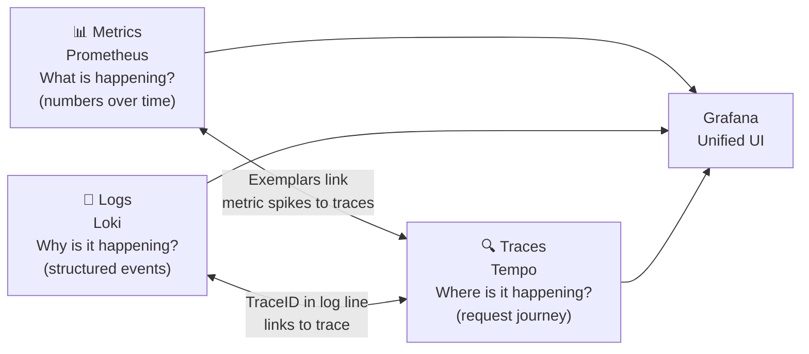
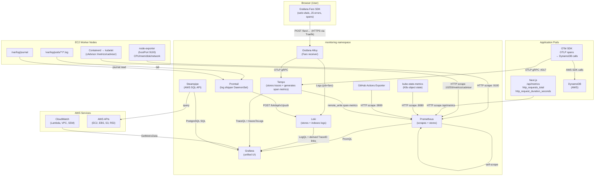

# Kubernetes Observability Stack — Architectural Report

> **Audience**: Written for both the author (learning and consolidation) and any engineer reading this architecture for the first time.
> **Scope**: System design decisions, data flows, implementation details, and the evolution of the monitoring strategy.

---

## Table of Contents

1. [Why Build a Custom Observability Stack?](#1-why-build-a-custom-observability-stack)
2. [Stack Components at a Glance](#2-stack-components-at-a-glance)
3. [Deployment Model](#3-deployment-model)
4. [The Three Pillars: Metrics, Logs, and Traces](#4-the-three-pillars-metrics-logs-and-traces)
5. [Prometheus — The Metrics Engine](#5-prometheus--the-metrics-engine)
6. [Promtail + Loki — Log Aggregation](#6-promtail--loki--log-aggregation)
7. [Grafana Alloy — The RUM / Faro Collector](#7-grafana-alloy--the-rum--faro-collector)
8. [Tempo — Distributed Tracing](#8-tempo--distributed-tracing)
9. [Grafana — Visualization Layer](#9-grafana--visualization-layer)
10. [Infrastructure Exporters](#10-infrastructure-exporters)
11. [Steampipe — Cloud Inventory](#11-steampipe--cloud-inventory)
12. [GitHub Actions Exporter — CI/CD Observability](#12-github-actions-exporter--cicd-observability)
13. [Grafana Alerting](#13-grafana-alerting)
14. [Dashboard Inventory & Design Decisions](#14-dashboard-inventory--design-decisions)
15. [Security Hardening of the Monitoring Plane](#15-security-hardening-of-the-monitoring-plane)
16. [The CloudWatch Evolution Story](#16-the-cloudwatch-evolution-story)
17. [Full Data Flow: End-to-End](#17-full-data-flow-end-to-end)
18. [Key Design Decisions Summary](#18-key-design-decisions-summary)

---

## 1. Why Build a Custom Observability Stack?

### The Problem with AWS CloudWatch (Alone)

When the cluster was initially provisioned, CloudWatch was the natural first stop — it is the native AWS observability service and requires no additional infrastructure. However, as the application matured, several limitations became apparent:

| Concern | CloudWatch | Prometheus / Grafana |
|---|---|---|
| **Data resolution** | 1-minute granularity by default | 15-second scrape intervals |
| **Pod-level visibility** | None — EC2-centric | Native label-based per-pod metrics |
| **Kubernetes awareness** | Not namespace/pod/container aware | `kube_*` metrics expose full cluster state |
| **Cost at scale** | Expensive per metric/dimension | In-cluster, no per-metric cost |
| **Custom metrics** | PutMetricData API (push, asynchronous) | Native pull model (synchronous validation) |
| **Trace correlation** | Separate X-Ray service, limited UI | Grafana links Loki logs ↔ Tempo traces |
| **Dashboarding** | CloudWatch Dashboards (limited) | Grafana — full PromQL + LogQL + TraceQL |
| **GitOps-compatible** | Manual console configuration | Dashboard JSONs versioned in Git |

> [!IMPORTANT]
> CloudWatch was **not abandoned** — it is still used for:
> - **Lambda function logs** (CloudFront edge, SSM automation handlers)
> - **VPC Flow Logs** (network traffic analysis)
> - **EC2 System Manager logs** (SSM Automation execution history)
> - **Edge Lambda logs in us-east-1** (CloudFront associated functions)
>
> These are rendered via the `cloudwatch.json` and `cloudwatch-edge.json` Grafana dashboards using the provisioned **CloudWatch datasource** and **CloudWatch Edge (us-east-1)** datasource.

---

## 2. Stack Components at a Glance

```
┌─────────────────────────────────────────────────────────────────────────────┐
│                         monitoring namespace                                 │
│                                                                             │
│  ┌──────────────┐  ┌──────────────┐  ┌──────────────┐  ┌──────────────┐   │
│  │  Prometheus   │  │    Loki       │  │    Tempo      │  │   Grafana    │   │
│  │  (metrics)    │  │    (logs)     │  │   (traces)    │  │    (UI)      │   │
│  └──────┬───────┘  └──────┬───────┘  └──────┬───────┘  └──────┬───────┘   │
│         │                 │                   │                  │           │
│  ┌──────┴───────┐  ┌──────┴───────┐  ┌──────┴──────────────────┘           │
│  │ node-exporter │  │   Promtail   │  │    Grafana Alloy                    │
│  │ kube-state-m  │  │  (DaemonSet) │  │  (Faro/RUM receiver)                │
│  │ github-exp.   │  └──────────────┘  └─────────────────────────────────    │
│  │ Steampipe     │                                                           │
│  └──────────────┘                                                           │
└─────────────────────────────────────────────────────────────────────────────┘
```

| Component | Role | Kind | Runs on |
|---|---|---|---|
| **Prometheus** | Scrapes and stores time-series metrics | Deployment (1 replica) | Monitoring node pool |
| **Loki** | Stores and indexes log streams | Deployment (1 replica) | Monitoring node pool |
| **Tempo** | Receives, stores, and queries distributed traces | Deployment (1 replica) | Monitoring node pool |
| **Grafana** | Unified UI — queries all three pillars | Deployment (1 replica) | Monitoring node pool |
| **Grafana Alloy** | Collects client-side RUM (Faro SDK) telemetry | Deployment (1 replica) | Monitoring node pool |
| **Promtail** | Tails pod and system logs → Loki | DaemonSet (every node) | All nodes |
| **node-exporter** | Exposes host-level OS/hardware metrics | DaemonSet (every node) | All nodes (incl. control-plane) |
| **kube-state-metrics** | Exposes Kubernetes object state | Deployment (1 replica) | Monitoring node pool |
| **Steampipe** | Queries live AWS inventory via SQL | Deployment (1 replica) | Monitoring node pool |
| **GitHub Actions Exporter** | Exposes GitHub Actions workflow metrics | Deployment (1 replica) | Monitoring node pool |

---

## 3. Deployment Model

### How the Monitoring Stack Gets Deployed

Unlike application workloads (which ArgoCD reconciles from Git), the monitoring stack has a **two-phase deployment** to handle secret injection:

**Phase 1 — Secret Seeding (SSM Automation → deploy.py)**

The `monitoring/deploy.py` script is executed on the control-plane EC2 instance by the SSM Automation pipeline during cluster bootstrap:

1. Reads secrets from SSM Parameter Store (`/k8s/development/grafana-admin-password`, etc.)
2. Creates Kubernetes `Secret` objects in the `monitoring` namespace:
   - `grafana-credentials` — Grafana admin user/password
   - `github-actions-exporter-credentials` — GitHub API token, webhook token, org
   - `prometheus-basic-auth-secret` — Traefik BasicAuth hash for Prometheus endpoint
3. Additionally handles SM-B retry paths for:
   - cert-manager `ClusterIssuer` (applied after CRDs are ready)
   - ArgoCD IngressRoutes and IP allowlist middleware

**Phase 2 — Helm Deployment (ArgoCD)**

ArgoCD sync deploys the `monitoring` Helm chart (`platform/charts/monitoring/`). The chart reads the pre-created Secrets via `secretKeyRef` references — the credentials never appear in a Git commit.

> [!NOTE]
> This pattern (secrets seeded by deploy.py, Helm chart consumes them) is the same approach used for the `nextjs` and `argocd` namespaces. It enforces a clean separation: **Git contains configuration structure, SSM contains secrets, Kubernetes Secrets are the runtime bridge**.

### Node Isolation

All monitoring components (except Promtail and node-exporter, which are DaemonSets) run exclusively on the **monitoring worker pool**, enforced by:

```yaml
nodeSelector:
  workload: monitoring

tolerations:
  - key: dedicated
    operator: Equal
    value: monitoring
    effect: NoSchedule
```

This ensures that a failing workload on the general pool cannot evict monitoring pods, and that monitoring resource pressure doesn't interfere with application availability.

---

## 4. The Three Pillars: Metrics, Logs, and Traces

Modern observability is built on three correlated signals:



**The key insight**: Each pillar answers a different question. When an alert fires (Prometheus), you click through to logs (Loki) to see _what_ happened, then follow the TraceID to Tempo to see _where_ in the request path the problem occurred. Grafana ties all three together.

---

## 5. Prometheus — The Metrics Engine

### What Prometheus Does

Prometheus is a **pull-based** time-series database. Rather than applications pushing data to a monitoring endpoint, Prometheus _actively scrapes_ HTTP `/metrics` endpoints at a defined interval (here: 15 seconds). Each scrape collects the current state of all exposed counters, gauges, and histograms.

This pull model has a critical advantage: **Prometheus knows immediately if a target is unreachable** (the `up` metric goes to 0). A push model would simply stop receiving data — which looks identical to "no activity".

### Prometheus Configuration Architecture

The scrape configuration is managed as a Kubernetes ConfigMap (`prometheus-config`), loaded into the Prometheus deployment at `/etc/prometheus/prometheus.yml`. Any change to the ConfigMap is automatically detected by Prometheus via the `--web.enable-lifecycle` flag and the sha256 annotation checksum on the Deployment pod template — triggering a rolling restart.

### Scrape Jobs — A Complete Inventory

The Prometheus ConfigMap defines the following scrape jobs, each targeting a different data source:

#### 1. `node-exporter` — Host-Level Hardware Metrics

```yaml
kubernetes_sd_configs:
  - role: node
relabel_configs:
  - target_label: __address__
    replacement: ${1}:9100          # node-exporter hostPort
```

**Service Discovery**: Uses `kubernetes_sd_configs` role `node` to automatically discover every EC2 node in the cluster. Prometheus queries the Kubernetes API (via its ClusterRole) to get the current node list, then constructs the scrape endpoint as `<nodeIP>:9100`.

**What is scraped**: node-exporter runs with `hostNetwork: true` and `hostPID: true`, mounting `/proc`, `/sys`, and `/` from the host. It exposes ~1,000+ metrics covering:
- CPU usage per mode (idle, user, system, iowait)
- Memory (total, available, buffers, cache)
- Disk I/O (reads/writes per block device)
- Filesystem usage per mount point
- Network I/O per interface

**Why this matters**: EC2 node metrics are the foundation of cluster health. Without these, you cannot distinguish "pod is slow because the application has a bug" from "pod is slow because the node is disk-throttled or memory-pressured".

#### 2. `cAdvisor` — Container Resource Metrics

```yaml
kubernetes_sd_configs:
  - role: node
relabel_configs:
  - target_label: __address__
    replacement: ${1}:10250         # kubelet HTTPS endpoint
    target_label: __metrics_path__
    replacement: /metrics/cadvisor
```

**Service Discovery**: Also uses `node` role, but scrapes the kubelet's `/metrics/cadvisor` path instead. cAdvisor is embedded in every kubelet and does not need a separate deployment.

**What is scraped**: Container-level resource consumption:
- `container_cpu_usage_seconds_total` — per-container CPU usage
- `container_memory_working_set_bytes` — memory excluding cache (the real limit pressure)
- `container_network_receive_bytes_total` / `container_network_transmit_bytes_total`
- `container_fs_usage_bytes` — filesystem usage per container

**Why this matters**: cAdvisor provides the `namespace + pod + container` label trifecta, enabling queries like "how much CPU is the `nextjs` container using across all replicas?" — something node-level metrics cannot achieve.

#### 3. `kube-state-metrics` — Kubernetes Object State

```yaml
static_configs:
  - targets:
      - kube-state-metrics.monitoring.svc.cluster.local:8080
```

**What is scraped**: kube-state-metrics generates metrics from the Kubernetes API about the _desired_ and _current_ state of objects:
- `kube_pod_status_phase` — whether pods are Pending/Running/Succeeded/Failed/Unknown
- `kube_pod_container_status_restarts_total` — restart counts (crash-loop detection)
- `kube_deployment_status_replicas_available` — deployment replica health
- `kube_node_labels` — node labels (used for cost allocation in the FinOps dashboard)
- `kube_pod_container_resource_requests/limits` — scheduled vs allowed resource usage

**Why this matters**: cAdvisor tells you what resources _are being used_; kube-state-metrics tells you what _should be_ running. Combining them enables efficiency ratios: `actual_cpu / cpu_limit * 100 = % of limit consumed`.

> [!NOTE]
> kube-state-metrics is configured with `--metric-labels-allowlist=nodes=[workload]`. This exposes the `workload` node label as a metric label, enabling the FinOps dashboard to differentiate cost between `control-plane|monitoring` nodes (larger, more expensive) and `frontend|argocd` nodes (smaller instances).

#### 4. `nextjs-app` — Application-Level Metrics (Active Slice)

```yaml
static_configs:
  - targets:
      - nextjs.nextjs-app.svc.cluster.local:3000
    labels:
      job: nextjs-app
metrics_path: /api/metrics
```

**What is scraped**: The `nextjs` application exposes a `/api/metrics` endpoint that returns Prometheus-format metrics. These include:
- `http_requests_total{method, route, status_code}` — request rate by route
- `http_request_duration_seconds_bucket` — histogram for P50/P95/P99 latency calculations
- `process_heap_size_bytes` — Node.js heap pressure
- Any custom business metrics the application exposes

**Why static_configs instead of kubernetes_sd_configs?**: Using a static DNS name (`nextjs.nextjs-app.svc.cluster.local`) rather than pod discovery ensures scraping targets the Kubernetes **Service**, which load-balances across all replicas. The alternative (pod-level scraping via SD) would produce per-pod metrics — useful for debugging, but requiring aggregation in every dashboard query.

#### 5. `nextjs-app-preview` — Blue/Green Preview Slice

```yaml
static_configs:
  - targets:
      - nextjs-preview.nextjs-app.svc.cluster.local:3000
    labels:
      job: nextjs-app-preview
metrics_path: /api/metrics
```

**Why this exists**: During a Blue/Green rollout, the `preview` service serves the new version. This separate scrape job allows the `bluegreen-rollout.json` dashboard to compare `job="nextjs-app"` (active/stable) against `job="nextjs-app-preview"` (preview/new) side by side. The comparison drives the Argo Rollouts Analysis Template decision.

#### 6. `traefik` — Ingress Request Metrics

```yaml
static_configs:
  - targets:
      - traefik-metrics.kube-system.svc.cluster.local:9100
    labels:
      job: traefik
```

**What is scraped**: Traefik exposes `traefik_service_requests_total{service, code}` and `traefik_service_request_duration_seconds_bucket{service}`. These are **service-level** metrics (per Kubernetes Service backend), enabling:
- Error rate by backend service
- P95 latency per backend
- Ingress traffic breakdown by route

**Why Traefik metrics for Analysis Templates?**: The Argo Rollouts analysis templates use Traefik metrics to measure error rate and P95 latency _at the ingress layer_ (not application-reported). This is a deliberate choice — it measures what the actual user experiences, regardless of whether the application itself reports errors correctly.

#### 7. Internal Monitoring Services

Prometheus also scrapes itself and the other monitoring stack components via `static_configs`:

| Job | Target | Purpose |
|---|---|---|
| `prometheus` | `localhost:9090/prometheus/metrics` | Self-monitoring (TSDB health, scrape duration) |
| `loki` | `loki.monitoring.svc.cluster.local:3100` | Loki ingest health, query performance |
| `tempo` | `tempo.monitoring.svc.cluster.local:3200` | Trace ingestion rate, block compaction |
| `grafana` | `grafana.monitoring.svc.cluster.local:3000` | Grafana query engine health |
| `alloy` | `alloy.monitoring.svc.cluster.local:12345` | Faro receiver throughput |

### Prometheus RBAC

Prometheus requires cluster-wide read access to the Kubernetes API for service discovery:

```yaml
rules:
  - apiGroups: [""]
    resources: [nodes, nodes/proxy, nodes/metrics, services, endpoints, pods]
    verbs: [get, list, watch]
  - nonResourceURLs: [/metrics, /metrics/cadvisor]
    verbs: [get]
```

This ClusterRole is the minimal required permission set. Without `nodes/proxy`, Prometheus cannot reach the kubelet endpoint for cAdvisor metrics. Without `pods`, Kubernetes service discovery cannot list scrape targets.

### Prometheus Storage

Prometheus uses a **PersistentVolumeClaim** (`prometheus-data`) backed by an EBS volume. The retention period is set via the `--storage.tsdb.retention.time` flag (configured in `values.yaml`).

Key startup flags:
- `--web.enable-remote-write-receiver` — allows Tempo's `metrics_generator` to write span-derived metrics directly into Prometheus (see §8)
- `--enable-feature=exemplar-storage,native-histograms` — enables trace exemplars (links from metric data points to specific traces) and the newer native histogram format
- `--web.external-url=/prometheus` — sets the base URL for Grafana's proxy URL

### Prometheus Topology Spread

```yaml
topologySpreadConstraints:
  - maxSkew: 1
    topologyKey: kubernetes.io/hostname
    whenUnsatisfiable: ScheduleAnyway
```

The Prometheus deployment uses `ScheduleAnyway` (not `DoNotSchedule`) to prevent scheduling being hard-blocked on the 2-node monitoring pool during rolling restarts, while still expressing a preference for spreading replicas across nodes.

---

## 6. Promtail + Loki — Log Aggregation

### Promtail — The Log Shipper

Promtail runs as a **DaemonSet** — one instance per node — and is responsible for tailing all pod and system logs and forwarding them to Loki.

**Two scrape jobs**:

1. **`kubernetes-pods`** — Uses kubernetes_sd_configs (role: pod) to discover all pods, then constructs the file path `/var/log/pods/<uid>/<container>/*.log`. For each log line it applies CRI parsing (`cri: {}`), then relabels the line with:
   - `namespace` — pod's namespace
   - `pod` — pod name
   - `container` — container name
   - `app` — the `app` pod label

2. **`journal`** — Reads from `/var/log/journal` (systemd journal), capturing OS-level logs including kubelet, containerd, and kernel messages. These are labelled `job="systemd-journal"` and are essential for diagnosing node-level failures that occur before pods start.

### Loki — The Log Store

Loki is a **label-indexed log database**. Unlike Elasticsearch (full-text indexed), Loki only indexes a small set of labels (namespace, pod, app, etc.), and stores the raw log lines compressed in chunks. This keeps storage costs low while enabling fast label-filtered queries.

**Configuration highlights**:
- `schema: v13 / store: tsdb` — Loki's most recent and efficient schema
- `reject_old_samples_max_age: 168h` — rejects logs older than 7 days (prevents accidental mass-ingest of historical data)
- `ingestion_rate_mb: 10` / `ingestion_burst_size_mb: 20` — rate limits to prevent log spam from consuming all available memory
- `max_streams_per_user: 10000` — cardinality cap to prevent label explosion
- `retention_enabled: true` with `retention_delete_delay: 2h` — enables TTL-based log deletion
- Storage: local filesystem on an EBS PVC — single-node mode, sufficient for a single-cluster deployment

> [!TIP]
> **Why not ElasticSearch?** Loki's label model is intentionally simple. For a single Kubernetes cluster, the query patterns are known: "give me the last 100 lines from `namespace=nextjs-app, pod=nextjs-xyz`". Full-text indexing (Elasticsearch) would cost significantly more in both compute and storage for this use case.

### Grafana → Loki Integration

In the Grafana datasource, the Loki datasource is configured with **derived fields**:

```yaml
derivedFields:
  - datasourceUid: tempo
    matcherRegex: '"traceID":"(\w+)"'
    name: TraceID
    url: "${__value.raw}"
```

This means: when a log line contains `"traceID":"<hex>"`, Grafana automatically adds a clickable link to the Tempo datasource, opening the specific trace. This enables the "click from error log → view trace" workflow without any manual trace ID copying.

---

## 7. Grafana Alloy — The RUM / Faro Collector

### What is Real User Monitoring (RUM)?

Server-side metrics (Prometheus) and logs (Loki) only capture what the _server_ experiences. They cannot measure:
- How long a page **actually loads** for a user in London on a mobile connection
- JavaScript **exceptions thrown in the browser**
- Core Web Vitals (LCP, INP, CLS, FCP, TTFB) — metrics that affect Google SEO rankings

This is where **Grafana Faro** (the SDK) and **Grafana Alloy** (the collector) enter the picture.

### Architecture

```
Browser (Next.js)
    │
    │  Grafana Faro SDK (client-side JS)
    │  Collects: Web Vitals, JS errors, user sessions, front-end spans
    │
    ▼
Grafana Alloy (Pod in monitoring namespace)
    │── faro.receiver on port 12347
    │       CORS: configured for *.nelsonlamounier.com
    │
    ├── Alloy routes LOGS → loki.process "faro"
    │       adds static label: job="faro"
    │       → loki.write → Loki API
    │
    └── Alloy routes TRACES → otelcol.exporter.otlp "tempo"
            → Tempo gRPC endpoint
```

The Alloy pod is exposed externally via a Traefik IngressRoute so browsers can POST telemetry directly to `https://ops.nelsonlamounier.com/faro/api/v1/push` — traversing: Internet → NLB → Traefik → `alloy.monitoring.svc.cluster.local:12347`.

**Why Alloy, not direct Loki push?**

The Faro SDK speaks the Faro protocol, not the Loki push API. Alloy acts as a **protocol translator**: it receives Faro payloads, splits them by signal type (measurements → logs with structured fields, spans → OTLP traces), and fans them out to the appropriate backends. Without Alloy, there would be no way to ingest Faro RUM data.

### The RUM Dashboard Queries

The `rum.json` dashboard reads all data from Loki using LogQL with `unwrap` expressions:

```logql
# LCP — Largest Contentful Paint
avg_over_time(
  {job="faro"} | logfmt | kind="measurement" | type="web-vitals"
  | page_url=~"$page" | lcp!="" | unwrap lcp [5m]
)
```

This pattern: filter by `job="faro"` (set by Alloy's `loki.process`), then parse the structured JSON fields via `logfmt`, filter to only `web-vitals` measurement events, filter out lines where `lcp` is empty, then `unwrap` the numeric `lcp` value and compute `avg_over_time` over a 5-minute window.

**Core Web Vitals tracked**:
| Metric | Meaning | Good Threshold |
|---|---|---|
| LCP | Largest Contentful Paint — perceived load speed | < 2.5s |
| INP | Interaction to Next Paint — responsiveness | < 200ms |
| CLS | Cumulative Layout Shift — visual stability | < 0.1 |
| FCP | First Contentful Paint — server response speed | < 1.8s |
| TTFB | Time to First Byte — network + server latency | < 800ms |

---

## 8. Tempo — Distributed Tracing

### What is Distributed Tracing?

A trace represents the **complete journey of a single request** across all services it touches. A span is one unit of work within that journey. Together, they answer: "the user clicked 'load articles' — which service took the longest? Where did the DynamoDB call fail?"

### Tempo Configuration

Tempo is configured to receive spans via **OTLP** (OpenTelemetry Protocol) on both gRPC (port 4317) and HTTP (port 4318):

```yaml
distributor:
  receivers:
    otlp:
      protocols:
        grpc:  # port 4317
        http:  # port 4318
```

Storage is local filesystem on an EBS PVC with a **72-hour block retention**. The WAL (Write-Ahead Log) is stored separately to prevent data loss during restarts.

### The Metrics Generator — The Bridge to Prometheus

Tempo's `metrics_generator` is the architectural keystone that enables DynamoDB observability:

```yaml
metrics_generator:
  processor:
    service_graphs:           # Service-to-service request topology
      dimensions: [http.method, http.status_code]
    span_metrics:             # RED metrics per operation
      dimensions: [service.name, http.method, http.status_code]
      enable_target_info: true
  storage:
    remote_write:
      - url: http://prometheus.monitoring.svc.cluster.local:9090/prometheus/api/v1/write
        send_exemplars: true  # Links metric data points to specific traces
```

**What this generates**: For every span received, Tempo derives and writes these metrics to Prometheus:
- `traces_spanmetrics_calls_total{span_name, service_name, status_code}` — operation call rate
- `traces_spanmetrics_latency_bucket{span_name, service_name, le}` — latency histogram (P50/P95/P99)
- `traces_service_graph_request_total{client, server}` — service topology graph
- `traces_service_graph_request_failed_total{client, server}` — failed calls between services

**Why this matters for DynamoDB**: The Next.js application instruments its DynamoDB calls with OpenTelemetry. Each `GetItem`, `PutItem`, `Query` operation becomes a span with `db.system="dynamodb"` attributes. Tempo ingests these spans and generates `traces_spanmetrics_*` metrics that Prometheus scrapes — making DynamoDB entirely observable without AWS CloudWatch DynamoDB metrics or IAM permissions from within the cluster.

### DynamoDB Tracing Dashboard Queries

```promql
# DynamoDB P95 Latency
histogram_quantile(0.95,
  sum by (le, span_name) (
    rate(traces_spanmetrics_latency_bucket{
      span_name=~"ArticleService.*",
      service_name=~"$service"
    }[5m])
  )
)

# DynamoDB Error Rate
(
  sum(rate(traces_spanmetrics_calls_total{
    span_name=~"ArticleService.*",
    status_code="STATUS_CODE_ERROR"
  }[5m]))
  /
  sum(rate(traces_spanmetrics_calls_total{
    span_name=~"ArticleService.*"
  }[5m]))
) * 100
```

These queries use `span_name=~"ArticleService.*"` because the Next.js application names its DynamoDB service spans using the service class name — a consistent convention that makes filtering straightforward.

### Exemplars — The Metric-to-Trace Link

Because Tempo writes to Prometheus with `send_exemplars: true`, and Prometheus is started with `--enable-feature=exemplar-storage`, each metric data point can carry an embedded TraceID. In Grafana, when viewing a spike in a P95 latency graph, clicking the data point reveals an exemplar — a direct link to the specific trace for the slowest request in that window. This eliminates the need to manually correlate timestamps between metrics and traces.

---

## 9. Grafana — Visualization Layer

### Deployment

Grafana runs as a `Deployment` with `strategy: Recreate` (not `RollingUpdate`). This is intentional: Grafana uses a `PersistentVolumeClaim` for its SQLite database, which cannot be mounted by two pods simultaneously. `Recreate` ensures the old pod is terminated before the new one starts.

Security hardening is applied via environment variables:
- `GF_USERS_ALLOW_SIGN_UP: "false"` — prevents self-registration
- `GF_AUTH_ANONYMOUS_ENABLED: "false"` — forces authentication
- `GF_AUTH_LOGIN_MAXIMUM_INACTIVE_LIFETIME_DURATION: "30m"` — short idle timeout
- `GF_AUTH_LOGIN_MAXIMUM_LIFETIME_DURATION: "12h"` — daily re-authentication required

### Datasource Provisioning

All datasources are provisioned from the `grafana-datasources` ConfigMap — no manual configuration through the UI. This ensures the datasource configuration is GitOps-managed and survives pod restarts.

| Datasource | UID | URL | Purpose |
|---|---|---|---|
| Prometheus | `prometheus` | `http://prometheus.monitoring.svc.cluster.local:9090/prometheus` | All PromQL metric queries |
| Loki | `loki` | `http://loki.monitoring.svc.cluster.local:3100` | LogQL log queries |
| Tempo | `tempo` | `http://tempo.monitoring.svc.cluster.local:3200` | TraceQL + Trace Explorer |
| CloudWatch | `cloudwatch` | IAM role (no URL) | Lambda/VPC/EC2 logs (eu-west-1) |
| CloudWatch Edge | `cloudwatch-edge` | IAM role (eu-east-1) | CloudFront Lambda logs (us-east-1) |
| Steampipe | `steampipe` | `steampipe.monitoring.svc.cluster.local:9193` | Cloud inventory SQL queries |

### Dashboard Provisioning — GitOps-Native

Dashboard JSON files are stored in `platform/charts/monitoring/chart/dashboards/*.json` within the Git repository. The Helm template `dashboards.yaml` uses Helm's `Files.Glob` to auto-iterate all JSON files and generate a separate ConfigMap per dashboard:

```yaml
{{- range $path, $_ := .Files.Glob "dashboards/*.json" }}
---
apiVersion: v1
kind: ConfigMap
metadata:
  name: grafana-dashboards-{{ trimSuffix ".json" (base $path) }}
```

These ConfigMaps are then mounted into the Grafana pod as a `projected` volume:
```yaml
volumes:
  - name: dashboards
    projected:
      sources:
      {{- range $path, $_ := .Files.Glob "dashboards/*.json" }}
        - configMap:
            name: grafana-dashboards-{{ trimSuffix ".json" (base $path) }}
      {{- end }}
```

The `dashboard-provider.yaml` ConfigMap configures Grafana to periodically reload dashboards from `/var/lib/grafana/dashboards` every 60 seconds (`updateIntervalSeconds: 60`), meaning **a Git commit → ArgoCD sync → ConfigMap update → Grafana picks up the new dashboard within 60 seconds** — no manual import required.

### Tempo → Loki Correlation Configuration

The Tempo datasource is configured with `tracesToLogs`, enabling a direct link from any trace span to the logs of the relevant pod:

```yaml
jsonData:
  tracesToLogs:
    datasourceUid: loki
    tags: [job, instance]
    mappedTags: [{key: service.name, value: service}]
    filterByTraceID: true
```

When viewing a trace in Grafana, clicking "see logs for this span" automatically constructs a LogQL query filtered by the TraceID — closing the traces-to-logs correlation loop.

---

## 10. Infrastructure Exporters

### node-exporter — Host-Level Hardware Metrics

node-exporter runs as a **DaemonSet** with two critical host access privileges:

```yaml
hostNetwork: true    # Uses host network namespace → exposed on node IP directly
hostPID: true        # Accesses host process table → enables process-level metrics
```

Host filesystem mounts:
- `/host/proc` → `/proc` — CPU, memory, network, processes
- `/host/sys` → `/sys` — block device I/O, temperature sensors
- `/host/root` → `/root` — filesystem stats (with `mountPropagation: HostToContainer`)

The `hostPort: 9100` binding means node-exporter listens on the actual EC2 node's port 9100, not inside the pod network. This allows Prometheus to reach it via the node IP directly (matching the `kubernetes_sd_configs` node role scrape pattern).

**Control-plane tolerance**: node-exporter has a `NoSchedule` toleration for `node-role.kubernetes.io/control-plane`, ensuring control-plane nodes (which have this taint) are also monitored. Without this, you would have no visibility into etcd, API server, or scheduler resource consumption.

**Filesystem exclusion filter**:
```
--collector.filesystem.mount-points-exclude=^/(dev|proc|sys|var/lib/docker/.+|var/lib/kubelet/.+)($|/)
```
This prevents noise from overlay filesystems (Docker layers) and virtual filesystems — keeping the disk metrics clean and focused on real storage.

### kube-state-metrics — Kubernetes Object State

kube-state-metrics queries the Kubernetes API and translates object state into metrics. It runs as a non-root (`runAsUser: 65534` = `nobody`) Deployment on the monitoring node pool.

**The `--metric-labels-allowlist` flag**:
```
--metric-labels-allowlist=nodes=[workload]
```
This exposes the `workload` node label (values: `control-plane`, `monitoring`, `frontend`, `argocd`) as a dimension on `kube_node_labels`. The FinOps dashboard uses this to apply per-instance-type pricing coefficients:
```promql
count(kube_node_labels{label_workload=~"control-plane|monitoring"}) * 0.0456
+
count(kube_node_labels{label_workload=~"frontend|argocd"}) * 0.0228
```
This gives a real-time estimated hourly cost using known EC2 instance pricing without requiring Cost Explorer API calls.

---

## 11. Steampipe — Cloud Inventory

### What Steampipe Provides

Steampipe is a unique component: it exposes live AWS API data as a **PostgreSQL-compatible SQL interface**. Rather than importing AWS data into Prometheus or a database periodically, queries execute in real-time against the AWS APIs.

Grafana connects to Steampipe as a **PostgreSQL datasource** (uid: `steampipe`), enabling SQL queries in dashboards:

```sql
-- Example: List all EBS volumes with their status and size
SELECT
    volume_id,
    state,
    size,
    volume_type,
    encrypted
FROM aws_ebs_volume
WHERE region = 'eu-west-1'
ORDER BY size DESC;
```

### Cloud Inventory Dashboard

The `cloud-inventory.json` dashboard uses Steampipe queries to provide real-time visibility into:
- **EBS Volumes & Snapshots** — size, type, encryption status, associated instance
- **Security Groups** — active rules, which resources use them
- **EC2 Instances & Cross-Service View** — running instances, their tags, state
- **S3 Buckets** — encryption, versioning, public access block status
- **Route 53** — DNS records, hosted zones

**Why not CloudWatch for this?** CloudWatch provides performance metrics for AWS services, not their configuration/inventory state. Steampipe provides the "what is deployed?" answer; Prometheus provides the "how is it performing?" answer.

**Configuration**: Steampipe is configured to query both `eu-west-1` (primary region) and `us-east-1` (where CloudFront and Lambda@Edge resources live).

---

## 12. GitHub Actions Exporter — CI/CD Observability

The GitHub Actions Exporter translates GitHub API data into Prometheus metrics, enabling CI/CD pipeline observability from Grafana.

**Credentials**: Injected via Kubernetes Secret (`github-actions-exporter-credentials`), seeded from SSM by `deploy.py`. The GitHub API token, webhook token, and org name are never in Git.

**Exposed metrics** (scraped by Prometheus via `prometheus.io/scrape: "true"` Service annotation):
- Workflow run success/failure rates
- Job duration histograms
- Queue times
- Runner utilization

The `cicd.json` dashboard ("CI/CD Pipeline") presents these metrics alongside GitHub Actions workflow statistics, providing a complete view of deployment pipeline health.

> [!NOTE]
> The `prometheus.io/scrape: "true"` annotation on the Service is picked up by the Prometheus pod-scraping job, which uses `relabel_configs` to filter for annotated pods. This is the "opt-in" annotation-driven model — only services that explicitly advertise themselves get scraped.

---

## 13. Grafana Alerting

### Architecture: Code-Defined Alerts

All alerting rules, contact points, and routing policies are defined in the `grafana-alerting` ConfigMap (from `alerting-configmap.yaml`) and provisioned at Grafana startup. This means **alerts are versioned in Git** and survive pod restarts or re-deployments.

### Contact Point: AWS SNS

```yaml
receivers:
  - uid: sns-receiver
    type: sns
    settings:
      topic_arn: "{{ .Values.grafana.alerting.snsTopicArn }}"
      region: "{{ .Values.grafana.alerting.awsRegion }}"
```

Alert notifications are routed through **AWS SNS**, which can fan out to email, SMS, Slack, Lambda, or any other supported SNS subscriber. The SNS topic ARN is injected at Helm deploy time (from `values.yaml`), keeping it out of the ConfigMap literal value.

### Alert Rule Groups

**Group 1: Cluster Health**

| Alert | Condition | Severity | For |
|---|---|---|---|
| Node Down | `up{job="node-exporter"} < 1` | critical | 2m |
| High Node CPU | avg CPU > 85% for 5m | warning | 5m |
| High Node Memory | mem usage > 85% for 5m | warning | 5m |
| Pod CrashLooping | >3 restarts in 15m | critical | 0s (immediate) |
| Pod Not Ready | `kube_pod_status_ready == 0` for 5m | warning | 5m |

**Group 2: Application Health**

| Alert | Condition | Severity | For |
|---|---|---|---|
| High Error Rate | >5% 5xx errors for 5m | critical | 5m |
| High P95 Latency | P95 > 2s for 5m | warning | 5m |

**Group 3: Storage Health**

| Alert | Condition | Severity | For |
|---|---|---|---|
| Disk Space Low | >80% usage for 5m | warning | 5m |
| Disk Space Critical | >90% usage for 2m | critical | 2m |

**Group 4: DynamoDB & Tracing**

| Alert | Condition | Severity | For |
|---|---|---|---|
| DynamoDB Error Rate | >5% error rate (from Tempo spans) | critical | 5m |
| DynamoDB P95 Latency | P95 > 1s | warning | 5m |
| Span Ingestion Stopped | `rate(traces_spanmetrics_calls_total[5m]) < 0.001` for 10m | critical | 10m |

The "Span Ingestion Stopped" alert is particularly important: if the Next.js application stops sending traces (OTel SDK crash, network partition, Tempo restart), this alert fires. It guards against the silent failure mode where everything looks fine in metrics but traces stop flowing.

### Alert Routing Policy

```yaml
group_by: [grafana_folder, alertname]
group_wait: 30s          # Wait 30s for more alerts before first notification
group_interval: 5m       # Send updates every 5m if the group is still firing
repeat_interval: 4h      # Re-notify every 4h if still unresolved
routes:
  - receiver: sns
    matchers: [severity = critical]
  - receiver: sns
    matchers: [severity = warning]
```

Both `critical` and `warning` route to SNS, but `continue: false` prevents double-notifications.

---

## 14. Dashboard Inventory & Design Decisions

### Full Dashboard Inventory

| Dashboard | Datasource(s) | Key Metrics / Panels |
|---|---|---|
| **Cluster & Nodes** | Prometheus | Node status, CPU/memory/disk/network per node, pod phases, resource allocation |
| **Next.js Application** | Prometheus | Replica health, CPU/memory per pod, restart rate, pod phase distribution |
| **Frontend Performance** | Prometheus (Traefik) | Request rate, P95 latency, HTTP status breakdown, ingress entrypoint |
| **Blue/Green Rollout** | Prometheus (Traefik + cAdvisor) | Active vs. Preview: request rate, error rate, P95 latency, CPU/memory per pod |
| **DynamoDB & Tracing** | Prometheus (span-metrics) + Tempo + CloudWatch | DynamoDB RED metrics, service graph, TraceQL explorer, Next.js traces, CloudWatch DynamoDB capacity |
| **Real User Monitoring (RUM)** | Loki (Faro events) | Core Web Vitals (LCP, INP, CLS, FCP, TTFB), JS errors, Faro collector health |
| **Monitoring Stack Health** | Prometheus | Scrape targets up/down, TSDB size, Prometheus query duration, stack resource usage |
| **FinOps — Cost Visibility** | Prometheus (kube-state-metrics) | Estimated hourly/monthly cost, cost per node/namespace, CPU/memory efficiency |
| **CI/CD Pipeline** | Prometheus (GitHub Actions Exporter) | Workflow run counts, success/failure rates, job duration |
| **Cloud Inventory & Compliance** | Steampipe (PostgreSQL) | EBS volumes, SGs, EC2 instances, S3 buckets, Route 53 |
| **AWS Logs** | CloudWatch (eu-west-1) | Lambda logs, SSM automation, EC2, VPC flow logs |
| **AWS Logs — Edge** | CloudWatch (us-east-1) | CloudFront Lambda@Edge logs |
| **Auto-Bootstrap Trace** | CloudWatch + Loki | Step Functions orchestrator, Router Lambda, SSM Automation, CA re-join traces |
| **Bedrock Content Pipeline** | Prometheus + Loki | AI pipeline metrics, token economics, Lambda performance |
| **Self-Healing Pipeline** | Loki | Agent execution logs, tool execution, FinOps token usage |
| **Blue/Green Rollout Comparison** | Prometheus | Side-by-side active vs. preview service metrics during rollouts |

### Design Decision: Traefik Metrics as the Source of Truth

For request-level metrics (traffic, error rate, latency), Traefik is the preferred source over application-reported metrics. This is because:

1. **Bypass-proof**: Traefik counts every request at the ingress layer, even if the application crashes before processing it
2. **Consistent**: All services use Traefik, giving a uniform metric shape regardless of the application language/framework
3. **Rollout-aware**: Traefik tracks `active` and `preview` services separately (they have different Service objects in Kubernetes), enabling the Blue/Green comparison dashboard

### Design Decision: Metrics-from-Traces (Span Metrics)

Rather than instrumenting DynamoDB separately (which would require IAM permissions, CloudWatch API calls, or a separate exporter), the system derives DynamoDB metrics from traces using Tempo's `metrics_generator`. This approach:
- Adds **no additional AWS cost** (no CloudWatch GetMetricStatistics calls)
- Provides **operation-level granularity** (`GetItem`, `PutItem`, `Query` as separate series)
- Maintains **trace linkage** (every metric data point can link to a specific trace via exemplars)
- Is **index-free** — no DynamoDB table permissions needed from within the cluster

---

## 15. Security Hardening of the Monitoring Plane

### Access Control

The monitoring namespace is protected by a Traefik `IPAllowList` middleware (`admin-ip-allowlist`), populated with the operator's IP addresses from SSM parameters (`monitoring/allow-ipv4` / `monitoring/allow-ipv6`). These IPs are written by the CI/CD pipeline from GitHub Environment secrets `ALLOW_IPV4` / `ALLOW_IPV6`.

Any request to `/grafana`, `/prometheus`, or `/argocd` that does not originate from an allowed IP receives HTTP 403.

### Prometheus Basic Auth

Prometheus is additionally protected by a Traefik `BasicAuth` middleware sourced from the `prometheus-basic-auth-secret` Kubernetes Secret (seeded by `deploy.py` from SSM). This provides a second layer of authentication beyond IP allowlisting.

### Secret Management Pattern

All credentials follow the SSM-to-Kubernetes Secret pattern:
- Secrets stored in SSM Parameter Store (encrypted, audit-logged)
- Seeded into Kubernetes Secrets by `deploy.py` at bootstrap time
- Consumed by containers via `secretKeyRef` volume mounts
- **Never appear in Git**

### Non-Root Containers

All monitoring containers run with `runAsNonRoot: true`:
- Grafana: `runAsUser: 472` (grafana user)
- Prometheus: `runAsUser: 65534` (nobody)
- kube-state-metrics: `runAsUser: 65534` (nobody)

---

## 16. The CloudWatch Evolution Story

### Phase 1: CloudWatch as the Only Option

When the Kubernetes cluster was first provisioned via the CDK `observability-stack.ts`, the Prometheus/Grafana stack did not yet exist. CloudWatch was used as the interim monitoring solution:

```typescript
// infra/lib/stacks/kubernetes/observability-stack.ts
// Provisioned during initial cluster setup when Prometheus was not yet operational
const dashboard = new cloudwatch.Dashboard(this, 'K8sDashboard', {
  dashboardName: `${id}-kubernetes-dashboard`,
  widgets: [
    // EC2 instance metrics (CPU, network)
    // EBS volume metrics (read/write ops)
    // Load balancer metrics (request count, healthy hosts)
  ]
});
```

This stack reads SSM parameters from the control-plane and worker stacks to discover EC2 instance IDs and construct CloudWatch metric widgets. It provides coarse-grained, instance-level visibility — the only option before the cluster was operational enough to run Prometheus.

**Limitations at this stage**:
- No pod-level visibility (only EC2)
- 5-minute aggregation (not 15-second scrapes)
- No application-level metrics
- No log aggregation (separate CloudWatch Logs interface)

### Phase 2: Prometheus/Grafana Stack Live

Once the cluster bootstraps successfully and ArgoCD deploys the monitoring Helm chart, the observability shifts to the in-cluster stack:

| Signal | Phase 1 (CloudWatch) | Phase 2 (In-Cluster) |
|---|---|---|
| CPU/Memory | EC2 instance level (5m) | Per-container (15s) + Per-node (15s) |
| Disk | EBS volume level | Per-filesystem, per-mount-point |
| Network | EC2 interface | Per-container, per-pod |
| Application metrics | None | `/api/metrics` scraping |
| Logs | CloudWatch Logs (manual) | Loki (automatic, label-indexed) |
| Traces | None (pre-Phase 2) | Tempo OTLP |
| Dashboards | CloudWatch Dashboards | Grafana (GitOps-provisioned) |

### Phase 3: CloudWatch as a Complementary Layer

CloudWatch is still actively used for resources that live **outside the cluster**:
- **Lambda functions** — SSM Automation handlers, CloudFront functions
- **VPC Flow Logs** — for network security analysis
- **EC2 System Manager** — automation execution logs

These are rendered inside Grafana via the provisioned CloudWatch datasource, giving a unified view: in-cluster metrics in PromQL alongside AWS-managed service logs in CloudWatch — **all in the same Grafana instance**.

---

## 17. Full Data Flow: End-to-End



---

## 18. Key Design Decisions Summary

| Decision | What Was Chosen | Why |
|---|---|---|
| **Metrics backend** | Prometheus (pull) | Pull model gives immediate target-down detection; in-cluster; no per-metric cost |
| **Log store** | Loki (label index) | Lower cost than Elasticsearch; uniform label model with Prometheus; tight Grafana integration |
| **Trace backend** | Tempo | OTLP-native; `metrics_generator` derives DynamoDB metrics from spans; no separate exporter needed |
| **RUM / Web Vitals** | Grafana Faro + Alloy | Only way to collect browser-side performance data; Alloy protocol-translates to Loki+Tempo |
| **Cloud inventory** | Steampipe | Live AWS API as SQL — no periodic imports, no staleness, tight Grafana PostgreSQL integration |
| **Dashboard as code** | JSON in Git → Helm ConfigMaps → Grafana provisioning | Fully GitOps: commit → sync → live in 60s; survives pod restarts |
| **Alert routing** | SNS topic | AWS-native; fan-out to email/Slack/Lambda from one topic; IAM-controlled |
| **DynamoDB metrics** | Tempo span-metrics → Prometheus | No CloudWatch API cost; operation-level granularity; trace-linked exemplars |
| **CloudWatch retention** | Kept for Lambda + VPC + SSM | These resources live outside the cluster; CloudWatch is the only practical option |
| **Node scheduling** | `dedicated=monitoring:NoSchedule` taint | Prevents application pods from evicting monitoring pods during pressure events |
| **Grafana strategy** | `Recreate` (not `RollingUpdate`) | SQLite PVC cannot be mounted by two pods simultaneously |
| **Secret injection** | deploy.py → K8s Secret → secretKeyRef | Secrets stay in SSM; never in Git; ArgoCD consumes without knowing values |
| **Prometheus auth** | BasicAuth middleware (Traefik) + IP allowlist | Two-factor access control without requiring an identity provider |
