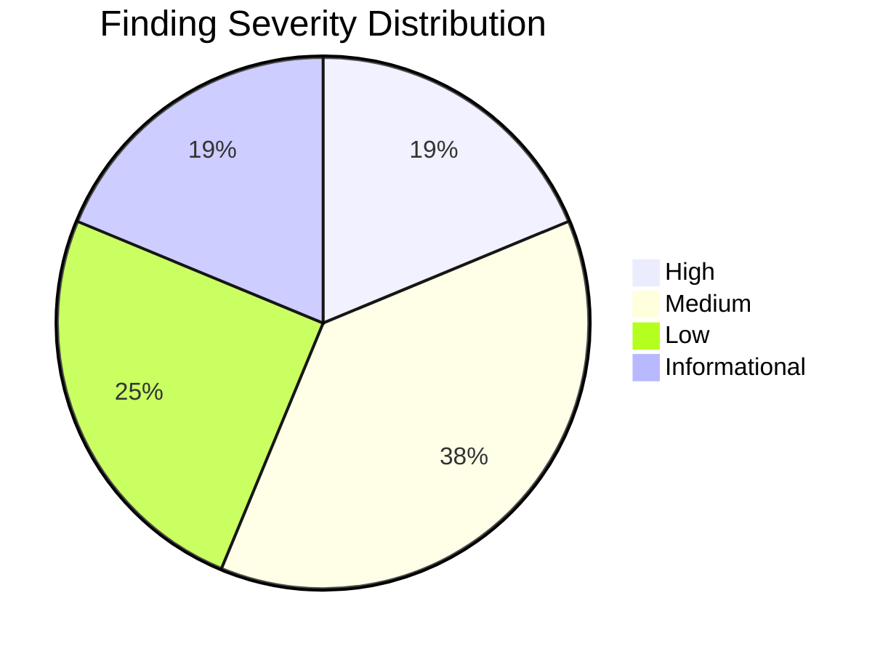
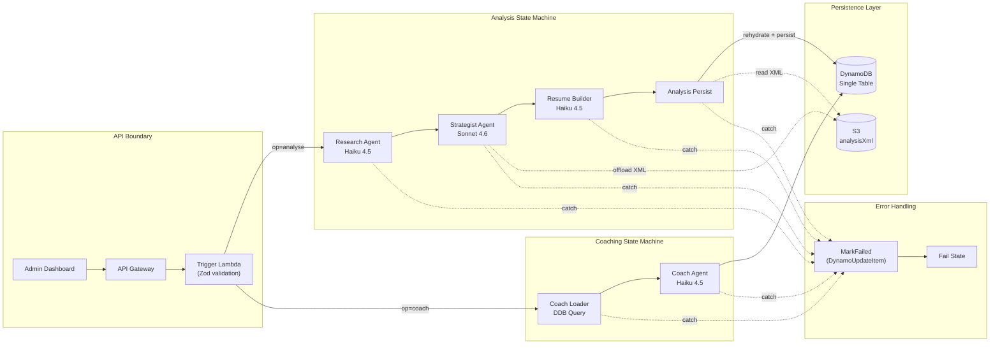
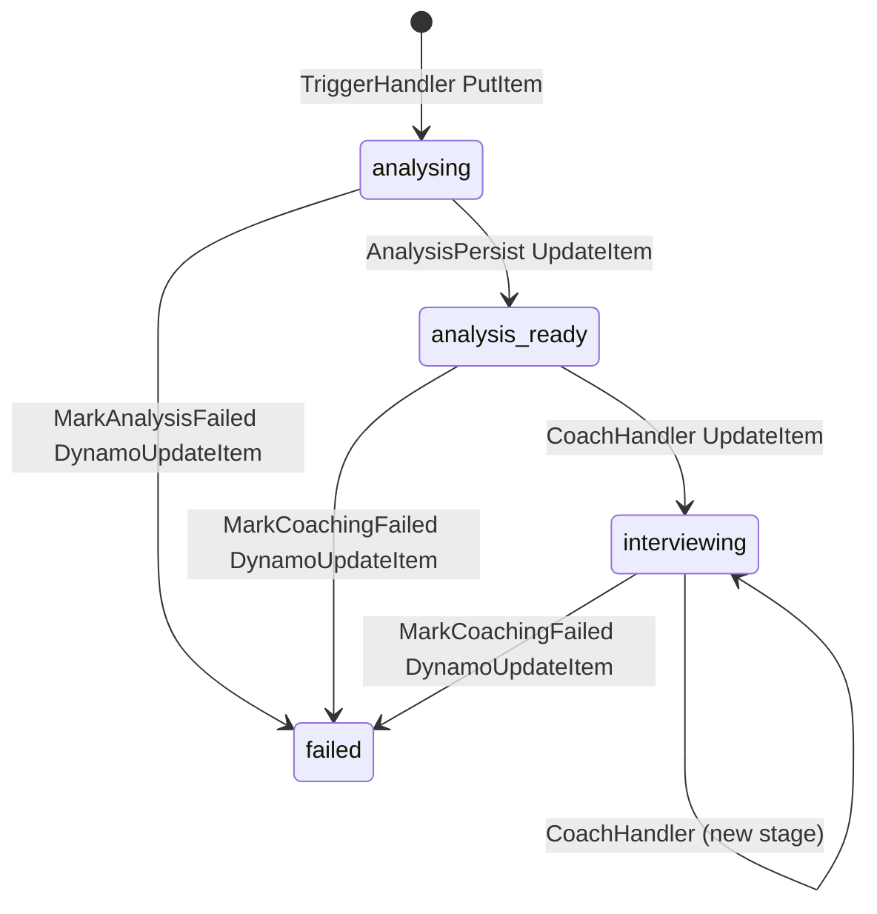

# Job Strategist Pipeline — Architecture & Security Audit

> **Scope:** `bedrock-applications/job-strategist/` (application) + `infra/lib/stacks/bedrock/` (CDK infrastructure)
> **Date:** 2026-04-16
> **Methodology:** Static code review against LLM engineering best practices, AWS Well-Architected, and the project's own established standards

---

## Table of Contents

1. [Executive Summary](#executive-summary)
2. [Architecture Overview](#architecture-overview)
3. [Strengths — What's Done Right](#strengths--whats-done-right)
4. [Findings — Critical & High](#findings--critical--high)
5. [Findings — Medium](#findings--medium)
6. [Findings — Low & Informational](#findings--low--informational)
7. [Data Lifecycle & Schema Divergence](#data-lifecycle--schema-divergence)
8. [Prompt Engineering Assessment](#prompt-engineering-assessment)
9. [Remediation Priority Matrix](#remediation-priority-matrix)

---

## Executive Summary

The Job Strategist pipeline is a **well-architected multi-agent system** with several standout engineering practices. However, the audit identified **3 High-severity** and **6 Medium-severity** findings that should be addressed. There are **no Critical-severity** findings — the system is deployable and functional as-is. The most impactful improvements centre around inconsistent environment variable validation, missing Bedrock API retry logic, and a documentation-vs-code schema drift in the data stack.



---

## Architecture Overview



---

## Strengths — What's Done Right

> [!TIP]
> These patterns represent production-grade engineering that can serve as reference implementations for other pipelines in the portfolio.

| # | Pattern | Location | Assessment |
|---|---------|----------|------------|
| **S1** | **Zod boundary validation** | [trigger-handler.ts](file:///Users/nelsonlamounier/Desktop/portfolio/cdk-monitoring/bedrock-applications/job-strategist/src/handlers/trigger-handler.ts#L370-L371) | All external data (API body, DDB records, env vars) is runtime-validated via Zod schemas. Discriminated union on `operation` ensures type-safe routing. **Exemplary.** |
| **S2** | **Fail-fast environment validation** | [environment.schema.ts](file:///Users/nelsonlamounier/Desktop/portfolio/cdk-monitoring/bedrock-applications/job-strategist/src/schemas/environment.schema.ts#L25-L50) | `TriggerEnvSchema.parse(process.env)` at module scope causes immediate cold-start failure on misconfiguration — far superior to mid-execution crashes. |
| **S3** | **S3 payload offloading** | [strategist-handler.ts](file:///Users/nelsonlamounier/Desktop/portfolio/cdk-monitoring/bedrock-applications/job-strategist/src/handlers/strategist-handler.ts#L52-L75) | Proactive S3 offloading of `analysisXml` (80-150KB) with `s3://` sentinel pattern and rehydration in the persist handler. Includes payload-size logging and near-limit warnings. |
| **S4** | **Step Functions-native error handling** | [strategist-pipeline-stack.ts](file:///Users/nelsonlamounier/Desktop/portfolio/cdk-monitoring/infra/lib/stacks/bedrock/strategist-pipeline-stack.ts#L460-L541) | `Catch → DynamoUpdateItem(status='failed') → Fail` pattern guarantees the frontend can always detect pipeline failures. Uses `$$.State.EnteredTime` for accurate timestamps and persists `$.error.Cause` for debuggability. |
| **S5** | **Input/output sanitisation** | [input-sanitiser.ts](file:///Users/nelsonlamounier/Desktop/portfolio/cdk-monitoring/bedrock-applications/job-strategist/src/security/input-sanitiser.ts), [output-sanitiser.ts](file:///Users/nelsonlamounier/Desktop/portfolio/cdk-monitoring/bedrock-applications/job-strategist/src/security/output-sanitiser.ts) | Dual-layer security: input sanitisation strips prompt injection patterns, output sanitisation guards against PII leakage and leaked tool markers. |
| **S6** | **Application Inference Profile ARNs** | [strategist-pipeline-stack.ts](file:///Users/nelsonlamounier/Desktop/portfolio/cdk-monitoring/infra/lib/stacks/bedrock/strategist-pipeline-stack.ts#L97-L104) | All agents use `INFERENCE_PROFILE_ARN` → `EFFECTIVE_MODEL_ID` for scoped FinOps cost attribution instead of raw foundation model ARNs. |
| **S7** | **Progressive payload trimming** | [strategist-handler.ts](file:///Users/nelsonlamounier/Desktop/portfolio/cdk-monitoring/bedrock-applications/job-strategist/src/handlers/strategist-handler.ts#L77-L114), [resume-builder-handler.ts](file:///Users/nelsonlamounier/Desktop/portfolio/cdk-monitoring/bedrock-applications/job-strategist/src/handlers/resume-builder-handler.ts#L144-L167) | Each stage trims fields no longer needed downstream (`jobDescription`, `kbContext`, `resumeData`), keeping payload under 256KB. Well-documented rationale. |
| **S8** | **Defensive LLM output parsing** | [research-agent.ts](file:///Users/nelsonlamounier/Desktop/portfolio/cdk-monitoring/bedrock-applications/job-strategist/src/agents/research-agent.ts#L248-L282) | Comprehensive null-coalescing and `Array.isArray()` guards on every field the LLM might malform. Prevents downstream `TypeError` from shape variations. |

---

## Findings — Critical & High

### H1: Inconsistent Environment Validation Across Handlers

**Severity:** 🔴 High | **Category:** Reliability

| Handler | Env Validation | Issue |
|---------|---------------|-------|
| [trigger-handler.ts](file:///Users/nelsonlamounier/Desktop/portfolio/cdk-monitoring/bedrock-applications/job-strategist/src/handlers/trigger-handler.ts#L52) | `TriggerEnvSchema.parse()` ✅ | Full fail-fast |
| [coach-loader-handler.ts](file:///Users/nelsonlamounier/Desktop/portfolio/cdk-monitoring/bedrock-applications/job-strategist/src/handlers/coach-loader-handler.ts#L33) | `DdbHandlerEnvSchema.parse()` ✅ | Fail-fast for `TABLE_NAME` |
| [strategist-handler.ts](file:///Users/nelsonlamounier/Desktop/portfolio/cdk-monitoring/bedrock-applications/job-strategist/src/handlers/strategist-handler.ts#L34) | `process.env.ASSETS_BUCKET ?? ''` ❌ | **Silent empty-string fallback** |
| [resume-builder-handler.ts](file:///Users/nelsonlamounier/Desktop/portfolio/cdk-monitoring/bedrock-applications/job-strategist/src/handlers/resume-builder-handler.ts#L29) | `process.env.TABLE_NAME ?? ''` ❌ | **Silent empty-string fallback** |
| [analysis-persist-handler.ts](file:///Users/nelsonlamounier/Desktop/portfolio/cdk-monitoring/bedrock-applications/job-strategist/src/handlers/analysis-persist-handler.ts#L31-L34) | `process.env.TABLE_NAME ?? ''` ❌ | **Silent empty-string fallback** |
| [coach-handler.ts](file:///Users/nelsonlamounier/Desktop/portfolio/cdk-monitoring/bedrock-applications/job-strategist/src/handlers/coach-handler.ts#L27) | `process.env.TABLE_NAME ?? ''` ❌ | **Silent empty-string fallback** |

**Impact:** If CDK misconfigures `TABLE_NAME` or `ASSETS_BUCKET` for any of the 4 non-validated handlers, the Lambda silently skips all DynamoDB writes (due to `if (TABLE_NAME) { ... }` guards). The pipeline appears to succeed but **no data is persisted**.

**Remediation:**
```typescript
// Create an AgentHandlerEnvSchema and use fail-fast on all handlers
export const AgentHandlerEnvSchema = z.object({
    TABLE_NAME: z.string().min(1, 'TABLE_NAME is required'),
    ASSETS_BUCKET: z.string().min(1, 'ASSETS_BUCKET is required'),
    ENVIRONMENT: z.string().default('development'),
});
```

---

### H2: No Bedrock API Retry Logic for Transient Failures

**Severity:** 🔴 High | **Category:** Resilience

The shared `runAgent()` function invokes Bedrock's `InvokeModel` API without any retry wrapper. Bedrock commonly returns `ThrottlingException` (429) and transient `ServiceUnavailableException` (503) errors during high-demand periods.

**Impact:** A single transient Bedrock 429/503 causes the entire multi-stage pipeline to fail and requires a manual re-trigger. With the analysis pipeline taking 2-5 minutes and costing ~$0.05-$0.15 per run, these wasted runs compound.

**Current flow:**
```
Bedrock 429 → Lambda throws → Step Functions Catch → MarkFailed → Fail
```

**Recommended flow:**
```
Bedrock 429 → Exponential backoff (3 retries) → Success
                                              → Lambda throws (after exhaustion) → Step Functions Catch
```

**Remediation options (pick one):**

1. **Application-level retry** in the shared `runAgent()`:
```typescript
import { retry } from './retry-utils.js';

const response = await retry(
    () => bedrockClient.send(command),
    { maxAttempts: 3, baseDelayMs: 1000, retryableErrors: ['ThrottlingException', 'ServiceUnavailableException'] },
);
```

2. **Step Functions-level retry** in CDK (simpler but coarser):
```typescript
researchTask.addRetry({
    errors: ['States.TaskFailed'],
    interval: cdk.Duration.seconds(5),
    maxAttempts: 2,
    backoffRate: 2.0,
});
```

> [!IMPORTANT]
> Option 2 is easier to implement but re-runs the entire Lambda from scratch, including KB retrieval. Option 1 is more efficient but requires a shared retry utility.

---

### H3: Missing `ASSETS_BUCKET` and `ALLOWED_ORIGINS` in Trigger Lambda CDK Environment

**Severity:** 🔴 High | **Category:** Deployment Bug

The trigger Lambda's CDK definition at [strategist-pipeline-stack.ts:672-677](file:///Users/nelsonlamounier/Desktop/portfolio/cdk-monitoring/infra/lib/stacks/bedrock/strategist-pipeline-stack.ts#L672-L677) does **not** inject `ASSETS_BUCKET` or `ALLOWED_ORIGINS`:

```typescript
// CDK definition (current)
environment: {
    ANALYSIS_STATE_MACHINE_ARN: ...,
    COACHING_STATE_MACHINE_ARN: ...,
    TABLE_NAME: ...,
    ENVIRONMENT: ...,
    // ❌ Missing: ASSETS_BUCKET
    // ❌ Missing: ALLOWED_ORIGINS
},
```

But the handler's `TriggerEnvSchema` declares both with defaults (`''` and `'*'` respectively), and the handler uses `ASSETS_BUCKET` in the pipeline context and `ALLOWED_ORIGINS` for CORS headers.

**Impact:**
- `ASSETS_BUCKET` defaults to `''` — the pipeline context will have `bucket: ''`, which downstream handlers use for S3 offloading. The Strategist handler's `if (ASSETS_BUCKET) { ... }` guard will silently skip XML offloading, leading to a 256KB payload limit breach.
- `ALLOWED_ORIGINS` defaults to `'*'` — open CORS, which may be acceptable in development but is a security weakness in production.

**Remediation:**
```typescript
environment: {
    ANALYSIS_STATE_MACHINE_ARN: ...,
    COACHING_STATE_MACHINE_ARN: ...,
    TABLE_NAME: strategistTable.tableName,
    ASSETS_BUCKET: assetsBucket.bucketName,           // ← Add
    ALLOWED_ORIGINS: props.allowedOrigins ?? '*',      // ← Add (or derive from configs)
    ENVIRONMENT: props.environmentName,
},
```

---

## Findings — Medium

### M1: Data Stack Schema Divergence — Comments vs. Actual Usage

**Severity:** 🟡 Medium | **Category:** Documentation Debt

The [strategist-data-stack.ts](file:///Users/nelsonlamounier/Desktop/portfolio/cdk-monitoring/infra/lib/stacks/bedrock/strategist-data-stack.ts#L9-L15) JSDoc describes a `JOB#<jobId>` schema with sort keys like `RESEARCH#<ts>`, `STRATEGY#<ts>`, and `STATUS`. However, the **actual** schema used by all handlers is:

| Documented (Data Stack comments) | Actual (Handler code) |
|---|---|
| `pk: JOB#<jobId>` | `pk: APPLICATION#<slug>` |
| `sk: RESEARCH#<ts>` | `sk: ANALYSIS#<pipelineId>` |
| `sk: STRATEGY#<ts>` | *(merged into ANALYSIS# record)* |
| `sk: COACH#<stage>#<ts>` | `sk: INTERVIEW#<stage>` |
| `sk: STATUS` | *(status is a field on METADATA, not a separate record)* |
| `gsi1pk: STATUS#<status>` | `gsi1pk: APP_STATUS#<status>` |

**Impact:** Developer confusion when onboarding or debugging DynamoDB queries. The CDK comments are the first place a developer looks for schema documentation.

**Remediation:** Update the JSDoc in `strategist-data-stack.ts` to reflect the actual entity schema.

---

### M2: Coaching Coach-Handler Uses `totalCostUsd + :cost` — Wrong Operator Semantic

**Severity:** 🟡 Medium | **Category:** Data Integrity

In [coach-handler.ts:77](file:///Users/nelsonlamounier/Desktop/portfolio/cdk-monitoring/bedrock-applications/job-strategist/src/handlers/coach-handler.ts#L77), the DynamoDB UpdateExpression uses:

```
totalCostUsd = totalCostUsd + :cost
```

Where `:cost` is `context.cumulativeCostUsd`. This would be correct if `cumulativeCostUsd` contained only the **delta** cost from this coaching run. However, the `cumulativeTokens` and `cumulativeCostUsd` fields are running accumulators that the shared `runAgent()` function updates on the context object during execution.

If `cumulativeCostUsd` already contains the full cost of this run (e.g. `$0.02`), and the METADATA record already has `totalCostUsd: $0.10` from a prior analysis, the result would be `$0.12` — which is correct for the first coaching run. But on a **second** coaching run, the analysis-persist handler doesn't use `+` (it does a `SET totalCostUsd = :cost`), creating an inconsistency where analysis overwrites and coaching accumulates.

**Remediation:** Audit whether `cumulativeCostUsd` is a delta or absolute. Then standardise: either always use `SET totalCostUsd = :cost` (absolute replacement) or always use `totalCostUsd + :cost` (increment).

---

### M3: DLQ is Declared but Never Wired

**Severity:** 🟡 Medium | **Category:** Dead Code

The `pipelineDlq` is created in [strategist-pipeline-stack.ts:157-163](file:///Users/nelsonlamounier/Desktop/portfolio/cdk-monitoring/infra/lib/stacks/bedrock/strategist-pipeline-stack.ts#L157-L163) but is **never attached** to any Lambda function, Step Functions state machine, or SQS event source mapping.

**Impact:** Failed events have no dead-letter destination. The DLQ exists as an unused resource consuming no cost but adding deployment surface area and misleading documentation.

**Remediation:** Either:
1. Wire the DLQ to the Lambda functions via `deadLetterQueue` property, or
2. Remove the DLQ if the Step Functions `Catch → MarkFailed` pattern is considered sufficient error handling.

---

### M4: Missing GSI2 Write in Analysis-Persist Handler

**Severity:** 🟡 Medium | **Category:** Data Integrity

The trigger handler writes `gsi2pk` and `gsi2sk` (company-based index) when creating the initial METADATA record at [trigger-handler.ts:215-216](file:///Users/nelsonlamounier/Desktop/portfolio/cdk-monitoring/bedrock-applications/job-strategist/src/handlers/trigger-handler.ts#L215-L216). However, the CDK data stack only defines **one** GSI (`gsi1-status-date`).

**Impact:** The `gsi2pk`/`gsi2sk` attributes are written to DynamoDB but have no corresponding GSI, making them dead attributes. If a company-based query was intended, the GSI needs to be created. If not, the writes should be removed to reduce item size.

---

### M5: Research Agent KB Deduplication is Content-Only

**Severity:** 🟡 Medium | **Category:** Quality

In [research-agent.ts:128](file:///Users/nelsonlamounier/Desktop/portfolio/cdk-monitoring/bedrock-applications/job-strategist/src/agents/research-agent.ts#L128), passage deduplication uses:

```typescript
const unique = [...new Set(allPassages)];
```

Since each passage is prefixed with `[Source: ..., Score: ...]`, two identical text passages from different queries will have different score values and thus **not** be deduplicated. True deduplication would need to compare the text content only.

**Remediation:**
```typescript
const seen = new Set<string>();
const unique = allPassages.filter((passage) => {
    const contentOnly = passage.split('\n').slice(1).join('\n');
    if (seen.has(contentOnly)) return false;
    seen.add(contentOnly);
    return true;
});
```

---

### M6: Coach-Handler Stores `interviewPrep` as Serialised JSON String

**Severity:** 🟡 Medium | **Category:** Data Model

In [coach-handler.ts:99](file:///Users/nelsonlamounier/Desktop/portfolio/cdk-monitoring/bedrock-applications/job-strategist/src/handlers/coach-handler.ts#L99):

```typescript
interviewPrep: JSON.stringify(coaching.data),
```

This stores the coaching data as a JSON **string** inside a DynamoDB attribute, rather than as a native DynamoDB Map. Consumers must `JSON.parse()` the value on read, losing DynamoDB's native type information and making it impossible to use DynamoDB projection expressions to extract individual fields.

**Remediation:** Store `coaching.data` directly as a DynamoDB Map:
```typescript
interviewPrep: coaching.data,  // DynamoDB DocumentClient handles Map serialisation
```

---

## Findings — Low & Informational

### L1: Stale JSDoc Comment in Research Agent

**Severity:** 🟢 Low

The `executeResearchAgent` JSDoc at [research-agent.ts:211](file:///Users/nelsonlamounier/Desktop/portfolio/cdk-monitoring/bedrock-applications/job-strategist/src/agents/research-agent.ts#L211) references "Haiku 3.5" but the system now uses Haiku 4.5 via the `EFFECTIVE_MODEL_ID` pattern.

---

### L2: No TTL on DynamoDB Records

**Severity:** 🟢 Low

There is no TTL attribute configured on the strategist DynamoDB table. For a portfolio project with ongoing experimentation, `ANALYSIS#` and `INTERVIEW#` records will accumulate indefinitely.

**Remediation:** Consider adding a `ttl` attribute (epoch seconds) set to 90 or 180 days for development, with `RETAIN` for production.

---

### L3: `ScanIndexForward: false` Relies on Lexicographic Ordering of Pipeline IDs

**Severity:** 🟢 Low

The coach-loader at [coach-loader-handler.ts:80](file:///Users/nelsonlamounier/Desktop/portfolio/cdk-monitoring/bedrock-applications/job-strategist/src/handlers/coach-loader-handler.ts#L80) uses `ScanIndexForward: false` to get the "newest" analysis. This works because pipeline IDs contain a `Date.now()` timestamp suffix. However, this is an **implicit contract** — if the ID generation changes, the sort order breaks silently.

---

### L4: `RESUME#<id>` Lookup is Cross-Table Assumption

**Severity:** ℹ️ Informational

The trigger handler reads `RESUME#<resumeId>` from the strategist table ([trigger-handler.ts:153-154](file:///Users/nelsonlamounier/Desktop/portfolio/cdk-monitoring/bedrock-applications/job-strategist/src/handlers/trigger-handler.ts#L153-L154)). This assumes that resume data is stored in the **same** DynamoDB table as application data. If resumes are managed by a separate service, this will need a cross-table read or an explicit `RESUME_TABLE_NAME` env var.

---

### I1: Trigger Lambda CORS Handling

**Severity:** ℹ️ Informational

CORS is handled manually in the trigger handler. If API Gateway is configured with CORS, the handler-level headers are redundant but harmless.

---

### I2: Research Agent Performs 3 Sequential KB Queries

**Severity:** ℹ️ Informational

The `queryKnowledgeBase()` function at [research-agent.ts:100](file:///Users/nelsonlamounier/Desktop/portfolio/cdk-monitoring/bedrock-applications/job-strategist/src/agents/research-agent.ts#L100) runs 3 KB queries sequentially. Parallelising with `Promise.all()` could reduce research latency by ~30-40%.

```typescript
const results = await Promise.all(queries.map(async (query) => {
    const command = new RetrieveCommand({ ... });
    return bedrockAgentClient.send(command);
}));
```

---

## Data Lifecycle & Schema Divergence

### Actual DynamoDB Record Lifecycle



### Actual Entity Schema (as implemented)

| Partition Key | Sort Key | Created By | Purpose |
|---|---|---|---|
| `APPLICATION#<slug>` | `METADATA` | TriggerHandler | Application status, company, role, interview stage |
| `APPLICATION#<slug>` | `ANALYSIS#<pipelineId>` | AnalysisPersistHandler | Full analysis XML, suggestions, cover letter |
| `APPLICATION#<slug>` | `INTERVIEW#<stage>` | CoachHandler | Stage-specific interview prep |
| `APPLICATION#<slug>` | `TAILORED_RESUME#<pipelineId>` | ResumeBuilderHandler | Tailored resume with change summary |
| `RESUME#<resumeId>` | `METADATA` | External (assumed) | Source resume data |

### GSI: `gsi1-status-date`

| gsi1pk | gsi1sk | Purpose |
|---|---|---|
| `APP_STATUS#analysing` | `<date>#<slug>` | Active pipeline listing |
| `APP_STATUS#analysis-ready` | `<date>#<slug>` | Completed analysis listing |
| `APP_STATUS#interviewing` | `<date>#<slug>` | Active coaching listing |
| `APP_STATUS#failed` | `<date>#<slug>` | Failed pipeline listing |

---

## Prompt Engineering Assessment

| Agent | Model | System Prompt Quality | Output Format | Guardrails |
|---|---|---|---|---|
| **Research** | Haiku 4.5 | ✅ Well-structured persona with clear JSON schema | JSON with defensive parsing | Input sanitisation ✅ |
| **Strategist** | Sonnet 4.6 | ✅ 5-phase framework with XML output specification | Custom XML with regex extraction | Input sanitisation ✅, Output sanitisation ✅ |
| **Resume Builder** | Haiku 4.5 | ✅ Explicit JSON-to-JSON transformation rules | JSON with structured diff | Inherits sanitised input |
| **Coach** | Haiku 4.5 | ✅ Stage-specific coaching framework | JSON with domain-specific structure | Inherits sanitised input |

> [!NOTE]
> The prompt engineering is mature. System prompts use clear delimiters (`--- BEGIN/END ---`), explicit output schemas, and persona-based instructions. The 5-phase strategist framework is particularly well-designed for structured analysis.

**One concern:** The strategist agent uses regex-based XML extraction rather than a proper XML parser. If the LLM generates malformed XML (e.g., unclosed tags), the regex may extract partial content silently. Consider adding an XML well-formedness check post-extraction.

---

## Remediation Priority Matrix

| Priority | Finding | Effort | Impact | Action |
|----------|---------|--------|--------|--------|
| **P0** | H3: Missing `ASSETS_BUCKET` in trigger CDK | 🟢 Trivial | Payload-limit breach in prod | Add 2 env vars to CDK definition |
| **P1** | H1: Inconsistent env validation | 🟢 Small | Silent data loss | Create shared schema, use in 4 handlers |
| **P1** | M1: Data stack schema divergence | 🟢 Small | Developer confusion | Update JSDoc in `strategist-data-stack.ts` |
| **P2** | H2: No Bedrock retry logic | 🟡 Medium | Wasted pipeline runs on transient failures | Implement retry in `runAgent()` or CDK |
| **P2** | M3: DLQ never wired | 🟢 Small | Unused resource | Wire or remove |
| **P2** | M2: Cost accumulation inconsistency | 🟡 Medium | Incorrect cost tracking | Audit and standardise |
| **P3** | M5: KB deduplication | 🟢 Small | Bloated context window | Content-only dedup |
| **P3** | M6: JSON.stringify in coach | 🟢 Small | Query limitations | Store as native Map |
| **P3** | M4: Dead GSI2 attributes | 🟢 Trivial | Wasted write capacity | Remove or create GSI |
| **P4** | L1-L4, I1-I2 | 🟢 Trivial | Polish | Address opportunistically |

---

> [!IMPORTANT]
> **H3 is the highest priority** — if `ASSETS_BUCKET` is not injected into the trigger Lambda, the pipeline context propagates `bucket: ''` to all downstream handlers, which silently skips S3 offloading and leads to 256KB payload breaches on real job descriptions. This should be verified against the deployed environment immediately.
