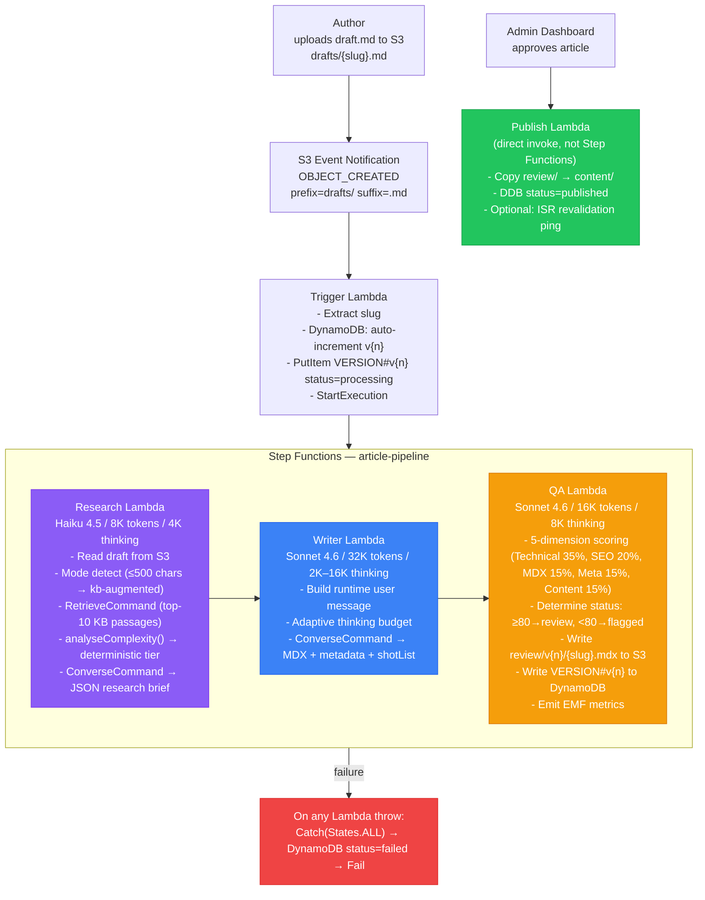

# Article Pipeline

A **Deterministic Workflow Agent** that transforms raw author drafts into quality-scored MDX articles. Three specialised Lambda functions (Research → Writer → QA) are orchestrated by an AWS Step Functions state machine. Each Lambda calls Claude directly via `ConverseCommand` — this is NOT a managed Bedrock Agent; it is explicit, code-controlled LLM orchestration.

Lives in `bedrock-applications/article-pipeline/` in the monorepo. The admin dashboard in [[tanstack-start|apps/start-admin]] triggers the pipeline by uploading a draft to S3.

## Pattern Classification — Chatbot vs Pipeline

| Property | Chatbot | Article Pipeline |
|---|---|---|
| **Invocation model** | `InvokeAgentCommand` (managed runtime) | `ConverseCommand` (direct model API) |
| **Workflow orchestration** | None — single round-trip | Step Functions state machine |
| **Agent count** | 1 (managed Bedrock Agent) | 3 specialised Lambdas |
| **Context passing** | Bedrock session memory | Explicit JSON payload through Step Functions |
| **State machine** | None | `StandardStateMachine` with `Catch → Fail` branches |
| **Model switching** | Single model per deployment | 3 models, each tuned for task |
| **KB retrieval** | Automatic (Agent Runtime) | Explicit `RetrieveCommand` call in Research Lambda |
| **Prompt injection** | Deploy-time static (CDK property) | Runtime dynamic (`SystemContentBlock[]` rebuilt per invocation) |

## Pipeline Flow



## Model Assignment

| Agent | Model | Max Tokens | Thinking Budget | Rationale |
|---|---|---|---|---|
| Research | `eu.anthropic.claude-haiku-4-5-*` | 8,192 | 4,096 (fixed) | Cost-efficient extraction; no creative generation needed |
| Writer | `eu.anthropic.claude-sonnet-4-6-*` | 32,768 | 2,048–16,000 (**adaptive**) | Highest-quality model for creative, high-stakes generation |
| QA | `eu.anthropic.claude-sonnet-4-6-*` | 16,384 | 8,192 (fixed) | Deep technical reasoning needed for CDK/K8s fact validation |

All use **Application Inference Profile ARNs** (cost-allocation tags: `component: article-pipeline`) and **EU cross-region inference profiles** (capacity resilience).

## Lambda Implementation Detail

### Trigger Lambda
- Parses S3 event (URL-decodes keys)
- Queries `VERSION#` sort keys in DynamoDB to auto-increment `v{n}`
- Writes immutable `VERSION#v{n}` record with `status="processing"` (live dashboard state)
- Calls Step Functions `StartExecution` with typed `PipelineContext` payload

### Research Lambda
- **Mode detection**: `draft.length ≤ 500 chars` → `kb-augmented` (prompt-driven); else → `legacy-transform` (draft conversion)
- **KB retrieval**: explicit `RetrieveCommand` (top-10 passages, query capped at 1,000 chars)
- **`analyseComplexity()`** — deterministic pre-model signal:
  - Signals: char count, code block count, code ratio, IaC fence count, heading count
  - Tiers: `LOW` (≤1 signal), `MID` (1 moderate), `HIGH` (≥2 signals)
  - Maps to Writer thinking budget: LOW=2,048, MID=8,192, HIGH=16,000 tokens
- **LLM output**: structured JSON research brief (outline, `technicalFacts[]`, SEO keywords, suggested references)

### Writer Lambda
- Receives full `ResearchResult` from Step Functions payload — no S3 reads
- Builds a **runtime-composed user message** from 8 context sections: retry warning, author direction, previous version, KB passages, proposed outline, technical facts, SEO brief, source draft
- Dynamic thinking budget: `min(complexity.budgetTokens, DEFAULT_THINKING_BUDGET)`
- Output: full MDX + frontmatter + metadata + `shotList` + `suggestedReferences`

### QA Lambda
- Validates 5 weighted dimensions: Technical Accuracy (35%), SEO (20%), MDX Structure (15%), Metadata Quality (15%), Content Quality (15%)
- Cross-references `technicalFacts[]` from Research Agent against article content
- Overrides Writer's `technicalConfidence` with independent `confidenceOverride`
- Determines `articleStatus`: `review` (≥80) or `flagged` (<80)
- Writes MDX to `review/v{n}/{slug}.mdx` — NOT to published (admin approval required)
- Emits pipeline-level EMF metrics

### Publish Lambda (admin-invoked)
- Copies `review/v{n}/slug.mdx` → `content/v{n}/slug.mdx`
- Updates DynamoDB `status="published"`
- Optionally pings [[nextjs|Next.js]] `/api/revalidate` for ISR cache purge

## System Prompts

| Prompt | Size | Cache Strategy | Key Output |
|---|---|---|---|
| `research-persona.ts` | ~156 lines | 1 `cachePoint` after persona + schema blocks | Strict JSON: `mode`, `outline[]`, `technicalFacts[]`, `seoResearch{}` |
| `blog-persona.ts` | **816 lines / 42KB** | 1 `cachePoint` after 6 static blocks (~3,650 tokens) → **~90% system prompt cost reduction** | Full MDX article + metadata + `shotList` |
| `qa-persona.ts` | ~167 lines | 1 `cachePoint` after rubric block | 5-dimension scores + `recommendation` + `confidenceOverride` |

The blog persona's Adaptive Thinking instructions tell the model *how* to use thinking tokens:
1. **Drift problem identification** — the 2 AM moment
2. **FinOps analysis** — calculate cost savings with actual math
3. **Syntax verification** — all CLI strings and code
4. **Structural scan** — plan section variety before writing

See [[inference-time-techniques]] for the full analysis of what thinking techniques are applied.

## Knowledge Base Integration

Shares the same Bedrock KB as the chatbot (`kb-stack.ts`). Key difference: the Research Lambda calls the KB **explicitly** via `RetrieveCommand`, not via managed Agent Runtime.

| Dimension | Chatbot | Article Pipeline |
|---|---|---|
| Who calls KB? | Bedrock Agent Runtime (automatic) | Research Lambda (explicit) |
| Passages visible in code? | No (black box) | Yes — typed `KbPassage[]` |
| Passages passed forward? | N/A (agent-internal) | Explicitly in Step Functions payload |
| Query control | Full (Bedrock decides) | Manual (draft content, capped 1,000 chars) |
| Score visibility | No | Yes — `passage.score` logged |
| Attribution | Hidden | `sourceUri` shown to Writer |

**KB is supplementary, not a hard gate**: If KB returns 0 passages, the pipeline continues in `legacy-transform` mode — the draft alone drives the article.

## DynamoDB Single-Table Design

```
pk                     sk              status       description
─────────────────────  ──────────────  ───────────  ────────────────────────
ARTICLE#{slug}         METADATA        published    Consumer-facing fields (title, tags, readingTime)
ARTICLE#{slug}         VERSION#v1      review       Full pipeline output
ARTICLE#{slug}         VERSION#v2      flagged      QA score < 80
ARTICLE#{slug}         VERSION#v3      processing   Pipeline currently running
```

**GSI1**: `gsi1pk=STATUS#{status}`, `gsi1sk={date}#{slug}#{version}` → enables dashboard queries like "all articles in review this week."

## Cost Monitoring

### What Exists

**Application Inference Profiles** with `component: article-pipeline` tag enable AWS Cost Explorer filtering by pipeline component.

**Per-Agent EMF** (emitted by `runAgent()` shared utility):
- `AgentInvocationCount`, `AgentInputTokens`, `AgentOutputTokens`, `AgentThinkingTokens`
- `AgentLatency`, `AgentCostUsd`, `AgentModelId`
- Dimensions: `AgentName` + `Environment`

**Pipeline-Level EMF** (emitted once in `qa-handler.ts`):
- `PipelineCompleted`, `PipelineCostUsd`, `PipelineQaScore`, `PipelineRetryCount`, `PipelinePassed`
- Dimensions: `Environment` + `Slug` + `Version`

**Prompt caching savings**: ~3,285 cached tokens at 10% cost per Writer invocation. Over 100 articles: ~$1 saved on Writer system prompts alone.

## Security Assessment

### Well-Implemented Controls

- Research Lambda: `bedrock:Retrieve` scoped to KB ARN only
- Writer Lambda: `bedrock:InvokeModel` only (no S3, no DDB writes)
- QA Lambda: S3 write scoped to `review/*` prefix
- Step Functions → DDB: `grantWriteData` (not `grantFullAccess`)
- SQS DLQ (14-day retention) on pipeline failures
- XRay tracing on all 5 Lambdas
- Prompt caching only on stable static sections (not dynamic user content)

### Security Gaps

| Gap | Severity | Description |
|---|---|---|
| **S1** | 🟡 Medium | No input sanitisation before model invocation — raw draft content passed directly; prompt injection possible |
| **S2** | 🟡 Medium | `KNOWLEDGE_BASE_ID` optional — if env var missing, KB retrieval silently skipped with no metric |
| **S3** | 🟡 Medium | No output sanitisation — Writer could include AWS ARNs or account IDs verbatim in published articles |
| **S4** | 🟡 Medium | No rate limit on Trigger Lambda — 50 simultaneous S3 uploads = 150 concurrent Bedrock API calls → `ThrottlingException` cascade |
| S5 | 🟢 Low | Slug divergence only logs a warning — no EMF metric, no QA score penalty |
| S6 | 🟢 Low | `bedrock:InvokeModel` allows wildcard `foundation-model/*` — should be scoped to specific model ARNs |

## Full Gap Inventory

| # | Gap | Severity | Effort |
|---|---|---|---|
| S1 | No input sanitisation (prompt injection) | 🟡 Medium | Low |
| S2 | `KNOWLEDGE_BASE_ID` optional — silent degradation | 🟡 Medium | Low |
| S3 | No output sanitisation — ARNs in articles | 🟡 Medium | Low |
| S4 | No rate limit on Trigger Lambda | 🟡 Medium | Medium |
| S5 | Slug divergence not surfaced as metric | 🟢 Low | Trivial |
| S6 | `bedrock:InvokeModel` wildcard ARN | 🟢 Low | Low |
| C1 | Cost lookup table not tied to live pricing | 🟡 Medium | Low |
| C2 | Prompt cache savings not netted from `PipelineCostUsd` | 🟢 Low | Low |
| C3 | No monthly Bedrock budget alarm | 🟡 Medium | Low |
| C4 | Failed pipeline partial cost not recorded | 🟢 Low | Low |
| P1 | No golden dataset for prompt regression testing | 🟡 Medium | Medium |
| P2 | No A/B prompt variant mechanism | 🟢 Low | Medium |
| P3 | `QA_PASS_THRESHOLD=80` hard-coded | 🟢 Low | Trivial |
| R1 | Discrete tier budgets — no continuous scaling | 🟢 Low | Low |
| R2 | Complexity not re-evaluated after Research output | 🟡 Medium | Low |
| R3 | No few-shot CoT exemplars in system prompts | 🟡 Medium | Low |
| R4 | QA score unsampled — single pass gates publish/flag | 🟡 Medium | Low |
| **R5** | **QA `issues[]` never injected into Writer retry** | **🔴 High** | **Medium** |
| R6 | QA scores not used as longitudinal reward signal | 🟡 Medium | Medium |

## Prompt Evolution

### Current Constraints
- All 3 prompts are TypeScript `const` values compiled into the Lambda bundle
- Changes require: edit `*-persona.ts` → `npm run build` → CDK Lambda code update
- No automated evaluation framework — the QA Agent is the only automated quality signal

### Built-in Evaluation Advantage
Unlike the chatbot (where prompt quality is opaque), every pipeline run produces 5 dimension scores in DynamoDB. `PipelineQaScore` metrics before/after a prompt change are quantitative evidence of regression.

### Recommended Evolution Path
1. **Short-term**: Query DynamoDB for `avg(qaScore)` by dimension by month — detect prompt regression
2. **Medium-term**: `promptVariant` field in `PipelineContext`; 50/50 routing via SSM feature flag → Writer Lambda A/B
3. **Long-term**: Bedrock Model Evaluation jobs against curated reference articles

## Related Pages

- [[inference-time-techniques]] — Extended Thinking, Adaptive Compute, CoT, Self-Consistency, Self-Refinement applied to this pipeline
- [[aws-bedrock]] — `ConverseCommand` vs `InvokeAgentCommand`, Application Inference Profiles, KB `RetrieveCommand`
- [[tanstack-start]] — admin dashboard that uploads drafts and triggers the pipeline
- [[nextjs]] — `/api/revalidate` target for ISR purge after publish
- [[aws-step-functions]] — orchestration engine for the Research→Writer→QA state machine
- [[frontend-portfolio]] — monorepo context
- [[comparisons/llm-wiki-vs-bedrock-pipeline]] — this pipeline vs the LLM Wiki knowledge base approach
