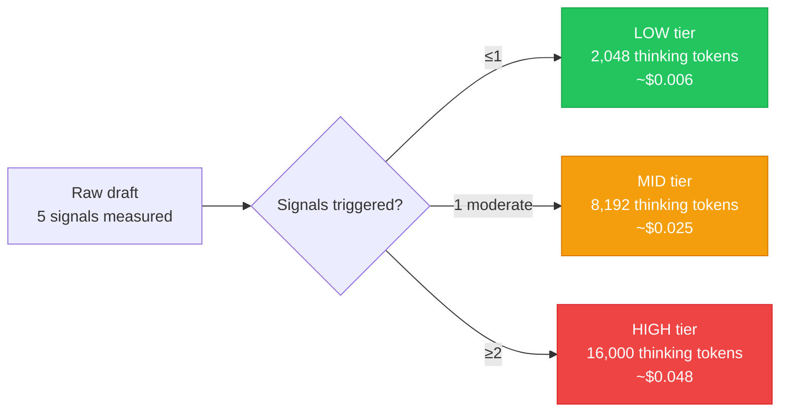
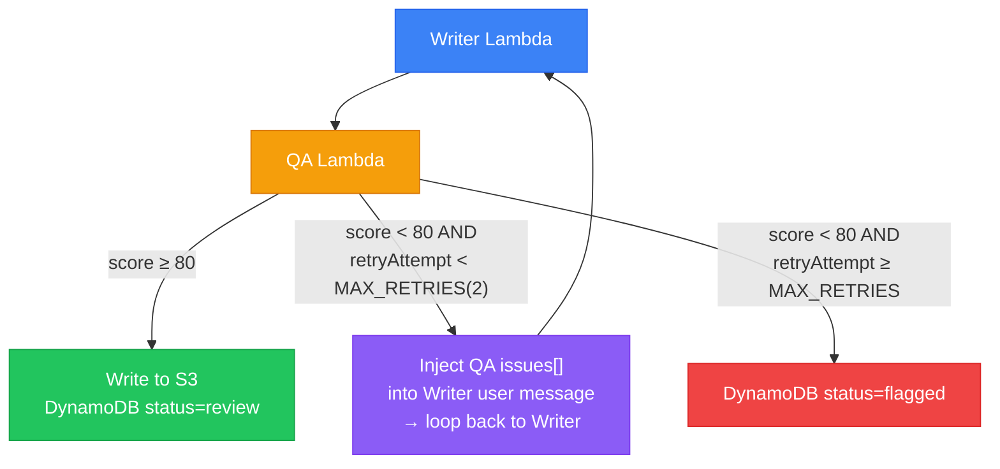

# Inference-Time Techniques

An inventory of inference-time and reasoning techniques assessed against the [[article-pipeline]] implementation. Distinguishes what is implemented, what is partially applied, what would improve the system, and what doesn't fit.

This page covers **inference-time** techniques (prompt design, sampling strategies, pipeline structure). Training-time techniques (SFT, RL) are briefly addressed but are not applicable to the current Bedrock-hosted stack.

## Status Legend

| Symbol | Meaning |
|---|---|
| ✅ | Applied — demonstrably implemented in the codebase |
| ⚠️ | Partial / Implicit — approximated but not fully formalised |
| ❌ | Absent but Relevant — would improve the system; not implemented |
| 🚫 | Not Applicable — does not fit this use case |

---

## 1. Extended Thinking — Budget Tokens

**Status: ✅ — the most significant inference-time design choice in the system.**

All three agents use Claude's Extended Thinking API via `additionalModelRequestFields.thinking.budget_tokens`. This runs model reasoning in a hidden `<thinking>` block that is not part of the visible output.

```typescript
// shared/src/index.ts → runAgent()
...(config.thinkingBudget > 0
    ? {
          additionalModelRequestFields: {
              thinking: { type: 'enabled', budget_tokens: config.thinkingBudget },
          },
      }
    : {})
```

| Agent | Budget | Fixed/Adaptive | Rationale |
|---|---|---|---|
| Research | 4,096 | Fixed | Extraction task — moderate depth |
| Writer | 2,048–16,000 | **Adaptive** (complexity-driven) | Creative + technical — scales with content |
| QA | 8,192 | Fixed | Technical validation needs deep reasoning |

`AgentThinkingTokens` is tracked as a separate EMF dimension for cost attribution.

**Extended Thinking as internalised search**: The `<thinking>` block is functionally analogous to the "internalised search budget" described in Meta-CoT research — the model performs multi-step reasoning in a latent space without producing intermediate output tokens in the visible response.

---

## 2. Adaptive Compute Allocation (Inference-Time Scaling)

**Status: ✅ — explicit, code-driven.**

The `analyseComplexity()` function in `research-agent.ts` is a **deterministic pre-model signal** that scales the Writer's thinking budget before the model is invoked.

```typescript
const TIER_BUDGETS: Record<ComplexityTier, number> = {
    LOW:  2_048,   // Light content → minimal thinking
    MID:  8_192,   // Moderate → standard thinking
    HIGH: 16_000,  // Dense technical → maximum thinking
};
```

Classification uses 5 observable signals:
- Character count (raw draft length)
- Code block count
- Code-to-prose ratio
- IaC fence count (yaml/hcl/terraform fences)
- Heading count

**Tier threshold**: ≥2 concurrent signals → HIGH. This is a **rule-based inference-time scaling policy** — no LLM involved in the routing decision.



### Gaps

**Gap R1**: The current model is **discrete** (3 tiers). A continuous model like `budget = base + (signals_triggered × 2048)` would allow finer-grained compute allocation without redesigning the tier system.

**Gap R2**: `analyseComplexity()` runs on the **raw draft** before the Research Agent runs. After the Research Agent returns a `technicalFacts[]` array and `outline[]`, those richer signals (e.g., `technicalFacts.length > 20 → upgrade to HIGH`) could refine the budget. This second-pass refinement is not implemented.

---

## 3. Chain-of-Thought (CoT) Prompting

**Status: ⚠️ Partial — applied implicitly via structured thinking instructions, not via explicit few-shot CoT.**

The `blog-persona.ts` Reasoning Instructions section instructs the model to follow a specific chain of steps inside its `<thinking>` block:

```
## Reasoning Instructions (Adaptive Thinking)
Before generating the final JSON, use your <thinking> tokens to:

1. THE DRIFT PROBLEM: Identify the specific drift, failure, or pain point...
2. FINOPS ANALYSIS: Calculate any cost optimisations mentioned...
3. SYNTAX VERIFICATION: Verify ALL command-line strings, code snippets...
4. STRUCTURAL SCAN: Plan section order and variety before writing...
```

This is **structured CoT via system prompt** — the model is told *what to reason about* and *in what order*, inside the thinking block (not in the visible response).

**What is missing**: None of the three agents uses explicit **few-shot CoT** — no example `<thinking>` traces are included in any system prompt.

**Gap R3**: Add 1–2 short exemplar thinking traces per agent:
- For the **QA agent**: show how to cross-reference a `technicalFacts[]` entry against an article claim — "I'm checking the claim in §3 that `aws_lambda.Function` is the TypeScript L2 construct name... actually that's Python SDK syntax; in TypeScript it's `lambda_.Function`. This is a technical accuracy error."
- For the **Writer agent**: show a structural scan thinking trace that catches section imbalance before writing

---

## 4. Self-Consistency (Multiple Sampling + Vote)

**Status: ❌ Absent.**

Self-consistency calls the same model N times (temperature > 0) and takes the majority answer. Each agent is called **exactly once** per pipeline run. No sampling, no voting.

**Is it relevant?** Yes — but only for the QA score, not the article content.

The article content benefits from a single high-quality generation (more thinking budget, lower temperature). But the QA agent produces a **single score** that gates `review` vs `flagged`. That gating decision is sensitive to model temperature and prompt phrasing variations.

**Gap R4**: Run the QA agent 2–3 times and average `overallScore` and dimension scores:

```typescript
// qa-handler.ts — proposed pattern
const [qa1, qa2] = await Promise.all([
    executeQaAgent(ctx, writerResult, technicalFacts, mode),
    executeQaAgent(ctx, writerResult, technicalFacts, mode),
]);
const averagedScore = (qa1.data.overallScore + qa2.data.overallScore) / 2;
```

**Effort**: Low. **Value**: High — reduces variance in the gating decision with a hard-coded `QA_PASS_THRESHOLD = 80`.

---

## 5. Sequential Revision / Iterative Refinement

**Status: ⚠️ Partial — implemented via pipeline re-execution, NOT via in-pipeline revision loop.**

The pipeline has a `retryAttempt` counter in `PipelineContext`. The Writer prompt includes a retry warning:

```typescript
...(retryAttempt > 0
    ? [`> ⚠️ This is retry attempt ${retryAttempt}. The previous version did not pass QA.`]
    : [])
```

But this retry requires a **full pipeline re-execution** — a new S3 `PutObject` of the draft. There is no Step Functions `Choice` state that loops:

```
Writer → QA → if score < threshold → Writer (with QA feedback) → QA
```

**The gap**: The QA agent's `issues[]` array contains structured, actionable feedback (issue location, severity, suggested fix). This feedback is stored in DynamoDB but **never programmatically injected into the Writer's input on a retry**. The Writer only receives a vague retry warning — not the specific criticism.

**Gap R5 — In-Pipeline Revision Loop** (HIGH severity):



This converts QA from a pure evaluation gate into an **active revision signal**. It is the highest-value reasoning improvement available.

---

## 6. Search Against a Verifier

**Status: ✅ Applied — the QA Agent IS the verifier.**

The pipeline maps directly onto the "generator + verifier" paradigm:

| Component | Role |
|---|---|
| Writer Agent | Generator (produces candidate solutions) |
| QA Agent | Verifier (scores against 5 rubrics) |
| `QA_PASS_THRESHOLD = 80` | Acceptance criterion |
| `retryAttempt` counter | Search budget (max candidates allowed) |

The Research Agent's `technicalFacts[]` serves as a **ground-truth reference** that the QA verifier checks Writer claims against:

```typescript
// qa-agent.ts → buildQaMessage()
`## Technical Facts from Research Agent`,
`Cross-reference the article content against these verified facts:`,
...technicalFacts.map(f => `- ${f}`),
```

**What is missing**: The verifier signal is not fed back to the generator on retry. See Gap R5.

**Gap R6**: Use QA dimension scores as a **longitudinal reward signal**. Store them in DynamoDB (already done) and query `avg(technicalAccuracy.score)` by article category over time. A prompt change that reduces `avg(technicalAccuracy)` on IaC articles has regressed the Writer for that category. This is lightweight reward modelling without requiring model fine-tuning.

---

## 7. Tree of Thoughts (ToT)

**Status: 🚫 Not applicable.**

ToT requires exploring multiple generation branches simultaneously and pruning via a verifier. For article generation (a single linear document), there is no branching decision tree where multiple narrative paths need evaluation and pruning.

The `STRUCTURAL SCAN` thinking instruction gives the Writer planning-before-execution behaviour, but it is single-path reasoning, not a genuine search tree.

**Should it be added?** Only if you wanted to generate N structurally different article variants per draft and let the QA agent select the best. At the current publishing cadence (solo developer), the added cost (N × Writer tokens) is not justified.

---

## 8. Training-Time Techniques (Not Applicable)

The following techniques require modifying model weights — not applicable to the Bedrock-hosted Anthropic models.

| Technique | Status | Reason |
|---|---|---|
| SFT on Reasoning Data (STaR) | 🚫 | Anthropic models cannot be fine-tuned on Bedrock; applicable to open-source alternatives |
| Outcome Reward Model (ORM) | 🚫 | QA agent already performs this role at inference time |
| Process Reward Model (PRM) | 🚫 | Extended Thinking outputs are model-internal; intermediate steps cannot be supervised |
| RL with a Verifier | 🚫 | Anthropic models cannot be trained via Bedrock; would require model provider change |

**What IS applicable**: The pipeline accumulates a valuable dataset (QA scores + Writer outputs + Research briefs per article). This constitutes fine-tuning data if you ever switched to an open-source Writer model (Llama 3.1 70B as cheaper alternative). The DynamoDB schema already stores everything needed.

---

## Gap Summary (Reasoning Techniques)

| # | Gap | Severity | Effort |
|---|---|---|---|
| R1 | Discrete tier budgets — no continuous inference scaling | 🟢 Low | Low |
| R2 | Complexity not re-evaluated after Research Agent output | 🟡 Medium | Low |
| R3 | No few-shot CoT exemplars in system prompts | 🟡 Medium | Low |
| R4 | QA score unsampled — single pass gates publish/flag | 🟡 Medium | Low |
| **R5** | **QA `issues[]` not injected into Writer retry** | **🔴 High** | **Medium** |
| R6 | QA scores not used as longitudinal reward signal | 🟡 Medium | Medium |

---

## Related Pages

- [[article-pipeline]] — the pipeline these techniques are applied to
- [[aws-bedrock]] — Extended Thinking API, `ConverseCommand`, Application Inference Profiles
