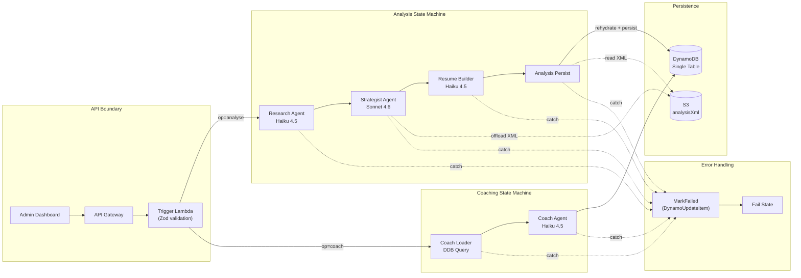
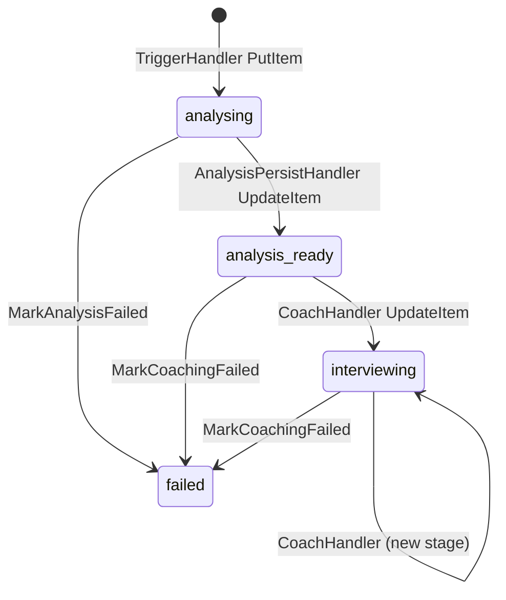
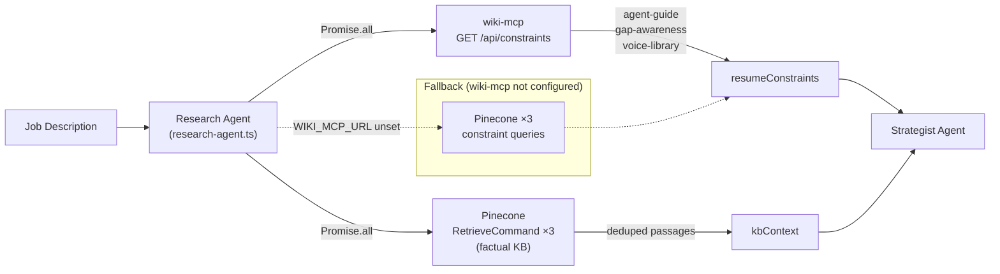

# Job Strategist Pipeline

Multi-agent Step Functions pipeline: Admin Dashboard → API Gateway → Trigger Lambda → two parallel state machines (Analysis + Coaching). Generates structured job application analysis, tailored resume, and interview coaching from a job description + resume input.

**Audit status:** No Critical findings. 3 High (H1–H3), 6 Medium (M1–M6), 4 Low/Info. See [[#remediation-priority-matrix]].

---

## Architecture



**Model assignment:**
- Research: Haiku 4.5 (KB retrieval + synthesis — cost-sensitive)
- Strategist: Sonnet 4.6 (5-phase structured analysis — quality-critical)
- Resume Builder: Haiku 4.5 (JSON-to-JSON transformation — deterministic)
- Coach: Haiku 4.5 (stage-specific coaching — repetitive pattern)

All agents use Application Inference Profiles (`INFERENCE_PROFILE_ARN` → `EFFECTIVE_MODEL_ID`) for FinOps cost attribution.

---

## Strengths

| # | Pattern | Assessment |
|---|---------|------------|
| S1 | **Zod boundary validation** (`trigger-handler.ts`) | Discriminated union on `operation`, runtime validation on all external data. Exemplary. |
| S2 | **Fail-fast env validation** (`environment.schema.ts`) | `TriggerEnvSchema.parse(process.env)` at module scope — cold-start failure on misconfiguration. |
| S3 | **S3 payload offloading** (`strategist-handler.ts`) | Proactive offload of `analysisXml` (80–150KB) with `s3://` sentinel + rehydration in persist handler. Includes near-limit warnings. |
| S4 | **Step Functions-native error handling** | `Catch → DynamoUpdateItem(status='failed') → Fail` — frontend always sees failure state. Persists `$.error.Cause` for debuggability. |
| S5 | **Input/output sanitisation** | Dual-layer: input strips prompt injection patterns; output guards against PII and leaked tool markers. |
| S6 | **Application Inference Profiles** | Per-agent FinOps cost attribution vs. raw foundation model ARNs. |
| S7 | **Progressive payload trimming** | Each stage trims fields no longer needed (jobDescription, kbContext, resumeData) — keeps under 256KB. |
| S8 | **Defensive LLM output parsing** | Null-coalescing + `Array.isArray()` guards on every LLM-returned field. |

---

## High Findings (H1–H3)

### H1: Inconsistent Environment Validation — Silent Data Loss Risk
**Severity:** High | **Category:** Reliability

`trigger-handler.ts` and `coach-loader-handler.ts` use `Schema.parse()` (fail-fast). The other 4 handlers use `process.env.VARIABLE ?? ''` (silent fallback). If `TABLE_NAME` or `ASSETS_BUCKET` is missing, those handlers skip all DynamoDB writes — pipeline appears to succeed but no data is persisted.

**Fix:** Create `AgentHandlerEnvSchema` with `z.string().min(1)` and apply to all 4 affected handlers.

### H2: No Bedrock API Retry Logic
**Severity:** High | **Category:** Resilience

`runAgent()` invokes Bedrock without retry. Bedrock `ThrottlingException` (429) and `ServiceUnavailableException` (503) cause entire pipeline failure — 2–5 min run cost (~$0.05–$0.15) wasted per transient error.

**Fix options:**
- Application-level: `retry()` wrapper in `runAgent()` — 3 attempts, exponential backoff, retry on 429/503
- Step Functions-level: `addRetry()` on each task — simpler but re-runs entire Lambda including KB retrieval

### H3: Missing `ASSETS_BUCKET` and `ALLOWED_ORIGINS` in Trigger Lambda CDK
**Severity:** High | **Category:** Deployment Bug — **Highest Priority (P0)**

CDK definition for trigger Lambda does not inject `ASSETS_BUCKET` or `ALLOWED_ORIGINS`. `ASSETS_BUCKET` defaults to `''`. The Strategist handler's `if (ASSETS_BUCKET)` guard silently skips XML offloading → 256KB payload limit breach on real job descriptions.

**Fix:** Add 2 env vars to CDK `environment` block (trivial — 2 lines).

---

## Medium Findings (M1–M6)

| # | Finding | Category | Fix |
|---|---------|----------|-----|
| M1 | Data stack JSDoc documents `JOB#<jobId>` schema but actual schema uses `APPLICATION#<slug>` | Docs debt | Update JSDoc in `strategist-data-stack.ts` |
| M2 | Coach handler uses `totalCostUsd + :cost` while analysis-persist uses `SET totalCostUsd = :cost` — inconsistent accumulator semantics | Data integrity | Standardise on increment OR absolute replacement |
| M3 | `pipelineDlq` declared but never wired to any Lambda or event source | Dead code | Wire to Lambdas or remove |
| M4 | Trigger handler writes `gsi2pk`/`gsi2sk` but data stack defines only 1 GSI | Dead attributes | Create GSI2 or remove the writes |
| M5 | KB deduplication uses `new Set(allPassages)` — score prefix prevents true dedup | Context quality | Compare content-only (strip `[Source: ...]` prefix) |
| M6 | `coach-handler.ts` stores `interviewPrep` as `JSON.stringify(coaching.data)` — string instead of native Map | Data model | Store as native DynamoDB Map — removes need for consumer `JSON.parse()` |

---

## Data Schema (Actual — Not What the JSDoc Says)

The DynamoDB single-table schema as implemented:

| pk | sk | Written by | Purpose |
|---|---|---|---|
| `APPLICATION#<slug>` | `METADATA` | TriggerHandler | Application status, company, role, interview stage |
| `APPLICATION#<slug>` | `ANALYSIS#<pipelineId>` | AnalysisPersistHandler | Full analysis XML, suggestions, cover letter |
| `APPLICATION#<slug>` | `INTERVIEW#<stage>` | CoachHandler | Stage-specific interview prep |
| `APPLICATION#<slug>` | `TAILORED_RESUME#<pipelineId>` | ResumeBuilderHandler | Tailored resume + change summary |
| `RESUME#<resumeId>` | `METADATA` | External (cross-table assumption) | Source resume data |

**GSI: `gsi1-status-date`** — `gsi1pk: APP_STATUS#<status>`, `gsi1sk: <date>#<slug>`. Used for listing applications by status.

**Record lifecycle:**



---

## Prompt Engineering Assessment

| Agent | Model | System Prompt | Output Format |
|---|---|---|---|
| Research | Haiku 4.5 | Well-structured persona with explicit JSON schema | JSON with defensive parsing (S8) |
| Strategist | Sonnet 4.6 | 5-phase framework, XML output spec, clear delimiters (`--- BEGIN/END ---`) | Custom XML with regex extraction |
| Resume Builder | Haiku 4.5 | Explicit JSON-to-JSON transformation rules | JSON structured diff |
| Coach | Haiku 4.5 | Stage-specific coaching framework | JSON domain-specific structure |

**One open concern:** Strategist uses regex-based XML extraction. Malformed LLM XML (unclosed tags) may be silently partially extracted. Add XML well-formedness check post-extraction.

---

## KB Integration

The Research Agent fetches context from two sources in parallel: [[ai-engineering/wiki-mcp]] (deterministic, structured pages) and Pinecone via Bedrock `RetrieveCommand` (semantic, factual chunks).

### Why Two Sources

RAG retrieval is **probabilistic** — it returns what is *semantically similar* to the query. Resume domain pages ([[resume/agent-guide]], [[resume/gap-awareness]], [[resume/voice-library]]) contain hard rules that RAG handles poorly:

- **Mandatory prohibitions** ("NEVER say service mesh", "NEVER claim SLA compliance") — absent from context if the JD query doesn't trigger similarity with `gap-awareness.md`
- **ABSENT concepts** — not claimed at all; RAG may return a passage about the topic without the ABSENT annotation

wiki-mcp solves this with deterministic retrieval: `GET /api/constraints` always returns all three constraint pages combined, regardless of the job description content.

### Implemented Retrieval Flow



**Fallback path**: if `WIKI_MCP_URL` / `WIKI_MCP_AUTH` env vars absent, research agent falls back to 3 additional Pinecone queries targeting the constraint pages. Backward-compatible — pipeline runs without wiki-mcp deployed.

### What Was Fixed

| Original problem | Status |
|---|---|
| Constraint retrieval probabilistic — hard rules may be absent | ✅ Fixed — wiki-mcp `GET /api/constraints` always returns all 3 pages |
| Sequential KB queries | ✅ Fixed — `Promise.all` over all 4 calls (3 factual + 1 constraints) |
| Dedup includes score prefix (M5) | Open — still uses `new Set(allPassages)` with score prefix |
| No retry on Bedrock `ThrottlingException` (H2) | Open — no retry wrapper in `runAgent()` |

### CDK Wiring

`strategist-pipeline-stack.ts` injects env vars into research Lambda:

```typescript
WIKI_MCP_URL:  'https://ops.nelsonlamounier.com/wiki-mcp',
WIKI_MCP_AUTH: ssm.StringParameter.valueForSecureStringParameter(
    this, '/wiki-mcp/basicauth-header'
),  // resolved at CloudFormation deploy time — no runtime SSM call
```

See [[ai-engineering/wiki-mcp]] for the full server implementation.

---

## Remediation Priority Matrix

| Priority | Finding | Effort | Action |
|----------|---------|--------|--------|
| P0 | H3: Missing `ASSETS_BUCKET` in trigger CDK | Trivial | Add 2 env vars |
| P1 | H1: Inconsistent env validation | Small | Create shared schema, apply to 4 handlers |
| P1 | M1: Data stack schema JSDoc divergence | Small | Update JSDoc |
| P2 | H2: No Bedrock retry logic | Medium | Retry in `runAgent()` or CDK `addRetry()` |
| P2 | M3: DLQ never wired | Small | Wire or remove |
| P2 | M2: Cost accumulation inconsistency | Medium | Audit and standardise |
| P3 | M5: KB dedup content-only | Small | Strip score prefix before `Set` |
| P3 | M6: `JSON.stringify` in coach | Small | Native Map |
| P3 | M4: Dead GSI2 attributes | Trivial | Create GSI or remove writes |
| P4 | L1–L4, I1–I2 | Trivial | Opportunistic |

---

## Related Pages

- [[resume/agent-guide]] — the direct-path guide agents must read before generating resume content
- [[resume/concept-library]] — STRONG/PARTIAL/ABSENT per concept with evidence
- [[resume/gap-awareness]] — what NOT to claim (including mandatory hard rules)
- [[ai-engineering/article-pipeline]] — sibling pipeline (Deterministic Workflow pattern)
- [[ai-engineering/self-healing-agent]] — sibling pipeline (Reactive Autonomous pattern)
- [[tools/aws-bedrock]] — ConverseCommand/InvokeModel API patterns
- [[tools/aws-step-functions]] — state machine orchestration patterns
