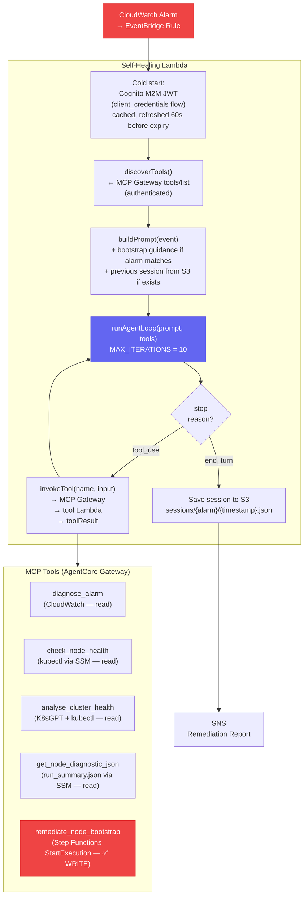

# Self-Healing Agent — LLM Design

A **Reactive Autonomous Agent** — the third distinct LLM pattern in the portfolio alongside the [[article-pipeline]] (Deterministic Workflow) and [[chatbot]] (Managed RAG). The model receives a CloudWatch alarm event and autonomously decides which MCP tools to call, in what order, and when to stop. It has real write-access tools that can trigger Step Functions on production infrastructure.

For the infrastructure integration perspective (triggers, SNS, FinOps routes) see [[concepts/self-healing-agent]].

## Three-Pattern Comparison

| Feature | Article Pipeline | Chatbot | **Self-Healing Agent** |
|---|---|---|---|
| **Pattern** | Deterministic Workflow Agent | Managed RAG Agent | **Reactive Autonomous Agent** |
| **Orchestration** | Step Functions state machine | Bedrock managed runtime | **Self-managed loop in Lambda** |
| **Model API** | `ConverseCommand` | `InvokeAgentCommand` | **`ConverseCommand` + `tool_use`** |
| **Tools** | None | None (KB retrieval built-in) | **6 MCP tools via AgentCore Gateway** |
| **Knowledge Base** | KB via `RetrieveCommand` | Bedrock KB + Pinecone (automatic) | **None — live infrastructure APIs** |
| **Trigger** | S3 event (author upload) | API Gateway (user request) | **EventBridge (CloudWatch Alarms)** |
| **Prompt source** | Runtime-built per invocation | Deploy-time static instruction | **Deploy-time system + runtime event** |
| **Determinism** | High (fixed steps) | Medium (RAG-grounded) | **Low — model chooses tool sequence** |
| **Extended Thinking** | ✅ Adaptive (2K–16K tokens) | ❌ Unavailable (InvokeAgent) | ❌ Absent (gap SH-R1) |
| **Human in loop** | Admin approves publish | User initiates conversation | **None — fully autonomous** |

## Architecture



## Model Invocation

`ConverseCommand` directly — same low-level API as the article pipeline, not the managed `InvokeAgentCommand`.

```typescript
// index.ts:726
const response = await bedrock.send(new ConverseCommand({
    modelId: EFFECTIVE_MODEL_ID,   // Application Inference Profile ARN ?? base model
    system: systemPrompt,          // Static multi-block system instruction
    messages,                      // Accumulating conversation turns
    toolConfig,                    // All discovered MCP tool definitions
}));
```

**Model**: `eu.anthropic.claude-sonnet-4-6` (EU cross-region inference profile)
**No Extended Thinking** — see Gap SH-R1 below.

## The 6 MCP Tools

| Tool | Lambda | Access | Risk |
|---|---|---|---|
| `diagnose_alarm` | `tool-diagnose-alarm` | `cloudwatch:DescribeAlarms` + `GetMetricData` | Read-only |
| `check_node_health` | `tool-check-node-health` | `kubectl get nodes` via SSM SendCommand | Read-only |
| `analyse_cluster_health` | `tool-analyse-cluster-health` | K8sGPT + kubectl via SSM | Read-only |
| `get_node_diagnostic_json` | `tool-get-node-diagnostic` | `run_summary.json` via SSM | Read-only |
| `remediate_node_bootstrap` | `tool-remediate-bootstrap` | `states:StartExecution` on Step Functions | ⚠️ **WRITE** |
| `ebs_detach` | _(fallback only — no Gateway Lambda)_ | EBS volume detach | ⚠️ Inconsistency |

`ebs_detach` appears in `getDefaultTools()` (fallback when Gateway is unavailable) but has **no registered Lambda target** in `gateway-stack.ts`. The model is told it has a tool it cannot actually execute — undefined behaviour if selected. See Gap SH-S3.

### Dynamic Tool Discovery

Unlike every other agentic system that hardcodes tool definitions, this agent **discovers tools at invocation time** from the MCP Gateway:

```typescript
// index.ts:408–463
async function discoverTools(): Promise<AgentTool[]> {
    // 1. POST tools/list to MCP Gateway (authenticated Cognito JWT)
    // 2. Transform MCP tool specs → Bedrock Tool format
    // 3. Fall back to getDefaultTools() if Gateway unavailable
}
```

**Architecture benefit**: Adding a new tool to the Gateway requires no Lambda code change. The model receives the updated tool inventory on next invocation.

## Gateway Authentication — Cognito M2M

Every Gateway call is M2M-authenticated via Cognito `client_credentials` flow:

1. Cold start: `cognito-idp:DescribeUserPoolClient` → retrieve client secret
2. Exchange `client_id:client_secret` for a Cognito JWT
3. Cache JWT; refresh 60 seconds before expiry
4. `Authorization: Bearer <token>` on every MCP Gateway call

```
POST https://<gateway-url>
Authorization: Bearer <cognito-jwt>
Content-Type: application/json

{ "jsonrpc": "2.0", "method": "tools/call", "params": { "name": "...", "arguments": {...} } }
```

## The Agentic Loop

Self-managed inside the Lambda — no Step Functions. The model drives the loop:

```
messages = [{ role: 'user', content: [prompt] }]

for iteration in 0..MAX_ITERATIONS (10):
    ConverseCommand → response
    append assistant response to messages
    if stopReason === 'tool_use':
        for each toolUse block:
            result = invokeTool(name, input) via MCP Gateway
        append toolResults as user message
        continue
    else (stopReason === 'end_turn'):
        return { text, toolsCalled }

MAX_ITERATIONS exceeded → return WARN, save session
```

**Token tracking**: `inputTokens` + `outputTokens` logged after every `ConverseCommand` call → CloudWatch MetricFilter extracts them.

**Conversation history accretion**: `messages[]` accumulates every turn. On a 10-iteration loop with 6 tools, the input token count grows significantly with each iteration. No truncation. See Gap SH-C2.

## Prompt Architecture — Hybrid Design

The most architecturally significant design decision: **hybrid autonomy**. The LLM is autonomous by default, but for well-understood failure classes the prompt injects a near-deterministic diagnostic workflow.

### System Prompt

Deploy-time injectable via `SYSTEM_PROMPT` environment variable. Minimal and generic — the heavy context specificity is handled at runtime by `buildPrompt()`. See Gap SH-S1 (stored in plaintext env var).

### `buildPrompt()` — Runtime Dynamic Builder

```typescript
// index.ts:254–295
function buildPrompt(event: AlarmEvent): string {
    const dryRunNote = DRY_RUN
        ? 'DRY RUN MODE: Propose remediation steps but do NOT execute them.'
        : 'Execute the appropriate remediation steps.';

    const bootstrapGuidance = isBootstrapAlarm(alarmName)
        ? buildBootstrapDiagnosticGuidance()   // injected conditionally
        : '';

    return [
        `Alarm: ${alarmName}`,
        `New State: ${newState}`,
        `Reason: ${reason}`,
        dryRunNote,
        bootstrapGuidance,
        `Full event detail:\n${JSON.stringify(detail, null, 2)}`,  // ← injection surface (SH-S5)
    ].filter(Boolean).join('\n');
}
```

### Bootstrap Diagnostic Guidance Block

When the alarm matches known bootstrap patterns (`bootstrap-orchestrator`, `ssm-automation`, `step-function`, `k8s-bootstrap`), the prompt injects a step-by-step workflow:

```
─── SSM BOOTSTRAP FAILURE DETECTED ───
1. DIAGNOSE: Use get_node_diagnostic_json to fetch run_summary.json
2. CLASSIFY: Determine if TRANSIENT (→ retry) or PERMANENT (→ report only)
3. REMEDIATE (transient only): Use remediate_node_bootstrap
4. VERIFY: Use check_node_health then analyse_cluster_health
───────────────────────────────────────
```

This is a **hybrid design**: the model is autonomous, but for well-understood failure classes it is guided through a near-deterministic workflow. Reduces token consumption and improves reliability without sacrificing flexibility for novel failures.

## S3-Backed Episodic Session Memory

Simple episodic memory for same-alarm repeat failures:

```typescript
interface SessionRecord {
    alarmName: string;
    timestamp: string;       // ISO — used for lexicographic sort
    correlationId: string;
    prompt: string;          // Full prompt sent to the model
    toolsCalled: string[];   // Deduplicated list
    result: string;          // Agent's final text response
    dryRun: boolean;
}
```

**Key format**: `sessions/{sanitised-alarm-name}/{ISO-timestamp}.json`  
**Retention**: S3 lifecycle rule, default 30 days  
**Load**: Lists up to 10 objects, takes the most recent — no multi-session summarisation

**Previous session injection**:
```
─── PREVIOUS REMEDIATION ATTEMPT (do NOT repeat the same actions) ───
Tools called: diagnose_alarm, get_node_diagnostic_json, remediate_node_bootstrap
Outcome: Node failed to join cluster within timeout...
[result truncated to 2000 chars]
───────────────────────────────────────
```

This is a primitive but effective **cross-invocation self-refinement**: the model is aware of what was previously attempted and explicitly instructed not to repeat it. Prevents remediation loops.

## Security Gaps

| Gap | Severity | Description |
|---|---|---|
| **SH-S1** | 🔴 High | System prompt in plaintext Lambda env var — readable by anyone with `lambda:GetFunction` IAM permission. Fix: load from SSM SecureString at cold start |
| **SH-S2** | 🔴 High | `ssm:SendCommand` on `resources: ['*']` — allows running commands on any SSM-managed instance in the account. Fix: scope with `aws:ResourceTag/project: k8s-cluster` condition |
| SH-S3 | 🟡 Medium | `ebs_detach` in fallback tool definitions but no Gateway Lambda — model told it has a tool it cannot execute |
| SH-S4 | 🟡 Medium | In-memory dedup cache (`Map<string, number>`) lost on Lambda cold start — identical events during cold start bypass dedup. Fix: DynamoDB conditional write with TTL |
| **SH-S5** | 🔴 High | `JSON.stringify(detail)` of CloudWatch event injected directly into prompt — `reason` field is a prompt injection surface. Fix: max char cap + strip instruction patterns + XML boundary tag |
| **SH-S6** | 🔴 High | No SQS rate limiting between EventBridge and Lambda — alarm storm spawns parallel Bedrock invocations, each consuming up to 100K+ tokens. Fix: SQS FIFO queue with `MessageDeduplicationId = alarmName#eventTime`, Lambda concurrency = 1 |
| SH-S7 | 🟡 Medium | SNS remediation reports unencrypted — contain alarm names, tool sequences, instance IDs. Fix: KMS encryption + output redaction |

## Cost & FinOps Gaps

| Gap | Severity | Description |
|---|---|---|
| SH-C1 | 🟡 Medium | Token budget alarm fires after 1-hour window — a single runaway 10-iteration loop can consume 200K+ tokens before the alarm triggers. Fix: per-invocation token gate inside the loop |
| SH-C2 | 🟡 Medium | `messages[]` accumulates unboundedly — input token cost grows with each iteration. Fix: sliding window keeping original prompt + last N turns |
| SH-C3 | 🟢 Low | No monthly Bedrock budget alarm — token alarm is per-hour only |

## Reasoning Technique Assessment

### Extended Thinking

**Status: ❌ Absent — notably absent given the stakes.**

The article pipeline uses adaptive Extended Thinking (2K–16K tokens). This agent uses the same `ConverseCommand` API but omits it. For TRANSIENT vs. PERMANENT failure classification — which drives whether `remediate_node_bootstrap` is called — a short thinking budget before write tool decisions would add a meaningful safety layer.

**Gap SH-R1**: Enable thinking budget of 1,000–2,000 tokens specifically for the classification step before invoking write tools.

### Chain-of-Thought

**Status: ⚠️ Partial — implicit via bootstrap guidance, not explicit in system prompt.**

The bootstrap guidance block functions as implicit CoT (DIAGNOSE → CLASSIFY → REMEDIATE → VERIFY). What is missing is an explicit system prompt instruction: "Before calling any write tool, reason about the failure class and state your classification."

**Gap SH-R2**: Add explicit CoT instruction to system prompt for write-tool decision points.

### Sequential Revision / Self-Refinement

**Status: ⚠️ Partial — cross-invocation via session memory; not within-session.**

Cross-invocation: S3 session memory tells the model what was tried. Within-session: the loop is forward-only — the model cannot step back after a tool result.

**Gap SH-R3**: After each diagnostic tool result, inject a structured reflection prompt: "Based on this diagnostic, what is your failure classification? Reason through it before proceeding."

### Search Against a Verifier

**Status: ⚠️ Partial — verification suggested but not enforced.**

The bootstrap guidance instructs: call `check_node_health` after `remediate_node_bootstrap`. This is generator (remediate) → verifier (check_node_health). But the loop has no hard gate requiring the verification call before accepting `end_turn`.

**Gap SH-R4** (HIGH): The verification step is advisory. The model can produce `end_turn` after `remediate_node_bootstrap` without verifying. Enforcing a check would require the loop to inspect `toolsCalled` before accepting `end_turn`.

### Reward Modelling / Outcome Signal

**Status: ❌ Absent — the most operationally critical gap.**

Session records store tools called and model text response, but there is no structured outcome signal:
- Did the alarm transition from `ALARM → OK`?
- How long did it take for the node to reach `Ready`?
- Did the same alarm fire again within 1 hour?

**Gap SH-R5** (HIGH): Without this, there is no way to know whether the self-healing agent is actually healing anything. A CloudWatch Events rule on `ALARM → OK` transitions correlated with the S3 session records would close this gap:

```typescript
// 1. On agent invocation: store { alarmName, correlationId, invokedAt } in DynamoDB
// 2. On alarm → OK: query DynamoDB for recent invocation matching alarmName
// 3. Compute durationToResolve; emit CloudWatch metric RemediationSuccess / RemediationFailure
// 4. Use as longitudinal quality signal for prompt evolution
```

## Full Gap Summary

| # | Gap | Severity | Effort |
|---|---|---|---|
| **SH-S1** | System prompt in plaintext Lambda env var | 🔴 High | Low |
| **SH-S2** | SSM SendCommand wildcard — no tag scope | 🔴 High | Low |
| SH-S3 | `ebs_detach` fallback tool without Gateway Lambda | 🟡 Medium | Low |
| SH-S4 | In-memory dedup cache lost on cold start | 🟡 Medium | Medium |
| **SH-S5** | Prompt injection via EventBridge event payload | 🔴 High | Low |
| **SH-S6** | No SQS rate limiting — alarm storms | 🔴 High | Medium |
| SH-S7 | SNS reports unencrypted + infra data in email | 🟡 Medium | Low |
| SH-C1 | No per-invocation token gate | 🟡 Medium | Low |
| SH-C2 | Conversation history grows unboundedly | 🟡 Medium | Low |
| SH-C3 | No monthly Bedrock budget alarm | 🟢 Low | Trivial |
| SH-R1 | Extended Thinking absent for high-stakes decisions | 🟡 Medium | Low |
| SH-R2 | No explicit CoT instruction before write tools | 🟡 Medium | Trivial |
| SH-R3 | No within-session self-reflection step | 🟡 Medium | Low |
| **SH-R4** | Verification step advisory, not loop-enforced | 🔴 High | Medium |
| **SH-R5** | No outcome tracking — cannot measure success | 🔴 High | Medium |

## Related Pages

- [[concepts/self-healing-agent]] — infrastructure integration: triggers, SNS, FinOps routes
- [[inference-time-techniques]] — Extended Thinking and other techniques applied to the article pipeline
- [[article-pipeline]] — Deterministic Workflow Agent (comparison)
- [[chatbot]] — Managed RAG Agent (comparison)
- [[aws-bedrock]] — `ConverseCommand`, Application Inference Profiles, Extended Thinking API
- [[aws-step-functions]] — deterministic orchestration; `remediate_node_bootstrap` tool triggers this
- [[observability-stack]] — Prometheus/CloudWatch alarms that trigger this agent
- [[k8s-bootstrap-pipeline]] — infrastructure the agent remediates
