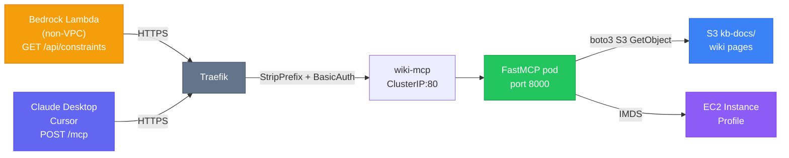

# wiki-mcp — FastMCP K8s MCP Server

FastMCP HTTP server deployed as a Kubernetes pod, exposing the [[comparisons/llm-wiki-vs-bedrock-pipeline|portfolio knowledge base]] as MCP tools callable from Bedrock Lambdas.

## Problem Statement

The [[ai-engineering/job-strategist]] research agent hits Pinecone (Bedrock KB) for retrieval — but the KB returns semantic chunks, not structured resume constraints. Hard boundaries like "NEVER say service mesh", banned terms, and confidence thresholds (STRONG/PARTIAL/ABSENT) require exact document retrieval, not nearest-neighbour similarity search.

wiki-mcp solves this by providing direct, deterministic access to the wiki's structured pages alongside semantic search.

## Architecture



## Health Route — `@mcp.custom_route`

FastMCP 3.x has a first-class `@mcp.custom_route()` decorator that injects additional HTTP routes directly into `http_app()`. No outer Starlette wrapper, no lifespan forwarding concern:

```python
@mcp.custom_route("/healthz", methods=["GET"])
async def healthz(request: Request) -> Response:
    return JSONResponse({"status": "ok", "service": "wiki-mcp"})
```

`http_app()` then returns a Starlette app with routes `[Route('/mcp'), Route('/healthz')]`.

K8s probes use `httpGet` on `/healthz` (200 JSON). Claude Desktop / Cursor clients use `POST /mcp` (MCP protocol). Bedrock Lambdas use the REST shortcut endpoints (`GET /api/constraints`, etc.) — no JSON-RPC overhead.

## Tools (7)

| Tool | Description | Primary consumer |
|---|---|---|
| `get_page(path)` | Fetch any wiki page by path | General KB access |
| `get_resume_constraints()` | Combined agent-guide + gap-awareness + voice-library | Job Strategist — MANDATORY first call |
| `get_career_history()` | Amazon TCSA work history + ATS bullets | Resume generation |
| `get_achievements()` | Quantified scorecard — all evidence-backed numbers | Resume generation |
| `search(query, category)` | Keyword search (path-first, then content) | Topic discovery |
| `list_pages(category)` | List available pages by category | Navigation |
| `get_index()` | Full wiki index with one-line summaries | Orientation |

## Content Source

S3 `kb-docs/` prefix, populated by [[tools/aws-s3|sync-wiki.py]]:

```
kb-docs/
├── index.md                   ← uploaded by sync-wiki.py (added in wiki-mcp implementation)
├── tools/argocd.md
├── resume/agent-guide.md
├── resume/gap-awareness.md
├── ...
└── *.md.metadata.json         ← Bedrock KB sidecars (skipped by wiki-mcp)
```

**Cache**: 10-min in-memory TTL per S3 key. Cache misses trigger `GetObject`. Single-pod, cache is lost on pod restart — acceptable for portfolio scale.

## Traefik Routing

```
ops.nelsonlamounier.com/wiki-mcp  → wiki-mcp IngressRoute (priority 90)
  ↓ wiki-mcp-basicauth middleware  (verify Authorization: Basic header)
  ↓ wiki-mcp-stripprefix middleware (strip /wiki-mcp → path becomes /mcp)
  → wiki-mcp ClusterIP:80
  → pod:8000
  → FastMCP POST /mcp handler
```

Cross-namespace middleware is NOT used — both middlewares live in `wiki-mcp` namespace, same as the IngressRoute. See [[tools/traefik]] for why cross-namespace refs require `allowCrossNamespace` flag.

## Security Model

| Layer | Implementation |
|---|---|
| Transport | HTTPS (Traefik TLS, cert-manager Let's Encrypt) |
| Authentication | BasicAuth middleware (htpasswd secret in wiki-mcp namespace) |
| AWS credentials | EC2 Instance Profile (IMDS) — zero K8s secrets |
| Pod security | Non-root uid 1001, readOnlyRootFilesystem, all capabilities dropped |
| Network | NetworkPolicy: allow Traefik + Prometheus only |
| S3 access | Worker node IAM role: `s3:GetObject` on `kb-docs/*` |

## Kubernetes Resources

| Resource | Kind | Notes |
|---|---|---|
| `wiki-mcp` | Deployment | replicaCount: 1, port 8000 |
| `wiki-mcp` | Service | ClusterIP, port 80 → targetPort 8000 |
| `wiki-mcp` | PodDisruptionBudget | minAvailable: 1 |
| `wiki-mcp` | NetworkPolicy | allow Traefik + monitoring |
| `wiki-mcp-basicauth` | Middleware | Traefik BasicAuth |
| `wiki-mcp-stripprefix` | Middleware | Traefik StripPrefix |
| `wiki-mcp` | IngressRoute | Host + PathPrefix, priority 90 |
| `wiki-mcp-config` | ConfigMap | `WIKI_S3_BUCKET` — created by kubectl, not ArgoCD |
| `wiki-mcp-basicauth` | Secret | htpasswd hash — created manually, never by ArgoCD |

## Lambda Integration

Lambda env vars (injected by CDK `strategist-pipeline-stack.ts`):

```
WIKI_MCP_URL  = https://ops.nelsonlamounier.com/wiki-mcp   ← base URL, no /mcp suffix
WIKI_MCP_AUTH = {{resolve:ssm-secure:/wiki-mcp/basicauth-header}}
                (value: "Basic <base64(mcp:password)>", resolved at deploy time)
```

Research Lambda uses REST endpoints, not MCP JSON-RPC protocol — simpler, single round-trip:

```typescript
// GET /api/constraints → agent-guide + gap-awareness + voice-library (combined)
const res = await fetch(`${WIKI_MCP_URL}/api/constraints`, {
    headers: { Authorization: WIKI_MCP_AUTH },
    signal: AbortSignal.timeout(10_000),
});
const constraints = await res.text();   // plain text, injected into kbContext
```

**Available REST endpoints:**

| Endpoint | Returns | Consumer |
|---|---|---|
| `GET /api/constraints` | agent-guide + gap-awareness + voice-library | Research agent — mandatory first call |
| `GET /api/achievements` | resume/achievements | Resume generation |
| `GET /api/career` | resume/career-history | Resume generation |
| `GET /api/page?path=<path>` | Any wiki page by path | General access |
| `GET /healthz` | `{"status":"ok"}` | K8s probes |

MCP protocol (`POST /mcp`, JSON-RPC 2.0) is for Claude Desktop / Cursor clients, not Lambda.

## Local Development

```bash
# From my-mcp repo root:
cp .env.example .env          # set WIKI_LOCAL_PATH
python server.py              # starts on http://localhost:8000/mcp

# In another terminal:
python client.py              # smoke test (get_index + list_pages + get_resume_constraints)
python client.py get tools/argocd
python client.py search "DORA"
python client.py list ai-engineering
```

No AWS credentials needed in local mode — reads from local filesystem.

## One-Time Setup

Before first ArgoCD sync:

```bash
# 1. Namespace
kubectl create namespace wiki-mcp

# 2. BasicAuth secret (htpasswd format)
htpasswd -nb mcp <password> | \
  kubectl create secret generic wiki-mcp-basicauth --from-file=users=/dev/stdin -n wiki-mcp

# 3. ConfigMap
kubectl create configmap wiki-mcp-config \
  --from-literal=WIKI_S3_BUCKET=<bucket-name> -n wiki-mcp

# 4. SSM parameter for Lambda
aws ssm put-parameter \
  --name /wiki-mcp/basicauth-header \
  --value "Basic $(echo -n 'mcp:<password>' | base64)" \
  --type SecureString

# 5. Build + push initial image via GitHub Actions
#    Trigger manually: workflow_dispatch on deploy-mcp.yml in my-mcp repo
#    OR push any *.py / requirements.txt / Dockerfile change to main/develop
#
#    To push locally (first bootstrap before CI is wired):
ECR_URL=$(aws ssm get-parameter --name /shared/ecr-wiki-mcp/development/repository-uri --query 'Parameter.Value' --output text)
docker build -t wiki-mcp .
docker tag wiki-mcp "${ECR_URL}:bootstrap"
aws ecr get-login-password --region eu-west-1 | docker login --username AWS --password-stdin "$ECR_URL"
docker push "${ECR_URL}:bootstrap"
```

CDK change (worker node IAM role — add to `KubernetesWorkerAsgStack`):

```typescript
workerRole.addToPolicy(new iam.PolicyStatement({
    effect: iam.Effect.ALLOW,
    actions: ["s3:GetObject", "s3:ListBucket"],
    resources: [
        kbBucket.bucketArn,
        `${kbBucket.bucketArn}/kb-docs/*`,
    ],
}));
```

## ArgoCD Integration

- **Wave**: 5 (same as admin-api, start-admin — workload tier)
- **Image Updater**: `newest-build` strategy, `regexp:^[0-9a-f]{7,40}(-r[0-9]+)?$` tag filter
- **Write-back**: `git:secret:argocd/repo-cdk-monitoring` (same as other workloads)
- **Namespace**: `wiki-mcp` (`CreateNamespace=true` syncOption)

## Related Pages

- [[ai-engineering/job-strategist]] — primary consumer: research agent should call get_resume_constraints() first
- [[tools/traefik]] — IngressRoute, middleware, StripPrefix pattern
- [[tools/argocd]] — GitOps deployment, Image Updater
- [[concepts/observability-stack]] — monitoring namespace (Prometheus scrapes wiki-mcp metrics)
- [[comparisons/llm-wiki-vs-bedrock-pipeline]] — why deterministic page retrieval vs Pinecone semantic search
