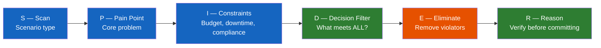
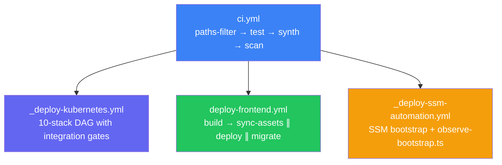

# AWS DevOps Certification — Real Project Connections

This page maps DOP-C02 exam domains to concrete implementation evidence in the portfolio project. It is source material for a future article exploring the gap between studying certification concepts and having already implemented them in production.

The central insight from both the exam preparation and the project: **the correct answer is always the option that violates no constraints** — not the most powerful option, not the most familiar one. This applies equally to SPIDER-based exam reasoning and to every architectural decision in the [[k8s-bootstrap-pipeline]].

---

## The SPIDER Framework — Exam and Production

The SPIDER framework (Scan → Pain Point → Identify Constraints → Decision Filter → Eliminate → Reason) was built to survive Professional-level exam questions where all four options are technically valid but three violate a hidden constraint.

The same process happens in production: every ADR in the [[cdk-kubernetes-stacks]] documentation lists three alternatives and the constraints that ruled them out. NLB over ALB (stable EIP, TCP passthrough required by Traefik/SNI). SSM over Fn::ImportValue (independent stack deployment required). VXLANAlways over VXLANCrossSubnet (single-subnet AWS requires full encapsulation). The exam trains the habit; the project is where the habit pays off.

---

## Domain 1 — SDLC Automation

### What the Exam Tests

- CI/CD pipeline design: stages, artifact management, parallel execution
- Deployment strategies: Canary, Linear, All-at-once, Blue/Green with traffic routing
- Automated testing gates in pipelines
- CodePipeline, CodeBuild, CodeDeploy patterns

### Project Implementation

**26-workflow monorepo CI/CD** in `.github/workflows/`: 8 reusable workflows (underscore-prefixed) + 18 runnable workflows. See [[ci-cd-pipeline-architecture]].

**Exam scenario parallel**: "A team needs zero-downtime deployments with automated rollback on health check failure and gradual traffic shifting." The exam expects you to identify Blue/Green with CodeDeploy. The project uses **Argo Rollouts Blue/Green** with a Prometheus AnalysisTemplate as the pre-promotion gate — the same logical answer, different implementation layer. The constraint set is identical: zero-downtime, health-check-gated promotion, traffic shift control.

**TypeScript scripting layer** replaces Bash for all non-trivial CI logic — typed, testable, handles edge cases (special characters in commit messages, multi-line SSM scripts). The exam doesn't test this directly, but it represents the "why does your pipeline not break on special characters?" operational maturity the exam implicitly validates.

---

## Domain 2 — Configuration Management and IaC

### What the Exam Tests

- CloudFormation: nested stacks, StackSets, cross-stack references, drift detection, custom resources
- CDK concepts (synthesises to CloudFormation)
- Configuration drift detection and remediation
- Parameter Store vs Secrets Manager selection criteria

### Project Implementation

**10-stack CDK TypeScript architecture** synthesised to CloudFormation. Key depth the exam rewards:

| Exam Concept | Project Implementation |
|---|---|
| Cross-stack references | SSM Parameter Store (not `Fn::ImportValue`) — stacks deploy independently |
| Custom resources | `ResourceCleanupProvider` (14 resources: 8 SSM + 5 log groups + 1 SNS), Lambda-backed ACM DNS validation |
| Nested stacks | CDK constructs composing into stacks (e.g. `KubernetesWorkerAsgStack` wrapping `LaunchTemplateConstruct`) |
| Drift detection | CDK unit tests (`Template.fromStack`) verify expected state on every commit — catch drift before deployment |
| StackSets equivalent | Parameterised stack (`KubernetesWorkerAsgStack`) instantiated twice: `GeneralPool-development` + `MonitoringPool-development` |

**CDK synth cache**: `synthesize.ts` runs CDK once, writes `cdk.out/` as a GitHub Actions artifact. All 10 parallel deploy jobs restore the cache — the exam concept of "build once, deploy many" at the CloudFormation template level.

**SSM over `Fn::ImportValue` ADR**: The exam teaches cross-stack references via `Fn::ImportValue` (CloudFormation Outputs). The project chose SSM because it decouples deployment order — any stack can be redeployed without first deploying its dependencies. The constraint that ruled out `Fn::ImportValue`: stacks must be independently deployable for rollback safety.

---

## Domain 3 — Monitoring and Logging

### What the Exam Tests

- CloudWatch metrics, alarms, dashboards, composite alarms
- CloudWatch Logs: log groups, metric filters, Contributor Insights
- X-Ray tracing: sampling, subsegments, trace maps
- Operational health: SLOs, error rates, latency percentiles

### Project Implementation

**LGTM observability stack** (Loki/Grafana/Tempo/Mimir) on the monitoring pool. See [[observability-stack]].

| Exam Concept | Project Equivalent |
|---|---|
| CloudWatch Metrics + Alarms | Prometheus + Grafana alerting → SNS |
| CloudWatch Logs | Loki (Promtail DaemonSet scraping all pods + journals) |
| X-Ray distributed tracing | Tempo (OpenTelemetry-compatible) with DynamoDB span metrics |
| CloudWatch Dashboards | 13 GitOps dashboards: Cluster, Bootstrap, Cost, RUM, API latency |
| Real User Monitoring | Alloy Faro RUM (browser instrumentation → Loki) |

**12-job Prometheus scrape inventory**: `cadvisor`, `node-exporter`, `apiserver`, `kubelet`, `kube-state-metrics`, `argocd`, `traefik`, `argo-rollouts`, `calico`, `grafana`, `steampipe`, `coredns`. Each scrape job represents exactly the kind of "which scrape target?" reasoning the exam asks about.

**Exam scenario parallel**: "An application team needs visibility into error rates, latency, and infrastructure health without accessing the underlying EC2 instances." The exam answer involves CloudWatch EMF + dashboards. The project answer is Prometheus + Grafana with SSM port-forwarding access only — same constraint (no direct instance access), different implementation stack.

---

## Domain 4 — Policies and Standards Automation

### What the Exam Tests

- AWS Config rules: managed vs custom, remediation actions
- Security Hub standards: CIS, AWS Foundational
- GuardDuty threat detection
- IAM: permissions boundaries, SCPs, cross-account access
- Tagging governance

### Project Implementation

**Checkov policy-as-code** (10 custom rules): See [[checkov]].

The exam teaches compliance automation via Config rules. The project implements an equivalent pattern via Checkov custom checks running on every CI push:

| Exam Concept | Project Implementation |
|---|---|
| Config rule: no SSH open | `CKV_CUSTOM_SG_1` — blocks port 22 in Security Groups |
| Config rule: encrypted storage | CDK `enforceSSL: true` + KMS CMK on all S3/DynamoDB |
| IAM permissions boundaries | `CKV_CUSTOM_IAM_1` (rule exists, currently skipped — future hardening) |
| Hardcoded credentials in code | `CKV_CUSTOM_IAM_2` — blocks literal account IDs in ARNs |
| Tagging governance | `TaggingGuard` CDK construct: throws at synth time if required tags missing |

**AROA masking**: The exam covers IAM identity concepts. The project masks the IAM role's internal unique identifier (AROA) in CI logs to prevent IAM reconnaissance via CloudTrail cross-reference. This is a detail the exam scenario would phrase as "prevent leakage of sensitive identity information in build logs."

**shared security-baseline-stack**: AWS Config (8 rules), Security Hub standards, GuardDuty, IAM Password Policy. The `resourceCountIs('AWS::Config::ConfigRule', 8)` unit test acts as a security control inventory — a failed refactoring that removes a Config rule will fail this test.

---

## Domain 5 — Incident and Event Response

### What the Exam Tests

- EventBridge rules: event patterns, targets, scheduling
- SNS/SQS for decoupled notification
- Step Functions for incident workflows
- AWS Systems Manager OpsCenter and Automation
- Automated remediation patterns

### Project Implementation

**Two-tier Step Functions orchestration**: SM-A (bootstrap) + SM-B (config injection). SM-A SUCCEED fires an EventBridge rule → SM-B executes automatically. Any EC2 replacement triggers full bootstrap → config injection without human intervention. See [[event-driven-orchestration]].

**SSM Automation documents**: The project uses SSM Automation (not just Run Command) for long-running orchestration — exactly the pattern DOP-C02 tests for "which service manages multi-step remediation workflows on EC2?" SSM Automation with `onFailure: Abort` is the answer when you need step-level control and failure isolation.

**Self-healing agent**: CloudWatch Alarm → EventBridge → Lambda → Bedrock ConverseCommand → MCP tool execution → remediation action. See [[self-healing-agent]]. This is the exam concept of "automated incident response" at full scale — the exam tests whether you know to use EventBridge + Lambda + Systems Manager; the project implements the same pattern with an AI reasoning layer.

**`observe-bootstrap.ts`**: Real-time step-level visibility into SSM Automation execution — dual CloudWatch log streaming + RunCommand output on failure. The exam tests "how do you diagnose a failed SSM Automation step?" The answer is GetCommandInvocation on the failed RunShellScript output — this is exactly what observe-bootstrap.ts automates.

---

## Domain 6 — High Availability, Fault Tolerance, and Disaster Recovery

### What the Exam Tests

- RTO/RPO: Warm Standby, Pilot Light, Multi-Site Active/Active
- Multi-region: Route 53 failover, cross-region replication
- Auto Scaling: lifecycle hooks, warm pools, predictive vs target tracking
- ELB health checks and connection draining
- Backup and restore strategies

### Project Implementation

**Disaster Recovery with RTO ~5–8 min**: etcd S3 backup (every 6h), PKI backup, TLS/JWT to SSM SecureStrings, `_reconstruct_control_plane()` DR path. See [[disaster-recovery]].

The exam question would be: "A Kubernetes control plane fails. The team needs to restore it without data loss and with minimum downtime." The SPIDER analysis: constraint = etcd data integrity + cluster credentials preserved + worker nodes should rejoin automatically. The project implementation maps to exactly these constraints.

**kube-proxy/CoreDNS addon guards**: The DR path previously had a hidden gap — `handle_second_run()` skips `kubeadm init` entirely, which means kube-proxy and CoreDNS DaemonSets were never deployed after restore. This is the "exam-level" failure: everything looked correct (kubectl worked, nodes registered) but ClusterIP routing was silently broken. `ensure_kube_proxy()` + `ensure_coredns()` are idempotent guards that close this gap. See [[kube-proxy-missing-after-dr]].

**KubernetesWorkerAsgStack Auto Scaling**: Two pools — general (min 2, max 3) and monitoring (min 1, max 1). Cluster Autoscaler tags required: `k8s.io/cluster-autoscaler/enabled: "true"` + `k8s.io/cluster-autoscaler/{clusterName}: "owned"`. The exam tests "why isn't Cluster Autoscaler scaling my ASG?" — missing CA discovery tags is the answer.

**Exam scenario parallel**: "An application requires 99.9% availability. The current architecture is single-region. What Auto Scaling configuration provides the highest availability?" The exam expects lifecycle hooks + health check grace period + connection draining. The project implements this via Kubernetes-managed Spot replacement — same availability constraint, different mechanism. The constraint-first analysis is identical.

---

## The Exam-to-Production Gap: Where the Certification Prepared and Where the Project Taught More

| Topic | Cert Prepared | Project Added |
|---|---|---|
| Blue/Green deployment | Traffic shifting concept, health check rollback | Prometheus AnalysisTemplate as pre-promotion gate; NLB target group drain timing |
| IaC automation | CloudFormation structure, StackSets concept | SSM over Fn::ImportValue for independent deployability; CDK synth caching across jobs |
| Auto Scaling | Lifecycle hook concept, policy types | CA tag requirements; Spot interruption handling; two-pool topology rationale |
| Disaster Recovery | RTO/RPO definitions, backup strategies | Hidden kube-proxy gap after second-run path; idempotent addon guards |
| Monitoring | CloudWatch services | Prometheus scrape debugging (relabel config, path rewriting); VXLANAlways packet inspection |
| Security | IAM least privilege, SCP | AROA masking; Checkov as continuous policy enforcement; deploy.py secrets broker pattern |
| CI/CD pipeline | Pipeline stages, artifact promotion | TypeScript scripting layer; cancel-in-progress semantics differ for app vs infra pipelines |

**The failure journal insight**: The same discipline applied to wrong exam answers — document *why* the reasoning failed, not just *that* it failed — applies to production post-mortems. The kube-proxy DR gap was discovered exactly this way: not "the cluster is broken" but "why does ClusterIP routing break only on the second-run path?" The answer required following the logic from `handle_second_run()` → skip `kubeadm init` → no addon phase → no kube-proxy DaemonSet.

---

## Narrative Threads for the Article

These are the structural connections worth building a narrative around:

1. **The SPIDER insight applies to architecture reviews, not just exams** — every ADR is a SPIDER execution: constraints enumerated, options filtered, one option left standing.

2. **The "feature knowledge vs decision knowledge" gap is real** — knowing what Argo Rollouts does is not the same as knowing when to reject it (cost, complexity, single-pod workloads). The exam tests the same distinction.

3. **The project implemented exam-level patterns before taking the exam** — Blue/Green with health-check promotion, SSM Automation with step isolation, EventBridge-triggered remediation. Studying for DOP-C02 was partially recognising existing implementations in a new vocabulary.

4. **Certification failure is a useful forcing function** — the failure journal methodology that passed the cert on attempt 2 is the same methodology that found the kube-proxy DR gap in production.

5. **The "all four options are valid" problem persists in production** — architecture reviews regularly present four technically valid proposals. SPIDER — constraint-first elimination — is the only way to avoid selecting the wrong one for the "right" reasons.

---

## Related Pages

- [[ci-cd-pipeline-architecture]] — 26-workflow CI/CD architecture (cert Domain 1)
- [[infra-testing-strategy]] — CDK testing pyramid (cert Domain 2)
- [[checkov]] — policy-as-code IaC security scanning (cert Domain 4)
- [[disaster-recovery]] — etcd backup, DR path, kube-proxy gap (cert Domain 6)
- [[argo-rollouts]] — Blue/Green deployment with Prometheus analysis (cert Domain 1)
- [[cdk-kubernetes-stacks]] — 10-stack CDK architecture (cert Domain 2)
- [[observability-stack]] — LGTM monitoring stack (cert Domain 3)
- [[event-driven-orchestration]] — SM-A → EventBridge → SM-B (cert Domain 5)
- [[self-healing-agent]] — automated incident response (cert Domain 5)
- [[self-hosted-kubernetes]] — cluster topology, Auto Scaling pools (cert Domain 6)
