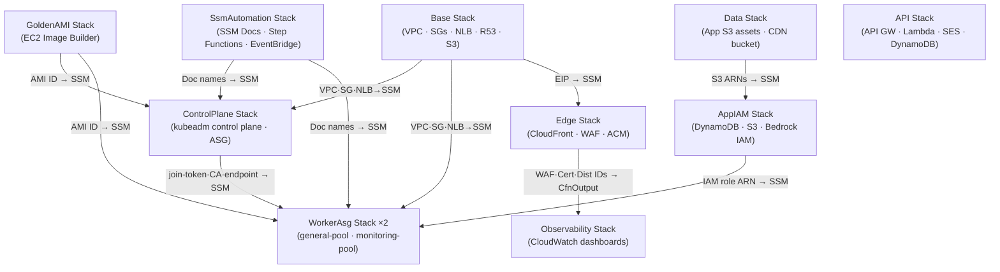
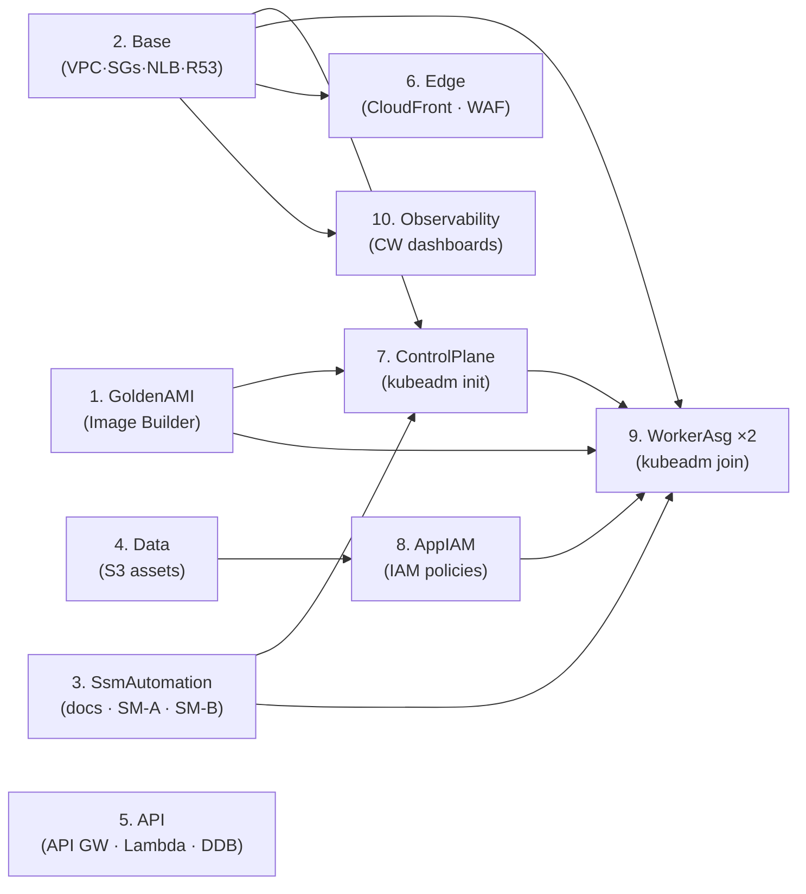
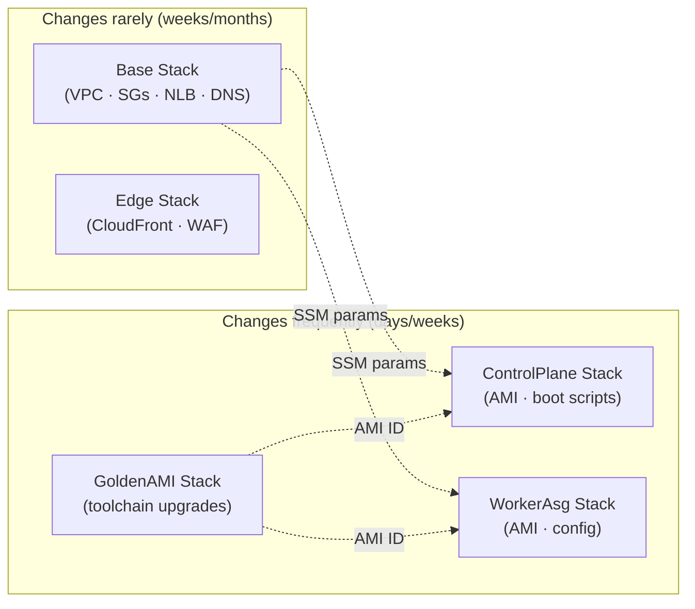

# CDK Kubernetes Stack Architecture

The full Kubernetes infrastructure is defined as 10 independent CDK stacks under `infra/lib/stacks/kubernetes/`. Each stack is self-contained, deployed independently, and communicates with the rest of the system exclusively via [[aws-ssm|SSM parameters]] — never via CloudFormation `Fn::ImportValue`.

## Stack Catalogue



| # | Stack | File | Lines | SSM outputs | Changes |
|---|---|---|---|---|---|
| 1 | `KubernetesBaseStack` | `base-stack.ts` | 561 | 14 | Rarely |
| 2 | `GoldenAmiStack` | `golden-ami-stack.ts` | 154 | 1 | On AMI rebuild |
| 3 | `K8sSsmAutomationStack` | `ssm-automation-stack.ts` | 726 | 8 | On bootstrap logic changes |
| 4 | `K8sDataStack` | `data-stack.ts` | 427 | 4 | On S3 policy changes |
| 5 | `K8sApiStack` | `api-stack.ts` | 618 | 3 | On subscription API changes |
| 6 | `K8sEdgeStack` | `edge-stack.ts` | 923 | 0 (CfnOutputs) | On CDN/WAF changes |
| 7 | `K8sControlPlaneStack` | `control-plane-stack.ts` | 763 | 5 | On AMI / boot-script changes |
| 8 | `K8sAppIamStack` | `app-iam-stack.ts` | 371 | 0 | On new service integrations |
| 9 | `KubernetesWorkerAsgStack` ×2 | `worker-asg-stack.ts` | 791 | per pool | On AMI / config changes |
| 10 | `K8sObservabilityStack` | `observability-stack.ts` | 194 | 0 | On dashboard changes |

## Deployment Order



| Step | Why this ordering |
|---|---|
| GoldenAMI first | AMI must exist before compute launch templates reference it |
| Base before CP + Workers | VPC, SGs, NLB must exist before any EC2 resource |
| SsmAutomation before CP + Workers | SSM doc names referenced in EC2 user-data |
| Data before AppIAM | Bucket ARNs needed to scope IAM policies |
| ControlPlane before Workers | Workers need join token, CA hash, endpoint from CP |
| AppIAM before Workers | Policies attached to worker role before instances launch |
| Edge after Base | CloudFront origin = EIP from Base stack |
| Observability last | Dashboard widgets reference NLB metrics (Base) and SM ARNs (SsmAutomation) |

Stacks 1–6 deploy in parallel where dependencies allow. The `deploy-k8s.yml` CI workflow uses `cdk deploy --concurrency 4`.

## Lifecycle Separation



The base stack changes only when modifying networking rules, DNS, or storage. Compute stacks change whenever AMIs, boot scripts, or instance configuration are updated — much more frequently.

## Key Design Patterns

### Config-Driven Security Groups

SG rules are defined as **data** in `DEFAULT_K8S_SECURITY_GROUPS` in `configurations.ts`, not as imperative CDK calls. `SecurityGroupConstruct.fromK8sRules()` converts the data into CDK ingress rules:

```typescript
// Config (data)
{ port: 2379, endPort: 2380, protocol: 'tcp', source: 'self', description: 'etcd client and peer' }

// Converted by SecurityGroupConstruct
sg.addIngressRule(Peer.self(), Port.tcpRange(2379, 2380), 'etcd client and peer')
```

The `source` discriminator maps to CDK peers:

| Config `source` | CDK Peer |
|---|---|
| `'self'` | `ec2.Peer.securityGroupId(sg.securityGroupId)` (self-referencing) |
| `'vpcCidr'` | `ec2.Peer.ipv4(vpc.vpcCidrBlock)` |
| `'podCidr'` | `ec2.Peer.ipv4(podNetworkCidr)` (e.g. `192.168.0.0/16`) |
| `'anyIpv4'` | `ec2.Peer.anyIpv4()` |

Adding a new SG rule requires editing **one object in config** — zero CDK construct changes.

### Runtime vs Config-Time Rules

Two ingress rules need deploy-time API calls rather than static config:

1. **CloudFront prefix list** (`port 80`) — `AwsCustomResource` calls `DescribeManagedPrefixLists` at deploy time to resolve `com.amazonaws.global.cloudfront.origin-facing` to a prefix list ID.
2. **Admin IPs** (`port 443`) — injected via CDK context (`-c adminAllowedIps=...`) which the `deploy-k8s.yml` workflow resolves from SSM before calling `cdk deploy`.

### EBS Data Volume in LaunchTemplate

The old `ec2.Volume` + EBS-detach Lambda pattern is replaced. A dedicated second EBS volume is declared directly in the `LaunchTemplate` block-device configuration:

```typescript
// launch-template.ts
{
    deviceName: '/dev/xvdf',
    volume: ec2.BlockDeviceVolume.ebs(dataVolumeSizeGb, {
        volumeType: ec2.EbsDeviceVolumeType.GP3,
        encrypted: true,
        deleteOnTermination: true,   // state lives in S3 (etcd snapshots)
        iops: 3000,
        throughput: 125,
    }),
}
```

| Volume | Mount | Persistence |
|---|---|---|
| `/dev/xvda` (root, 30 GB) | OS + Golden AMI | Ephemeral |
| `/dev/xvdf` (data, 30 GB) | `/data` — etcd, kubelet | Ephemeral; state in S3 (hourly etcd snapshots) |

`deleteOnTermination: true` keeps EBS lifecycle tied to EC2 instance lifecycle. Etcd state is durable via S3 snapshots, not via EBS persistence.

### SSM Over `Fn::ImportValue`

All cross-stack wiring is done via SSM parameters. CloudFormation outputs exist for console visibility only — no stack reads them via `Fn::ImportValue`. See [[aws-ssm]] for the full rationale and the 14-parameter output table from the Base stack.

## KubernetesWorkerAsgStack v2

The three named worker stacks (`AppWorkerStack`, `MonitoringWorkerStack`, `ArgocdWorkerStack`) were replaced by a single parameterised `KubernetesWorkerAsgStack` driven by a `WorkerPoolType` discriminator.

### Key Design Differences

| Feature | Old stacks (×3) | New `worker-asg-stack.ts` (×2) |
|---|---|---|
| ASG capacity | `min=0, max=1, desired=1` fixed | `min/max/desired` configurable — Cluster Autoscaler scales |
| Node tags | absent | `k8s.io/cluster-autoscaler/enabled: "true"` + `k8s.io/cluster-autoscaler/{clusterName}: "owned"` |
| Node labels | per-stack hardcoded | `node-pool=general` or `node-pool=monitoring` |
| Node taints | none | `dedicated=monitoring:NoSchedule` for monitoring pool only |
| IAM roles | 3 separate roles | 2 merged roles (general + monitoring) |
| ArgoCD placement | Dedicated `ArgocdWorkerStack` | Folds into `general` pool — saves one Spot instance |

### Pool Instantiation

```typescript
// General-purpose pool
new KubernetesWorkerAsgStack(app, `K8s-GeneralPool-${env}`, {
    poolType: 'general',
    minCapacity: 1, maxCapacity: 4, desiredCapacity: 2,
    instanceType: ec2.InstanceType.of(ec2.InstanceClass.T3, ec2.InstanceSize.MEDIUM),
    useSpotInstances: true,
    ...commonProps,
});

// Monitoring pool (Prometheus, Grafana, Loki, Tempo, ArgoCD, Steampipe, CA)
new KubernetesWorkerAsgStack(app, `K8s-MonitoringPool-${env}`, {
    poolType: 'monitoring',
    minCapacity: 1, maxCapacity: 2, desiredCapacity: 1,
    instanceType: ec2.InstanceType.of(ec2.InstanceClass.T3, ec2.InstanceSize.MEDIUM),
    useSpotInstances: true,
    notificationEmail: props.notificationEmail,
    ...commonProps,
});
```

### Cluster Autoscaler Tags

Required on both ASGs for CA auto-discovery:

```typescript
asg.addTag('k8s.io/cluster-autoscaler/enabled', 'true', true);
asg.addTag(`k8s.io/cluster-autoscaler/${clusterName}`, 'owned', true);
asg.addTag('k8s.io/cluster-autoscaler/node-template/label/node-pool', poolType, true);
```

### IAM Consolidation

3 roles → 2 merged roles:
- **general-pool role** = AppWorker + ArgocdWorker permissions (ECR pull/list, DynamoDB, S3, CloudWatch read, DNS)
- **monitoring-pool role** = MonitoringWorker permissions (EBS CSI, Steampipe ViewOnly, SNS, CloudWatch deep, CA scale actions)

### Zero-Downtime 4-Phase Migration

```
Phase 1 — Deploy new ASGs alongside old named nodes
          → New EC2 instances join cluster; CA installs on general pool

Phase 2 — Migrate workloads (update nodeSelector → node-pool=general/monitoring)
          → ArgoCD syncs; pods evict from old nodes to new
          → NLB health checks confirm new nodes serving traffic

Phase 3 — Validate (one full deployment cycle)
          → Prometheus scraping new nodes ✓
          → ArgoCD sync state clean ✓
          → NLB access logs show traffic to new instances ✓

Phase 4 — Drain and delete old stacks
          → kubectl drain k8s-app-worker / k8s-mon-worker / k8s-argocd-worker
          → cdk destroy KubernetesAppWorkerStack KubernetesMonitoringWorkerStack KubernetesArgocdWorkerStack
```

### Script Impact (Migration Blockers)

| File | Change | Blocker? |
|---|---|---|
| `trigger-bootstrap.ts` | Role names + SSM paths (3→2 targets) | ✅ Yes |
| `system/argocd/install.yaml` | 7× `workload: argocd` → `node-pool: general` | ✅ Yes |
| 8× Helm `values.yaml` files | `nodeSelector` + monitoring `tolerations` | ✅ Yes |
| `stale_pvs.py` + `worker.py` | Label constant `workload=monitoring` → `node-pool=monitoring` | ✅ Yes |
| `verify-cluster.sh` | Label selectors + node count (≥3 not ==3) | ⚠️ Diagnostic only |
| CDK unit tests | Assertion strings for old SSM paths | ⚠️ CI only |

## Related Pages

- [[k8s-bootstrap-pipeline]] — project overview
- [[aws-ssm]] — SSM parameter wiring pattern
- [[aws-step-functions]] — SsmAutomation stack details
- [[self-hosted-kubernetes]] — control plane and worker pool design; topology table
- [[cluster-networking]] — Security Group 4-tier design, NLB/EIP SubnetMapping
- [[aws-cloudfront]] — Edge stack deep-dive
- [[aws-ebs-csi]] — storage driver deployed by ArgoCD
- [[ec2-image-builder]] — Golden AMI pipeline
- [[disaster-recovery]] — control-plane replacement and etcd restore
