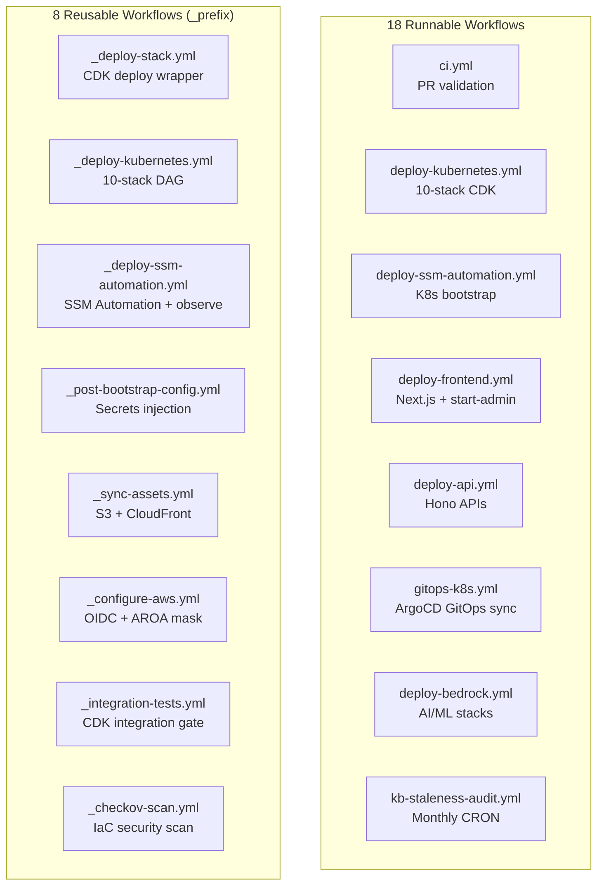
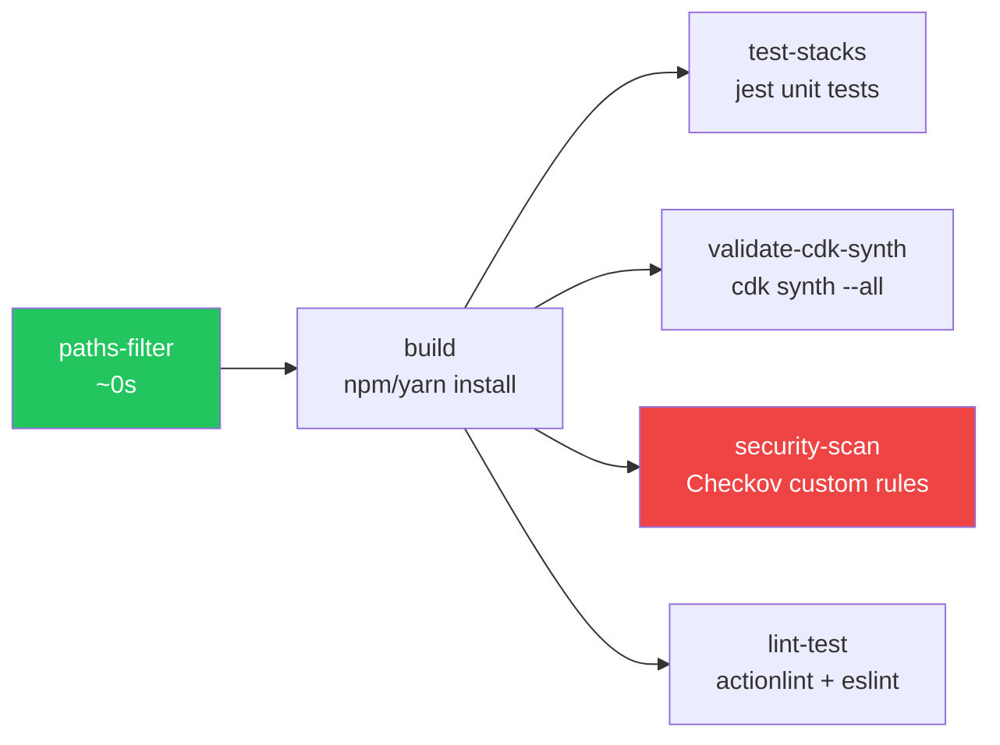
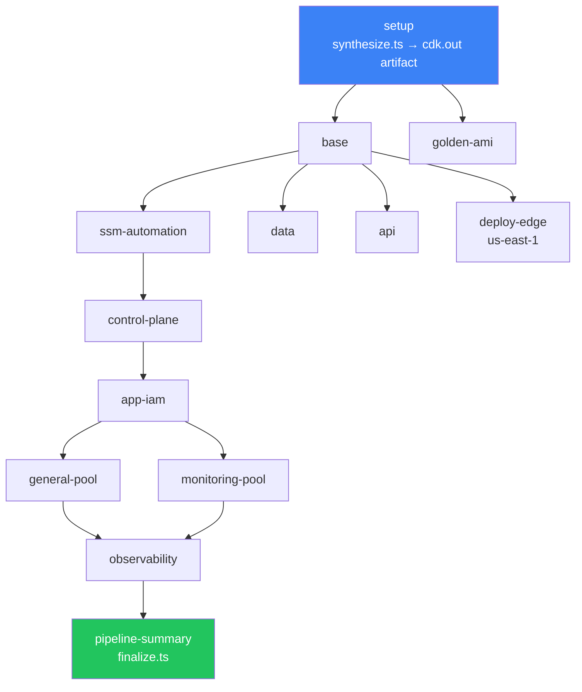
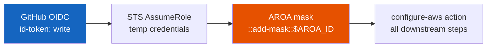
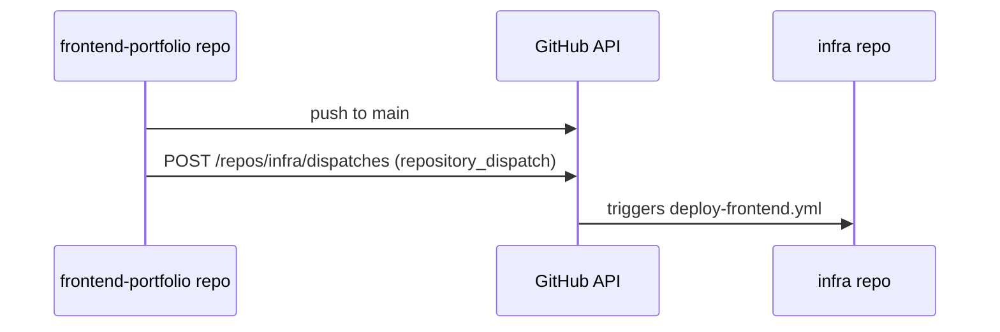

# CI/CD Pipeline Architecture

The [[k8s-bootstrap-pipeline]] uses a 26-workflow GitHub Actions monorepo with three layered execution tiers: YAML orchestration, a TypeScript CI scripting layer, and a TypeScript CD scripting layer. ~12,000 lines of workflow YAML + ~3,500 lines of TypeScript scripts + ~550 lines of Python Checkov checks.

## Workflow Inventory



**Naming convention**: `_` prefix marks reusable workflows called by `workflow_call`. They are not directly triggerable and have no trigger conditions of their own.

---

## CI Pipeline (`ci.yml`)

The PR validation pipeline optimised for speed:



**paths-filter** (dorny/paths-filter): conditional job execution based on which files changed. Median CI time: ~12 min (full run) → ~3 min (focused change). The filter operates at the job level — if `infra/**` didn't change, `test-stacks` and `validate-cdk-synth` are skipped entirely.

**actionlint**: Validates workflow YAML syntax before running any jobs. Catches undefined expression references, invalid `on:` keys, missing `with:` parameters — errors that would otherwise surface as cryptic mid-run failures.

---

## Kubernetes Deployment DAG (`_deploy-kubernetes.yml`)

10 CDK stacks deployed in a dependency-ordered DAG with an integration test gate after every deployment:



**Integration test gate**: after every stack deployment, `_integration-tests.yml` runs the corresponding CDK integration test (real AWS SDK, SSM-anchored). A stack that deploys successfully but leaves resources in a broken state fails the gate before downstream stacks run. See [[infra-testing-strategy]].

**synthesize.ts single synth**: CDK synthesis runs once in the `setup` job, writes `cdk.out/` + `synthesis-metadata.json` as a GitHub Actions artifact. All 10 parallel deploy jobs restore the cache. Eliminates the previous pattern of synthesising twice (once to validate, once to deploy) — saves ~4 min per pipeline run.

---

## Security Architecture



### OIDC + AROA Masking

Every job calls `_configure-aws.yml` which:
1. Exchanges GitHub OIDC token for temporary STS credentials (no static AWS keys).
2. Calls `sts:GetCallerIdentity` to get the current identity.
3. Extracts the AROA (IAM role's internal unique identifier) from the ARN.
4. Masks it: `echo "::add-mask::$AROA_ID"` — prevents IAM reconnaissance via CloudTrail cross-reference.

**Why AROA matters**: An AROA (`AROAXXXXXXXXXXXXXXXXXXXX`) uniquely identifies an IAM role across all CloudTrail events. If leaked in build logs, it can be correlated against public CloudTrail data to map infrastructure topology. Masking it is defence above the standard OIDC baseline.

### Immutable Image Tags (`sha-rAttempt`)

```
${github.sha}-r${github.run_attempt}
```

Example: `abc1234def5678-r1`. Prevents ECR tag overwrite with stale layers. If a build is re-run after failure (attempt 2), the new image gets tag `abc1234def5678-r2` — a distinct, immutable artifact. The `-r{attempt}` suffix ensures artifact integrity across retries.

### Pinned Action SHA Versions

```yaml
- uses: actions/checkout@de0fac2e4500b2b2dd765ee34e2c8dfd58b7f00e  # v6.0.2
```

All marketplace actions are pinned to a **commit SHA**, not a version tag. Version tags are mutable — a supply chain attack could push malicious code to `@v4` without changing the SHA. The `# v4.1.0` comment preserves human readability.

### Concurrency: App vs Infra

| Pipeline type | `cancel-in-progress` | Reason |
|---|---|---|
| App pipelines (frontend, api) | `true` | Latest commit wins; stale deploy not useful |
| Infra pipelines (CDK, SSM automation) | `false` | Mid-flight CloudFormation or kubeadm must complete; cancellation leaves cluster in unknown state |

---

## TypeScript CI Scripting Layer (`infra/scripts/ci/`)

Replaces inline Bash for all non-trivial CI logic. Key advantage over Bash: typed, testable, and deterministic on edge cases (special characters in commit messages, multi-line strings in SSM).

### `pipeline-setup.ts`

Called first in every deployment pipeline. Outputs:
- `commit-sha`, `short-sha`, `timestamp` — from `git log`
- `commit-message` — via `JSON.stringify()` (handles special chars, newlines, quotes — Bash quoting is fragile)
- AWS account validation via `sts:GetCallerIdentity`
- AROA extraction and masking
- SSM context values → CDK context file (`cdk.context.json`)

Account ID format check:
```typescript
if (!/^\d{12}$/.test(accountId)) {
    logger.error(`Invalid AWS account ID format: ${accountId}`);
    process.exit(1);
}
```
Catches copy-paste errors (e.g., `eu-west-1` where an account ID is expected).

### `preflight-checks.ts`

Validates environment before CloudFormation runs:
- Account ID regex `^\d{12}$` — catches copied region names
- Region regex `^[a-z]{2}-[a-z]+-\d{1}$` — validates AWS region format
- CDK bootstrap verification: `cloudformation:DescribeStacks` on `CDKToolkit` — confirms bootstrap stack status contains `COMPLETE`

### `synthesize.ts`

Single CDK synthesis with three outputs:
1. `cdk.out/` — all CloudFormation templates
2. `synthesis-metadata.json` — commit SHA, environment, timestamp, stackCount
3. Per-stack name outputs (`needs.setup.outputs.base`, `needs.setup.outputs.data`, etc.)

The typed project registry (`stacks.ts`) maps project IDs to `StackConfig[]` arrays. `getProject(projectId)` validates at runtime — unknown project IDs fail cleanly rather than producing cryptic CDK context errors.

### `security-scan.ts` — Checkov Orchestration

Beyond raw Checkov CLI execution:
1. Template discovery (graceful exit if synth was skipped)
2. Multi-format output: `-o cli -o json -o sarif`
3. Severity gating: only CRITICAL + HIGH block the pipeline; MEDIUM + LOW are visible but non-blocking
4. `scan-passed`, `findings-count`, `critical-count` GitHub outputs for downstream gating
5. Rich Markdown step summary in `$GITHUB_STEP_SUMMARY`

See [[checkov]] for the custom check library.

---

## TypeScript CD Scripting Layer (`infra/scripts/cd/`)

CD scripts execute *after* a deployment event — verify, finalise, integrate. All communicate via structured exit codes, `$GITHUB_OUTPUT`, `$GITHUB_STEP_SUMMARY`.

### `finalize.ts` (two modes)

**`stack-outputs` mode** (per-stack): reads CDK outputs from `cdk-outputs.json`, masks values in logs (shows `***6789` not full IDs), emits to `$GITHUB_OUTPUT`, saves to artifact.

**`pipeline-summary` mode** (project-wide): calls `cloudformation:DescribeStacks` for all 10 stacks in parallel via `Promise.all()`, confirms no `ROLLBACK` status. Writes SSM port-forwarding cheat-sheet (Grafana 3000, Prometheus 9090, Loki 3100) with live EC2 instance IDs — ready to copy-paste after deployment.

### `observe-bootstrap.ts`

Real-time visibility into SSM Automation Kubernetes bootstrap (~20 min process):
- Polls `GetAutomationExecution` every 15s (max 80 polls = 20 min)
- Renders step-level progress as GitHub Actions `::group::` collapsible blocks
- Dual CloudWatch streaming: SSM Automation log + EC2 `cloud-init` journal
- On failure: fetches `GetCommandInvocation` for the failed RunShellScript step — dumps full stdout/stderr directly in the pipeline log without requiring Console access

### `verify-argocd-sync.ts`

Polls ArgoCD for 10 expected applications (`cert-manager`, `traefik`, `nextjs`, `monitoring`, `metrics-server`, etc.). Since ArgoCD API runs on ClusterIP with no public endpoint, every call is proxied via **SSM send-command** to the control-plane node.

**Inline Python filter**: The full ArgoCD application JSON can exceed SSM's 24KB stdout limit. A single-line Python filter extracts only `sync` and `health` status server-side before returning the output — avoids truncation.

**Self-healing token refresh**: If the probe returns 401/403 (expired bot token), the script auto-refreshes: fetches admin password → POST to `/argocd/api/v1/session` → POST to `/argocd/api/v1/account/ci-bot/token` → stores in Secrets Manager → continues poll with fresh token. Eliminates the class of "verify failed because bot token expired" failures.

### `deploy-nextjs-secrets.ts`

SSM-as-proxy secrets injection for Next.js:
1. Resolves live control-plane instance ID via EC2 `DescribeInstances` with `k8s:bootstrap-role=control-plane` tag (not SSM parameter — ASG replacement can make SSM stale)
2. Reads SSM Automation document name from `/k8s/{env}/deploy/secrets-doc-name` (written by CDK, read dynamically)
3. Triggers SSM Automation which runs `deploy.py` on the control-plane
4. `deploy.py`: SSM SecureString → K8s Secret in-memory → `kubectl apply` — no secrets in Git

---

## Cross-Repo Patterns

### `repository_dispatch` (Cross-Repo Trigger)



`frontend-portfolio` pushes to main → fires a webhook → triggers `deploy-frontend.yml` in the infra repo. Decouples frontend code changes from infrastructure pipeline configuration.

### KB Staleness Audit (CRON)

```yaml
schedule:
  - cron: '0 9 1 * *'   # Monthly, 1st of month, 09:00 UTC
```

Scans knowledge base docs not updated in >90 days, auto-creates a GitHub Issue with the list. Prevents documentation rot without requiring manual audits.

---

## Multi-Line SSM Script Encoding (`jq -Rs`)

```bash
SCRIPT=$(jq -Rs . < script.sh)
aws ssm send-command --parameters "commands=[$SCRIPT]" ...
```

`-R` reads raw input (no JSON parsing), `-s` slurps all lines into a single string. This is the only correct way to pass multi-line shell scripts to `aws ssm send-command` — Bash heredocs and direct variable substitution break on newlines, quotes, and backslashes in the script body.

---

## Related Pages

- [[github-actions]] — tool page with pipeline structure, OIDC, custom CI image
- [[infra-testing-strategy]] — CDK testing pyramid; integration test gates referenced by this pipeline
- [[checkov]] — IaC security scanning; called by security-scan.ts
- [[aws-devops-certification-connections]] — how these patterns map to DOP-C02 exam domains
- [[argo-rollouts]] — Blue/Green deployment triggered by this pipeline
- [[nextjs-image-asset-sync]] — build hash alignment; parallel track dependency
- [[k8s-bootstrap-pipeline]] — the project this CI/CD pipeline orchestrates
