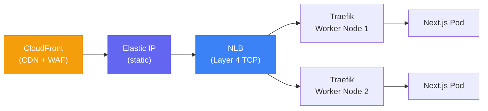
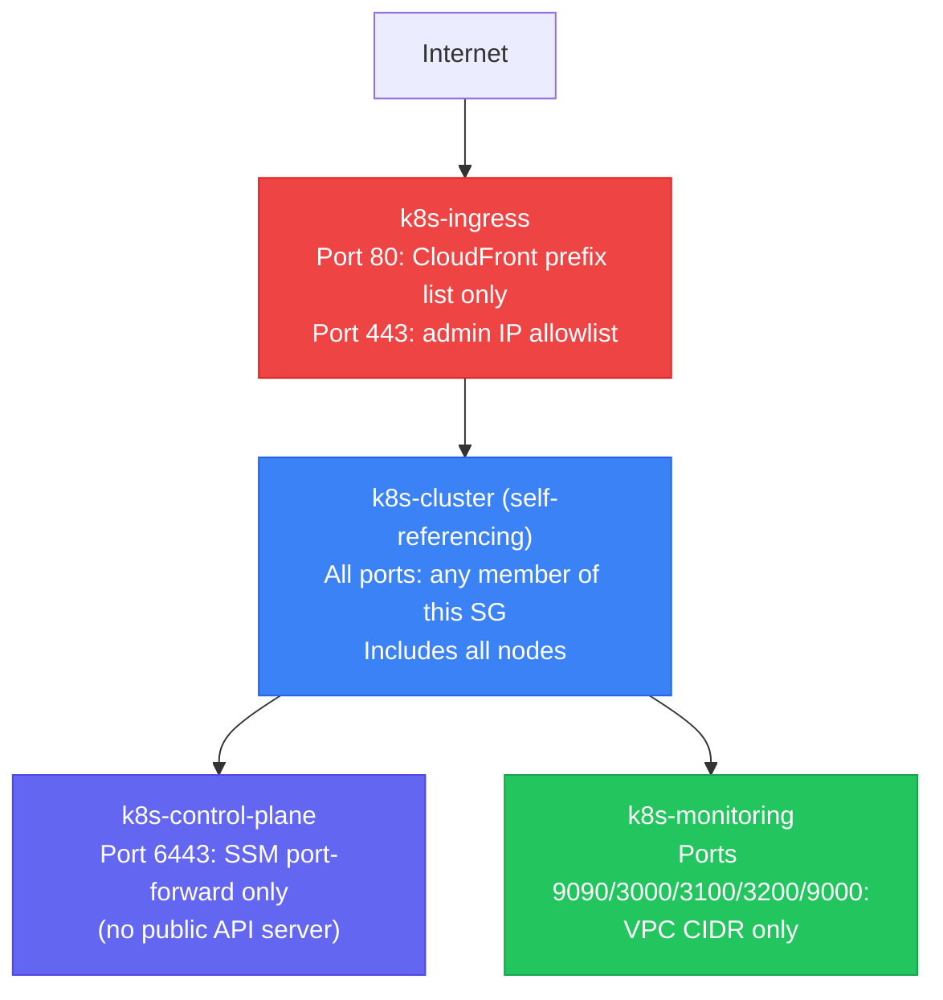
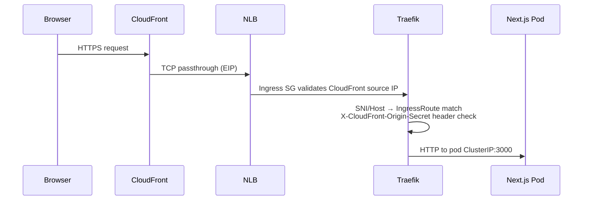
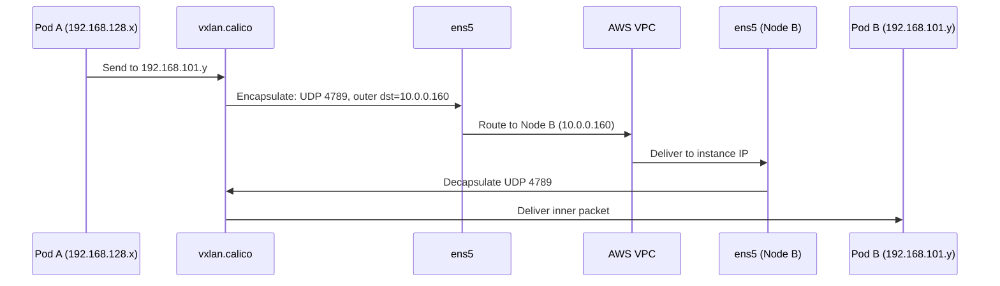

# Cluster Networking

End-to-end networking for the self-hosted Kubernetes cluster on AWS. Covers VPC topology, Security Group layering, NLB ingress, Calico VXLAN overlay, and cross-node traffic flows.

## VPC Topology

All cluster nodes live in a **single public subnet in `eu-west-1a`** (`10.0.0.0/16` VPC, single `/24` subnet). This is a deliberate cost-and-performance decision:

- **No cross-AZ data transfer costs** — all control-plane → worker and pod → pod traffic stays within one AZ
- **Ultra-low latency** — single-AZ removes the ~1ms inter-AZ RTT penalty
- **Documented limitation** — single-AZ means no fault tolerance against AZ failure; acceptable for development

| Node | Pool | Private IP | EC2 Type |
|---|---|---|---|
| Control Plane | — | `10.0.0.169` (example) | Fixed EC2 in ASG |
| Worker 1 | `general` | `10.0.0.160` (example) | t3.medium Spot |
| Worker 2 | `monitoring` | `10.0.0.26` (example) | t3.medium Spot |

Worker nodes use `ec2.SubnetType.PUBLIC` — they have public IPs but external access is controlled entirely by Security Groups and the CloudFront → NLB → EIP pipeline.

## Ingress: NLB over ALB

External traffic enters via a **Network Load Balancer (NLB)** with a permanently bound **Elastic IP (EIP)**:



**Why NLB instead of ALB:**

| Requirement | NLB | ALB |
|---|---|---|
| TLS termination ownership | ✅ Traefik (not load balancer) | ❌ ALB terminates TLS |
| Static EIP binding | ✅ Stable IP for CloudFront origin | ❌ DNS only, no EIP |
| TCP passthrough (SNI routing) | ✅ Untouched packet | ❌ ALB inspects L7 |
| Traefik health-check failover | ✅ Health check per node | ✅ Same |

The EIP is bound to the NLB via `SubnetMapping` — not to any EC2 instance. During control-plane replacement (DR), the EIP never changes. See [[disaster-recovery]].

## Security Group Architecture (4 Tiers)

Security Groups are defined as **data** in `configurations.ts`, not imperative CDK calls. See [[cdk-kubernetes-stacks]] for the config-driven SG design.



| SG | Name | Purpose |
|---|---|---|
| 1 | `k8s-cluster` | Self-referencing; all intra-cluster traffic (etcd, kubelet, VXLAN UDP 4789, BGP) |
| 2 | `k8s-control-plane` | Kubernetes API server port 6443 — no internet exposure; SSM Session Manager only |
| 3 | `k8s-monitoring` | Prometheus, Grafana, Loki, Tempo ports — VPC CIDR only |
| 4 | `k8s-ingress` | HTTP 80/8000: CloudFront Managed Prefix List only; HTTPS 443/8443: admin IP allowlist |

**CloudFront prefix list for port 80:** Resolved at CDK synth time via `AwsCustomResource` → `DescribeManagedPrefixLists` → `com.amazonaws.global.cloudfront.origin-facing`. Bot traffic is dropped at the packet level before reaching Traefik.

## Overlay Networking: Calico VXLAN

AWS VPC only understands ENI IP addresses. Pod IPs (`192.168.x.x`) are unknown to the VPC — packets from pod IPs are silently dropped unless overlay networking is used.

### SourceDestCheck: Must Be Disabled

`SourceDestCheck` is an EC2 hypervisor attribute. When enabled (AWS default), the hypervisor drops any packet whose source or destination IP doesn't match the instance's ENI IP. Pod IPs don't match — so `SourceDestCheck` **must be `false`** on all cluster nodes.

Disabled in CDK via `disableSourceDestCheck: true` on the `LaunchTemplate`.

### Why VXLAN Uses UDP (Not TCP)

**TCP Meltdown** is the reason. Encapsulating TCP inside TCP creates exponential congestion:

1. If a packet is lost, both the outer (VXLAN) TCP and the inner (application) TCP retry independently
2. Each retry triggers the other's congestion control, creating cascading retransmission storms
3. Under packet loss, throughput collapses non-linearly

VXLAN uses **UDP port 4789** as a stateless wrapper. The inner TCP stream handles its own reliability. The outer UDP just delivers the encapsulated packet without state.

### Why `VXLANAlways` (Not `VXLANCrossSubnet`)

`VXLANCrossSubnet` mode only activates VXLAN for nodes in **different subnets**. For nodes in the same subnet, it uses direct L3 routing (pod IP as destination). AWS VPC drops these packets even with `SourceDestCheck` disabled, because the VPC routing table has no entries for pod CIDRs.

Since all cluster nodes are in a single subnet, `VXLANCrossSubnet` **always uses direct routing** — which always fails.

**`VXLANAlways`** encapsulates all cross-node pod traffic in UDP regardless of subnet. The outer packet uses instance IPs (known to the VPC) to carry the inner pod-to-pod payload.

```text
VXLANCrossSubnet (broken on single-subnet AWS):
  Pod A (192.168.128.x) → ens5 → AWS VPC → dropped (pod IP unknown)

VXLANAlways (correct):
  Pod A (192.168.128.x) → vxlan.calico → [UDP 4789, src 10.0.0.169, dst 10.0.0.160]
                          → AWS VPC → dest 10.0.0.160 found → decap → Pod B
```

### Route Table Signatures

```bash
ip route | grep 192.168
```

**VXLANAlways (correct):**
```
192.168.101.0/26 via 192.168.101.0 dev vxlan.calico onlink   ← VXLAN tunnel ✅
192.168.177.0/26 via 192.168.177.0 dev vxlan.calico onlink   ← VXLAN tunnel ✅
```

**VXLANCrossSubnet (broken):**
```
192.168.101.0/26 via 10.0.0.160 dev ens5   ← Direct routing ❌
192.168.177.0/26 via 10.0.0.26  dev ens5   ← Direct routing ❌
```

Routes via `ens5` instead of `vxlan.calico` indicate the encapsulation mode is wrong.

## IP Address Management (IPAM)

[[calico]] manages pod IP assignment from `192.168.0.0/16`. Each node is allocated a `/26` block:

| Node | Pod CIDR Block | Capacity |
|---|---|---|
| Control Plane | `192.168.128.128/26` (example) | 62 pods |
| Worker 1 | `192.168.101.0/26` (example) | 62 pods |
| Worker 2 | `192.168.177.0/26` (example) | 62 pods |

Felix (Calico's per-node agent) programs the routes, iptables rules, and VXLAN Forwarding Database for each block.

## End-to-End Traffic Flows

### Inbound: Browser to Pod



1. Browser → CloudFront (CDN edge, WAF inspection)
2. CloudFront → NLB via EIP (TCP passthrough, Layer 4)
3. NLB → Traefik (iptables forwards to Traefik's hostNetwork port)
4. Ingress SG validates source IP is in CloudFront prefix list
5. Traefik evaluates IngressRoute match + `X-CloudFront-Origin-Secret` header
6. Traefik forwards to Next.js pod via ClusterIP

### Cross-Node: Pod to Pod



## Cluster Discovery (Route 53)

The API server is discoverable at `k8s-api.k8s.internal` (private hosted zone). On control-plane replacement:

1. `kubeadm init` (or `_reconstruct_control_plane` on DR path) updates the Route 53 A record to the new private IP
2. Workers use `k8s-api.k8s.internal:6443` as the API endpoint
3. The public IP on the A record is used for external kubectl access

## Related Pages

- [[calico]] — CNI implementation details, NetworkPolicy dual-ipBlock for hostNetwork
- [[cross-node-networking]] — 10-step diagnostic guide for cross-node pod networking failures
- [[cdk-kubernetes-stacks]] — Security Group config-driven design, EIP/NLB SubnetMapping
- [[self-hosted-kubernetes]] — cluster topology, worker pools
- [[traefik]] — ingress controller hostNetwork design, IngressRoute priority
- [[disaster-recovery]] — EIP binding to NLB; no re-association needed on DR
- [[observability-stack]] — monitoring SG design
