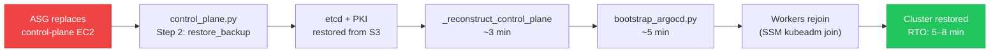

# Disaster Recovery

The control-plane DR strategy for the self-hosted Kubernetes cluster. Designed for the primary failure mode: **ASG replacing the control-plane EC2 instance**, which destroys all in-memory and local-disk state.

## Recovery Flow



**RTO: ~5–8 minutes** for a full control-plane replacement.

## Backup Matrix

| Asset | Backup target | Mechanism | Recovery step |
|---|---|---|---|
| etcd snapshot | S3 (`dr-backups/` prefix) | Hourly systemd timer (`install_etcd_backup`, step 10) | `restore_backup` (step 2, control-plane bootstrap) |
| Kubernetes PKI (`/etc/kubernetes/pki/`) | S3 | Backed up alongside etcd snapshot | Restored before `_reconstruct_control_plane` |
| `admin.conf` | S3 | Alongside etcd | Restored → used to skip `kubeadm init` on DR path |
| TLS Secret (`ops-tls-cert`) | SSM SecureString | `backup_tls_cert` (step 10c, ArgoCD bootstrap) | `restore_tls_cert` (step 5d, ArgoCD bootstrap) |
| ArgoCD JWT signing key | SSM SecureString | `backup_argocd_secret_key` (step 10d) | `preserve_argocd_secret` → `restore_argocd_secret` |
| ArgoCD admin password | SSM | `set_admin_password` (step 10b) | Read at bootstrap |
| GitHub SSH deploy key | SSM | Pre-provisioned (day-0 setup) | `resolve_deploy_key` (step 2, ArgoCD bootstrap) |

## `_reconstruct_control_plane` — DR Path

When `control_plane.py` detects `admin.conf` exists but API server manifests are missing (fresh instance, data EBS reattached), it runs `_reconstruct_control_plane` instead of `kubeadm init`:

1. Start `containerd`
2. Configure ECR credential provider for `kubelet`
3. Write new `kubelet --node-ip` for current instance IP
4. Update Route 53 A record (`k8s-api.k8s.internal`) to new private/public IPs
5. Regenerate kubeconfigs (`kubeadm init phase kubeconfig all`)
6. **Regenerate API server cert SANs** — critical: old cert references old IPs; kubelet TLS verification fails without fresh SANs
7. Generate static pod manifests (`kubeadm init phase control-plane all`)
8. Generate etcd static pod manifest
9. Restart `kubelet`
10. Wait up to 180s for `/healthz` → `ok`

## Bootstrap Token Repair (DR)

Because `kubeadm init` is skipped on the DR path, several cluster-bootstrap objects are absent:

- `cluster-info` ConfigMap
- RBAC bindings for bootstrap tokens
- `kube-proxy` DaemonSet
- CoreDNS Deployment

These are recreated idempotently via `kubeadm init phase` subcommands in the post-restore sequence before workers rejoin.

## CA Mismatch Handling

Workers detect a CA change before attempting `kubeadm join`. If the local CA cert hash differs from `{prefix}/ca-hash` in SSM (control-plane replaced with a new CA), the worker runs:

```bash
kubeadm reset -f && rm -f /etc/kubernetes/kubelet.conf
```

Then proceeds with the join step using the new credentials from SSM.

## EBS as State Boundary

The control-plane `/data/` directory is on a separate EBS volume. The EBS volume persists across instance replacements — ASG terminates the EC2 but the EBS remains attached to the new instance. This means etcd data and certs survive as long as the EBS is healthy. The S3 backup provides a second layer for EBS failure or AZ migration.

## Related Pages

- [[self-hosted-kubernetes]] — bootstrap pipeline and step numbering
- [[k8s-bootstrap-pipeline]] — SM-A triggers the DR recovery path
- [[argocd]] — ArgoCD JWT key and TLS cert backup/restore in bootstrap sequence
- [[observability-stack]] — monitoring PV stale cleanup on monitoring node replacement
- [[self-healing-agent]] — autonomous recovery for non-DR incidents
- [[aws-ssm]] — SSM Parameter Store as secondary backup target
