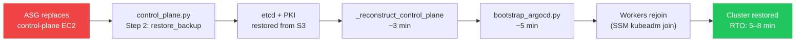

# Disaster Recovery

The control-plane DR strategy for the self-hosted Kubernetes cluster. Designed for the primary failure mode: **ASG replacing the control-plane EC2 instance**, which destroys all in-memory and local-disk state.

## Recovery Flow



**RTO: ~5–8 minutes** for a full control-plane replacement.

## Backup Matrix

| Asset | Backup target | Mechanism | Recovery step |
|---|---|---|---|
| etcd snapshot | S3 (`dr-backups/` prefix) | Hourly systemd timer (`install_etcd_backup`, step 10) | `restore_backup` (step 2, control-plane bootstrap) |
| Kubernetes PKI (`/etc/kubernetes/pki/`) | S3 | Backed up alongside etcd snapshot | Restored before `_reconstruct_control_plane` |
| `admin.conf` | S3 | Alongside etcd | Restored → used to skip `kubeadm init` on DR path |
| TLS Secret (`ops-tls-cert`) | SSM SecureString | `backup_tls_cert` (step 10c, ArgoCD bootstrap) | `restore_tls_cert` (step 5d, ArgoCD bootstrap) |
| ArgoCD JWT signing key | SSM SecureString | `backup_argocd_secret_key` (step 10d) | `preserve_argocd_secret` → `restore_argocd_secret` |
| ArgoCD admin password | SSM | `set_admin_password` (step 10b) | Read at bootstrap |
| GitHub SSH deploy key | SSM | Pre-provisioned (day-0 setup) | `resolve_deploy_key` (step 2, ArgoCD bootstrap) |

## `_reconstruct_control_plane` — DR Path

When `control_plane.py` detects `admin.conf` exists but API server manifests are missing (fresh instance, data EBS reattached), it runs `_reconstruct_control_plane` instead of `kubeadm init`:

1. Start `containerd`
2. Configure ECR credential provider for `kubelet`
3. Write new `kubelet --node-ip` for current instance IP
4. Update Route 53 A record (`k8s-api.k8s.internal`) to new private/public IPs
5. Regenerate kubeconfigs (`kubeadm init phase kubeconfig all`)
6. **Regenerate API server cert SANs** — critical: old cert references old IPs; kubelet TLS verification fails without fresh SANs
7. Generate static pod manifests (`kubeadm init phase control-plane all`)
8. Generate etcd static pod manifest
9. Restart `kubelet`
10. Wait up to 180s for `/healthz` → `ok`

## Bootstrap Token Repair (DR)

Because `kubeadm init` is skipped on the DR path, several cluster-bootstrap objects are absent:

- `cluster-info` ConfigMap
- RBAC bindings for bootstrap tokens
- `kube-proxy` DaemonSet ← **critical gap** (see below)
- CoreDNS Deployment ← **critical gap** (see below)

These are recreated idempotently via `kubeadm init phase` subcommands in the post-restore sequence before workers rejoin.

### kube-proxy and CoreDNS: Addon Guards in `handle_second_run()`

The production failure mode: S3 restore successfully recovers `admin.conf` **before** `kubeadm init` runs. `step_init_kubeadm()` detects `admin.conf` exists and enters `handle_second_run()`. This skips `kubeadm init` entirely — `kube-proxy` is never deployed.

Without `kube-proxy`, ClusterIP routing breaks (`10.96.0.1:443` unreachable) → CCM cannot reach the API server → `uninitialized` taint stays → no pods schedule → `kubeadm join` hangs.

**Fix:** Two idempotent guards added to `handle_second_run()`:

```python
# At the end of handle_second_run(), after publish_kubeconfig_to_ssm()
ensure_kube_proxy(cfg)   # deploys via kubeadm init phase addon kube-proxy
ensure_coredns(cfg)      # deploys via kubeadm init phase addon coredns
```

Both functions check if the resource exists first and no-op if present. Safe to run on every second-run invocation. See [[kube-proxy-missing-after-dr]] for full implementation and 6 test cases.

## Certificate SAN Mismatch (Post-Replacement)

`_reconstruct_control_plane()` step 6 regenerates the API server certificate with the new instance's IPs in the SANs — this is handled automatically on the full DR path.

**When it fails**: if the DR automation is interrupted after step 5 (kubeconfigs) but before step 6 (cert regeneration), the restored backup cert has old IPs in its SANs. The new instance's IP is rejected by kubelet TLS verification and workers cannot join.

**Detection**: `just diagnose` Phase 3 checks cert SANs vs current IMDS IP — emits `[CRITICAL]` on mismatch.

**Repair**: See [[control-plane-cert-san-mismatch]] for the full diagnostic and automated repair sequence (`just fix-cert` / `control-plane-autofix.ts`).

## CA Mismatch Handling

Workers detect a CA change before attempting `kubeadm join`. If the local CA cert hash differs from `{prefix}/ca-hash` in SSM (control-plane replaced with a new CA), the worker runs:

```bash
kubeadm reset -f && rm -f /etc/kubernetes/kubelet.conf
```

Then proceeds with the join step using the new credentials from SSM.

## EBS as State Boundary

The control-plane `/data/` directory is on a dedicated **30 GB GP3 EBS volume** (`/dev/xvdf`) declared in the `LaunchTemplate` block-device mapping. Since `deleteOnTermination: true`, the volume is **ephemeral** — it is destroyed with the EC2 instance on replacement. State durability comes entirely from the S3 etcd snapshots (hourly `systemd` timer), not from EBS persistence.

On node replacement: `control_plane.py` detects the missing data directory, downloads the latest snapshot from `s3://{scripts-bucket}/dr-backups/`, and restores before running `_reconstruct_control_plane`.

## EIP Binding — NLB Not EC2

The Elastic IP is permanently bound to the **NLB via SubnetMapping** — not to the EC2 control-plane instance. During DR:

- The EIP address **does not change** and requires no re-association step
- The NLB automatically routes to the new instance once health checks pass (~30 s)
- Route 53 updates `k8s-api.k8s.internal` to the new **private IP** so workers find the new API server

This design eliminates the old Lambda-based EIP re-association pattern, which required custom failover logic and was operationally fragile.

## Full Cluster Rebuild (No S3 Snapshot)

If the S3 snapshot is unavailable (first deployment, manual deletion, or bucket failure):

1. `control_plane.py` detects no snapshot and runs `kubeadm init` from scratch
2. New etcd is empty — application data is lost
3. ArgoCD re-syncs all application state from Git within ~5 minutes
4. StatefulSet data (Prometheus metrics, Loki logs, Tempo traces) is lost for the period since last snapshot

## Related Pages

- [[self-hosted-kubernetes]] — bootstrap pipeline and step numbering
- [[k8s-bootstrap-pipeline]] — SM-A triggers the DR recovery path
- [[kube-proxy-missing-after-dr]] — DR gap: ensure_kube_proxy + ensure_coredns guards
- [[control-plane-cert-san-mismatch]] — cert SAN failure mode on interrupted DR path; automated repair via control-plane-autofix.ts
- [[operational-scripts]] — control-plane-troubleshoot.ts and autofix.ts implementation
- [[cdk-kubernetes-stacks]] — EBS data volume design in LaunchTemplate
- [[argocd]] — ArgoCD JWT key and TLS cert backup/restore in bootstrap sequence
- [[observability-stack]] — monitoring PV stale cleanup on monitoring node replacement
- [[self-healing-agent]] — autonomous recovery for non-DR incidents
- [[aws-ssm]] — SSM Parameter Store as secondary backup target
