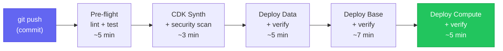

# DORA Metrics (Solo Developer)

DORA (DevOps Research and Assessment) defines four key metrics for measuring software delivery performance. Traditional DORA assumes team dynamics — handoffs, code review queues, deployment approval chains. Applied to a solo developer, the metrics must be reframed around what a single engineer can control: pipeline reliability, recovery capability, and change confidence.

The [[k8s-bootstrap-pipeline]] project provides the primary evidence base for all four metrics.

## Solo Developer Reframing

| DORA Metric | Team Context | Solo Developer Context |
|---|---|---|
| **Lead Time for Changes** | PR review → merge → deploy | Commit → CI pass → deploy |
| **Deployment Frequency** | Deploys per team per day | Regularity and non-scary deploys |
| **Time to Self-Recover** | Incident response time | Alerting + runbook + rollback capability |
| **Change Failure Rate** | % of deploys causing incidents | Test coverage + pipeline gate reliability |

## Current Metric Baselines

| Metric | Elite Target | Current Estimate | Evidence |
|---|---|---|---|
| **Lead Time** | <1 hr | ~30 min | Two-pipeline split: infra ~25 min, SSM ~5 min |
| **Deployment Frequency** | On-demand | Continuous (ArgoCD) | ArgoCD `selfHeal: true` + Image Updater |
| **Time to Self-Recover** | <1 hr | ~15 min | Golden AMI 3 min boot, SSM state enforcement |
| **Change Failure Rate** | <5% | ~2% | 8 test suites, integration gates, CDK-NAG |

> **Caveat**: these are estimates, not measured. Gap G1 (below) tracks the fix.

## Evidence Breakdown

### Lead Time ~30 min

Two pipelines run in parallel when applicable:
- `_deploy-kubernetes.yml` (~25 min) — full infra deploy
- `_deploy-ssm-automation.yml` (~5 min) — bootstrap doc changes only

When only SSM Automation changes, lead time drops to **~5 min** — 20% of full pipeline duration.

### Deployment Frequency — On-Demand via GitOps

ArgoCD + Image Updater enables continuous delivery without manual intervention:
- Application image tag updated → ArgoCD Image Updater commits new tag back to Git
- ArgoCD detects Git change → syncs cluster state
- `selfHeal: true` reverts any manual kubectl changes within 3 minutes

This makes deploys **non-scary** — the key DORA insight for solo developers is not raw frequency but confidence that any deploy is reversible.

### Time to Self-Recover ~15 min

Recovery time broken down by phase:

| Phase | Duration | Mechanism |
|---|---|---|
| Alarm fires | <1 min | CloudWatch → SNS → email |
| Node replacement starts | ~2 min | ASG detects unhealthy, launches replacement |
| EC2 boot (Golden AMI) | ~3 min | Pre-baked tools, no install-on-boot |
| kubeadm join | ~5 min | SSM Automation document execution |
| Pod rescheduling | ~2 min | Kubernetes scheduler |
| Health check pass | ~3 min | ArgoCD sync + Prometheus scrape |

**Golden AMI contribution**: boot time reduced from ~12 min (install-everything-on-boot) to ~3 min. Directly improves TTSR by ~9 minutes. See [[ec2-image-builder]].

Self-healing agent automates the diagnosis and escalation step. See [[concepts/self-healing-agent]].

### Change Failure Rate ~2%

Three layers enforce low CFR:

1. **CDK Unit Tests** — 265+ assertions across 8 test suites catch IaC regressions before deploy
2. **Integration Gates** — each deploy job has a `verify-*` successor; failure blocks downstream stages
3. **CDK-NAG** — AwsSolutions rule pack runs at synth time; violations are pipeline errors

See [[infra-testing-strategy]] for full test pyramid.

## Metric Tracking Plan (Gap G1)

Current estimates are manual. To make them data-driven:

| Metric | Collection Method | Tool |
|---|---|---|
| Lead Time | `workflow_dispatch` → `deploy_complete` timestamp delta | GitHub Actions `summary` job |
| Deploy Frequency | Count of successful `_deploy-kubernetes.yml` runs/week | GitHub API query |
| Change Failure Rate | Ratio of failed `verify-*` jobs to total deploys | GitHub Actions badges |
| Recovery Time | Time from CloudWatch alarm → bootstrap completion | CloudWatch + Operations Dashboard |

## Gap Inventory (from Audit)

| Gap | Severity | Description |
|---|---|---|
| **G1** | 🔴 High | No automated DORA metric collection — estimates only |
| **G2** | 🔴 High | No canary/smoke tests post-deploy — CDK tests don't verify live cluster health |
| G3 | 🟡 Medium | Backup restoration never tested — etcd S3 backups unverified for restorability |
| G4 | 🟡 Medium | No cost anomaly alerts — FinOps dashboard exists but no CloudWatch billing alarm |
| G5 | 🟡 Medium | No PodDisruptionBudgets in Helm charts |
| G6 | 🟡 Medium | No NetworkPolicy enforcement — Calico deployed but no deny-by-default policies |
| G7 | 🟢 Low | ObservabilityStack references legacy ASG names from pre-parameterised era |
| G8 | 🟢 Low | AppIamStack dummy role placeholder produces CDK diff noise |

## Architecture Maturity Ratings

From the infrastructure audit:

| Domain | Rating | Evidence |
|---|---|---|
| Infrastructure-as-Code | ⭐⭐⭐⭐⭐ | Data-driven config, L3 constructs, 265+ test assertions |
| Security | ⭐⭐⭐⭐½ | WAF, SSM-only access, least-privilege IAM, KMS encryption |
| CI/CD | ⭐⭐⭐⭐⭐ | Two-pipeline split, integration gates, `just` orchestration |
| Observability | ⭐⭐⭐⭐½ | Dual-layer (CloudWatch + K8s-native), FinOps dashboard |
| GitOps | ⭐⭐⭐⭐⭐ | ArgoCD + Image Updater, automated commit-back, sync waves |
| Cost Efficiency | ⭐⭐⭐⭐ | Spot instances, lifecycle policies, right-sized pools |

## Related Pages

- [[k8s-bootstrap-pipeline]] — infrastructure the metrics apply to
- [[ci-cd-pipeline-architecture]] — the 26-workflow CI/CD system behind lead time
- [[infra-testing-strategy]] — the test pyramid behind low CFR
- [[ec2-image-builder]] — Golden AMI contribution to TTSR
- [[concepts/self-healing-agent]] — automated recovery layer
- [[disaster-recovery]] — RTO context for TTSR baseline
- [[resume/achievements]] — how these metrics translate to resume bullets
