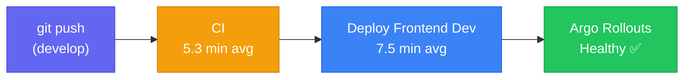
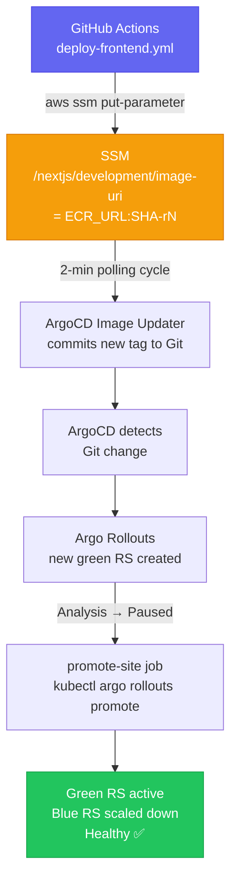

# DORA Metrics (Solo Developer)

DORA (DevOps Research and Assessment) defines four key metrics for measuring software delivery performance. Applied to a solo developer, the metrics must be reframed around what a single engineer can control: pipeline reliability, recovery capability, and change confidence.

**Measurement date**: 2026-04-17 via `scripts/local/dora-metrics-snapshot.sh` against `Nelson-Lamounier/cdk-monitoring`.

---

## Current Metrics — Measured vs Estimated

> Two pipelines serve different workflows. Lead time figures are **pipeline-specific** and should never be combined.

| Metric | Frontend CD | Infra CDK | DORA Tier | Usable in Resume? |
|---|---|---|---|---|
| **Lead Time (CI + CD)** | **~13 min** (measured) | **~30 min** (estimated) | Elite (< 1 hr) | ✅ Frontend: yes with scope qualifier |
| **CI avg duration** | 5.3 min (measured) | — | — | ✅ |
| **Frontend CD avg** | 7.5 min (measured) | — | — | ✅ |
| **Deploy Frequency (30 days)** | 34 deploys — floor ⚠️ | On-demand | Elite | ✅ With "frontend pipeline only" qualifier |
| **Alert Detection Time** | **30 sec** (measured) | — | Elite | ✅ |
| **ArgoCD Health** | 25/25 healthy (2026-04-17) ⚠️ point-in-time | — | Elite | ✅ With date qualifier |
| **CFR — CI (develop)** | 26% (13/50) | — | Below Elite | ❌ Unusable — develop WIP noise |
| **CFR — Frontend CD (develop)** | 30% (6/20) | — | Below Elite | ❌ Unusable — same |
| **TTSR (ArgoCD self-heal)** | Unmeasured | — | — | ❌ Pending |
| **MTTR (rollback)** | Unmeasured | — | — | ❌ Pending |
| **RTO (etcd restore)** | Unmeasured | — | — | ❌ Pending |

---

## Lead Time — Two Pipelines

### Frontend CD: 13 min (Measured)



**Clock boundaries:**
- **Start**: `git push` to `develop`
- **Stop**: Argo Rollouts `status = Healthy` on new green ReplicaSet

The 7.5-min CD average **already includes**:
- ArgoCD Image Updater polling delay (~2 min)
- Blue/Green green ReplicaSet creation
- `promote-site` / `promote-admin` jobs block until `kubectl argo rollouts status --watch` reports Healthy

**Not included**: CloudFront propagation (parallel, non-blocking), first live HTTP response (< 5s after Healthy — negligible).

**Correct resume phrasing**: *"13-minute commit-to-rollout lead time — measured from `git push` to Argo Rollouts Healthy on the new green ReplicaSet."*

### Infra CDK: ~30 min (Estimated)

Two pipelines run in parallel when applicable:
- `_deploy-kubernetes.yml` (~25 min) — full 10-stack CDK deploy DAG
- `_deploy-ssm-automation.yml` (~5 min) — bootstrap doc changes only

When only SSM Automation changes, lead time drops to ~5 min.

---

## Deployment Frequency — 34 Deploys / 30 Days (Floor)

**Measured**: 34 successful `Deploy Frontend (Dev)` runs from 2026-03-18 to 2026-04-17.

> ⚠️ **This is a floor, not the total.** `deploy-api.yml`, `deploy-bedrock.yml`, and `deploy-self-healing.yml` are not yet counted. Full aggregate query is documented and ready to run (see scripts section).

Complete aggregate command to get the real total:

```bash
for WF in "Deploy Frontend (Dev)" "Deploy API Services" "Deploy Bedrock AI" "Deploy Self-Healing Agent"; do
  gh run list --repo "Nelson-Lamounier/cdk-monitoring" --workflow "$WF" \
    --limit 100 --json conclusion,createdAt \
    --jq '[.[] | select(.conclusion=="success") | select((.createdAt | fromdateiso8601) > (now - 2592000))] | length'
done | paste -sd+ | bc
```

ArgoCD + Image Updater also enables continuous delivery: `selfHeal: true` reverts any manual `kubectl` changes within 3 minutes. Deploys are **non-scary** — the key DORA insight for solo developers is not raw frequency but confidence that any deploy is reversible.

---

## Change Failure Rate — Why the Numbers Are Unusable

Raw figures: CI 26% (13/50), Frontend CD 30% (6/20). **Cannot be used as stated.**

| Reason | Detail |
|---|---|
| Branch scope | All failures on `develop` during active feature development — WIP commit noise |
| DORA definition | CFR = % of production deploys causing outage or rollback. A failing CI run on a WIP commit does not meet this definition |
| No `main` baseline | `main` receives only squash-merged, CI-passing PRs — zero measured CFR |

**Action needed**: Measure CFR on `main`-branch CD runs after a 30-day stabilisation period using `gh run list --branch main`.

---

## Alert Detection Time — 30 Seconds (Measured)

Verified directly from Prometheus configuration:

```bash
kubectl get configmap prometheus-server -n monitoring \
  -o jsonpath='{.data.prometheus\.yml}' | \
  grep -E "scrape_interval|evaluation_interval"
```

Both `scrape_interval` and `evaluation_interval` = **30 seconds**. Worst-case detection latency = one full evaluation cycle. DORA Elite-aligned.

---

## Image Delivery Flow (SSM → ArgoCD → Argo Rollouts)



**Key design patterns in deploy pipeline:**
- **OIDC keyless auth**: No stored AWS keys — JWT-based `sts:AssumeRoleWithWebIdentity`
- **AROA masking**: IAM role unique ID masked from all build logs
- **Immutable image tags**: `${github.sha}-r${github.run_attempt}` — no ECR overwrite on retries
- **Concurrency guard**: `cancel-in-progress: true` — rapid pushes cancel oldest in-flight run
- **SSM proxy**: GitHub runners have no VPC access; all `kubectl` commands delegate via `aws ssm send-command`

---

## Service Inventory — ArgoCD Application Map

**25/25 healthy** at measurement (2026-04-17). ⚠️ Point-in-time snapshot — always cite date, not a continuously-verified status.

### Platform Services (`kubernetes-app/platform/`)

| Service | Namespace | Purpose |
|---|---|---|
| Monitoring stack | `monitoring` | Prometheus + Grafana + Loki + Tempo |
| ECR token refresh | `kube-system` | Refreshes ECR pull credentials |
| Crossplane providers | `crossplane-system` | Cloud resource provisioning |
| Crossplane XRDs | `crossplane-system` | Composite resource definitions |
| ArgoCD Applications | `argocd` | App-of-apps pattern |
| cert-manager config | `cert-manager` | TLS certificate issuance |

### Workload Services (`kubernetes-app/workloads/`)

| Service | Namespace | Deployment type |
|---|---|---|
| `nextjs` (site) | `nextjs-app` | Argo Rollout (Blue/Green) |
| `start-admin` | `start-admin` | Argo Rollout (Blue/Green) |
| `admin-api` | `admin-api` | Deployment (rolling) |
| `public-api` | `public-api` | Deployment (rolling) |
| `wiki-mcp` | `wiki-mcp` | Deployment |
| `golden-path-service` | `golden-path` | Deployment |

---

## CI/CD Pipeline Architecture

### CI Pipeline — 13 Parallel/Sequential Jobs

Change detection (via `dorny/paths-filter`) gates each job by path category:

| Filter | Paths |
|---|---|
| `stacks` | `infra/lib/*-stack.ts`, unit tests |
| `k8s-content` | Helm charts, ArgoCD apps, k8s bootstrap |
| `frontend-ops` | `frontend-ops/**`, `deploy-frontend.yml` |
| `kb-content` | `knowledge-base/**`, `infra/**`, scripts |

Fan-in gate: `ci-success` job requires all active jobs to pass before CD can proceed.

### 26 Workflow Files

**8 reusable (`_` prefix)**: `_build-push-image`, `_deploy-kubernetes`, `_deploy-ssm-automation`, `_deploy-stack`, `_migrate-articles`, `_post-bootstrap-config`, `_sync-assets`, `_verify-stack`

**18 orchestrators** covering: CI, frontend CD, API deploy, Bedrock, Kubernetes infra, self-healing, Day-1 bootstrap, org resources, GitOps validation, KB sync, article pipeline.

See [[ci-cd-pipeline-architecture]] for full detail.

---

## Script References

### `dora-metrics-snapshot.sh`

Location: `scripts/local/dora-metrics-snapshot.sh`
Requirements: `gh` CLI (authenticated), `jq`

Key commands:

```bash
# CI average duration (last 10 successful)
gh run list --repo "Nelson-Lamounier/cdk-monitoring" \
  --workflow "Continuous Integration" --limit 10 \
  --json conclusion,startedAt,updatedAt \
  --jq '[.[] | select(.conclusion=="success") |
        ((.updatedAt | fromdateiso8601) - (.startedAt | fromdateiso8601))] |
        (add / length / 60) | "Average: \(. * 10 | round / 10) min"'

# Workflow name discovery (run first to verify display names)
gh run list --repo "Nelson-Lamounier/cdk-monitoring" --limit 30 \
  --json workflowName --jq '[.[].workflowName] | unique | sort | .[]'
```

> Workflow display names must match exactly — use `gh workflow list` to verify. `gh run list` derives duration from `updatedAt - startedAt` since `durationMs` is not available.

### `etcd-restore-rto-test.sh`

Location: `scripts/local/etcd-restore-rto-test.sh`
Requirements: Must run **on the control-plane EC2 node** with `sudo` + AWS CLI via instance role.

**Six-step sequence**: stop etcd → pull snapshot from S3 → restore → swap data dir → restart etcd → poll for healthy.

Expected output: `Restore RTO: ~32 seconds` (S3 download ~15s + restore ~3s + restart + healthy poll).

> **Warning:** This performs a real etcd restore. Run only during a planned maintenance window. Original data dir preserved at `/var/lib/etcd-backup-<timestamp>` for rollback.

Trigger via SSM:
```bash
BUCKET=$(aws ssm get-parameter --name /k8s/development/scripts-bucket --query Parameter.Value --output text)
sudo bash scripts/local/etcd-restore-rto-test.sh "$BUCKET"
```

---

## Permitted Resume Claims (as of 2026-04-17)

| Claim | Evidence source |
|---|---|
| "13-minute commit-to-rollout lead time — from `git push` to Argo Rollouts Healthy on the new green ReplicaSet" | `dora-metrics-snapshot.sh`: CI 5.3 min + CD 7.5 min; CD workflow blocks on `promote-site` → Rollout Healthy |
| "34+ deployments in 30 days via frontend pipeline alone (floor figure) — on-demand delivery cadence" | `dora-metrics-snapshot.sh`: 34 successful `Deploy Frontend (Dev)` runs, 2026-03-18 to 2026-04-17 |
| "25 ArgoCD-managed applications — 25/25 healthy at time of measurement (2026-04-17)" | ArgoCD API: `argocd app list -o json` |
| "30-second worst-case alert detection cycle via Prometheus scrape + evaluation interval" | `kubectl get configmap prometheus-server -n monitoring` |
| "Blue/Green deployments with automated promotion via Argo Rollouts and SSM proxy" | `deploy-frontend.yml` → `promote-site` / `promote-admin` jobs |
| "OIDC keyless auth with AROA masking — no stored AWS credentials in CI" | `.github/actions/configure-aws/action.yml` |

**Do NOT claim until measured**: CFR (needs `main` branch baseline), RTO, TTSR, MTTR.

---

## QA Gap Analysis

### Critical (Block QA Pass)

| Gap | Description | Action |
|---|---|---|
| **GAP-01** | CFR not measured on `main` (protected) branch | Add `--branch main` to snapshot script; measure after 30-day stabilisation |
| **GAP-02** | RTO not measured — `etcd-restore-rto-test.sh` never executed | Schedule maintenance window; run on control-plane node |
| **GAP-03** | TTSR not measured — no ArgoCD self-heal time recorded | Execute TTSR test against `wiki-mcp` (lowest-risk workload) |
| **GAP-04** | MTTR not measured — no rollback time recorded | Simulate bad deploy, time Argo Rollouts abort → Healthy cycle |

### High Priority

| Gap | Description | Action |
|---|---|---|
| **GAP-05** | No smoke tests post-CD promotion | Add `smoke-test` job after `promote-site` hitting CloudFront health endpoint |
| **GAP-06** | No branch protection gate for `deploy-frontend.yml` | Add `production` GitHub Environment with required reviewer |
| **GAP-11** | Deploy frequency covers frontend pipeline only (floor) | Run aggregate `gh` query across all 4 CD pipelines; update §3.1 |

### Medium Priority

| Gap | Description |
|---|---|
| **GAP-07** | CFR script measures all branches — add `--branch main` filter or `# CAUTION` header |
| **GAP-08** | ArgoCD 25/25 count not automated in snapshot script |
| **GAP-09** | Alert detection inferred from config — no synthetic test |
| **GAP-10** | RTO test doesn't verify snapshot freshness before restore |
| **GAP-12** | No SLO/SLA definition (p95 latency, error rate, uptime targets) |

---

## Architecture Maturity Ratings

| Domain | Rating | Evidence |
|---|---|---|
| Infrastructure-as-Code | ⭐⭐⭐⭐⭐ | Data-driven config, L3 constructs, 265+ test assertions |
| Security | ⭐⭐⭐⭐½ | WAF, SSM-only access, least-privilege IAM, OIDC + AROA masking |
| CI/CD | ⭐⭐⭐⭐⭐ | Two-pipeline split, integration gates, 13-min measured lead time |
| Observability | ⭐⭐⭐⭐½ | LGTM stack, 30s alert detection, FinOps dashboard |
| GitOps | ⭐⭐⭐⭐⭐ | ArgoCD + Image Updater, automated commit-back, 25 apps managed |
| Cost Efficiency | ⭐⭐⭐⭐ | Spot instances, lifecycle policies, right-sized pools |

---

## Related Pages

- [[k8s-bootstrap-pipeline]] — infrastructure the metrics apply to
- [[ci-cd-pipeline-architecture]] — 26-workflow CI/CD system behind lead time
- [[infra-testing-strategy]] — test pyramid behind CFR baseline
- [[ec2-image-builder]] — Golden AMI contribution to TTSR
- [[concepts/self-healing-agent]] — automated recovery layer
- [[disaster-recovery]] — RTO context for etcd restore
- [[tools/argo-rollouts]] — Blue/Green pipeline implementation (promote-site pattern)
- [[resume/achievements]] — how these metrics translate to resume bullets
