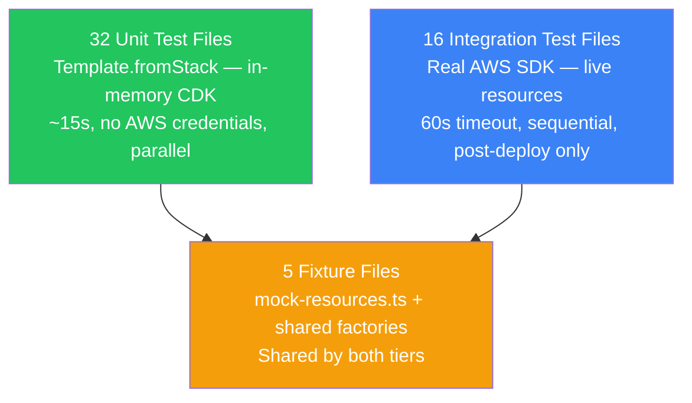

# Infrastructure Testing Strategy

The [[k8s-bootstrap-pipeline]] `infra/tests/` directory contains 50 test files (~8,000 lines of TypeScript). Two distinct test tiers operate independently: unit tests run in CI on every commit (~15s total), integration tests run after real deployments against live AWS resources (~60s per file, sequential).

## The Testing Pyramid



**The split matters**: unit tests cannot detect IAM permission gaps (the role exists in the template but the action may be insufficient) — that requires a live integration test. Integration tests cannot run in 15 seconds — they make real AWS API calls. Both tiers are necessary; neither is sufficient alone.

---

## Unit Test Infrastructure

### jest.config.js

```json
{
  "testMatch": ["**/tests/unit/**/*.test.ts"],
  "workerIdleMemoryLimit": "512MB",
  "testEnvironment": "node"
}
```

`workerIdleMemoryLimit: 512MB` — CDK unit tests instantiate full stack graphs in memory. Without this limit, Jest workers accumulate memory across test files and OOM-crash mid-run.

**esbuild mock**: CDK's `NodejsFunction` construct triggers `esbuild` bundling at synthesis time. In unit tests, esbuild is mocked at the module level — synthesis completes in <1s instead of 5–10s per Lambda.

### `jest-worker-setup.js` — CWD Drift Fix

```javascript
const infraRoot = path.resolve(__dirname, '../..');
process.chdir(infraRoot);
```

Jest workers in a monorepo inherit `CWD=/repo-root`. CDK assumes `CWD=infra/` when resolving asset paths and `cdk.json`. Without this setup file, every CDK synthesis inside a Jest worker fails with `No such file or directory: cdk.json`. The fix runs once per worker at startup.

### `mock-resources.ts` — Real CDK Constructs as Fixtures

The fixture layer uses **real CDK L2 constructs**, not dummy string IDs:

```typescript
// WRONG — brittle, doesn't encode CDK contract
const vpcId = 'vpc-12345';

// CORRECT — real CDK construct, encodes actual dependency contract
const vpc = new ec2.Vpc(stack, 'TestVpc', { maxAzs: 1 });
```

Tests that use real constructs catch issues like: "does the stack correctly resolve the VPC's subnets from the construct reference?" A string ID would never surface this.

### `createStackWithHelper` — Cross-Stack Dependency Injection

```typescript
function createStackWithHelper(config: StackConfig): StackUnderTest {
    const app = new cdk.App();
    const dependencies = {
        vpc: new ec2.Vpc(baseStack, 'Vpc', ...),
        securityGroups: createMockSGs(baseStack),
        kmsKey: new kms.Key(baseStack, 'Key'),
    };
    return new TargetStack(app, 'TestStack', { ...config, ...dependencies });
}
```

Factory pattern for stacks with many CDK cross-stack dependencies. The helper constructs all dependency mocks once per test suite, not once per test. CDK stacks with 10+ dependencies would require 20+ lines of setup before every test without this pattern.

---

## Key Unit Test Patterns

### `Template.fromStack` vs Snapshots

CDK supports `toMatchSnapshot()` — pins the entire CloudFormation template. **This project does not use snapshots** for infrastructure tests.

| Approach | Pros | Cons |
|---|---|---|
| `toMatchSnapshot()` | Zero code to write | Pins CDK-generated logical IDs; every CDK upgrade invalidates all snapshots; `--updateSnapshot` hides real regressions |
| `hasResourceProperties` + `Match.objectLike` | Tests only semantically meaningful properties | Requires explicit assertion authoring |

`Match.objectLike` allows partial matching — the test validates the properties that matter (SG port, IAM action, encryption flag) without caring about CDK's internal metadata and hash-suffixed logical IDs.

### `describe.each` — Parametric Pool Tests

```typescript
describe.each([
    ['general',    generalPoolConfig],
    ['monitoring', monitoringPoolConfig],
])('KubernetesWorkerAsgStack — %s pool', (poolName, config) => {
    it('should have correct instance type', () => {
        expect(template.findResources('AWS::AutoScaling::LaunchConfiguration'))
            .toMatchInstanceType(config.instanceType);
    });
    // All assertions run for BOTH pools automatically
});
```

Both worker pool configurations run the same assertions. New pool types are covered by adding an entry to the `describe.each` array — no assertion duplication.

### Negative Assertions

```typescript
it('should not create a standalone worker stack', () => {
    expect(stackMap).not.toHaveProperty('worker');
});
```

Verifies that legacy stacks were decommissioned. Without this, a refactoring that accidentally re-introduces a removed stack would pass all positive tests but deploy an orphaned resource.

### `it.todo()` — Structured Technical Debt

```typescript
it.todo('should validate cross-region CloudFront ACM cert exists in us-east-1');
it.todo('should verify NLB access logs bucket has cross-region replication');
```

`it.todo()` shows as **yellow (pending)** in CI output, not red (failure). Known missing coverage is tracked in the test suite itself rather than in a separate ticket system. A developer implementing the feature adds the assertion — the `todo` becomes the specification.

### Security Control Count Assertions

```typescript
it('should create all required AWS Config rules', () => {
    template.resourceCountIs('AWS::Config::ConfigRule', 8);
});
```

Count assertions act as a **security control inventory**. If a Config rule is accidentally removed during stack refactoring, the count drops from 8 to 7 and the test fails immediately. No one accidentally removes a security control without CI surfacing it.

---

## Integration Test Strategy

### The Fundamental Principle — SSM as the Source of Truth

Every integration test follows the **SSM anchor pattern**:

```typescript
// Step 1: Load ALL SSM parameters for this stack in ONE call
const ssmParams = await loadSsmParameters('/k8s/development/');

// Step 2: All resource IDs come from SSM — never hardcoded
const vpcId = requireParam(ssmParams, '/k8s/development/vpcId');
const { Vpcs } = await ec2.send(new DescribeVpcsCommand({ VpcIds: [vpcId] }));
expect(Vpcs).toHaveLength(1);
```

A single test proves three things: (1) the stack created a VPC, (2) the stack published its ID to SSM, (3) the SSM value is correct (resolves to a real VPC). Tests that hardcode expected IDs only prove step 3.

**Why SSM over CloudFormation Outputs?**: SSM parameters are directly addressable (no stack ARN needed), versioned (atomic update on redeploy), and discoverable (`GetParametersByPath`). Most importantly, they are **the same contract downstream stacks use** — testing via SSM means the test exercises the exact same wiring that production depends on.

### `requireParam` — Diagnostic Error Messages

```typescript
function requireParam(params: Map<string, string>, path: string): string {
    const value = params.get(path);
    if (!value) throw new Error(`Missing required SSM parameter: ${path}`);
    return value;
}
```

Replaces TypeScript's `!` non-null assertion entirely. When a test fails with `Missing required SSM parameter: /k8s/development/vpcId`, the message immediately distinguishes "the stack failed to deploy" from "the stack deployed but forgot to publish this parameter." Compare to `Cannot read property 'VpcId' of undefined` — three minutes of debugging vs one clear message.

### `beforeAll` — API Call Budget

```typescript
let ssmParams: Map<string, string>;
let nlb: LoadBalancer;

beforeAll(async () => {
    ssmParams = await loadSsmParameters();  // ONCE
    const { LoadBalancers } = await elbv2.send(new DescribeLoadBalancersCommand(...));
    nlb = LoadBalancers![0];               // ONCE
}, 60_000);

it('should have access logs enabled', () => {
    // Uses cached nlb — zero API calls here
    expect(nlbAttributes.find(a => a.Key === 'access_logs.s3.enabled')?.Value).toBe('true');
});
```

Module-level `beforeAll` makes all shared AWS API calls once. Individual `it()` blocks read from cached values — no AWS API calls inside test bodies. Reduces API call volume by 10–20x, cuts execution time, and eliminates API throttling risk.

### jest.integration.config.js

```json
{
  "testTimeout": 60000,
  "maxWorkers": 1
}
```

60-second timeout (real AWS SDK calls). `maxWorkers: 1` enforces **sequential execution** — integration tests make destructive reads (SSM parameters, running EC2 instances) that could race if parallelised. A test that checks "does the NLB exist?" and another that checks "does the NLB have correct listeners?" must not interleave.

---

## Integration Test Coverage

### `base-stack.integration.test.ts` (1,214 lines)

The largest file. Validates the foundational networking layer:
- 13 SSM parameters all exist with non-empty values
- VPC in `available` state
- VPC Flow Logs → CloudWatch, 3-day retention
- 4 Security Groups, each validating every ingress/egress rule (18 cluster SG rules)
- EIP exists and matches SSM value
- NLB: internet-facing, access logs enabled
- Route 53: private zone `k8s.internal`, A record `k8s-api.k8s.internal` with 30s TTL
- KMS key: enabled, rotation on

**Diagnostic formatters**: custom `formatIpPermission()` renders SG rules as human-readable text on failure:
```
Expected TCP ingress for port 6443, but none found.
Actual TCP ingress rules (5):
  • Port 10250 (tcp) — Sources: SG:sg-abc123
  • Port 443 (tcp) — Sources: PrefixList:pl-def456
```
Engineers diagnose the problem from the failure message without opening the AWS Console.

### Other Integration Files

| File | Key assertions |
|---|---|
| `control-plane-stack.integration.test.ts` | EC2 running, IAM profile attached, K8s node registered |
| `worker-asg-stack.integration.test.ts` | Both ASGs exist, instances healthy, CA tags present |
| `data-stack.integration.test.ts` | DynamoDB `ACTIVE`, PITR enabled, SSE with CMK |
| `edge-stack.integration.test.ts` | CloudFront deployed, WAF associated, ACM cert `ISSUED` |
| `bluegreen.integration.test.ts` | Active target group matches expected slot, drain complete |
| `bootstrap-orchestrator.integration.test.ts` | Step Functions `ACTIVE`, most recent execution succeeded |
| `ssm-automation-runtime.integration.test.ts` | Automation docs exist, IAM role trust policy correct |

---

## Advanced TypeScript Patterns

### `satisfies` Over `as const`

```typescript
// WRONG — loses type checking after the list
const paths = ['vpcId', 'elasticIp'] as const;

// CORRECT — TypeScript errors if any key is not in K8sSsmPaths
const paths = ['vpcId', 'elasticIp'] satisfies Array<keyof K8sSsmPaths>;
```

If `vpcId` is renamed in `K8sSsmPaths`, the `satisfies` expression produces a compile error. `as const` would silently continue to reference the old name at runtime. Rename-safe SSM path management.

### No Conditionals in `it()` Blocks

ESLint rule `jest/no-conditional-in-test` is enforced:

```typescript
// WRONG — if rule is undefined, test silently passes
it('should have VPC CIDR rule for 6443', () => {
    const rule = ingress.find(r => r.FromPort === 6443);
    if (rule) {
        expect(rule.IpRanges?.[0]?.CidrIp).toMatch(/^10\./);
    }
});

// CORRECT — throws on missing rule, never silently passes
it('should have VPC CIDR rule for 6443', () => {
    const rule = requireTcpIngressRule(ingress, 6443);
    expectCidrSource(rule, VPC_CIDR_PREFIX);
});
```

All conditional logic lives in module-level helper functions. `it()` blocks read linearly and cannot hide failures.

### Env Vars Before Imports

```typescript
// MUST set env vars BEFORE any import — config evaluates at module init time
process.env.CDK_DEFAULT_ACCOUNT = '123456789012';
process.env.DOMAIN_NAME = 'dev.nelsonlamounier.com';

import * as cdk from 'aws-cdk-lib/core';  // Safe — config already set
```

CDK's config module calls `fromEnv()` at the moment the module is imported. If env vars arrive after the import, the config throws `Missing required env var` before any test runs. This pattern is especially important for test factories that create stacks involving environment-sensitive configuration.

---

## Time Savings Summary

| Activity | Without tests | With tests |
|---|---|---|
| Missing SSM parameter | `cdk deploy` 5–15 min | Unit test failure <1s |
| Misconfigured SG rule | Deploy + Console inspection | Unit test failure <1s |
| Missing IAM permission | Deploy + runtime failure | Integration test 30–60s |
| Post-deploy state validation | Manual Console inspection | Integration test 30–60s |

The 32 unit test files run in parallel across Jest workers — total unit test time is ~15s (bounded by the slowest file, `base-stack.test.ts` at 898 lines). Sequential synthesis of all stacks would take ~90s minimum.

---

## Related Pages

- [[shift-left-validation]] — the broader philosophy: validate as early as possible
- [[ci-cd-pipeline-architecture]] — integration test gates embedded in the deployment DAG
- [[cdk-kubernetes-stacks]] — the 10 stacks being tested
- [[checkov]] — IaC security scanning that runs alongside unit tests in CI
- [[aws-devops-certification-connections]] — how CDK testing maps to DOP-C02 Domain 2
