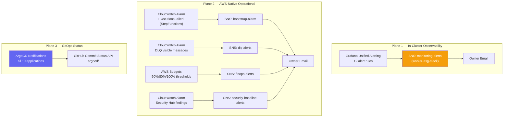
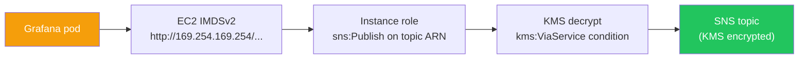
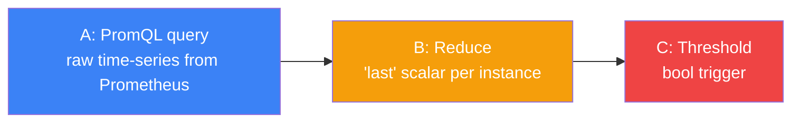
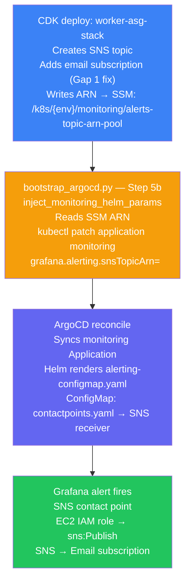

# Notification Architecture

Three independent notification planes deliver operational signals from the [[k8s-bootstrap-pipeline]]:



**Plane 1** (Grafana → SNS) delivers in-cluster metrics and trace-based alerts.  
**Plane 2** (CloudWatch → SNS) delivers AWS-native operational events that don't touch the cluster.  
**Plane 3** (ArgoCD → GitHub) delivers deployment traceability in the Git repository's commit history.

---

## SNS Topic Inventory

Five topics across four CDK stacks:

| Topic | Stack | Publisher | Encryption | Purpose |
|---|---|---|---|---|
| `{poolId}-monitoring-alerts` | `worker-asg-stack` | Grafana (EC2 instance role → IMDSv2) | `alias/aws/sns` KMS | Grafana alert rules (12 rules) |
| `{prefix}-bootstrap-alarm` | `ssm-automation-stack` | CloudWatch Alarm | `enforceSSL: true` | Step Functions `ExecutionsFailed` |
| `{prefix}-dlq-alerts` | `api-stack` | CloudWatch Alarm | Default | Lambda DLQ visible messages |
| `{prefix}-finops-alerts` | `finops-stack` | AWS Budgets service principal | `enforceSSL: true` | Budget threshold breaches |
| `security-baseline-alerts` | `security-baseline-stack` | CloudWatch Alarm | Default | Security Hub / GuardDuty findings |

All topics are conditionally subscribed:
```typescript
if (props.notificationEmail) {
    topic.addSubscription(new EmailSubscription(props.notificationEmail));
}
```
`notificationEmail` is sourced from the `NOTIFICATION_EMAIL` environment variable at CDK synth time.

> **Gap 1 (fixed)**: The monitoring pool stack previously received no `notificationEmail` prop — the SNS topic was created but had no subscriber. Grafana published alerts that were silently dropped. Fixed in `factory.ts` by passing `notificationEmail: emailConfig.notificationEmail` to `monitoringPoolStack`.

### Monitoring Alerts Topic — IAM Chain



Grafana uses the AWS SDK for SNS publishing. The SDK fetches credentials via IMDSv2 from the node's EC2 instance role — no static credentials in the pod. The KMS `kms:ViaService` condition in the instance role policy restricts KMS usage to the SNS service only.

### FinOps Topic — Budgets Service Principal

```typescript
this.alertsTopic.grantPublish(
    new iam.ServicePrincipal('budgets.amazonaws.com'),
);
```

AWS Budgets is a separate service that requires explicit `sns:Publish` permission. The service principal grant is the only correct mechanism — no IAM role can be assumed by the Budgets service. A second `BudgetConstruct` scoped to `serviceFilter: 'Amazon Bedrock'` reuses the same topic.

### Bootstrap Alarm Topic

`treatMissingData: NOT_BREACHING` — correct default. During quiet periods (no ASG scaling events) there are no Step Functions executions. Missing data must not trigger "bootstrap failed" alarms. The `ResourceCleanupProvider` registers this topic's ARN for deletion on stack teardown.

---

## Grafana Unified Alerting

### Configuration Model

Alerting is provisioned via the `grafana-alerting` ConfigMap mounted at `/etc/grafana/provisioning/alerting/`:

| File key | Contains |
|---|---|
| `contactpoints.yaml` | SNS receiver definition (conditional on `snsTopicArn`) |
| `policies.yaml` | Label-based routing (severity=critical/warning → SNS) |
| `rules.yaml` | 4 groups, 12 alert rules (PromQL A→B→C pipeline) |

**GitOps-native**: changes to alert rules are Git commits. ArgoCD detects ConfigMap changes. The `checksum/config` annotation on the pod template triggers a rolling restart when the ConfigMap changes:
```yaml
annotations:
  checksum/config: {{ include (print $.Template.BasePath "/grafana/configmap.yaml") . | sha256sum }}
```

### Contact Point

```yaml
{{- if .Values.grafana.alerting.snsTopicArn }}
contactPoints:
  - name: sns
    receivers:
      - uid: sns-receiver
        type: sns
        settings:
          topic_arn: "{{ .Values.grafana.alerting.snsTopicArn }}"
          region: "{{ .Values.grafana.alerting.awsRegion }}"
        disableResolveMessage: false   # ← sends recovery notification too
{{- else }}
contactPoints: []   # silent mode during initial bring-up
{{- end }}
```

The `snsTopicArn` default in `values.yaml` is `""` — intentional. During initial cluster bring-up, the SSM parameter may not be available yet. Bootstrap Step 5b (`inject_monitoring_helm_params`) overwrites it via `kubectl patch application monitoring --type merge`.

`disableResolveMessage: false` sends a second SNS message when the alert resolves — the owner sees a complete alert lifecycle rather than just the firing notification.

### Routing Policy

```yaml
group_wait: 30s      # batch related alerts before first notification
group_interval: 5m   # re-notify window for new alerts joining a group
repeat_interval: 4h  # repeat if alert stays firing
group_by: [grafana_folder, alertname]   # batch same-name alerts from all nodes
```

Both `critical` and `warning` labels route to SNS — no tiered escalation in a solo-developer context. `group_by: [grafana_folder, alertname]` prevents alert storms where all cluster nodes trigger the same alert simultaneously (e.g., disk space on all 3 nodes).

### A→B→C Evaluation Pattern

All 12 alert rules use Grafana Unified Alerting's three-stage evaluation pipeline:



Grafana Unified Alerting cannot express threshold conditions inline in PromQL (unlike Prometheus Alertmanager). The `Reduce` node (typically `last`) collapses the time-series to a scalar; the `Threshold` node applies the comparison.

### Alert Rule Catalogue — 12 Rules

#### Group 1: Cluster Health (interval: 1m)

| Rule | Expression | Threshold | `for` | Severity | Rationale |
|---|---|---|---|---|---|
| **Node Down** | `up{job="node-exporter"} < 1` | < 1 | 2m | critical | `for: 2m` — prevents false positives from transient Prometheus scrape gaps |
| **High Node CPU** | avg `rate(node_cpu_seconds_total{mode="idle"}[5m])` → `100 - x * 100` | > 85% | 5m | warning | Sustained CPU, not spikes |
| **High Node Memory** | `(1 - MemAvailable / MemTotal) * 100` | > 85% | 5m | warning | — |
| **Pod CrashLooping** | `increase(kube_pod_container_status_restarts_total[15m]) > 3` | > 0 | **0s** | critical | `for: 0s` — restart counter is monotonically increasing; every increment is a real signal, not noise |
| **Pod Not Ready** | `kube_pod_status_ready{condition="true"} == 0` | < 1 | 5m | warning | — |

**`for: 0s` vs `for: 2m` asymmetry**: Node Down uses debouncing because `up` can flip briefly on Prometheus restart or network hiccup. Pod restarts are monotonically increasing — there is no "false positive" form of a container restart counter incrementing.

#### Group 2: Application Health (interval: 1m)

| Rule | Expression | Threshold | `for` | Severity |
|---|---|---|---|---|
| **High Error Rate** | `sum(rate(http_requests_total{code=~"5.."}[5m])) / sum(rate(http_requests_total[5m])) * 100` | > 5% | 5m | critical |
| **High P95 Latency** | `histogram_quantile(0.95, sum by (le) (rate(http_request_duration_seconds_bucket[5m])))` | > 2s | 5m | warning |

**Instrumentation source**: `@opentelemetry/sdk-node` in Next.js auto-instruments the HTTP server. OTLP → Alloy → Prometheus (remote-write or direct scrape).

**5% error threshold**: A portfolio site with occasional 404s or bot crawlers needs headroom. 1% would be constant noise.

#### Group 3: Storage Health (interval: 1m)

| Rule | Expression | Threshold | `for` | Severity |
|---|---|---|---|---|
| **Disk Space Low** | `(1 - node_filesystem_avail_bytes{fstype!~"tmpfs\|overlay"} / node_filesystem_size_bytes) * 100` | > 80% | 5m | warning |
| **Disk Space Critical** | (same) | > 90% | 2m | critical |

Two-tier: warning at 80% provides advance notice; critical at 90% with shorter `for: 2m` forces urgent action before Prometheus TSDB or Loki storage corrupts.

**`fstype!~"tmpfs|overlay"` exclusion**: `tmpfs` (in-memory) and `overlay` (container layer union mounts) are ephemeral — not meaningful storage targets.

#### Group 4: DynamoDB & Tracing (interval: 1m)

| Rule | Expression | Threshold | `for` | Severity |
|---|---|---|---|---|
| **DynamoDB Error Rate** | `traces_spanmetrics_calls_total{db_system="dynamodb", status="STATUS_CODE_ERROR"}` | > 5% | 5m | critical |
| **DynamoDB P95 Latency** | `histogram_quantile(0.95, rate(traces_spanmetrics_duration_seconds_bucket{db_system="dynamodb"}[5m]))` | > 1s | 5m | warning |
| **Span Ingestion Stopped** | `sum(rate(traces_spanmetrics_calls_total[5m]))` | < 0.001 | 10m | critical |

**`traces_spanmetrics_*` source**: These metrics are **generated by Tempo** via its SpanMetrics pipeline — not by DynamoDB or CloudWatch. The pipeline receives OTel spans from Node.js → OTLP → Alloy → Tempo, then converts span data into Prometheus-compatible counters/histograms. This allows PromQL-based DynamoDB alerting without the cost or latency of CloudWatch custom metrics.

**Span Ingestion Stopped** is a **meta-alert** on the observability pipeline itself. If rate of spans drops near zero for 10 minutes, Grafana may be showing zero errors simply because it stopped receiving data — not because everything is healthy. This prevents the "silent observability failure" failure mode.

**DynamoDB 1s P95 threshold**: DynamoDB's documented single-digit ms latency means even 100ms is anomalous. The 1s threshold fires only on significant capacity or connectivity issues.

---

## SSM → Helm Wiring Chain (Grafana SNS)

The complete data flow resolving `snsTopicArn` in the Grafana config:



> **Gap 2 (already handled)**: `inject_monitoring_helm_params` in `steps/apps.py` was already correctly reading the SSM parameter with a legacy path fallback and patching the ArgoCD Application. Confirmed working.

---

## ArgoCD Notifications

### Architecture

The ArgoCD Notifications controller (bundled with ArgoCD ≥2.6) is deployed as a self-managing application at sync-wave 4. All configuration lives in `argocd-notifications-cm` ConfigMap — GitOps managed.

### GitHub App Authentication

```yaml
service.github: |
  appID: $github-appID
  installationID: $github-installationID
  privateKey: $github-privateKey
```

Uses a **GitHub App** (not a PAT token) — not tied to a personal account, rotatable independently of any user.

**Secret creation — `provision_argocd_notifications_secret` (bootstrap Step 5e)**:

> **Gap 3 (fixed)**: The `argocd-notifications-secret` had no automated bootstrap path — it required a manual `kubectl create secret` step.

The new function in `steps/apps.py` (called from `bootstrap_argocd.py` as Step 5e):
1. Reads three SSM SecureString parameters: `{prefix}/argocd/github-app-id`, `github-installation-id`, `github-private-key`
2. Creates or updates `argocd-notifications-secret` in the `argocd` namespace
3. **Idempotent**: 409 Conflict → `replace_namespaced_secret`
4. **Non-fatal**: missing SSM params log a warning and bootstrap continues — ArgoCD silently skips GitHub commit statuses until credentials are populated

**Pre-requisite — store credentials in SSM before first bootstrap**:
```bash
aws ssm put-parameter --name "/k8s/development/argocd/github-app-id" \
  --type SecureString --value "<GitHub App ID>"
aws ssm put-parameter --name "/k8s/development/argocd/github-installation-id" \
  --type SecureString --value "<Installation ID>"
aws ssm put-parameter --name "/k8s/development/argocd/github-private-key" \
  --type SecureString --value "$(cat /path/to/private-key.pem)"
```

### Notification Templates & Triggers

| Template | Trigger condition | GitHub status | Visible as |
|---|---|---|---|
| `app-sync-succeeded` | Sync phase = `Succeeded` | `success` + revision SHA | ✅ in PR status checks |
| `app-sync-failed` | Sync phase = `Error` or `Failed` | `failure` | ❌ in PR status checks |
| `app-health-degraded` | Health = `Degraded` | `failure` | ❌ in PR status checks |

**`defaultTriggers`** applies to **all** ArgoCD Applications without per-application annotation:
```yaml
defaultTriggers: |
  - on-sync-succeeded
  - on-sync-failed
  - on-health-degraded
```

Status label: `argocd/<app-name>` — e.g., `argocd/monitoring`, `argocd/nextjs`. Appears as a named status check in GitHub's PR merge protection rules. Every application in the cluster (cert-manager, traefik, monitoring, nextjs, etc.) posts deployment status automatically.

---

## CLI Audit — Subscription Verification

```bash
# 1. Find topics without confirmed subscriptions
for TOPIC_ARN in $(aws sns list-topics --region eu-west-1 --profile development \
    --query 'Topics[*].TopicArn' --output text); do
    CONFIRMED=$(aws sns list-subscriptions-by-topic --topic-arn "$TOPIC_ARN" \
        --query 'Subscriptions[?SubscriptionArn!=`PendingConfirmation`] | length(@)' \
        --output text 2>/dev/null)
    [ "$CONFIRMED" = "0" ] && echo "❌ NO SUBSCRIPTION: $(echo $TOPIC_ARN | awk -F: '{print $NF}')"
done

# 2. Verify monitoring topic has subscriber
TOPIC_ARN=$(aws ssm get-parameter --name "/k8s/development/monitoring/alerts-topic-arn-pool" \
    --query 'Parameter.Value' --output text --region eu-west-1)
aws sns list-subscriptions-by-topic --topic-arn "$TOPIC_ARN" --output table

# 3. Verify Grafana contact point has ARN wired
kubectl get configmap grafana-alerting -n monitoring \
    -o jsonpath='{.data.contactpoints\.yaml}' | grep topic_arn

# 4. Verify ArgoCD notifications secret
kubectl get secret argocd-notifications-secret -n argocd \
    -o jsonpath='{.data}' | python3 -c "import json,sys; print(list(json.load(sys.stdin).keys()))"
# Expected: ['github-appID', 'github-installationID', 'github-privateKey']

# 5. Smoke test — manually publish to monitoring topic
aws sns publish --topic-arn "$TOPIC_ARN" \
    --subject "[TEST] Notification Chain Verification" \
    --message "Manual smoke test of Grafana → SNS → Email chain." \
    --region eu-west-1
```

**Subscription confirmation reminder**: AWS SNS email subscriptions require the recipient to click a confirmation link in the initial email. Until confirmed, `SubscriptionArn` shows `PendingConfirmation` and no alerts are delivered.

---

## Known Gaps & Hardening Roadmap

| Priority | Action | Rationale |
|---|---|---|
| P2 | CloudWatch Alarm on `SNSNumberOfNotificationsFailed` for monitoring topic | Silent publish failures (KMS or IAM issue) would make all Grafana alerts invisible |
| P2 | CDK integration test asserting `notificationEmail` prop | Prevent regression — `notificationEmail` was silently missing before Gap 1 fix |
| P2 | `just ops-audit` recipe checking `PendingConfirmation` subscriptions | New subscriptions require confirmation click — easy to forget |
| P3 | Lambda formatter for Grafana SNS → HTML email with runbook links | Grafana sends raw JSON — hard to read in email clients |
| P3 | Loki-based alerting for log pattern detection | 12 current rules are metric/trace-based; `OOMKilled` and `panic:` in logs complement these |
| P3 | Multi-environment notification matrix | Separate topics + emails per environment as staging/production are added |

---

## Related Pages

- [[observability-stack]] — LGTM stack hosting Grafana, Prometheus, Tempo; full scrape job inventory
- [[argocd]] — ArgoCD sync engine; notifications controller is a sync-wave 4 application
- [[cdk-kubernetes-stacks]] — CDK stacks that provision the 5 SNS topics
- [[self-healing-agent]] — autonomous remediation triggered by CloudWatch Alarms from this architecture
- [[aws-ssm]] — SSM SecureStrings storing GitHub App credentials for ArgoCD Notifications
- [[k8s-bootstrap-pipeline]] — the project this notification architecture covers
