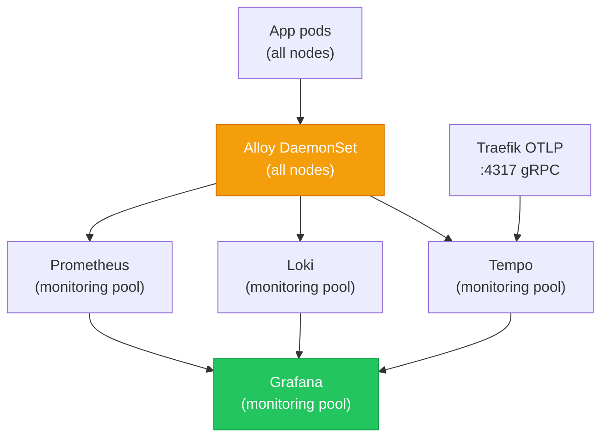

# Observability Stack

The LGTM stack (Loki, Grafana, Tempo, Mimir/Prometheus) plus Grafana Alloy as the collector agent. All stateful components run on the dedicated **monitoring pool** (tainted `dedicated=monitoring:NoSchedule`); Alloy runs as a DaemonSet on every node.

## Component Topology

| Component | Role | Node pool |
|---|---|---|
| Prometheus | Metrics collection and alerting | monitoring |
| Loki | Log aggregation | monitoring |
| Tempo | Distributed trace storage | monitoring |
| Grafana | Dashboards, alerting UI, datasource router | monitoring |
| Alloy | Collector agent — scrapes metrics, ships logs and traces | DaemonSet (all nodes) |
| Cluster Autoscaler | Scale-out decisions based on pending pods | monitoring |

## Alloy — Collector Agent

Grafana Alloy runs as a DaemonSet on every node (general and monitoring pools). It:

- Scrapes Prometheus metrics from pods via annotations
- Ships container logs to Loki
- Forwards OTLP traces to Tempo

Having a collector on each node avoids cross-node scraping and removes the need for remote-write aggregation at small cluster scale.

## Traefik → Tempo Tracing

[[Traefik]] ships OTLP traces over gRPC to `tempo.monitoring.svc.cluster.local:4317` (insecure — in-cluster only). This connects ingress-level request spans with downstream application spans in Grafana Explore.

## Monitoring Pool Isolation

The monitoring pool is tainted `dedicated=monitoring:NoSchedule`. Workload pods (Next.js, API services) do not tolerate this taint — they cannot land on the monitoring pool. Conversely, observability pods use `nodeSelector: node-pool=monitoring` to ensure they don't consume general pool resources.

The Cluster Autoscaler pod also runs on the monitoring pool. CA scale-write IAM permissions (`SetDesiredCapacity`, `TerminateInstanceInAutoScalingGroup`) are scoped to the monitoring pool role only — see [[self-hosted-kubernetes]] for the IAM split rationale.

## Persistent Storage

Prometheus TSDB, Loki chunk storage, and Tempo trace data use EBS-backed PersistentVolumes with:

- **`WaitForFirstConsumer`** binding — EBS volume created in the same AZ as the scheduled pod
- **`Retain`** reclaim policy — PVs survive ArgoCD prune operations; monitoring data is not destroyed by a chart update

When the monitoring node is replaced by the ASG, the worker bootstrap step 4 (`step_clean_stale_pvs`) cleans up PVs whose `nodeAffinity` references the dead hostname. ArgoCD recreates the PVCs on the next sync cycle.

## Monitoring Access — Direct via Traefik

Monitoring services (Grafana, Prometheus) are **not** fronted by CloudFront. They are exposed via [[traefik]] `IngressRoute` directly on `nelsonlamounier.com` subdomains. This means:

- End-users see Traefik's `ops-tls-cert` (cert-manager DNS-01) for monitoring routes
- An IP allowlist middleware (created in step 7b of [[argocd]] bootstrap) restricts access to operator IPs only

## Alerting Integration

Prometheus alerts route to the SNS monitoring topic (created per monitoring pool by `worker-asg-stack.ts`). The SNS topic ARN is injected into Helm parameters during [[argocd]] bootstrap. The [[self-healing-agent]] also publishes to this same topic after autonomous remediation attempts.

## FinOps Observability

The `admin-api` provides three CloudWatch-backed FinOps routes:

| Route | Namespace | Tracks |
|---|---|---|
| `/finops/realtime` | `BedrockMultiAgent` | Article pipeline token usage |
| `/finops/chatbot` | `BedrockChatbot` | Chatbot query token usage |
| `/finops/self-healing` | `self-healing-development/SelfHealing` | Self-healing agent token cost per event |

See [[hono]] for implementation details.

## Related Pages

- [[self-healing-agent]] — reacts to CloudWatch alarms from this stack
- [[traefik]] — ships OTLP traces; exposes monitoring services via IngressRoute
- [[self-hosted-kubernetes]] — monitoring pool node design and PV cleanup
- [[argocd]] — manages the observability Helm releases
- [[hono]] — admin-api FinOps routes querying CloudWatch
- [[disaster-recovery]] — monitoring PV backup behaviour on node replacement
