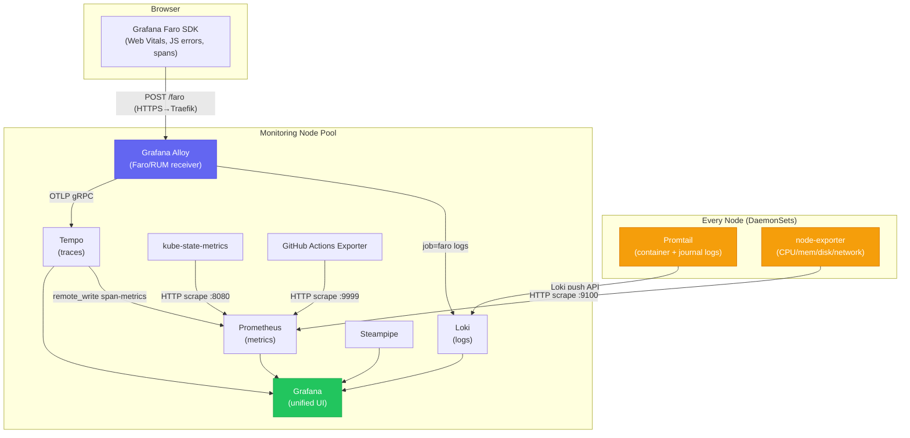
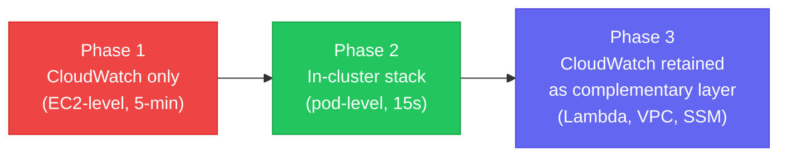

# Observability Stack

The full monitoring stack for the [[k8s-bootstrap-pipeline]] cluster — Prometheus, Loki, Tempo, and Grafana (LGTM), plus a collection of exporters and collectors. All stateful components run on the dedicated **monitoring pool** (tainted `dedicated=monitoring:NoSchedule`). Two DaemonSets run on every node: Promtail (log shipping) and node-exporter (host metrics).

## Component Topology



| Component | Role | Kind | Runs on |
|---|---|---|---|
| Prometheus | Scrapes and stores time-series metrics | Deployment (1 replica) | Monitoring pool |
| Loki | Stores and indexes log streams | Deployment (1 replica) | Monitoring pool |
| Tempo | Receives, stores, queries distributed traces; derives span-metrics | Deployment (1 replica) | Monitoring pool |
| Grafana | Unified UI — PromQL, LogQL, TraceQL, SQL | Deployment (1 replica) | Monitoring pool |
| Grafana Alloy | Receives Faro SDK RUM telemetry from browsers; fan-outs to Loki + Tempo | Deployment (1 replica) | Monitoring pool |
| Promtail | Tails pod logs + systemd journal → Loki | **DaemonSet (all nodes)** | All nodes |
| node-exporter | Host-level OS/hardware metrics via `/proc` + `/sys` | **DaemonSet (all nodes)** | All nodes (incl. control-plane) |
| kube-state-metrics | K8s object state (pod phases, restarts, replica counts) | Deployment (1 replica) | Monitoring pool |
| Steampipe | Live AWS inventory via SQL PostgreSQL FDW | Deployment (1 replica) | Monitoring pool |
| GitHub Actions Exporter | CI/CD workflow metrics from GitHub API | Deployment (1 replica) | Monitoring pool |
| Cluster Autoscaler | Scale-out decisions based on pending pods | Deployment (1 replica) | Monitoring pool |

---

## Monitoring Chart Structure

The monitoring stack is a single Helm chart (`platform/charts/monitoring/`) with service-isolated subdirectories — same principle as workload charts but applied to infrastructure components:

```
chart/templates/
├── _helpers.tpl
├── network-policy.yaml
├── resource-quota.yaml
├── alloy/                       # Faro/RUM receiver
├── github-actions-exporter/     # CI/CD metrics
├── grafana/                     # 8 files: deployment, alerting, dashboards, ingress
├── kube-state-metrics/          # Cluster object state
├── loki/                        # Log store
├── node-exporter/               # Host metrics DaemonSet
├── prometheus/                  # Metrics engine + RBAC
├── promtail/                    # Log shipper DaemonSet
├── steampipe/                   # Cloud inventory SQL
├── tempo/                       # Distributed traces
└── traefik/                     # Monitoring IngressRoutes
```

Environment-specific overrides in `values-development.yaml` reduce resource limits, PVC sizes, and retention periods.

---

## Two-Phase Deployment Model

The monitoring stack cannot be deployed purely by ArgoCD because it needs secrets injected first.

**Phase 1 — Secret Seeding (SSM Automation → `deploy.py`)**

The `monitoring/deploy.py` script runs on the control-plane via the SSM pipeline during bootstrap. It:
1. Reads secrets from SSM Parameter Store
2. Creates Kubernetes `Secret` objects in the `monitoring` namespace:
   - `grafana-credentials` — Grafana admin user/password
   - `github-actions-exporter-credentials` — GitHub API token, webhook token, org
   - `prometheus-basic-auth-secret` — Traefik BasicAuth hash

**Phase 2 — Helm Deployment (ArgoCD)**

ArgoCD deploys the `monitoring` Helm chart. The chart consumes the pre-created Secrets via `secretKeyRef` references. Secrets never appear in a Git commit.

> The pattern — secrets seeded by deploy.py, Helm chart consumes them via references — is the same approach used for `nextjs` and `argocd` namespaces. **Git contains configuration structure. SSM contains secrets. Kubernetes Secrets are the runtime bridge.**

---

## Prometheus — Scrape Jobs

Prometheus uses a **pull model** — it actively scrapes HTTP endpoints every 15 seconds. A target that goes down is immediately detected (the `up` metric drops to 0). A push model would silently stop receiving data.

Key startup flags:
- `--web.external-url=/prometheus` — moves all endpoints under `/prometheus/` prefix (affects every URL reference — see [[prometheus-scrape-targets]])
- `--web.enable-remote-write-receiver` — allows Tempo's `metrics_generator` to push span-derived metrics
- `--enable-feature=exemplar-storage,native-histograms` — enables trace exemplar links from metric data points

### Complete Scrape Job Inventory (12 jobs)

| Job | Discovery | Target | What it measures |
|---|---|---|---|
| `prometheus` | Static | `localhost:9090/prometheus/metrics` | TSDB health, scrape duration |
| `kubernetes-nodes` | Node SD | `<nodeIP>:10250` (kubelet) | Kubelet metrics, node summary |
| `kubernetes-cadvisor` | Node SD | `<nodeIP>:10250/metrics/cadvisor` | Per-container CPU/mem/network |
| `kubernetes-service-endpoints` | Endpoints SD | Annotated services | Any service with `prometheus.io/scrape: "true"` |
| `node-exporter` | Endpoints SD | `<nodeIP>:9100` (hostPort) | Host CPU/mem/disk/network |
| `kube-state-metrics` | Static | `kube-state-metrics.monitoring:8080` | K8s object state (desired vs actual) |
| `grafana` | Static | `grafana.monitoring:3000/grafana/metrics` | Grafana query engine health |
| `loki` | Static | `loki.monitoring:3100` | Ingest health, query performance |
| `tempo` | Static | `tempo.monitoring:3200` | Trace ingestion, block compaction |
| `github-actions-exporter` | Static | `github-actions-exporter.monitoring:9999` | CI/CD workflow metrics |
| `traefik` | Pod SD | `traefik-metrics.kube-system:9100` | Ingress error rate, latency by backend |
| `nextjs-app` | Static DNS | `nextjs.nextjs-app.svc:3000/api/metrics` | Application request rate, latency, heap |
| `alloy` | Static | `alloy.monitoring:12345` | Faro receiver throughput |

> **Port collision:** Traefik metrics default to port `9100` — same as node-exporter. In `values-development.yaml`, node-exporter is overridden to port `9101` to avoid metric cross-contamination. The base `values.yaml` still lists both at `9100`.

**Why `nextjs-app` uses static DNS (not pod SD):** A static Service DNS load-balances across all replicas automatically. Pod-level SD would produce per-pod metrics requiring aggregation in every query.

**`kubernetes-service-endpoints` — annotation-driven opt-in:** Any Service that adds `prometheus.io/scrape: "true"` is auto-discovered. No chart change needed. Supports `prometheus.io/port`, `prometheus.io/path`, and `prometheus.io/scheme` annotations. See [[prometheus-scrape-targets]] for the relabel bug history on this job.

> The Blue/Green comparison also uses a separate `nextjs-app-preview` scrape job (targeting the preview Service) during rollouts. See [[argo-rollouts]].

### Prometheus RBAC

Prometheus needs cluster-wide read access for service discovery:
```yaml
rules:
  - apiGroups: [""]
    resources: [nodes, nodes/proxy, nodes/metrics, services, endpoints, pods]
    verbs: [get, list, watch]
  - nonResourceURLs: [/metrics, /metrics/cadvisor]
    verbs: [get]
```

Without `nodes/proxy`, cAdvisor metrics are unreachable. Without `pods`, Kubernetes SD cannot list scrape targets.

---

## Promtail — Log Shipping DaemonSet

[[Promtail]] runs on every node and ships logs to Loki. Two scrape jobs:

1. **`kubernetes-pods`** — Tails `/var/log/pods/<uid>/<container>/*.log` for every pod. Applies CRI parsing and relabels each log line with `namespace`, `pod`, `container`, `app`.

2. **`journal`** — Reads from `/var/log/journal` (systemd). Captures kubelet, containerd, and kernel logs labelled `job="systemd-journal"`. Essential for diagnosing failures that occur before pods start.

See [[promtail]] for full configuration detail.

**Loki configuration highlights:**
- `schema: v13 / store: tsdb` — most recent and efficient schema
- `auth_enabled: false` — single-tenant mode; any pod in the namespace can push logs to Loki with arbitrary labels (acceptable for a single-cluster deployment)
- `reject_old_samples_max_age: 168h` — rejects logs older than 7 days; prevents accidental mass-ingest of historical data
- `ingestion_rate_mb: 10` / `ingestion_burst_size_mb: 20` — rate limits to prevent log storms from exhausting memory
- `max_streams_per_user: 10000` — cardinality cap to prevent label explosion
- `retention_enabled: true` with `retention_delete_delay: 2h` — TTL-based log deletion

---

## Grafana Alloy — RUM / Faro Collector

Alloy is **not** a log shipper or metrics collector — that role belongs to Promtail and node-exporter. Alloy is a **single-pod Deployment** that acts as a protocol translator for browser-side telemetry.

The Next.js application embeds the **Grafana Faro SDK** which collects:
- Core Web Vitals (LCP, INP, CLS, FCP, TTFB)
- JavaScript exceptions
- User session spans

The browser POSTs this data to `https://ops.nelsonlamounier.com/faro/api/v1/push` → NLB → Traefik → `alloy.monitoring:12347`. The Faro IngressRoute uses a `StripPrefix` middleware to strip the `/faro` prefix before the request reaches the Alloy receiver. Alloy splits the payload by signal type and fans out:
- **Measurements/errors → Loki** (labelled `job="faro"`)
- **Spans → Tempo** (via OTLP gRPC)

**CORS:** Alloy is configured with `cors_allowed_origins = ["*"]` — open for development. In production this should be restricted to the actual domain(s) to prevent third-party telemetry abuse.

**Why RUM matters for SEO:** Core Web Vitals (LCP, INP, CLS) are the same metrics Google uses to grade sites for organic search ranking. The `rum.json` dashboard is as much an SEO tool as a performance tool.

The `rum.json` dashboard queries Loki with LogQL `unwrap` expressions to extract Core Web Vitals numeric values:
```logql
avg_over_time(
  {job="faro"} | logfmt | kind="measurement" | type="web-vitals"
  | lcp!="" | unwrap lcp [5m]
)
```

**Core Web Vitals panels:**

| Web Vital | Meaning | Good threshold |
|---|---|---|
| LCP | Largest Contentful Paint — perceived load speed | < 2.5s |
| INP | Interaction to Next Paint — responsiveness | < 200ms |
| CLS | Cumulative Layout Shift — visual stability | < 0.1 |
| FCP | First Contentful Paint — server response speed | < 1.8s |
| TTFB | Time to First Byte — network + server latency | < 800ms |

**Client-Side Exception panels:**
- **JS Errors (1h)** — total count over last hour
- **Error Rate Over Time** — timeline; useful for detecting deployment-triggered spikes
- **Recent JS Errors** — live table of browser stack traces + source URLs
- **Errors by Type** — distribution of `ReferenceError` vs `SyntaxError` vs `Error`

**Faro Collector Health panels:**
- **Alloy Status** — up/down indicator for the Faro receiver pipeline
- **Alloy Memory (RSS)** — RAM usage of the Alloy container; OOM risk if unchecked under high traffic
- **Faro Receiver Throughput: Accepted vs Dropped/s** — if Dropped spikes consistently, rate limits are being exceeded or a frontend bug is spamming the pipeline

---

## Tempo — Distributed Tracing + Span Metrics

Tempo receives OTLP spans via gRPC (port 4317) and HTTP (port 4318). Storage: local EBS PVC with **72-hour block retention**. Key config limits:
- `max_bytes_per_trace: 5MB` — caps memory spikes from chatty services
- `max_live_traces: 2000` — monitor via `tempo_metrics_generator_live_traces` metric
- No `search` block configured — TraceQL queries work by trace ID; full-text trace search is not enabled
- Local storage only — traces are lost if the monitoring node is Spot-reclaimed (known limitation; see [[#known-limitations]])

### metrics_generator — DynamoDB Observability Without CloudWatch

The `metrics_generator` is the architectural keystone for DynamoDB observability. The Next.js app instruments DynamoDB calls with OpenTelemetry. Each `GetItem`/`PutItem`/`Query` becomes a span. Tempo ingests these and derives metrics:

```yaml
metrics_generator:
  processor:
    service_graphs:
      dimensions: [http.method, http.status_code]
    span_metrics:
      dimensions: [service.name, http.method, http.status_code]
  storage:
    remote_write:
      - url: http://prometheus.monitoring.svc.cluster.local:9090/prometheus/api/v1/write
        send_exemplars: true
```

Generated metrics written to Prometheus:
- `traces_spanmetrics_calls_total{span_name, service_name, status_code}` — operation call rate
- `traces_spanmetrics_latency_bucket{span_name, service_name, le}` — latency histograms
- `traces_service_graph_request_total{client, server}` — service topology
- `traces_service_graph_request_failed_total{client, server}` — failed inter-service calls

**Why this matters:** Full DynamoDB RED metrics (error rate, P95 latency, operation-level breakdown) with:
- Zero CloudWatch API calls
- Zero IAM permissions from within the cluster
- Every metric data point linked to a specific trace via exemplars (`send_exemplars: true` + `--enable-feature=exemplar-storage`)

---

## Grafana — Visualization Layer

### Datasource Provisioning

All datasources are provisioned via the `grafana-datasources` ConfigMap — no manual UI configuration. Survives pod restarts.

| Datasource | UID | URL | Purpose |
|---|---|---|---|
| Prometheus | `prometheus` | `...:9090/prometheus` | PromQL metric queries |
| Loki | `loki` | `...:3100` | LogQL log queries |
| Tempo | `tempo` | `...:3200` | TraceQL + Trace Explorer |
| CloudWatch | `cloudwatch` | IAM role (no URL) | Lambda/VPC/EC2 logs (eu-west-1) |
| CloudWatch Edge | `cloudwatch-edge` | IAM role | CloudFront Lambda logs (us-east-1) |
| Steampipe | `steampipe` | `steampipe.monitoring:9193` | Cloud inventory SQL |

### Traces ↔ Logs Correlation

**Loki → Tempo:** The Loki datasource has `derivedFields` with regex `"traceID":"(\w+)"`. When a log line contains a traceID, Grafana adds a clickable link to Tempo. No manual trace ID copying.

**Tempo → Loki:** The Tempo datasource has `tracesToLogs` configured. Clicking "see logs for this span" auto-constructs a LogQL query filtered by TraceID, filtered to the relevant pod via `service.name` → `service` label mapping.

### Dashboard GitOps Pattern

Dashboard JSON files live in `platform/charts/monitoring/chart/dashboards/*.json`. The Helm template auto-generates one ConfigMap per dashboard using `Files.Glob`:

```yaml
{{- range $path, $_ := .Files.Glob "dashboards/*.json" }}
---
kind: ConfigMap
metadata:
  name: grafana-dashboards-{{ trimSuffix ".json" (base $path) }}
```

ConfigMaps mount as a `projected` volume. Grafana auto-reloads every 60 seconds (`updateIntervalSeconds: 60`). **Pipeline: Git commit → ArgoCD sync → ConfigMap update → Grafana hot-reloads in ~60s.** No manual import ever needed.

### Dashboard Inventory (13 dashboards)

| File | Data source(s) | What it shows |
|---|---|---|
| `cluster.json` | Prometheus | Node status, CPU/memory/disk/network, pod phases |
| `nextjs.json` | Prometheus | Replica health, CPU/mem, restart rate |
| `frontend.json` | Prometheus (Traefik) | Request rate, P95 latency, HTTP status breakdown |
| `tracing.json` | Prometheus (span-metrics) + Tempo + CloudWatch | DynamoDB RED, service graph, TraceQL explorer |
| `rum.json` | Loki (Faro) | Core Web Vitals, JS errors, Faro Collector Health |
| `monitoring-health.json` | Prometheus | Scrape targets up/down, TSDB size, query duration |
| `finops.json` | Prometheus (kube-state-metrics) | Estimated hourly/monthly cost, namespace efficiency |
| `cicd.json` | Prometheus (GitHub Actions Exporter) | Workflow run counts, success/failure, job duration |
| `cloud-inventory.json` | Steampipe (PostgreSQL) | EBS, SGs, EC2, S3, Route 53 |
| `cloudwatch.json` | CloudWatch (eu-west-1) | Lambda, SSM automation, VPC flow logs |
| `cloudwatch-edge.json` | CloudWatch (us-east-1) | CloudFront Lambda@Edge logs |
| `auto-bootstrap.json` | CloudWatch + Loki | Step Functions, Router Lambda, SSM, CA re-join |
| `self-healing.json` | Loki | Self-healing agent execution logs, tool use, token cost |

### Grafana Alerting

All alerting rules, contact points, and routing are defined in the `grafana-alerting` ConfigMap — versioned in Git, survive pod restarts.

**Contact point:** AWS SNS topic (ARN injected at Helm deploy time from `values.yaml`). Fans out to email/Slack/Lambda from a single topic.

**Alert groups:**

| Group | Alert | Condition |
|---|---|---|
| Cluster Health | Node Down | `up{job="node-exporter"} < 1` for 2m |
| Cluster Health | High Node CPU | avg CPU > 85% for 5m |
| Cluster Health | Pod CrashLooping | > 3 restarts in 15m (immediate) |
| Application Health | High Error Rate | > 5% 5xx errors for 5m |
| Application Health | High P95 Latency | P95 > 2s for 5m |
| Storage Health | Disk Space Low | > 80% usage for 5m |
| Storage Health | Disk Space Critical | > 90% usage for 2m |
| DynamoDB & Tracing | DynamoDB Error Rate | > 5% from span-metrics for 5m |
| DynamoDB & Tracing | **Span Ingestion Stopped** | `rate(traces_spanmetrics_calls_total[5m]) < 0.001` for 10m |

The **Span Ingestion Stopped** alert guards against the silent failure mode where everything looks fine in metrics but traces have stopped flowing (OTel SDK crash, network partition, Tempo restart).

**Known alerting gaps:**
- `for: 0s` on Pod CrashLooping — fires immediately on first detection; may produce noise during normal rollouts; `for: 1m` would reduce false positives
- No inhibition rules — if Node Down fires, all pod-level alerts on that node also fire independently (alert storm)
- `repeat_interval: 4h` may be too infrequent for critical alerts
- No Grafana health alert — if Grafana itself goes down, there is no external check to fire

All alerting configuration is in the `grafana-alerting` ConfigMap and is GitOps-managed — changes require a Git commit + ArgoCD sync.

---

## Infrastructure Exporters

### node-exporter

DaemonSet with `hostNetwork: true` and `hostPID: true`. Mounts `/proc`, `/sys`, `/` from the host. Exposes 1000+ metrics: CPU modes, memory breakdown (available/buffers/cache), disk I/O per block device, filesystem usage, network I/O per interface.

Has `NoSchedule` toleration for `node-role.kubernetes.io/control-plane` — ensures control-plane metrics (etcd, API server, scheduler) are also collected.

### kube-state-metrics

Translates Kubernetes API object state into metrics. Key flag: `--metric-labels-allowlist=nodes=[workload]` — exposes the `workload` node label as a metric dimension. The FinOps dashboard uses this for real-time cost estimation:

```promql
count(kube_node_labels{label_workload=~"control-plane|monitoring"}) * 0.0456
+
count(kube_node_labels{label_workload=~"frontend|argocd"}) * 0.0228
```

This gives estimated hourly cost using known EC2 instance pricing — no Cost Explorer API calls required.

---

## ResourceQuota

The `monitoring` namespace is budget-constrained:

```yaml
requests.cpu: "1500m"   limits.cpu: "3"
requests.memory: 2Gi    limits.memory: 4Gi
persistentvolumeclaims: "6"
```

Actual sum across all 11 monitoring services: ~850m CPU, ~1.5Gi memory — comfortably within the 1500m / 2Gi request budget on the monitoring `t3.small` (2 vCPU, 2Gi RAM in dev configuration). The 6 PVC slots cover Prometheus, Grafana, Loki, Tempo (4 EBS volumes) plus 2 spare.

---

## Known Limitations

| Limitation | Severity | Notes |
|---|---|---|
| **Single-AZ placement** | Medium | Monitoring ASG is pinned to `eu-west-1a`. An AZ-level outage takes the entire monitoring stack offline. Acceptable for development; should be documented as an ADR for production. |
| **No Spot interruption handler** | Medium | No ASG lifecycle hook + `kubectl drain` before termination. If the monitoring node is Spot-reclaimed, in-flight traces and recent metrics may be lost. A `PreTerminate` lifecycle hook triggering graceful drain would mitigate this. |
| **Tempo local storage** | Low | Traces are on a local EBS PVC, not object storage (S3/GCS). A Spot reclamation that destroys the EBS volume loses all trace history. Mitigated by 72h retention (short window) and PVC Retain policy. |
| **Open Faro CORS** | Low | `cors_allowed_origins = ["*"]` — acceptable in development; restrict to `*.nelsonlamounier.com` before production promotion. |
| **Steampipe password in values.yaml** | Low | `databasePassword: steampipe` is committed in plaintext. While Steampipe is read-only, best practice is to move this to a Kubernetes Secret. |

---

## Monitoring Pool Isolation

The monitoring pool is tainted `dedicated=monitoring:NoSchedule`. Workload pods (Next.js, API services) do not tolerate this taint and cannot land on the monitoring pool. Observability pods use `nodeSelector: node-pool=monitoring` to avoid consuming general pool resources.

Node isolation also means: a failing application on the general pool cannot evict monitoring pods, and monitoring resource pressure doesn't affect application availability.

The Cluster Autoscaler also runs on the monitoring pool. CA scale-write IAM permissions (`SetDesiredCapacity`, `TerminateInstanceInAutoScalingGroup`) are scoped to the monitoring pool role only — see [[self-hosted-kubernetes]] for the IAM split rationale.

---

## Persistent Storage

All four stateful monitoring components use the [[aws-ebs-csi|`ebs-sc` StorageClass]] (GP3, encrypted):

| Workload | PVC Size (dev) | Update Strategy |
|---|---|---|
| Prometheus | 10 Gi | `Recreate` |
| Grafana | 10 Gi | `Recreate` |
| Loki | 10 Gi | `Recreate` |
| Tempo | 10 Gi | `Recreate` |

- **`WaitForFirstConsumer`** — EBS volume created in the same AZ as the scheduled pod; prevents cross-AZ attachment failures
- **`Retain` reclaim policy** — PVs survive ArgoCD prune operations; monitoring data is not destroyed by chart updates
- **`Recreate` update strategy** — prevents RWO deadlock; only one pod can hold a `ReadWriteOnce` volume at a time. Grafana specifically requires this because its SQLite database cannot be opened by two pods simultaneously

When the monitoring node is replaced by the ASG, `step_clean_stale_pvs` (worker bootstrap step 4) cleans up PVs whose `nodeAffinity` references the dead hostname. ArgoCD recreates them on the next sync.

> **Migration note (2026-03-31):** Migrated from `local-path` StorageClass to `ebs-sc`. `local-path` bound volumes to a specific node's local disk — every Spot interruption caused permanent data loss and pod deadlocks. See [[aws-ebs-csi]] for the full migration context.

---

## Security Hardening

**IPAllowList middleware** — `admin-ip-allowlist` restricts access to `/grafana`, `/prometheus`, and `/argocd` to operator IPs only. IPs are sourced from SSM params (`monitoring/allow-ipv4` / `monitoring/allow-ipv6`), populated by CI/CD from GitHub Environment secrets `ALLOW_IPV4` / `ALLOW_IPV6`.

**Prometheus BasicAuth** — additional Traefik `BasicAuth` middleware backed by `prometheus-basic-auth-secret` (seeded by `deploy.py` from SSM). Two-factor access control without requiring an identity provider.

**Non-root containers** — all monitoring components run with `runAsNonRoot: true`: Grafana as user `472`, Prometheus and kube-state-metrics as user `65534` (nobody).

---

## Monitoring Access — Direct via Traefik

Monitoring services are **not** fronted by CloudFront. They are exposed via [[traefik]] `IngressRoute` directly on `nelsonlamounier.com` subdomains, restricted by the IPAllowList middleware.

---

## CloudWatch Evolution Story

The cluster moved through three phases:



**Phase 1:** CloudWatch was the interim solution before the in-cluster stack was operational. EC2-level metrics only, 5-minute granularity, no pod visibility, no log aggregation within Grafana.

**Phase 2:** Once ArgoCD deploys the monitoring Helm chart, the observability shifts to Prometheus/Grafana for all in-cluster signals.

**Phase 3:** CloudWatch is actively used for resources that live outside the cluster — Lambda functions (SSM Automation handlers, CloudFront functions), VPC Flow Logs, EC2 Systems Manager logs. These are rendered inside Grafana via the provisioned CloudWatch datasource (`cloudwatch` uid for eu-west-1, `cloudwatch-edge` uid for us-east-1). **All signals — in-cluster PromQL and AWS-managed CloudWatch — appear in the same Grafana instance.**

---

## FinOps Observability

The `admin-api` provides three CloudWatch-backed FinOps routes:

| Route | Namespace | Tracks |
|---|---|---|
| `/finops/realtime` | `BedrockMultiAgent` | Article pipeline token usage |
| `/finops/chatbot` | `BedrockChatbot` | Chatbot query token usage |
| `/finops/self-healing` | `self-healing-development/SelfHealing` | Self-healing agent token cost per event |

See [[hono]] for implementation details.

---

## Related Pages

- [[promtail]] — DaemonSet log shipper; kubernetes-pods + journal scrape jobs
- [[aws-ebs-csi]] — storage driver; `ebs-sc` StorageClass; migration from local-path
- [[steampipe]] — cloud inventory SQL tool; Grafana datasource; debugging workflow
- [[self-healing-agent]] — reacts to CloudWatch alarms from this stack; publishes to SNS
- [[traefik]] — ships OTLP traces; exposes monitoring services via IngressRoute
- [[self-hosted-kubernetes]] — monitoring pool node design and PV cleanup
- [[argocd]] — manages the observability Helm releases (EBS CSI at Sync Wave 4)
- [[hono]] — admin-api FinOps routes querying CloudWatch
- [[disaster-recovery]] — monitoring PV backup behaviour on node replacement
- [[argo-rollouts]] — uses `nextjs-app-preview` scrape job for Blue/Green analysis
- [[prometheus-scrape-targets]] — troubleshooting guide: 6 real issues, sub-path prefix table
