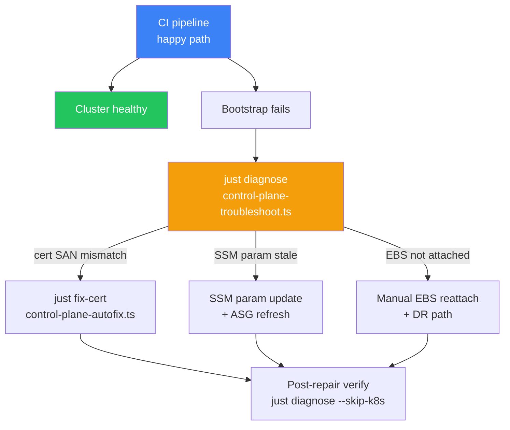
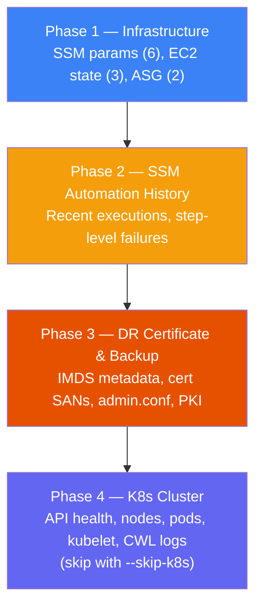
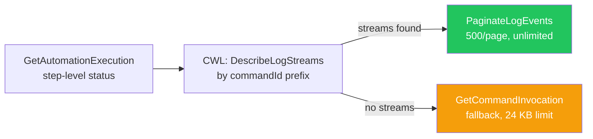

# Operational Scripts & Diagnostic Tooling

The `scripts/` directory is the **operational backbone** of the [[k8s-bootstrap-pipeline]] — the tooling that exists for the gap between CI automation and incident response. When `kubectl get nodes` returns unexpected state at 2 AM, these scripts provide a single entry point, contextual diagnostics, and automated repair for well-understood failure modes.

## The Core Problem

CI/CD automates the happy path. Scripts handle everything else:



Three failure modes are unique to this architecture's ASG-managed Kubernetes control plane:
1. **SSM Parameter staleness** — `instance-id` still references the old terminated EC2 instance
2. **EBS misattachment** — etcd data volume not re-attached to the new instance
3. **Certificate SAN mismatch** — API server cert has SANs for old IPs; new instance IP is rejected by kubelet TLS verification

See [[control-plane-cert-san-mismatch]] for the cert SAN failure mode in detail.

---

## Shared Library (`scripts/lib/`)

All 11 TypeScript scripts share two library files that eliminate ~120 lines of boilerplate duplication.

### `logger.ts` — Structured Console Output

Semantic log functions with ANSI colour codes:

```typescript
log.header('Control Plane Troubleshooter');     // Large visual separator
log.step(1, 4, 'Inspecting SSM parameters...'); // Numbered progress
log.success('All 6 SSM parameters found');      // Green ✓
log.warn('Certificate SAN mismatch detected');  // Yellow ⚠
log.fatal('Cannot proceed — instanceId missing'); // Red, process.exit(1)
log.config('Config', { Region: 'eu-west-1' });  // Config table
log.summary('Done', { Checks: '25', Failed: '2' }); // Summary table
log.nextSteps(['Fix cert: just fix-cert']);      // Actionable next steps
```

**File-based logging via monkey-patching**: `startFileLogging('ssm-automation')` intercepts `console.log`, `console.warn`, `console.error` and writes all output to a timestamped file in `.troubleshoot-logs/`. The monkey-patch approach (vs a wrapper) captures output from AWS SDK internals and any nested calls — nothing escapes to the terminal without also going to the file.

```
scripts/local/diagnostics/.troubleshoot-logs/ssm-automation-2026-04-14T15:32:00.log
```

**Why timestamped files?** Enables `diff`-ing output between two diagnostic runs after an ASG replacement cycle — exactly the workflow for "what changed between yesterday's healthy state and today's failure?"

### `aws-helpers.ts` — Auth & Config Abstraction

**`resolveAuth()`** — seamless OIDC/profile switching:

```typescript
export function resolveAuth(profile: string | undefined): AuthResult {
    const isCI = Boolean(process.env['GITHUB_ACTIONS']);

    if (isCI)    return { mode: 'OIDC',         credentials: undefined };  // ambient
    if (profile) return { mode: `profile:${profile}`, credentials: fromIni({ profile }) };
    return       { mode: 'default-chain',        credentials: undefined };
}
```

Zero `if (GITHUB_ACTIONS)` branches in application code — auth logic is a single concern. CI runners pick up ambient OIDC credentials; local developers use named profiles; both paths produce the same `credentials` field consumed by all SDK clients.

**`parseArgs()`** — custom CLI parser, zero extra dependencies:

```typescript
const args = parseArgs([
    { name: 'profile', description: 'AWS CLI profile', hasValue: true },
    { name: 'region',  description: 'AWS region',      hasValue: true, default: 'eu-west-1' },
    { name: 'fix',     description: 'Attempt auto-repair', hasValue: false, default: false },
], 'Control Plane Troubleshooter');
```

Every script is self-documenting via `--help`. The custom parser keeps the scripts dependency-free and ensures identical `--help` output format across all 11 scripts.

**`buildAwsConfig()`** composes both into a single SDK config object — all AWS clients in a script are created from three lines.

---

## `control-plane-troubleshoot.ts` — The Flagship Diagnostic

**1,737 lines** | `just diagnose` | ~90s → structured verdict

Designed for the primary failure mode: **ASG instance replacement**. Without this script, diagnosing post-replacement failures requires manually navigating EC2 + SSM + CloudWatch across ~20 minutes. With it: `just diagnose` → 90 seconds.

### Four-Phase Architecture



**Remote shell via SSM**: Phases 3 and 4 execute shell commands on the instance via `AWS-RunShellScript` — no bastion, no SSH, no public IP required. Output is captured via `GetCommandInvocation`.

**Named markers protocol**: The shell script injects structured markers into its output:
```bash
echo "META_PRIVATE_IP=$(curl -s ...imds.../local-ipv4)"
echo "CERT_EXISTS=$(test -f /etc/kubernetes/pki/apiserver.crt && echo yes || echo no)"
echo "=== DR_STATE ==="
```
The TypeScript parser extracts named values from the response. Remote shell and local TypeScript share an implicit protocol — this is the alternative to a full RPC layer when SSM Run Command is the transport.

**Severity tiers**: `CheckResult` objects carry `severity: 'critical' | 'warning' | 'info'`. The final summary groups by severity — operators focus on critical failures; informational items don't obscure the root cause.

**Flags**:
- `--fix` — triggers automatic cert regeneration via `control-plane-autofix.ts` when SAN mismatch detected
- `--skip-k8s` — skips Phase 4; avoids 12 min of 120s timeouts if the API server is completely broken

**Example output**:
```
── Phase 1: Infrastructure ──────────────────────
✓  SSM: /k8s/development/instance-id    → i-0abc1234567
✗  DR: Certificate SANs  [CRITICAL]
     ⚠ MISMATCH: Cert SANs [10.0.1.40, 54.12.x.x] do NOT include IP 10.0.1.52

Root Cause: Certificate SAN mismatch
  The API server cert was restored from backup with old IPs.
  Current instance IP 10.0.1.52 is NOT in the cert SANs.
Next Steps:
  1) just fix-cert        (regenerates cert for new IP)
  2) just diagnose --fix  (automated repair)
```

---

## `ssm-automation.ts` — Execution Inspector

**822 lines** | `just ssm-inspect` | Full unbounded SSM Automation log access

**The problem**: AWS Console truncates SSM Automation step output at 2,500 characters — exactly at the depth where `kubeadm init` failures occur.

**Dual log retrieval**:



**Log group auto-resolution**: infers `/ssm/k8s/{env}/bootstrap` vs `/ssm/k8s/{env}/deploy` from the SSM document name — mirrors the actual log group structure created by the CDK SSM constructs.

---

## `asg-audit.ts` — Infrastructure Coverage Auditor

**449 lines** | `just asg-audit` | Detects monitoring drift

Cross-references **live AWS resources** against **CloudWatch dashboard widget definitions** to find orphans (resources deployed but not monitored).

**Parallel API calls** via `Promise.all()` — 8 API calls simultaneously:
```typescript
const [asgResult, dashboardResult, parameterResult, ebsResult,
       nlbResult, lambdaResult, cloudFrontResult, sfnResult] = await Promise.all([...]);
```
Reduces total latency from ~16s (sequential) to ~2s (parallel).

**Orphan detection**: parses dashboard body JSON for metric dimension values (`AutoScalingGroupName`, `FunctionName`, `DistributionId`) and compares against live resource lists. Output drives the next sprint's monitoring additions.

---

## `control-plane-autofix.ts` — Automated Repair Agent

**30,750 bytes** | `just fix-cert` | Encodes three runbooks as executable automation

| Failure Mode | Automated Steps |
|---|---|
| **Cert SAN mismatch** | Stop kube-apiserver static pod → remove stale certs → `kubeadm init phase certs apiserver --apiserver-cert-extra-sans=<IPs>` → restart kubelet → wait for node Ready |
| **kubeadm-config podSubnet missing** | Regenerate ConfigMap with `podSubnet: 192.168.0.0/16` → `kubectl apply` |
| **Worker not joining** | `kubeadm token create --print-join-command` → publish to SSM → trigger worker bootstrap SSM Automation |

**Safety features**: full Phase 1–3 diagnostic runs before any repair; aborts if instance is unreachable; `--dry-run` flag prints commands without executing; post-repair Phase 4 diagnostic runs automatically to confirm success.

---

## `ebs-lifecycle-audit.ts` — Pre-Deploy Check

**Purpose**: Flags EBS volumes with `DeleteOnTermination: true` on CDK-managed block devices.

**Why this matters**: The etcd data volume must never have `DeleteOnTermination: true` — instance replacement would wipe cluster state. This error is invisible until an ASG replacement incident occurs. Running `just ebs-audit` as a pre-deployment check catches it before it becomes a data-loss event.

---

## `cfn-troubleshoot.ts` — CloudFormation Root Cause Extraction

**Purpose**: Filters the CloudFormation event stream to surface only:
1. The first `CREATE_FAILED` / `UPDATE_FAILED` event (actual root cause)
2. `ROLLBACK_FAILED` events (secondary recovery failures)

Eliminates the ~30 sympathy-rollback events that bury the real failure in the AWS Console view. Invoked automatically by CI on non-zero CDK deployment exit codes.

---

## DynamoDB Migration Scripts

Three scripts for the `start-admin` article management system's data layer:

| Script | Purpose |
|---|---|
| `migrate-articles-to-dynamodb.ts` | 3-phase ETL: extract (JSON → validate schema) → transform (add GSI keys: `gsi1pk=TAG#<tag>`) → load (BatchWriteItem in groups of 25 with exponential backoff) |
| `verify-migration.ts` | Post-migration: item count, spot-check by PK, GSI queries, duplicate PK detection |
| `add-tag-index.ts` | Retroactive backfill: scans table for items missing `gsi1pk`/`gsi1sk`, adds tag GSI entries for pre-existing articles |

**Single-table DynamoDB design**: `pk=ARTICLE#<slug>` for O(1) retrieval, `gsi1pk=TAG#<tag>` with `gsi1sk=<published_at>` for O(log n) tag-filtered listing. No joins, no connection pooling, matches the project's "minimal operational surface area" philosophy.

---

## `kb-drift-check.py` — Documentation Drift Detection

**261 lines, Python 3** | `python3 scripts/kb-drift-check.py --base origin/main`

Maps code file changes to documentation pages via `.kb-map.yml`:

```yaml
mappings:
  - name: "Networking & VPC"
    code_paths:
      - "infra/lib/stacks/networking/**"
    kb_docs:
      - "infrastructure/networking_and_edge.md"
```

When a PR changes `infra/lib/stacks/networking/`, the script emits a warning for `networking_and_edge.md` if that doc wasn't also updated.

**Dual-mode output**:
- **CI**: `::warning file=knowledge-base/{doc}::KB document may be stale.` — appears as GitHub Actions annotation directly in the PR diff view
- **Local**: human-readable list with file names and reasons

**PyYAML-free fallback**: detects `import yaml` availability; falls back to a minimal custom YAML parser — runs in GitHub Actions' default Python environment without a `pip install` step.

**Relevance to this wiki**: This script is the project's own documentation drift detection. The LLM Wiki knowledge base serves a similar function for the portfolio project — the `.kb-map.yml` approach is a simpler, code-anchored alternative to the wiki's source/updated frontmatter tracking.

---

## Cross-Cutting Design Patterns

### Diagnostic-First Principle

```
Read → Analyse → Report → (optionally) Remediate
```

Scripts that can repair (`--fix`) always run the full diagnostic first and abort if the environment is unsafe. No blind repairs.

### Client Factory Pattern

```typescript
function createClients(region, credentials) {
    const config = { region, credentials };
    return {
        ssm: new SSMClient(config),
        ec2: new EC2Client(config),
        asg: new AutoScalingClient(config),
        cw:  new CloudWatchLogsClient(config),
    };
}
```

Single credential/region configuration point — trivially mockable in unit tests. AWS SDK v3 modular packages only (tree-shaking, fully typed responses, Promise-native).

### Pagination via `do...while`

Consistent across all scripts for all paginated AWS APIs:
```typescript
let nextToken: string | undefined;
do {
    const response = await client.send(new Command({ NextToken: nextToken }));
    nextToken = response.NextToken;
    // process response
} while (nextToken);
```

### Emergency Bash Fallback

`diagnostics/ssm-bootstrap-diagnose.sh` predates the TypeScript suite. Runs directly on the control-plane via `bash` — no Node.js required. Used when the TypeScript scripts fail due to a Node.js version mismatch on the CI runner, or when you need a minimal diagnostic with zero setup.

---

## Known Technical Debt

| Issue | Location | Resolution |
|---|---|---|
| `formatDuration()` duplicated | `ssm-automation.ts` + `control-plane-troubleshoot.ts` | Move to `scripts/lib/time.ts` |
| `listParemeters` typo | `asg-audit.ts` line ~580 | Rename to `listParameters` |
| No unit tests for scripts | `scripts/local/` | Add Jest + `@aws-sdk/client-mock` |
| `fix-control-plane-cert.sh` lacks `--dry-run` | Shell script | Add `DRY_RUN=1` env var check |

---

## Related Pages

- [[just]] — task runner implementing the stable CLI interface for all scripts
- [[control-plane-cert-san-mismatch]] — the cert SAN failure mode diagnosed and repaired by this tooling
- [[disaster-recovery]] — the DR path that triggers the cert SAN and kube-proxy failure modes
- [[kube-proxy-missing-after-dr]] — the adjacent DR gap fixed by ensure_kube_proxy guards
- [[ci-cd-pipeline-architecture]] — the 4 touch points where scripts integrate with GitHub Actions pipelines
- [[k8s-bootstrap-pipeline]] — the project this operational tooling supports
- [[aws-ssm]] — the remote execution layer (SSM RunCommand) used by diagnostic scripts
