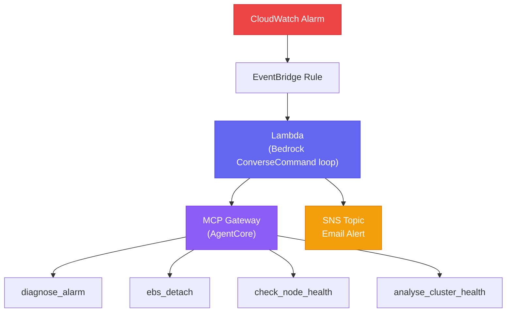

# Self-Healing Agent

An AI-driven remediation pipeline that reacts to Kubernetes cluster alarms and attempts autonomous recovery via a Bedrock-powered tool-calling loop. Sits on top of the [[observability-stack]] and integrates with the [[k8s-bootstrap-pipeline]] infrastructure.

## Remediation Loop

**Trigger:** A CloudWatch Alarm breach fires an EventBridge Rule, which invokes a Lambda function. The Lambda runs a Bedrock `ConverseCommand` loop — iteratively calling tools until the model decides the incident is resolved or escalation is needed.

**MCP Gateway (AgentCore):** The Lambda communicates with an MCP server running as AgentCore. Tool calls are dispatched through the gateway, which provides the model with real-time cluster state.

## Available Tools

| Tool | Purpose |
|---|---|
| `diagnose_alarm` | Reads CloudWatch alarm state, dimensions, and recent metric data |
| `ebs_detach` | Force-detaches a stuck EBS volume from a failed node |
| `check_node_health` | Queries `kubectl get nodes` and inspects node conditions |
| `analyse_cluster_health` | Broad cluster inspection — pod states, events, recent restarts |

## SNS Alert Topic

The monitoring alerts SNS topic is created per monitoring pool by `worker-asg-stack.ts`. Its ARN is:

1. Published to SSM at CDK synth time: `{prefix}/monitoring/alerts-topic-arn-pool`
2. Injected into ArgoCD Helm parameters during `inject_monitoring_helm_params` (step 5b of [[argocd]] bootstrap)
3. Used by the agent Lambda as the escalation endpoint

When the agent cannot resolve an incident autonomously (or completes a remediation), it publishes a structured summary to SNS → email.

## FinOps Observability

The `admin-api` FinOps route queries the `self-healing-development/SelfHealing` CloudWatch namespace for `InputTokens` and `OutputTokens`. This gives operators per-remediation-event token cost visibility from the admin dashboard without additional instrumentation.

See [[hono]] for the admin-api route implementation.

## Design Rationale

**Why Lambda + ConverseCommand loop instead of a Step Functions agent:**
The remediation scenarios are open-ended — the number of tool calls needed is unknown upfront. A `ConverseCommand` loop naturally handles multi-turn reasoning without a fixed state machine graph. Step Functions is used for the deterministic bootstrap pipeline ([[aws-step-functions]]); this agent handles the non-deterministic incident response space.

**Why MCP / AgentCore:**
MCP provides a standard tool protocol so the same tool implementations can be used both by the Lambda agent and tested locally. AgentCore handles session management and tool dispatch without custom routing code in the Lambda.

## Related Pages

- [[observability-stack]] — Prometheus/CloudWatch alarms that trigger this agent
- [[k8s-bootstrap-pipeline]] — infrastructure context
- [[aws-step-functions]] — deterministic orchestration counterpart
- [[hono]] — admin-api FinOps routes surfacing token costs
- [[disaster-recovery]] — what happens when the agent cannot self-heal
