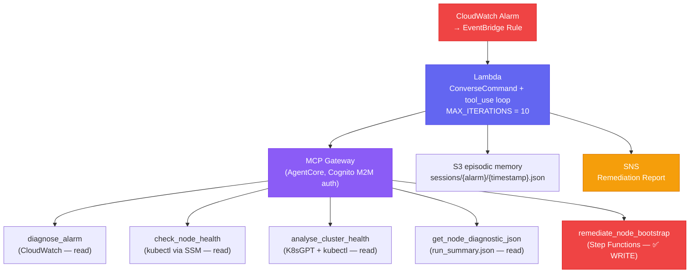

# Self-Healing Agent

A **Reactive Autonomous Agent** — the model receives a CloudWatch alarm event and autonomously decides which MCP tools to call, in what order, and when to stop. Has real write-access tools that can trigger Step Functions on production infrastructure. Sits on top of the [[observability-stack]] and integrates with the [[k8s-bootstrap-pipeline]] infrastructure.

For the LLM system design depth (agentic loop, prompt engineering, reasoning techniques, 15 gaps) see [[ai-engineering/self-healing-agent]].

## Remediation Loop

**Trigger:** CloudWatch Alarm → EventBridge Rule → Lambda. The Lambda runs a `ConverseCommand` loop — iteratively calling tools until the model decides the incident is resolved or escalation is needed.

**MCP Gateway (AgentCore):** Tools are discovered dynamically at invocation time via MCP `tools/list` — adding a new tool to the Gateway requires no Lambda code change. Every Gateway call requires a Cognito M2M JWT (`client_credentials` flow), cached and refreshed 60s before expiry.

## Available Tools

| Tool | Access | Write? |
|---|---|---|
| `diagnose_alarm` | `cloudwatch:DescribeAlarms` + `GetMetricData` | ❌ |
| `check_node_health` | `kubectl get nodes` via SSM SendCommand on control plane | ❌ |
| `analyse_cluster_health` | K8sGPT + kubectl via SSM | ❌ |
| `get_node_diagnostic_json` | `run_summary.json` via SSM | ❌ |
| `remediate_node_bootstrap` | `states:StartExecution` on bootstrap Step Functions | ✅ **WRITE** |

## S3 Episodic Session Memory

The agent stores a session record in S3 after each invocation:
- **Key**: `sessions/{sanitised-alarm-name}/{ISO-timestamp}.json`
- **Contents**: alarm name, tools called, full agent result, dry-run flag
- **Retention**: S3 lifecycle rule (default 30 days)

On next invocation for the same alarm, the previous session is loaded and injected into the prompt: "Previous attempt called these tools. Do NOT repeat the same actions." This prevents remediation loops across separate invocations.

## SNS Alert Topic

The monitoring alerts SNS topic is created per monitoring pool by `worker-asg-stack.ts`. Its ARN is:

1. Published to SSM at CDK synth time: `{prefix}/monitoring/alerts-topic-arn-pool`
2. Injected into ArgoCD Helm parameters during `inject_monitoring_helm_params` (step 5b of [[argocd]] bootstrap)
3. Used by the agent Lambda as the escalation endpoint

When the agent cannot resolve an incident autonomously (or completes a remediation), it publishes a structured summary to SNS → email.

## FinOps Observability

The `admin-api` FinOps route queries the `self-healing-development/SelfHealing` CloudWatch namespace for `InputTokens` and `OutputTokens`. This gives operators per-remediation-event token cost visibility from the admin dashboard without additional instrumentation.

See [[hono]] for the admin-api route implementation.

## Design Rationale

**Why Lambda + ConverseCommand loop instead of a Step Functions agent:**
The remediation scenarios are open-ended — the number of tool calls needed is unknown upfront. A `ConverseCommand` loop naturally handles multi-turn reasoning without a fixed state machine graph. Step Functions is used for the deterministic bootstrap pipeline ([[aws-step-functions]]); this agent handles the non-deterministic incident response space.

**Why MCP / AgentCore:**
MCP provides a standard tool protocol so the same tool implementations can be used both by the Lambda agent and tested locally. AgentCore handles session management and tool dispatch without custom routing code in the Lambda.

## Design Rationale

**Why a `ConverseCommand` loop instead of Step Functions:** Remediation scenarios are open-ended — the number of tool calls needed is unknown upfront. A `ConverseCommand` loop naturally handles multi-turn reasoning without a fixed state machine graph. Step Functions is used for the deterministic bootstrap pipeline ([[aws-step-functions]]); this agent handles the non-deterministic incident response space.

**Why MCP / AgentCore:** MCP provides a standard tool protocol and dynamic tool discovery. New tools added to the Gateway are automatically available to the agent without Lambda code changes.

**Hybrid prompt design:** For well-understood failure classes (bootstrap alarms), the runtime prompt injects a near-deterministic diagnostic workflow (DIAGNOSE → CLASSIFY → REMEDIATE → VERIFY). For other alarms, the model is autonomous. This balances reliability for known failures with flexibility for novel ones.

**DRY_RUN flag:** Defaults `true` in development — write tools (`remediate_node_bootstrap`) are proposed but not executed. Set `false` in production to enable autonomous remediation.

## Related Pages

- [[ai-engineering/self-healing-agent]] — full LLM design: agentic loop, prompt builder, reasoning techniques, 15 gaps
- [[observability-stack]] — Prometheus/CloudWatch alarms that trigger this agent
- [[k8s-bootstrap-pipeline]] — infrastructure the agent remediates
- [[aws-step-functions]] — deterministic orchestration; `remediate_node_bootstrap` triggers bootstrap Step Functions
- [[hono]] — admin-api FinOps routes surfacing token costs
- [[aws-bedrock]] — `ConverseCommand`, Application Inference Profiles
- [[disaster-recovery]] — what happens when the agent cannot self-heal
