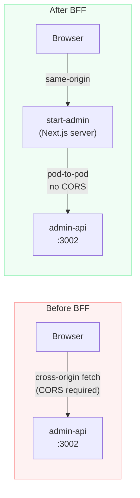

# Backend for Frontend (BFF) Pattern

A pattern where a dedicated server-side layer sits between the browser and internal API services. The browser communicates only with the BFF; the BFF calls internal services pod-to-pod. Used in the [[k8s-bootstrap-pipeline]] project to isolate the admin dashboard from the `admin-api`.

## Before and After



**Before:** The browser sends requests cross-origin to `admin-api` directly, requiring CORS headers, exposing the API surface to client-side code, and complicating JWT handling.

**After:** All admin API calls originate from `start-admin` server-side functions (pod-to-pod). The browser never talks to `admin-api`. CORS configuration on `admin-api` is retained as defence-in-depth only — it no longer serves the primary request path.

## Why Pod-to-Pod Removes CORS Complexity

CORS only applies to browser-initiated cross-origin requests. Pod-to-pod HTTP inside the cluster is not a browser request — the CORS preflight flow does not occur. `start-admin` calling `admin-api` at `http://admin-api-svc:3002` is a server-side HTTP call; no `Origin` header, no preflight, no CORS response headers needed.

## CORS as Defence-in-Depth

The `admin-api` still has CORS configuration:
```
Allowed origin: https://nelsonlamounier.com
Methods: standard HTTP methods
```

This is retained because:
1. It is cheap to keep
2. If a future change accidentally re-exposes `admin-api` to direct browser calls, the CORS policy rejects cross-origin requests from unexpected origins
3. It signals intent in the codebase — `admin-api` was designed for server-side consumption

## Credential Simplification

The BFF migration also simplifies credential handling:

- **Before:** Browser needs access to Cognito tokens; must handle token refresh client-side; token exposed in browser memory
- **After:** `start-admin` holds the server-side session; Cognito JWT is never sent to the browser; `admin-api` validates JWTs from `start-admin` only

## Implementation in This Project

- **BFF:** `start-admin` — [[tanstack-start|TanStack Start]] admin dashboard. `createServerFn` RPC functions run server-side and make pod-to-pod calls to `admin-api` using the cluster's internal DNS (`http://admin-api-svc.default.svc.cluster.local:3002`)
- **Internal API:** `admin-api` — [[hono]] service on port 3002, Cognito JWT middleware on all `/api/admin/*` routes
- **CORS config on `admin-api`:** Retained with `https://nelsonlamounier.com` as the allowed origin (the admin sub-path `/admin/*` CloudFront routes to `start-admin`; browser origin is always the main domain)

### `createServerFn` as BFF Primitive

[[tanstack-start]] implements the BFF boundary via `createServerFn`. Each server function:
1. Is annotated `'use server'`-equivalent by the Vinxi bundler
2. Never appears in the browser bundle
3. Makes the `apiFetch` pod-to-pod call to `admin-api`
4. Returns typed data to the calling component

This removes the need for a manual `fetch` proxy layer that would otherwise be required in a traditional BFF setup.

## Related Pages

- [[tanstack-start]] — `start-admin` BFF framework; `createServerFn` RPC pattern
- [[hono]] — `admin-api` implementation behind the BFF
- [[k8s-bootstrap-pipeline]] — cluster context
- [[frontend-portfolio]] — project overview for both apps
- [[traefik]] — routes `/admin/*` traffic to `start-admin`, not `admin-api`
