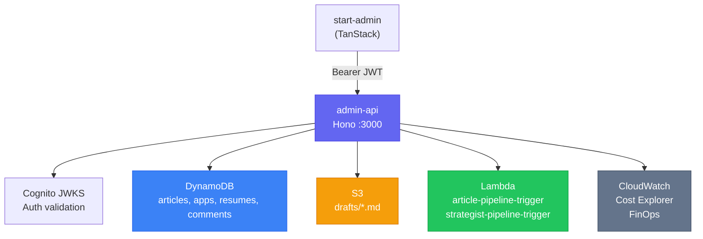
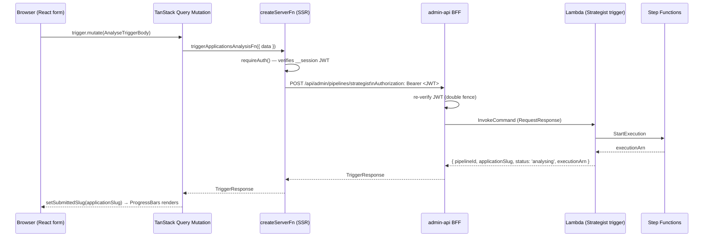

# admin-api — BFF Service

Hono v4 Backend-for-Frontend (BFF) running as a K8s pod. The exclusive data gateway for [[projects/frontend-portfolio|start-admin]] (TanStack admin dashboard). All 7 routers protected by a single Cognito JWT middleware mounted at the top-level app.

| Attribute | Detail |
|---|---|
| Framework | Hono v4 + `@hono/node-server` |
| Runtime | Node.js ESM (`"type": "module"`) |
| Auth | Cognito JWT (JWKS, validated via `jose`) |
| Database | DynamoDB via `@aws-sdk/lib-dynamodb` |
| Storage | S3 (article drafts, content blobs) |
| Compute | Lambda invocations (article + strategist pipelines) |
| Observability | CloudWatch (`BedrockMultiAgent`, `BedrockChatbot`, `SelfHealing`) |
| Cost tracking | AWS Cost Explorer (always `us-east-1`) |
| Credentials | EC2 Instance Profile (IMDS) — zero secrets in code |
| Deployment | Kubernetes (K3s), config via K8s Secrets + ConfigMaps |

---

## Architecture



---

## Route Map (7 Routers)

| Mount path | File | Responsibility |
|---|---|---|
| `/api/admin/articles` | `articles.ts` | Content CRUD, GSI status queries, pipeline trigger |
| `/api/admin/applications` | `applications.ts` | Job application CRUD, batch delete, coaching |
| `/api/admin/pipelines` | `pipelines.ts` | Fire-and-forget + sync Lambda invocations |
| `/api/admin/resumes` | `resumes.ts` | Resume lifecycle, activation, S3 presign |
| `/api/admin/drafts` | `drafts.ts` | S3 PutObject → triggers article pipeline via S3 event |
| `/api/admin/finops` | `finops.ts` | CloudWatch metrics + Cost Explorer billing data |
| `/api/admin/comments` | `comments.ts` | Comment moderation queue (approve/reject/delete) |

---

## DynamoDB Data Model

Single-table design with `pk` (partition) + `sk` (sort). GSI (`gsi1pk / gsi1sk`) supports status-based queries without full table scans.

See [[concepts/dynamodb-single-table]] for pattern details.

### Entity Key Schema

| Entity | `pk` | `sk` | `gsi1pk` |
|---|---|---|---|
| Article metadata | `ARTICLE#<slug>` | `METADATA` | `ARTICLE#<status>` |
| Article counters | `ARTICLE#<slug>` | `COUNTERS` | — |
| Application metadata | `APPLICATION#<slug>` | `METADATA` | `APPLICATION#<status>` |
| Analysis result | `APPLICATION#<slug>` | `ANALYSIS#<ulid>` | — |
| Interview record | `APPLICATION#<slug>` | `INTERVIEW#<stage>` | — |
| Resume record | `RESUME#<uuid>` | `METADATA` | `RESUME#<status>` |
| Comment record | `ARTICLE#<slug>` | `COMMENT#<timestamp>#<uuid>` | `COMMENT#pending` |

---

## Route Deep Dives

### articles.ts — GSI-First + Async Lambda Trigger

```typescript
// List → GSI query (no scan)
QueryCommand({ IndexName: GSI1, KeyConditionExpression: 'gsi1pk = :pk' })

// Publish → fire-and-forget Lambda
LambdaClient.send(new InvokeCommand({ InvocationType: 'Event', ... }))
// Returns 202 immediately — pipeline runs in background
```

### applications.ts — Multi-Item Batch Delete

```typescript
// Removes ALL sort-key variants (METADATA + ANALYSIS#* + INTERVIEW#*)
BatchWriteItemCommand({ RequestItems: { [TABLE]: deleteRequests } })
```

Critical: batch delete prevents orphaned records if only METADATA is deleted.

### pipelines.ts — Dual Lambda Invocation Modes

```typescript
// Fire-and-forget (article pipeline)
InvokeCommand({ InvocationType: 'Event' })

// Synchronous — when slug is needed immediately (strategist pipeline)
InvokeCommand({ InvocationType: 'RequestResponse' })
```

Thin typed proxy: accepts structured JSON from admin UI, forwards to pipeline Lambda. `RequestResponse` used when the Lambda returns a value (e.g., generated `applicationSlug`) that the UI needs before navigating.

### resumes.ts — Exclusive Activation ⚠️

```typescript
// TWO sequential UpdateItem calls — NOT atomic
// Step 1: deactivate old
UpdateCommand({ UpdateExpression: 'SET #status = :inactive, gsi1pk = :inactiveGsi' })
// Step 2: activate new
UpdateCommand({ UpdateExpression: 'SET #status = :active, gsi1pk = :activeGsi' })
```

**Known issue:** If process crashes between calls, 0 or 2 resumes appear active. Fix: wrap in `TransactWriteCommand`.

### drafts.ts — S3 Event Trigger (No Direct Lambda Call)

```typescript
// Upload to S3 → S3 bucket event notification fires trigger Lambda automatically
PutObjectCommand({ Key: `drafts/${slug}.md`, Body: content })
```

Contrast with `pipelines.ts` which manually invokes the Lambda with a synthetic S3 event (used for local dev where the S3 notification isn't configured).

### finops.ts — CloudWatch + Cost Explorer

| Endpoint | Namespace | Key metrics |
|---|---|---|
| `/realtime` | `BedrockMultiAgent` | InputTokens, OutputTokens, ThinkingTokens, ProcessingDurationMs |
| `/costs` | Cost Explorer | UnblendedCost by inference profile |
| `/chatbot` | `BedrockChatbot` | InvocationCount, BlockedInputs, RedactedOutputs |
| `/self-healing` | `self-healing-development/SelfHealing` | InputTokens, OutputTokens |

`collapseMetrics()` takes `Values[0]` from each CloudWatch time-series (aggregated single period). Results are **one data point**, not a trend. Endpoints accept `?days=N` (default 7, max 365).

### comments.ts — GSI Pending Queue ⚠️

```typescript
// Moderate: update status + GSI key in ONE UpdateItem
UpdateCommand({ UpdateExpression: 'SET #status = :status, gsi1pk = :gsi1pk' })

// Counter: SEPARATE UpdateItem — not atomic with above
UpdateCommand({ UpdateExpression: 'ADD commentCount :inc' })
```

Same atomicity risk as resume activation. Composite ID format: `slug__sk` (URL-decoded before parsing).

---

## Cross-Cutting Concerns

### Authentication Flow

```
Request → Hono auth middleware
  → jose.jwtVerify() with JWKS from Cognito
  → JWKS cached in-memory by createRemoteJWKSet()
  → Claims validated → ctx.set('user', payload)
  → Route handler executes
```

JWKS URL: `https://cognito-idp.<region>.amazonaws.com/<userPoolId>/.well-known/jwks.json`

### Fail-Fast Config

```typescript
// loadConfig() throws at startup if any env var is missing
// → CrashLoopBackOff in K8s instead of silent misconfiguration
const config = loadConfig();
```

K8s sources: `admin-api-secrets` (Secret) for Cognito IDs; `admin-api-config` (ConfigMap) for table name, Lambda ARNs, bucket name.

### Lazy Singleton AWS Clients

Each route module has a module-level lazy singleton per AWS service:

```typescript
let _docClient: DynamoDBDocumentClient | null = null;

function getDocClient(region: string): DynamoDBDocumentClient {
  if (!_docClient) {
    _docClient = DynamoDBDocumentClient.from(new DynamoDBClient({ region }), {
      marshallOptions: { removeUndefinedValues: true },  // silently drops undefined on writes
    });
  }
  return _docClient;
}
```

`removeUndefinedValues: true` is convenient for partial updates but can mask missing required fields if types aren't strict.

---

## Analysis Form Submission Flow

Full path from admin UI to Step Functions execution (from `analysis_panel_flow_report`):



**Double JWT fence**: JWT verified at the SSR server function level (via `__session` HTTP-only cookie) AND re-verified at admin-api (via `Authorization: Bearer` header). No unauthenticated BFF call is possible.

**interviewStage intentionally dropped**: Collected in form, validated, stored in draft — but never forwarded to the Lambda. Lambda hardcodes `'applied'` for analyse operations. The JSDoc documents this but it may confuse future maintainers.

---

## Known Design Issues

### High Priority

| Issue | Location | Fix |
|---|---|---|
| Non-atomic resume activation | `resumes.ts` | Use `TransactWriteCommand` |
| Non-atomic comment counter | `comments.ts` | Use `TransactWriteCommand` |

### Medium Priority

| Issue | Location | Fix |
|---|---|---|
| `collapseMetrics()` discards multi-value time-series | `finops.ts` | Sum all `Values` with `reduce` |
| `drafts.ts` creates S3 client from `process.env` directly instead of `config.awsRegion` | `drafts.ts` | Pass `config.awsRegion` to `createDraftsRouter` |
| DynamoDB clients not using shared `lib/dynamo.ts` singleton | `comments.ts`, `finops.ts` | Extend `lib/dynamo.ts` export |

---

## Related Pages

- [[patterns/bff-pattern]] — BFF architectural pattern
- [[tools/hono]] — Hono framework used by admin-api
- [[tools/tanstack-start]] — start-admin (the BFF consumer)
- [[concepts/dynamodb-single-table]] — single-table design + GSI pattern
- [[ai-engineering/job-strategist]] — strategist pipeline triggered via `/api/admin/pipelines/strategist`
- [[ai-engineering/article-pipeline]] — article pipeline triggered via `/api/admin/articles/:slug/publish`
- [[concepts/observability-stack]] — FinOps CloudWatch namespaces surfaced by `/api/admin/finops`
