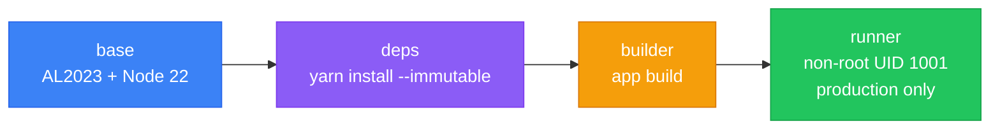

# frontend-portfolio

Yarn 4 monorepo containing both frontend applications deployed to the [[k8s-bootstrap-pipeline]] cluster at `nelsonlamounier.com`.

## Workspace Structure

```
frontend-portfolio/
├── apps/
│   ├── site/           # Next.js 15 — public portfolio site
│   └── start-admin/    # TanStack Start — private admin dashboard
├── packages/
│   ├── shared/         # @repo/shared — shared types, utilities, API clients
│   └── ui/             # @repo/ui — shared React components
```

Both apps use TypeScript strict mode throughout. Shared packages prevent type drift between the public and admin surfaces.

## Applications at a Glance

| Dimension | apps/site | apps/start-admin |
|---|---|---|
| **Framework** | Next.js 15 (App Router) | TanStack Start (Vinxi/Vite) |
| **Router** | Next.js file-based App Router | TanStack Router (type-safe, file-based) |
| **Build tool** | Webpack + SWC | Vite + Vinxi |
| **Test runner** | Jest | Vitest |
| **API style** | Route Handlers (`route.ts`) | `createServerFn` (RPC-style) |
| **Auth** | None (public) | AWS Cognito PKCE + `httpOnly` cookies |
| **Data access** | Direct AWS SDK v3 (DynamoDB, S3) | Via `admin-api` BFF (HTTP) |
| **OTel traces** | ✅ Full SDK (OTLP/gRPC → Tempo) | ❌ Not configured |
| **Prometheus metrics** | ✅ `/api/metrics` endpoint | ❌ Not configured |
| **RUM (Faro)** | ✅ Client-side telemetry | ✅ Client-side telemetry |
| **CSP header** | ❌ Missing | ✅ Full CSP via middleware |
| **Port** | 3000 | 5001 |
| **Docker output** | `standalone` (Next.js) | Vite SSR (`dist/`) |
| **State management** | `zustand` + `@tanstack/react-query` | `@tanstack/react-query` |
| **Forms** | Uncontrolled / custom | `@tanstack/react-form` + Zod |

## apps/site — Public Portfolio

See [[nextjs]] for full implementation details.

**Purpose:** Public-facing portfolio site. Static content + interactive features (AI chat, live Kubernetes metrics, article browsing). No authentication.

**Key capabilities:**
- Next.js 15 App Router with React Server Components + ISR
- [[DynamoDB]] single-table design; `contentRef` field → S3 for MDX article bodies
- 7 API routes: `/api/metrics` (SSM Bearer auth), `/api/chat` (Bedrock Agent proxy), `/api/articles`, `/api/health`, `/api/revalidate`, `/api/portfolio`, `/log-proxy`
- Full OTel distributed tracing → [[observability-stack|Tempo]]
- `prom-client` metrics → Prometheus scrape via `/api/metrics`
- Grafana Faro RUM via `/log-proxy` rewrite (avoids CORS)
- CloudFront + WAF edge layer → NLB → [[traefik]] → pod

## apps/start-admin — Admin Dashboard

See [[tanstack-start]] for full implementation details.

**Purpose:** Private admin interface for content authoring and portfolio management. Cognito-authenticated, mounted at `/admin/`.

**Key capabilities:**
- TanStack Start (Vinxi/Vite SSR) with `createServerFn` type-safe RPC
- 12 server modules: auth, articles, applications, AI (Bedrock publish pipeline), resume, media, cache
- AWS Cognito PKCE OAuth flow; JWT stored in `httpOnly` cookie (24h TTL)
- [[bff-pattern|BFF pattern]]: server functions call `admin-api` pod-to-pod; browser never crosses origin
- Full CSP via `securityHeadersMiddleware`
- Grafana Faro RUM; no Prometheus endpoint (covered by node-level monitoring)

## Supporting Infrastructure

| Component | Role |
|---|---|
| [[hono\|admin-api]] | Authenticated BFF — CRUD to DynamoDB/S3 |
| AWS Bedrock + API Gateway + Lambda | AI chat (site) + publish pipeline (admin) |
| AWS DynamoDB (single-table) | Article metadata, resume data |
| AWS S3 | MDX article content, uploaded assets |
| [[aws-cloudfront\|CloudFront + WAF]] | CDN, edge caching, WAF rate limiting |
| NLB | K8s cluster ingress |
| [[traefik]] | Internal routing |
| [[argocd]] | Continuous deployment via GitOps |
| [[observability-stack\|Prometheus + Grafana + Tempo + Loki]] | Metrics, dashboards, traces, logs |
| AWS Cognito | Admin authentication (PKCE) |
| AWS SSM Parameter Store | Secrets (Bearer tokens, Bedrock keys) |

## Docker Build Strategy

Both apps use **4-stage multi-stage Dockerfiles** with Amazon Linux 2023 (matching the K8s node OS):



`apps/site` uses Next.js `output: 'standalone'` — produces a self-contained bundle without `node_modules`. `apps/start-admin` uses Vite SSR output (`dist/`).

## Known Gaps

| Gap | Severity | Description |
|---|---|---|
| No CSP on `apps/site` | Medium | Unlike admin, site responses lack `Content-Security-Policy` |
| No OTel on `apps/start-admin` | Low | Server function spans would help debug API latency |
| Rate limiter missing on `/api/chat` | Low | Only `articles` has rate limiting; Bedrock proxy unprotected |
| `/api/revalidate` unauthenticated | Low | Token validation would prevent cache-purge DoS |
| `awsEcsDetector` on K8s | Low | ECS detector runs but returns nothing; replace with container detector |
| `unsafe-inline`/`unsafe-eval` in admin CSP | Low | Vite SSR requirement — worth auditing post-build |
| Prometheus cache cold on restart | Low | First scrape after pod restart may fail if SSM is slow |

## Best Practices

- TypeScript strict mode throughout; no `any` in reviewed code
- JSDoc on all public server functions
- Multi-stage Docker builds; non-root container users
- Zod for runtime validation (both apps)
- SSM for all secrets; no hardcoded keys
- PKCE OAuth (no implicit flow); JWT in `httpOnly` cookies
- `yarn --immutable` in Docker (reproducible builds)
- AL2023 base image matches K8s node OS
- Full [[observability-stack]] integration (site)
- [[argocd]] Image Updater continuous delivery

## Related Pages

- [[k8s-bootstrap-pipeline]] — cluster running these apps
- [[nextjs]] — `apps/site` implementation details
- [[tanstack-start]] — `apps/start-admin` implementation details
- [[hono]] — `admin-api` BFF backend
- [[bff-pattern]] — BFF architecture pattern used by start-admin
- [[observability-stack]] — monitoring stack these apps integrate with
- [[argocd]] — GitOps deployment controller
- [[traefik]] — cluster ingress that routes `/admin/*` to start-admin
- [[aws-cloudfront]] — CloudFront + WAF edge layer
- [[troubleshooting/nextjs-image-asset-sync]] — Image Updater delivery issues
