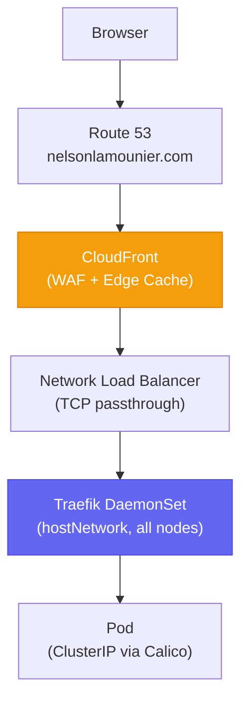

# K8s Bootstrap Pipeline

A CDK-managed pipeline that bootstraps self-hosted Kubernetes clusters on EC2 using [[self-hosted-kubernetes|kubeadm]], [[aws-ssm|SSM Run Command]], and [[aws-step-functions|Step Functions]]. No managed Kubernetes (EKS/GKE) — full control-plane and worker node automation via Python scripts. Hosts the portfolio website and associated API services at `nelsonlamounier.com`.

## Cluster Topology

**3 nodes:** 1 control-plane EC2 + 2 ASG-backed worker pools.

| Pool | Instance | Hosts |
|---|---|---|
| `general` | `t3.small` (Spot) | Next.js, start-admin, ArgoCD, API services |
| `monitoring` | `t3.medium` (Spot) | [[observability-stack]], Cluster Autoscaler |

## Network Path

TLS terminates at **CloudFront** (ACM wildcard cert) for public traffic. [[traefik]] holds a cert-manager cert (`ops-tls-cert`) for the CloudFront→NLB→Traefik leg and for monitoring services served directly.

## Architecture — Two-Tier Orchestration

### SM-A — Bootstrap Orchestrator (Tier 1)

Manages cluster infrastructure lifecycle. Runs once per EC2 instance (or replacement):

1. **InvokeRouter Lambda** — reads ASG tags to determine role, SSM prefix, S3 bucket
2. **UpdateInstanceId** — writes instance ID to SSM
3. **BootstrapControlPlane** — runs `control_plane.py` via SSM Run Command (10 steps)
4. **Worker rejoin** — parallel `worker.py` execution on general + monitoring pools

### SM-B — Config Orchestrator (Tier 2)

Manages application runtime config. Runs 5 `deploy.py` scripts sequentially on the control plane:

1. `nextjs/deploy.py` — K8s Secrets, ConfigMap, Traefik IngressRoute
2. `monitoring/deploy.py` — Grafana Secret, Prometheus ConfigMap, Helm release
3. `start-admin/deploy.py` — Cognito + DynamoDB + Bedrock config
4. `admin-api/deploy.py` — Secrets, ConfigMap, IngressRoute
5. `public-api/deploy.py` — ConfigMap, IngressRoute

### Self-Healing

SM-A SUCCEED → EventBridge rule → SM-B fires automatically. Any EC2 replacement triggers the full bootstrap → config injection cycle without CI involvement. An AI-driven [[self-healing-agent]] handles incident response for non-replacement failures.

## In-Cluster Services

| Service | Port | Auth | Framework |
|---|---|---|---|
| Next.js | 3000 | None | Next.js |
| start-admin | 3000 | Cognito (UI) | Next.js |
| [[hono\|public-api]] | 3001 | None (public) | Hono/Node.js |
| [[hono\|admin-api]] | 3002 | Cognito JWT | Hono/Node.js |

`admin-api` is only called pod-to-pod from `start-admin` via the [[bff-pattern|BFF pattern]]. All services use IMDS for AWS credentials — no static secrets in pods.

## Key Design Decisions

- **[[self-hosted-kubernetes|Single `WorkerPoolType` CDK stack]]** — replaces three named worker stacks; eliminates IAM policy drift
- **[[aws-ssm|SSM over `Fn::ImportValue`]]** — all cross-stack dependencies resolved at runtime via SSM; stacks deploy independently
- **[[aws-ssm|SSM Run Command over SSH]]** — no keys, no bastion, no port 22, IAM-governed access
- **[[aws-step-functions|Step Functions over Lambda chains]]** — native parallel branches, no 15-min timeout limit, visual debugging
- **[[github-actions|GitHub Actions with OIDC]]** — zero-infrastructure CI, temporary credentials per run
- **[[bff-pattern|BFF pattern for admin]]** — browser never calls `admin-api` directly; pod-to-pod only
- **[[argo-rollouts|Argo Rollouts Blue/Green]]** — manual gate + Prometheus AnalysisTemplate for Next.js deployments

## Testing Workflow

Follows [[shift-left-validation]]:

1. `just deploy-test <script>` — offline unit tests (< 5s)
2. `just deploy-sync <script>` → `just ssm-shell` → `--dry-run` — live node validation (< 30s)
3. `just deploy-script <script>` — SSM document trigger with CloudWatch tail (< 1min)
4. `just config-run development` — full SM-B execution (integration gate)

## Logging

| Layer | Log Group | Retention |
|---|---|---|
| SM-A state transitions | `/aws/vendedlogs/states/k8s-dev-bootstrap-orchestrator` | 7 days |
| SM-B state transitions | `/aws/vendedlogs/states/k8s-dev-config-orchestrator` | 7 days |
| Bootstrap script stdout | `/ssm/k8s/development/bootstrap` | 14 days |
| Deploy script stdout | `/ssm/k8s/development/deploy` | 14 days |

## CDK Stacks

| Stack | Purpose |
|---|---|
| `SsmAutomation-development` | SSM Documents + Step Functions + IAM |
| `ControlPlane-development` | EC2 control-plane + ASG |
| `GeneralPool-development` | General worker pool ASG |
| `MonitoringPool-development` | Monitoring worker pool ASG |
| `AppIam-development` | IAM roles for pod workloads |

## Related Pages

- [[self-hosted-kubernetes]] — cluster topology, node pools, bootstrap steps
- [[aws-step-functions]] — orchestration engine
- [[aws-ssm]] — remote execution layer
- [[traefik]] — ingress controller
- [[calico]] — CNI plugin
- [[argocd]] — GitOps controller
- [[argo-rollouts]] — progressive delivery for Next.js
- [[observability-stack]] — LGTM stack on monitoring pool
- [[self-healing-agent]] — AI-driven incident remediation
- [[disaster-recovery]] — etcd backup and control-plane DR
- [[hono]] — public-api and admin-api services
- [[bff-pattern]] — admin-api access pattern
- [[shift-left-validation]] — testing philosophy
- [[event-driven-orchestration]] — SM-A → EventBridge → SM-B
- [[ssm-permission-denied]] — /data/app-deploy/ permissions fix
- [[k8s-bootstrap-commands]] — all just recipes and CLI commands
