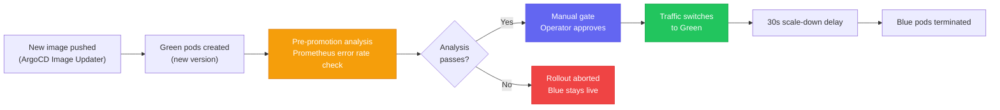

# Argo Rollouts

Progressive delivery controller for Kubernetes. Used in the [[k8s-bootstrap-pipeline]] project for the Next.js application via a **Blue/Green strategy** with a manual promotion gate.

## Blue/Green Deployment Flow



1. **Green pods created** — new version deployed alongside the live blue pods; no traffic yet
2. **Pre-promotion analysis** — Prometheus `AnalysisTemplate` queries error rate metrics on the green pods
3. **Manual gate** — human approval required (ArgoCD UI or `kubectl argo rollouts promote`)
4. **Traffic switch** — Traefik `IngressRoute` updated to point at the green service
5. **Scale-down delay** — 30 seconds before blue pods terminate

## Pre-Promotion Analysis

A Prometheus `AnalysisTemplate` gates promotion on error rate. If the error rate on green pods exceeds the threshold during the analysis window, the rollout is automatically aborted and blue remains live — no manual intervention needed for failure cases.

This acts as an automated quality gate: the manual promotion is only reached when metrics are healthy.

## N-1 Static Asset Retention

The scale-down delay (30s) solves a subtle problem: users whose browser has the **old** HTML (referencing old JS/CSS asset hashes) may still be making requests to those old asset paths after promotion. If blue pods terminate immediately, those asset requests return 404.

The 30s delay keeps the previous version's static assets available in S3 long enough for in-flight page loads to complete. The previous version's build output is retained in S3 under its hash prefix until the delay elapses.

## Promotion Commands

```bash
# Approve promotion via CLI
kubectl argo rollouts promote nextjs-rollout -n default

# Check rollout status
kubectl argo rollouts get rollout nextjs-rollout -n default --watch

# Abort and revert to blue
kubectl argo rollouts abort nextjs-rollout -n default
```

From ArgoCD UI: navigate to the application → Rollout → click **Promote**.

## Integration with ArgoCD Image Updater

New deployments are triggered by [[argocd]] Image Updater detecting a new ECR image tag. The `-rN` retry suffix in the tag format forces a re-tag event when the underlying image digest changes without a version bump, ensuring Image Updater always detects the change.

## Related Pages

- [[argocd]] — manages the Rollout CR and runs Image Updater
- [[traefik]] — IngressRoute is updated during promotion to switch traffic
- [[k8s-bootstrap-pipeline]] — project context
- [[observability-stack]] — Prometheus provides the AnalysisTemplate metrics
