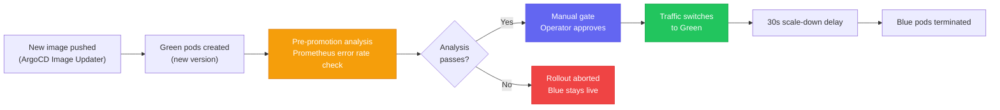

# Argo Rollouts

Progressive delivery controller for Kubernetes. Used in the [[k8s-bootstrap-pipeline]] project for the Next.js application via a **Blue/Green strategy** with a manual promotion gate.

## Blue/Green Deployment Flow



1. **Green pods created** — new version deployed alongside the live blue pods; no traffic yet
2. **Pre-promotion analysis** — Prometheus `AnalysisTemplate` queries error rate metrics on the green pods
3. **Manual gate** — human approval required (ArgoCD UI or `kubectl argo rollouts promote`)
4. **Traffic switch** — Traefik `IngressRoute` updated to point at the green service
5. **Scale-down delay** — 30 seconds before blue pods terminate

## Pre-Promotion Analysis

A Prometheus `AnalysisTemplate` gates promotion on two metrics:

```yaml
metrics:
  - name: error-rate
    successCondition: "isNaN(result) || result < 0.05"   # < 5% error rate
    provider:
      prometheus:
        query: |
          scalar(
            sum(rate(traefik_service_requests_total{service=~"nextjs-nextjs-app-.*@kubernetes", code=~"5.."}[5m])) /
            sum(rate(traefik_service_requests_total{service=~"nextjs-nextjs-app-.*@kubernetes"}[5m]))
          )

  - name: p95-latency
    successCondition: "isNaN(result) || result < 2000"   # < 2000ms
    provider:
      prometheus:
        query: |
          scalar(
            histogram_quantile(0.95,
              sum(rate(traefik_service_request_duration_seconds_bucket{service=~"nextjs-nextjs-app-.*@kubernetes"}[5m])) by (le)
            ) * 1000
          )
```

**`scalar()` wrapping** is required (bug fixed 2026-03-18): PromQL returns a one-element vector; Argo Rollouts cannot evaluate `[]float64` against a numeric condition. Without `scalar()`, analysis always returns an error.

**`isNaN(result)`** handles division-by-zero when the preview service has received zero traffic. Without this guard, Day-0 deployments with no preview traffic produce NaN and fail analysis with a false-negative.

## N-1 Static Asset Retention

The scale-down delay (30s) solves a subtle problem: users whose browser has the **old** HTML (referencing old JS/CSS asset hashes) may still be making requests to those old asset paths after promotion. If blue pods terminate immediately, those asset requests return 404.

The 30s delay keeps the previous version's static assets available in S3 long enough for in-flight page loads to complete. The previous version's build output is retained in S3 under its hash prefix until the delay elapses.

## Promotion Commands

```bash
# Approve promotion via CLI
kubectl argo rollouts promote nextjs-rollout -n default

# Check rollout status
kubectl argo rollouts get rollout nextjs-rollout -n default --watch

# Abort and revert to blue
kubectl argo rollouts abort nextjs-rollout -n default
```

From ArgoCD UI: navigate to the application → Rollout → click **Promote**.

## HPA Targeting a Rollout

The HPA for `nextjs` targets the Argo `Rollout` resource, not a standard `Deployment`:

```yaml
scaleTargetRef:
  apiVersion: argoproj.io/v1alpha1
  kind: Rollout    # not apps/v1 Deployment
  name: nextjs
minReplicas: 2
maxReplicas: 5
metrics:
  - type: Resource
    resource:
      name: cpu
      target:
        type: Utilization
        averageUtilization: 70
```

This requires `metrics-server` (ArgoCD sync wave 3) to be healthy before the HPA can report CPU utilization — enforced by sync wave ordering.

## ResourceQuota for Blue/Green

The `nextjs` namespace resource quota accounts for **both** blue and green ReplicaSets running simultaneously during a promotion:

```yaml
resourceQuota:
  hard:
    requests.cpu: "300m"     # formula: replicas × 2 (blue+green) × per-pod × 1.5 safety
    requests.memory: 1536Mi
    limits.cpu: "3"
    limits.memory: 3Gi
    persistentvolumeclaims: "2"
```

A rolling update strategy would only need quota for `n + 1` pods. Blue/green requires `n × 2` — a constraint unique to this strategy.

## Deployment Testing Workflow

### Phase 1 — ArgoCD Application Health

```bash
# Health + sync status for both apps
kubectl -n argocd get applications nextjs start-admin \
  -o custom-columns=\
'NAME:.metadata.name,HEALTH:.status.health.status,SYNC:.status.sync.status,IMAGE:.status.summary.images[0]'

# Last sync operation message
kubectl -n argocd get application nextjs \
  -o jsonpath='{.status.operationState.message}{"\n"}'
```

### Phase 2 — Rollout Status (Recommended)

The Argo Rollouts kubectl plugin gives a tree view of active vs. preview ReplicaSets:

```bash
# Install once
brew install argoproj/tap/kubectl-argo-rollouts

# Watch live rollout state
kubectl argo rollouts get rollout nextjs -n nextjs-app --watch
kubectl argo rollouts get rollout start-admin -n start-admin --watch
```

**Mid-rollout output (what you want during BlueGreen testing):**
```
REVISION  STATUS       PODS   READY   AVAILABLE
3         ◌ Running    1      1       1     ← preview (new version, test this)
2         ✔ Healthy    1      1       1     ← active (current stable)
```

### Phase 3 — Preview Testing

Test the new version **before promotion** without impacting production users:

```bash
# Test preview via X-Preview header (bypasses IngressRoute priority)
curl -v \
  -H "X-Preview: true" \
  -H "Host: <your-domain>" \
  http://<NLB_IP>/

# Or use ModHeader browser extension: add "X-Preview: true"
# Then navigate to the production URL — Traefik routes to preview RS
```

Traffic flow: `curl/Browser → NLB → Traefik → nextjs-preview Service → preview ReplicaSet`

### Phase 4 — Manual Promotion

```bash
# Promote after preview testing passes
kubectl argo rollouts promote nextjs -n nextjs-app
kubectl argo rollouts promote start-admin -n start-admin

# Watch promotion sequence
kubectl argo rollouts get rollout nextjs -n nextjs-app --watch
```

Expected promotion sequence:
1. Preview RS becomes Active
2. Old RS enters `ScaleDownDelay` (30 seconds)
3. Old RS scales to 0 replicas
4. Rollout phase = `Healthy`

### One-Liner Status Summary

```bash
kubectl get rollout -A -o custom-columns=\
'NS:.metadata.namespace,NAME:.metadata.name,STATUS:.status.phase,DESIRED:.spec.replicas,READY:.status.readyReplicas'
```

## `start-admin` `:latest` Tag Bug

`start-admin` uses `tag: "latest"` in `start-admin-values.yaml`. The Image Updater `allow-tags` regexp `^[0-9a-f]{7,40}(-r[0-9]+)?$` **never matches** `:latest`.

Result: Image Updater always reports "no new image found" for `start-admin` — the image is never auto-updated. This leaves `start-admin` degraded (running a stale `:latest` image that may not exist or is old).

**Fix:** Push a SHA-tagged image and update `start-admin-values.yaml`:
```yaml
image:
  tag: "abc1234def5678"   # replace :latest with a real SHA
```

See [[nextjs-image-asset-sync]] for the full Image Updater diagnostic workflow.

## Integration with ArgoCD Image Updater

New deployments are triggered by [[argocd]] Image Updater detecting a new ECR image tag. The `-rN` retry suffix forces a re-tag event when the underlying image digest changes without a version bump, ensuring Image Updater always detects the change. The `newest-build` strategy selects by build timestamp (correct for SHA-tagged images with no semver ordering).

## Related Pages

- [[argocd]] — manages the Rollout CR, Image Updater, sync waves
- [[traefik]] — IngressRoute priority cascade; preview service at priority 100
- [[helm-chart-architecture]] — Rollout replaces Deployment in chart templates; ResourceQuota formula
- [[nextjs-image-asset-sync]] — build hash alignment, Image Updater diagnostics, ArgoCD override pattern
- [[k8s-bootstrap-pipeline]] — project context
- [[observability-stack]] — Prometheus provides AnalysisTemplate metrics
