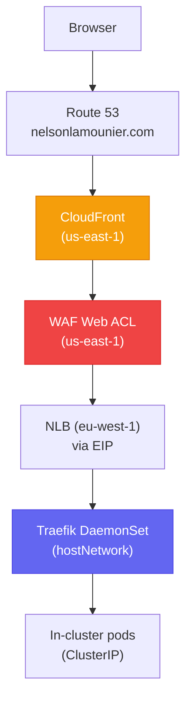

# AWS CloudFront (Edge Stack)

The global CDN, TLS termination, and edge security layer for `nelsonlamounier.com`. Defined in `K8sEdgeStack` and deployed in `us-east-1` — a hard requirement because CloudFront and WAF (global) resources are only available in that region, while the cluster runs in `eu-west-1`.

## Architecture



## Resources Created

| Resource | Detail |
|---|---|
| **ACM Certificate** | `nelsonlamounier.com`, `*.nelsonlamounier.com` — DNS validation |
| **WAF Web ACL** | AWSManagedRulesCommonRuleSet, AWSManagedRulesKnownBadInputsRuleSet, rate-limit 1000 req/5min |
| **CloudFront Distribution** | 1 origin (EIP NLB), `AllViewerExceptHostHeader` cache policy |
| **CloudFront Origin Secret** | `X-Origin-Verify` header — rotated by Secrets Manager rotation Lambda |
| **Cross-Region SSM Readers** | `AwsCustomResource` Lambda reads EIP from `eu-west-1` SSM into `us-east-1` |
| **Route 53 records** (optional) | ALIAS records for `nelsonlamounier.com`, `www.nelsonlamounier.com` |

## TLS Architecture

Two termination points, not one:

```
Browser → CloudFront (TLS termination — ACM wildcard cert: nelsonlamounier.com)
              ↓ HTTPS (X-Origin-Verify header injected)
          NLB:443 → TCP pass-through → Traefik:443
              ↓ TLS termination (cert-manager Let's Encrypt: ops-tls-cert)
          In-cluster pod
```

| Termination point | Certificate | Issuer |
|---|---|---|
| CloudFront | `nelsonlamounier.com` wildcard | ACM (managed rotation) |
| Traefik | `ops-tls-cert` | cert-manager DNS-01 / Let's Encrypt |

CloudFront terminates what browsers see. Traefik handles the CloudFront→NLB→Traefik leg. `ops-tls-cert` is backed up to SSM SecureString — see [[disaster-recovery]].

## WAF Rule Set

| Rule | Action | Reason |
|---|---|---|
| `AWSManagedRulesCommonRuleSet` | Block | OWASP Top 10 (XSS, SQLi, etc.) |
| `AWSManagedRulesKnownBadInputsRuleSet` | Block | Known exploit payloads |
| `RateLimit` (custom) | Block | 1000 req/5 min per IP — prevents scraping and DDoS |

The WAF ACL is deployed at the CloudFront edge, not at the NLB. This means rule evaluation happens at 400+ PoPs before traffic reaches `eu-west-1`.

## CloudFront Cache Behaviour

| Header / Cookie | Behaviour |
|---|---|
| `X-Origin-Verify` | Forwarded to origin (NLB validates against Secrets Manager) |
| `Host` | **Not** forwarded (`AllViewerExceptHostHeader`) — prevents SNI mismatch at Traefik |
| `Accept-Encoding` | Forwarded for Gzip/Brotli compression |
| Query strings | All forwarded (Next.js ISR cache keys use query strings) |
| Cookies | None forwarded for public routes; `session` forwarded for admin routes |

Cache TTL: `s-maxage=300` (5 minutes) set by [[hono|public-api]] for article reads. Next.js pages use `stale-while-revalidate` for ISR.

## X-Origin-Verify (Origin Secret)

Traefik validates the `X-Origin-Verify` header on every request. Only CloudFront knows the secret — direct NLB access without the header is rejected. The secret is stored in Secrets Manager and rotated periodically by a rotation Lambda.

## Cross-Region SSM Read Pattern

The Edge stack runs in `us-east-1` but needs the EIP (stored in SSM in `eu-west-1`). It uses `AwsCustomResource` with a two-ID strategy to prevent stale SSM cache:

```typescript
// onCreate: stable ARN-based ID — avoids replacement on Day-0
physicalResourceId: cr.PhysicalResourceId.fromResponse('Parameter.ARN'),

// onUpdate: timestamp-based ID — changes every deploy → forces fresh SSM read
physicalResourceId: cr.PhysicalResourceId.of(`${parameterPath}@${deployTimestamp}`),
```

**Why this matters:** Without the timestamp-based `onUpdate` ID, CloudFormation caches the SSM value and serves a stale EIP or rotated secret until the custom resource is manually deleted. This was a real production bug that caused CloudFront 504 errors after a secret rotation.

## CloudFormation Outputs

| Output | Value |
|---|---|
| `CertificateArn` | ACM cert ARN |
| `WebAclArn` | WAF Web ACL ARN |
| `DistributionId` | CloudFront distribution ID |
| `DistributionDomainName` | `*.cloudfront.net` domain |

These outputs are consumed by the [[cdk-kubernetes-stacks|Observability stack]] for dashboard metrics.

## Related Pages

- [[k8s-bootstrap-pipeline]] — end-to-end network path (browser → pod)
- [[traefik]] — downstream TLS boundary; receives traffic from NLB
- [[disaster-recovery]] — `ops-tls-cert` backup/restore
- [[cdk-kubernetes-stacks]] — Stack 8 in the full deployment catalogue
- [[aws-ssm]] — cross-region SSM parameter lookup
