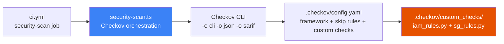

# Checkov

IaC static analysis tool that scans CloudFormation, Terraform, and CDK-synthesised templates against security and compliance checks. Acts as a "linter for security misconfigurations" — catches unencrypted S3 buckets, permissive Security Groups, and IAM policy gaps before deployment. Integrated into [[ci-cd-pipeline-architecture]] via `security-scan.ts`.

## Integration Point



Runs on every PR via `ci.yml`. `security-scan.ts` orchestrates discovery, multi-format output, severity parsing, and GitHub step summary. Current mode: `soft_fail: true` — findings visible but non-blocking during active development.

---

## Configuration Architecture (`.checkov/config.yaml`)

```yaml
framework: cloudformation
directory: "infra/cdk.out"

external_checks_dir:
  - ".checkov/custom_checks"

skip-check:
  - CKV_AWS_117   # Lambda VPC — intentionally VPC-agnostic (Bedrock Lambdas call external APIs)
  - CKV_AWS_115   # Lambda concurrency — solo-developer project; reserved concurrency adds cost
  - CKV_AWS_116   # Lambda DLQ — specific Lambdas have DLQs by design; blanket rule is too broad
  - CKV_AWS_76    # CloudFront geo-restriction — portfolio is intentionally global
  - CKV2_AWS_5    # SG not attached — CDK synthesises temporary SGs; always attached when deployed
```

**Skip philosophy**: Every skipped check has a documented justification in the config. A future reviewer can audit exactly which checks are bypassed and why — no unexplained suppressions.

The `external_checks_dir` loads all Python files in `.checkov/custom_checks/` as first-class Checkov checks. Custom checks are treated identically to built-in rules: they appear in CLI output, JSON results, SARIF, and can be skipped via `skip-check`.

---

## `security-scan.ts` — Beyond the Raw CLI

The `bridgecrewio/checkov-action` marketplace action runs Checkov and exits. `security-scan.ts` adds:

1. **Template discovery**: counts `.template.json` files in `cdk.out/`. Zero templates → emit `findings-count=0` and exit 0 gracefully (no phantom failures if synth was skipped).

2. **Severity gating**:
   ```typescript
   const hasBlockingFindings = criticalCount > 0 || highCount > 0;
   if (hasBlockingFindings && !softFail) { process.exit(1); }
   ```
   CRITICAL + HIGH block the pipeline. MEDIUM + LOW produce a `⚠️ Non-Blocking Findings` step summary entry but don't fail the job.

3. **GitHub outputs**: `scan-passed`, `findings-count`, `critical-count`, `high-count` — consumable by downstream gating jobs.

4. **Error annotations**: `emitAnnotation('error', ...)` writes red banners on the PR/commit status page, not just buried in the log.

5. **SARIF output**: available for upload to GitHub Code Scanning (Advanced Security).

---

## Custom IAM Checks (`iam_rules.py`)

Five checks enforcing IAM hygiene beyond Checkov's built-in rules:

### `CKV_CUSTOM_IAM_1` — Permissions Boundary Required

Every `AWS::IAM::Role` must have a `PermissionsBoundary`. Acts as a ceiling — even if an inline policy grants `*`, the boundary limits effective permissions.

**Exception**: Service-linked roles (trusted by `*.amazonaws.com` principals) are exempt — AWS manages them and they cannot accept boundaries.

**Current state**: Skipped in `config.yaml` — applying boundaries to all 40+ CDK-generated roles is a future hardening task. The rule exists to document the intent.

### `CKV_CUSTOM_IAM_2` — No Hardcoded Account IDs in ARNs

IAM policy resource ARNs must not contain literal 12-digit account numbers. Regex: `:(\d{12}):` against every `Resource` ARN.

**Why**: hardcoded account IDs create cross-account portability issues and reveal infrastructure topology in policy documents. Correct form: `!Sub "arn:aws:iam::${AWS::AccountId}:role/..."`.

### `CKV_CUSTOM_IAM_3` — No Static Role Names

`AWS::IAM::Role` resources must not use a static string `RoleName`. CloudFormation cannot replace a role with a static name while the old role exists — creates a naming conflict during stack update.

**Exception**: `RoleName` set to a CloudFormation intrinsic function (`Fn::Sub`, `Fn::Join`, `!Ref`) is permitted — dynamic names are safe for replacement.

### `CKV_CUSTOM_IAM_4` — Limit AWS Managed Policies (≤3)

Each IAM role may attach at most 3 AWS managed policies. AWS managed policies (e.g. `AmazonEC2FullAccess`) are broad by design — limiting their count encourages least-privilege inline policies.

**Threshold rationale**: The legitimate maximum for EC2 instance roles is 3: `AmazonEC2ContainerServiceforEC2Role` + `AmazonSSMManagedInstanceCore` + `CloudWatchAgentServerPolicy`.

### `CKV_CUSTOM_IAM_5` — Role Must Have at Least One Policy

Every IAM Role must have at least one managed or inline policy attached. An empty role is either a misconfiguration (missing grants causing runtime failures) or an orphaned resource.

---

## Custom Security Group Checks (`sg_rules.py`)

Five checks enforcing network security beyond Checkov's built-in rules:

### `CKV_CUSTOM_SG_1` — No SSH Ingress (Port 22)

No Security Group ingress rule may open port 22. This project uses **SSM Session Manager** for all instance access — no SSH keys, no bastion, no open inbound ports required.

**Implementation**: checks `FromPort <= 22 <= ToPort` — catches catch-all rules like `0-65535` that incidentally include port 22.

### `CKV_CUSTOM_SG_2` — No Unrestricted All-Protocol Egress

No egress rule may use `0.0.0.0/0` with protocol `-1` (all protocols). Blocks the CDK default `addEgressRule(Peer.anyIpv4(), Port.allTraffic())`.

The project's SGs use specific egress rules (HTTPS to ECR CIDR ranges, UDP 4789 for VXLAN) — not catch-all rules. This check enforces that policy.

### `CKV_CUSTOM_SG_3` — No Full Port Range Ingress

No ingress rule may span 1,000 or more consecutive ports. Port ranges >1,000 almost always indicate a misconfiguration.

**Threshold**: 1,000 accommodates legitimate ephemeral port ranges (e.g. `1024-2047` for specific UDP protocols) while blocking catch-all rules.

### `CKV_CUSTOM_SG_4` — Metrics Ports Not Externally Accessible

Ports 9090 (Prometheus) and 9100 (Node Exporter) must not be reachable from external CIDR sources (only from SG-to-SG rules).

```python
INTERNAL_ONLY_PORTS = {3000, 9090, 9100}

def _has_external_cidr(rule: dict) -> bool:
    return 'CidrIp' in rule or 'CidrIpv6' in rule
    # SG-to-SG rules use SourceSecurityGroupId — not flagged
```

Prometheus `/metrics` exposes CPU usage patterns, memory stats, process names — sensitive operational intelligence. Node Exporter is more verbose. Both must only be accessible within the cluster SG.

### `CKV_CUSTOM_SG_5` — Grafana Not Directly Exposed

Port 3000 (Grafana) must not be accessible from external CIDR sources. Access model: developers use `aws ssm start-session` with `portNumber=3000, localPortNumber=3000` — no public port required.

This check is **security policy expressed as code**: the architectural decision "Grafana via SSM only" is automatically verified on every CI run.

---

## The Policy-as-Code Model

The 10 custom rules implement a machine-checkable security policy:

| Security Principle | Enforced By |
|---|---|
| No direct shell access | `CKV_CUSTOM_SG_1` (no SSH) |
| Metrics never public | `CKV_CUSTOM_SG_4`, `CKV_CUSTOM_SG_5` |
| Egress controlled | `CKV_CUSTOM_SG_2` |
| No catch-all port rules | `CKV_CUSTOM_SG_3` |
| IAM least-privilege | `CKV_CUSTOM_IAM_1`, `CKV_CUSTOM_IAM_4` |
| No hardcoded identifiers | `CKV_CUSTOM_IAM_2` |
| Safe CloudFormation updates | `CKV_CUSTOM_IAM_3` |
| No empty roles | `CKV_CUSTOM_IAM_5` |

Each rule enforces a decision made at the architecture level. The rules exist because the project committed to these patterns in code. Custom checks are the automated audit trail proving those commitments are maintained with every deployment.

**Future state**: when `soft_fail: false` is set, any CRITICAL or HIGH finding blocks the pipeline. Currently `soft_fail: true` provides visibility without blocking during active development — the explicit plan is to harden to hard-fail once all current MEDIUM findings are addressed.

---

## Related Pages

- [[ci-cd-pipeline-architecture]] — the pipeline that runs Checkov via `security-scan.ts`
- [[infra-testing-strategy]] — CDK unit/integration tests running alongside Checkov in CI
- [[cluster-networking]] — the 4-tier Security Groups that CKV_CUSTOM_SG checks validate
- [[aws-devops-certification-connections]] — Checkov as the project equivalent of AWS Config rules (DOP-C02 Domain 4)
- [[cdk-kubernetes-stacks]] — the CDK stacks whose synthesised templates are scanned
