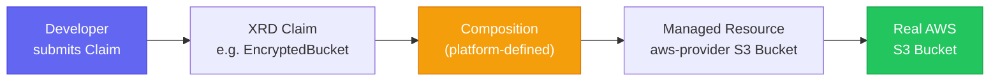

# Crossplane

A Kubernetes-native control plane for AWS resource management. Runs alongside CDK in the [[k8s-bootstrap-pipeline]] project, providing an **Internal Developer Platform (IDP)** pattern where developers provision AWS infrastructure by submitting Kubernetes resource claims — no IAM or S3 policy knowledge required.

## Architecture



- **Provider** — AWS provider CRD that maps to real AWS services
- **XRD (Composite Resource Definition)** — simplified golden-path API designed by platform engineers
- **Composition** — expands an XRD claim into one or more Managed Resources with safe defaults
- **Claim** — what a developer or Helm chart submits; the Composition does the rest

## Sync Wave Ordering

| Wave | Component |
|---|---|
| Wave 4 | `crossplane` controller and core CRDs |
| Wave 5 | `crossplane-providers` — AWS provider (requires Crossplane core running) |
| Wave 6 | `crossplane-xrds` — XRD + Composition definitions (requires providers registered) |

The wave ordering prevents a chicken-and-egg: XRDs can't be registered until the Crossplane provider is healthy, and the provider can't be healthy until Crossplane core is running.

## XRD Types

### `EncryptedBucket`

```yaml
apiVersion: platform.nelsonlamounier.com/v1alpha1
kind: EncryptedBucket
metadata:
  name: my-service-uploads
spec:
  parameters:
    bucketName: my-service-uploads
    retentionDays: 30
    environment: development
```

**What the developer gets automatically** (defined in the Composition):
- SSE-S3 encryption (AES256)
- Versioning enabled
- Public access block (all four settings)
- Lifecycle rule (`retentionDays`)
- Standard tagging schema

### `MonitoredQueue`

SQS queue with CloudWatch alarm wired automatically. Developer submits a Claim; the Composition creates the queue + DLQ + alarm.

## Credentials Model

Crossplane uses long-lived IAM credentials stored in a Kubernetes Secret, **separate from the EC2 Instance Profile** used by application pods.

`bootstrap_argocd.py` seeds these credentials at Day-0:

```
provision_crossplane_credentials:
  reads from AWS Secrets Manager → creates K8s Secret
  `crossplane-aws-creds` in `crossplane-system` namespace
```

The `ProviderConfig` references this Secret. Application pods continue to use IMDS for their own AWS SDK calls — the two credential paths don't interfere.

## Deployment

Crossplane is managed by [[argocd]] via the App-of-Apps platform tier. The `golden-path-service` chart template includes optional XRD Claim templates guarded by feature flags:

```yaml
crossplane:
  bucket:
    enabled: false     # set true to provision an EncryptedBucket
    bucketName: ""
    retentionDays: 30
  queue:
    enabled: false     # set true to provision a MonitoredQueue
```

Adding a new service that needs an S3 bucket requires only setting `crossplane.bucket.enabled: true` in the values file — no CDK changes, no IAM work.

## Why Alongside CDK

CDK manages long-lived, rarely-changing infrastructure (VPC, NLB, EBS, ECR). Crossplane manages per-service resources that teams create and delete as services evolve. The split is:

- **CDK** — cluster-wide shared infrastructure (deployed by platform engineers)
- **Crossplane** — per-service AWS resources (provisioned by developers via GitOps)

## Related Pages

- [[argocd]] — manages Crossplane via App-of-Apps; waves 4/5/6
- [[k8s-bootstrap-pipeline]] — project context
- [[cdk-kubernetes-stacks]] — CDK manages the infrastructure layer Crossplane sits on top of
- [[patterns/helm-chart-architecture]] — golden-path service template with XRD Claim feature flags
