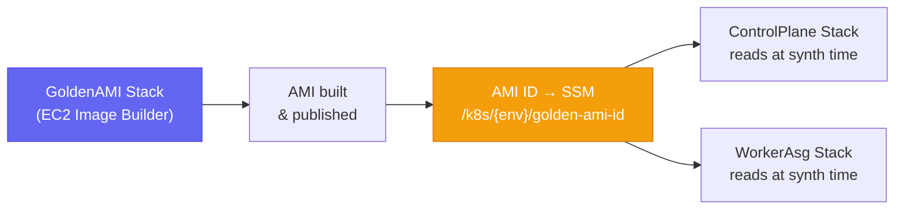

# EC2 Image Builder (Golden AMI)

The `GoldenAmiStack` orchestrates an EC2 Image Builder pipeline that bakes a "Golden AMI" pre-loaded with the full Kubernetes toolchain. Deployed first in the [[cdk-kubernetes-stacks|stack deployment order]] to break the chicken-and-egg problem: the AMI must exist before compute stacks can reference it in their launch configurations.

## Why a Golden AMI

Without pre-baked binaries, every EC2 instance would download and install `kubeadm`, `kubelet`, `kubectl`, `containerd`, and dependencies at boot time. This pushes node bootstrap time to **~15 minutes** per node, creating multi-node delays during ASG scaling events.

The Golden AMI reduces this to **~2–3 minutes** — the toolchain is already present, and `control_plane.py` / `worker.py` only perform configuration steps.

## Golden AMI Contents

| Package | Role |
|---|---|
| `kubeadm` | Cluster initialisation and join |
| `kubelet` | Node agent (systemd service) |
| `kubectl` | CLI for cluster management |
| `containerd` | Container runtime |
| `aws-cli` | S3 script downloads, SSM interactions |
| `python3` | Bootstrap script interpreter |
| `helm` | Helm chart installations during bootstrap |
| Calico binaries | CNI installation (Tigera operator + manifests) |
| CloudWatch agent | Log and metric shipping to CloudWatch |
| Python venv (`/opt/k8s-venv/`) | Isolated environment with `boto3`, `pyyaml` |

## Lifecycle



**Decoupled lifecycle:** AMI builds happen independently from compute stack deployments. A new AMI does not force a CloudFormation update — the ASG's `LaunchTemplate` reads the AMI ID from SSM, so rotating the AMI only requires an ASG rolling update triggered from CI.

## SSM Parameter

The pipeline publishes the built AMI ID to:

```
/k8s/{env}/golden-ami-id
```

Both `K8sControlPlaneStack` and `KubernetesWorkerAsgStack` read this parameter at CDK synth time to populate their `LaunchTemplate` AMI reference.

## IAM Pattern

The `K8sGoldenAmiConstruct` creates the minimal Image Builder service role required by EC2 Image Builder:
- `EC2InstanceProfileForImageBuilder`
- `EC2InstanceProfileForImageBuilderECRContainerBuilds`

## AMI Sharing

The Golden AMI is shared within the same AWS account only. No cross-account sharing in the current architecture — each environment (development, staging, production) has its own Image Builder pipeline.

## Related Pages

- [[self-hosted-kubernetes]] — bootstrap scripts that run on the Golden AMI
- [[cdk-kubernetes-stacks]] — Stack 2 in the deployment order; prerequisite for CP and Worker stacks
- [[k8s-bootstrap-pipeline]] — full pipeline that uses the AMI
- [[aws-ssm]] — SSM parameter `/k8s/{env}/golden-ami-id`
