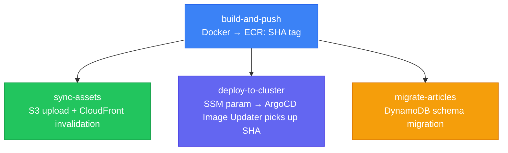

# GitHub Actions

CI/CD platform for the [[k8s-bootstrap-pipeline]]. Uses OIDC for AWS credential federation and a custom Docker CI image. Chosen over Jenkins, CircleCI, and CodePipeline.

## Pipeline Structure

| Workflow | Purpose |
|----------|---------|
| `deploy-kubernetes.yml` | CDK stack deployment for K8s infra (SM-A, SM-B, EventBridge, IAM, EC2) |
| `deploy-ssm-automation.yml` | Sync scripts to S3, trigger SM-A (Phase 4), verify health (Phase 5), trigger SM-B (Phase 6) |
| `deploy-post-bootstrap.yml` | SM-B only — secret rotation or targeted config re-injection |
| `gitops-k8s.yml` | ArgoCD GitOps sync for platform charts (Traefik, cert-manager, monitoring) |
| `deploy-api.yml` | Docker builds for admin-api, public-api → ECR |
| `deploy-frontend.yml` | Next.js + start-admin builds → ECR |
| `deploy-bedrock.yml` | AI/ML stack (Bedrock, Lambda, DynamoDB) |

## OIDC Credential Federation

No static AWS credentials anywhere in the pipeline. GitHub OIDC token is exchanged for temporary STS credentials:

```yaml
permissions:
  id-token: write

- uses: aws-actions/configure-aws-credentials@v4
  with:
    role-to-assume: ${{ secrets.AWS_OIDC_ROLE }}
    aws-region: ${{ vars.AWS_REGION }}
```

The IAM role trust policy restricts which repository and branch can assume it.

## Custom CI Docker Image

`ghcr.io/nelson-lamounier/cdk-monitoring/ci:latest` pre-installs Node.js, Yarn, Python 3, boto3, pytest, AWS CLI v2, just, kubectl, helm, kubeadm. Reduces runner startup from ~3-5 min of installs to ~15 sec image pull.

## Monorepo Path Scoping

Each pipeline triggers only when relevant files change:

```yaml
on:
  push:
    paths:
      - "kubernetes-app/k8s-bootstrap/**"   # → deploy-ssm-automation.yml
      - "kubernetes-app/workloads/charts/**" # → deploy-ssm-automation.yml
```

## Frontend Deployment Pipeline (4 Parallel Tracks)

`deploy-frontend.yml` orchestrates Next.js and start-admin deployments via 4 parallel jobs that must all come from the same `${{ github.sha }}` to maintain build hash alignment:



**Build alignment invariant:** The container image and S3 static assets must come from the **same build**. Next.js generates content-hashed CSS/JS filenames at build time — a mismatch causes `404` errors for all static assets. See [[nextjs-image-asset-sync]].

### ArgoCD Parameter Override (self-heal safe)

When `selfHeal: true` is enabled, `kubectl set image` is reverted. Use ArgoCD parameter override instead:

```bash
kubectl patch application nextjs -n argocd --type merge -p '{
  "spec": {
    "source": {
      "helm": {
        "parameters": [
          {"name": "image.tag", "value": "<SHA_TAG>"}
        ]
      }
    }
  }
}'
```

This modifies the ArgoCD Application spec itself (the source of truth for ArgoCD) — not the live cluster state. ArgoCD treats it as the desired state and deploys it.

## Concurrency: App vs Infra Pipelines

| Pipeline type | `cancel-in-progress` | Reason |
|---|---|---|
| App pipelines (frontend, api) | `true` | Latest commit wins; stale deploy is useless |
| Infra pipelines (CDK, SSM automation) | `false` | Mid-flight CloudFormation or `kubeadm init` must complete; cancellation leaves cluster in unknown state |

## Security Hardening

**Immutable image tags**: `${github.sha}-r${github.run_attempt}` — prevents ECR tag overwrite with stale layers across retries.

**Pinned action SHA versions**: All marketplace actions pinned to a commit SHA (`@de0fac2e4500...`), not a version tag. Version tags are mutable; SHA pins are not. A `# v4.1.0` comment preserves readability.

**AROA masking**: The custom `_configure-aws.yml` reusable workflow masks the IAM role's internal unique identifier (AROA) in all logs — prevents IAM reconnaissance via CloudTrail cross-reference. Standard OIDC credential federation does not do this.

## TypeScript Scripting Layer

All non-trivial CI logic lives in typed TypeScript scripts rather than inline Bash (`infra/scripts/ci/`):

| Script | Purpose |
|---|---|
| `pipeline-setup.ts` | Commit metadata, AWS account validation, AROA mask, SSM → CDK context |
| `preflight-checks.ts` | Account ID regex, region regex, CDK bootstrap verification |
| `synthesize.ts` | Single CDK synth → `cdk.out/` artifact + stack name outputs |
| `security-scan.ts` | Checkov orchestration, severity gating, SARIF output |

Key advantage over Bash: `JSON.stringify()` handles commit messages with special characters and newlines — Bash heredoc quoting is fragile on edge cases.

See [[ci-cd-pipeline-architecture]] for the full 26-workflow architecture.

## Related Pages

- [[k8s-bootstrap-pipeline]] — project context
- [[ci-cd-pipeline-architecture]] — full 26-workflow architecture, TypeScript scripting layer, security model
- [[aws-step-functions]] — triggered by GHA phases
- [[shift-left-validation]] — local tests before CI
- [[infra-testing-strategy]] — CDK testing pyramid run by CI
- [[checkov]] — IaC security scanning run by security-scan.ts
- [[nextjs-image-asset-sync]] — build hash alignment; parallel track dependency; ArgoCD override
- [[argo-rollouts]] — BlueGreen deployment triggered by Image Updater after pipeline
