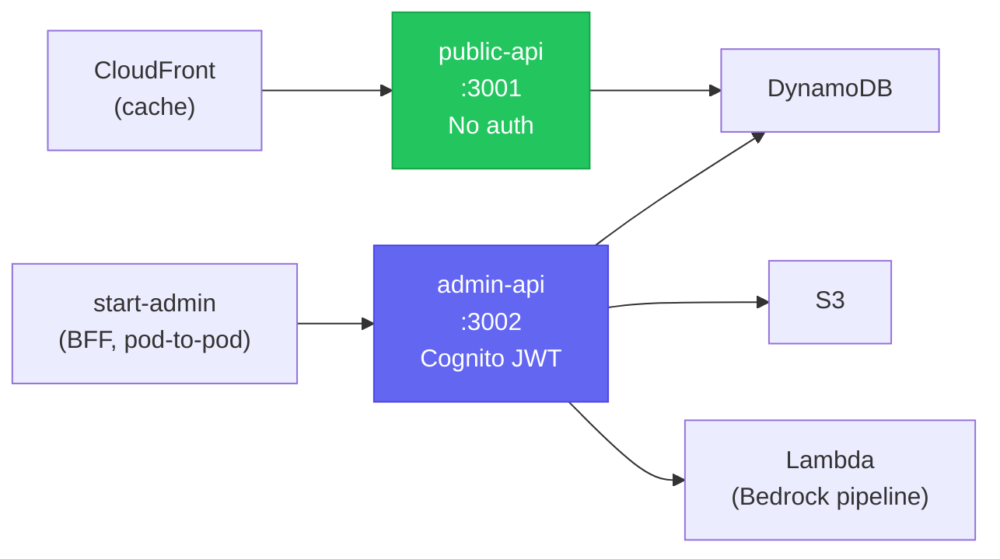

# Hono

Lightweight TypeScript web framework running on `@hono/node-server`. Used for both in-cluster API services in the [[k8s-bootstrap-pipeline]] project: `public-api` (port 3001) and `admin-api` (port 3002).

## Services Overview

## `public-api` — Port 3001

**Auth:** None (public, read-only).

| Route | Cache-Control | Data source |
|---|---|---|
| `GET /healthz` | — | — |
| `GET /api/articles` | `s-maxage=300, stale-while-revalidate=60` | DynamoDB GSI1 (`gsi1-status-date`), `STATUS#published` |
| `GET /api/articles/:slug` | `s-maxage=300, stale-while-revalidate=60` | DynamoDB `GetItem` |
| `GET /api/tags` | `s-maxage=300` | DynamoDB scan |
| `GET /api/resumes/active` | `s-maxage=300, stale-while-revalidate=600` | DynamoDB (Strategist table); graceful 204 if unconfigured |

The `s-maxage` Cache-Control headers instruct CloudFront to cache responses at the edge for 5 minutes, reducing DynamoDB reads on high-traffic public listing endpoints.

**CORS:** `https://nelsonlamounier.com` and `http://localhost:3000`. Methods restricted to `GET, HEAD, OPTIONS`.

## `admin-api` — Port 3002

**Auth:** Cognito JWT middleware on all `/api/admin/*` routes. `/healthz` is unauthenticated (Kubernetes liveness/readiness probes cannot send JWTs).

Key routes:

| Route | Method | Backend |
|---|---|---|
| `GET /api/admin/articles` | GET | DynamoDB GSI1 fan-out across `all\|draft\|review\|published\|rejected` |
| `PUT /api/admin/articles/:slug` | PUT | DynamoDB `UpdateCommand`, syncs `gsi1pk` on status change |
| `DELETE /api/admin/articles/:slug` | DELETE | Parallel cascade delete: `METADATA` + `CONTENT#<slug>` |
| `POST /api/admin/articles/:slug/publish` | POST | Lambda `InvokeCommand` (`InvocationType: Event`) → Bedrock pipeline |
| `GET /api/admin/finops/realtime` | GET | CloudWatch `BedrockMultiAgent` namespace |
| `GET /api/admin/finops/costs` | GET | Cost Explorer (`us-east-1`, always) |
| `GET /api/admin/finops/chatbot` | GET | CloudWatch `BedrockChatbot` namespace |
| `GET /api/admin/finops/self-healing` | GET | CloudWatch `self-healing-development/SelfHealing` |

**Publish flow:** `POST .../publish` invokes the Bedrock publish Lambda with `InvocationType: 'Event'` (fire-and-forget async). The Lambda carries the slug, triggering user (from JWT `sub`), and timestamp.

**CORS:** `https://nelsonlamounier.com` only. Retained as defence-in-depth after the [[bff-pattern|BFF migration]] — the browser no longer calls `admin-api` directly.

## Credential Model — IMDS Only

Both services use the EC2 Instance Profile (IMDS) for all AWS SDK calls:

- No AWS credentials in Kubernetes Secrets or ConfigMaps
- `AWS_DEFAULT_REGION` injected from the `nextjs-config` / `admin-api-config` ConfigMap
- Cognito client IDs (non-secret) stored in `admin-api-secrets` for JWT middleware configuration
- Automatic rotation — credentials cycle with instance role without any deployment

This is the recommended pattern for EC2-hosted pods without IRSA (no EKS IAM role for service accounts available in self-hosted Kubernetes).

## DynamoDB Access Pattern

The article listing uses a GSI (`gsi1-status-date`) with `gsi1pk = STATUS#published` to retrieve all published articles without a full table scan. On status change (`draft` → `review` → `published`), `admin-api` updates `gsi1pk` so the GSI stays consistent.

## Related Pages

- [[bff-pattern]] — why `admin-api` is only called pod-to-pod
- [[k8s-bootstrap-pipeline]] — deployment context; SM-B configures `admin-api` secrets and ConfigMaps
- [[observability-stack]] — FinOps routes in `admin-api` surface token costs from CloudWatch
- [[self-healing-agent]] — `admin-api` `/finops/self-healing` route surfaces remediation token costs
