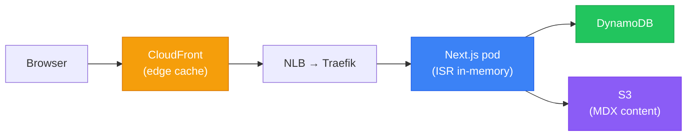

# Next.js

Next.js 15 (App Router) powers `apps/site` in the [[frontend-portfolio]] monorepo — the public portfolio at `nelsonlamounier.com`. It was chosen specifically for three capabilities that the [[k8s-bootstrap-pipeline]] deployment model relies on: `output: 'standalone'`, the `instrumentation.ts` hook, and Incremental Static Regeneration (ISR).

## Why Next.js 15

| Requirement | How Next.js 15 meets it |
|---|---|
| Self-contained container | `output: 'standalone'` — copies all dependencies into one directory, no `node_modules` at runtime |
| OTel SDK integration | `instrumentation.ts` hook runs before any request handler — correct injection point for OTel SDK init |
| ISR for static articles | Pages revalidate on a timer without a full rebuild; cache purged on content publish |
| React Server Components | Reduces client bundle size; runs AWS SDK calls server-side |

## API Routes

Seven route handlers in `app/api/`:

| Route | Auth | Purpose |
|---|---|---|
| `/api/health` | None | Pod liveness/readiness check |
| `/api/metrics` | SSM Bearer token | Prometheus metrics scrape target |
| `/api/chat` | None (public) | Bedrock Agent proxy for AI chat |
| `/api/articles` | None | Article listing (DynamoDB) |
| `/api/portfolio` | None | Portfolio data |
| `/api/revalidate` | None (⚠️ gap) | On-demand ISR cache purge |
| `/log-proxy` | None | Grafana Faro RUM proxy (avoids CORS) |

### `/api/metrics` — Prometheus Endpoint

```typescript
// SSM Bearer auth + 5-minute in-process cache
const token = await getCachedBearerToken()  // SSM GetParameter, cached 5 min
if (request.headers.get('Authorization') !== `Bearer ${token}`) {
  return new Response('Unauthorized', { status: 401 })
}
// prom-client registry
return new Response(await register.metrics(), { headers: { 'Content-Type': register.contentType } })
```

The 60-second backoff prevents SSM call storms on auth failures. The in-process cache is cold on pod restart — the first Prometheus scrape after restart may fail if SSM responds slowly.

### `/log-proxy` — Faro RUM Rewrite

The Faro SDK sends telemetry to `window.location.origin/log-proxy`, which Next.js rewrites to the Grafana Alloy Faro receiver. This sidesteps the CORS restrictions that would block a direct browser → Alloy call.

```js
// next.config.js
async rewrites() {
  return [{ source: '/log-proxy/:path*', destination: `${ALLOY_FARO_URL}/:path*` }]
}
```

## Data Layer

**DynamoDB single-table design** for article metadata and resume data:

| Entity | PK | SK | Key fields |
|---|---|---|---|
| Article | `ARTICLE#<slug>` | `META` | title, tags, status, contentRef |
| Resume | `RESUME#v1` | `DATA` | JSON resume fields |

`contentRef` is an S3 key — large MDX bodies are stored in S3, not in DynamoDB items. The Route Handler fetches the S3 object on cache miss.

**No Redis/Elasticache** — the CloudFront + ISR caching stack handles >99% of read traffic at portfolio scale without a cache tier.

## Caching Architecture



Three-layer caching: CloudFront edge → Next.js ISR → AWS SDK response. On content publish, the admin triggers `/api/revalidate` to purge ISR cache, and a CloudFront invalidation is issued separately.

## Observability

### OTel Distributed Tracing

Initialised in `instrumentation.ts` (Next.js server startup hook):

```typescript
// instrumentation.ts
export async function register() {
  if (process.env.NEXT_RUNTIME === 'nodejs') {
    const { NodeSDK } = await import('@opentelemetry/sdk-node')
    const sdk = new NodeSDK({
      exporter: new OTLPTraceExporter({ url: process.env.OTEL_EXPORTER_OTLP_ENDPOINT }),
      instrumentations: [
        getNodeAutoInstrumentations(),   // HTTP, fetch, DNS
        new AwsInstrumentation(),        // AWS SDK v3 calls
      ],
      resource: new Resource({ [SEMRESATTRS_SERVICE_NAME]: 'nextjs-site' }),
    })
    sdk.start()
    process.on('SIGTERM', () => sdk.shutdown())  // graceful flush
  }
}
```

`OTEL_SDK_DISABLED=true` in the Dockerfile default — SDK only activates when the environment variable is overridden at deploy time (ArgoCD sets it for production).

Traces flow: Next.js → OTLP/gRPC → [[observability-stack|Alloy]] → Tempo.

> ⚠️ **Known gap:** `awsEcsDetector` is configured but the app runs on Kubernetes, not ECS. Replace with `@opentelemetry/resource-detector-container` for accurate container metadata.

### prom-client Metrics

`prom-client` exposes a `/api/metrics` endpoint scraped by [[observability-stack|Prometheus]]. Custom counters:

| Metric | Type | Description |
|---|---|---|
| `http_request_duration_seconds` | Histogram | Per-route request latency |
| `http_request_size_bytes` | Histogram | Request body sizes |
| `aws_api_calls_total` | Counter | AWS SDK call counts by service/operation |

### Grafana Faro RUM

Client-side telemetry via `@grafana/faro-web-sdk`. Browser performance, errors, and user sessions are collected and shipped through the `/log-proxy` rewrite to Alloy's Faro receiver. See [[observability-stack]] for the Alloy Faro/RUM section.

## Security

Six security headers applied via Next.js `middleware.ts`:

| Header | Value |
|---|---|
| `Strict-Transport-Security` | `max-age=31536000; includeSubDomains` |
| `X-Frame-Options` | `DENY` |
| `X-Content-Type-Options` | `nosniff` |
| `Referrer-Policy` | `strict-origin-when-cross-origin` |
| `Permissions-Policy` | Feature restrictions |
| `X-XSS-Protection` | `1; mode=block` |

> ⚠️ **Gap:** No `Content-Security-Policy` header. This is the most significant security gap in `apps/site`. Unlike `apps/start-admin` (which has full CSP), the public site omits it. Fix: add nonce-based or hash-based CSP to the middleware.

> ⚠️ **Gap:** `/api/revalidate` has no token validation — an unauthenticated caller can trigger cache purges. Fix: validate a shared secret before processing.

> ⚠️ **Gap:** `/api/chat` (Bedrock proxy) has no local rate limiter. API Gateway handles upstream limits, but the Next.js layer is unprotected. Fix: apply the existing `rate-limiter` utility.

## Docker Build

4-stage multi-stage Dockerfile (`apps/site/Dockerfile`):

| Stage | Base | Purpose |
|---|---|---|
| `base` | `node:22-alpine` on AL2023 | Node.js runtime |
| `deps` | `base` | `yarn install --immutable` (full workspace) |
| `builder` | `deps` | `yarn workspace site build` → `output: 'standalone'` |
| `runner` | AL2023 (minimal) | Copies `.next/standalone/` only; UID 1001 non-root |

`output: 'standalone'` is critical: Next.js traces all `require()` calls and copies only the reachable files. The resulting container has no `node_modules` directory — just the traced dependency subset. This reduces image size significantly.

```dockerfile
# runner stage — key lines
COPY --from=builder /app/.next/standalone ./
COPY --from=builder /app/.next/static ./.next/static
COPY --from=builder /app/public ./public
ENV OTEL_SDK_DISABLED=true   # override at deploy time in K8s
USER 1001
```

## MDX Content Pipeline

Articles are authored in MDX. The pipeline:

1. Admin uploads MDX via `start-admin` → `admin-api` → S3
2. DynamoDB article record updated with `contentRef` (S3 key) and metadata
3. Admin triggers `/api/revalidate` → ISR cache purged
4. Next.js Route Handler fetches S3 on next request → renders MDX → caches

`@next/mdx` handles static pages; `next-mdx-remote` handles dynamically-fetched MDX from S3.

## Related Pages

- [[frontend-portfolio]] — project overview, comparative analysis
- [[tanstack-start]] — `apps/start-admin` companion app
- [[hono]] — `admin-api` service that Next.js interacts with via start-admin BFF
- [[observability-stack]] — Prometheus scrape target, Tempo traces destination, Faro receiver
- [[aws-cloudfront]] — CloudFront + WAF edge layer in front of the Next.js pod
- [[traefik]] — cluster ingress routing to the Next.js pod
- [[argocd]] — Image Updater drives continuous deployment
- [[troubleshooting/nextjs-image-asset-sync]] — Image Updater delivery issues and fixes
- [[bff-pattern]] — BFF architecture (start-admin calls admin-api; Next.js site calls AWS directly)
