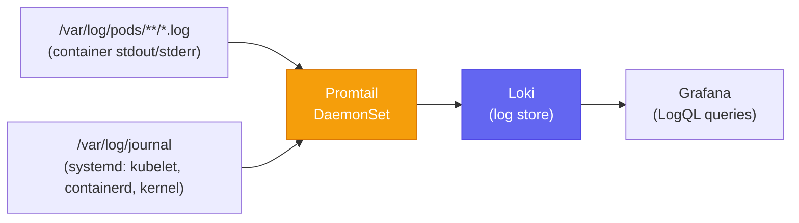

# Promtail

The log shipping agent in the [[observability-stack]]. Runs as a **DaemonSet** — one instance per node — tailing all pod and system logs and forwarding them to [[loki]] for storage and indexing.

> **Promtail is the DaemonSet log shipper.** [[Grafana Alloy]] is a separate component and serves a completely different purpose: it receives Real User Monitoring (RUM) telemetry from browsers via the Grafana Faro SDK.

## Role in the Data Flow



Promtail runs on **every node** (general pool and monitoring pool) so no log line is dropped before it reaches Loki.

## Two Scrape Jobs

### 1. `kubernetes-pods` — Container Logs

Uses `kubernetes_sd_configs` with `role: pod` to discover all running pods. For each pod, Promtail constructs the log file path:

```
/var/log/pods/<uid>/<container>/*.log
```

Each log line is passed through the CRI parser (`cri: {}`) — necessary because container runtimes (containerd) prefix log lines with timestamps and stream identifiers before the actual log text.

**Relabeling applied to each log line:**

| Source | Label added | Example value |
|---|---|---|
| `__meta_kubernetes_namespace` | `namespace` | `nextjs-app` |
| `__meta_kubernetes_pod_name` | `pod` | `nextjs-abc123` |
| `__meta_kubernetes_pod_container_name` | `container` | `nextjs` |
| `__meta_kubernetes_pod_label_app` | `app` | `nextjs` |

This label set enables LogQL queries like:
```logql
{namespace="nextjs-app", container="nextjs"} |= "ERROR"
```

### 2. `journal` — Systemd Journal

Reads from `/var/log/journal`, capturing OS-level logs including:
- **kubelet** — node registration, pod lifecycle events, volume mount failures
- **containerd** — container start/stop, image pull operations
- **kernel** — OOM killer events, network namespace changes

These are labelled `job="systemd-journal"` and are essential for diagnosing node-level failures that happen before any pod starts — including bootstrap failures, CNI initialization errors, and etcd connectivity issues.

## Why Promtail, Not Alloy, for Logs

Grafana Alloy exists in this cluster but serves a different purpose — it receives browser-side Faro SDK telemetry (Web Vitals, JS errors, front-end spans). It is **not** a container log shipper in this deployment.

Promtail is the dedicated log collection path because:
- It integrates directly with the Kubernetes API for pod discovery
- It understands the CRI log format natively
- It handles systemd journal reads
- It has minimal resource overhead as a DaemonSet

## Loki Integration

Promtail pushes log streams to Loki via the Loki push API:

```
POST http://loki.monitoring.svc.cluster.local:3100/loki/api/v1/push
```

Loki stores log lines as compressed chunks indexed only by the label set (namespace, pod, app, etc.) — **not** by full-text. This keeps storage costs low and query performance fast for the label-filtered access patterns typical of Kubernetes debugging.

## Grafana → Loki → Tempo Correlation

The Loki datasource in Grafana is configured with **derived fields** that detect TraceIDs in log lines:

```yaml
derivedFields:
  - datasourceUid: tempo
    matcherRegex: '"traceID":"(\w+)"'
    name: TraceID
    url: "${__value.raw}"
```

When a log line contains `"traceID":"<hex>"`, Grafana adds a clickable link directly to the matching trace in Tempo. This enables the workflow: alert fires → check logs → click TraceID → see full request trace — without any manual correlation.

## Related Pages

- [[observability-stack]] — full monitoring stack; Promtail's place in the LGTM stack
- [[loki]] — the log store Promtail pushes to
- [[traefik]] — ships OTLP traces to Tempo (separate from Promtail log path)
- [[self-hosted-kubernetes]] — node design; all nodes run Promtail DaemonSet
