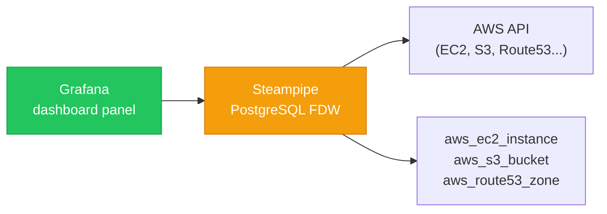
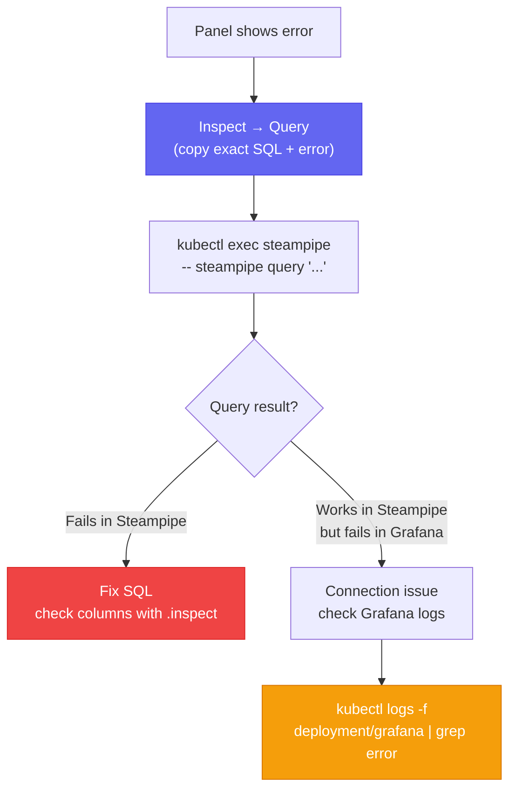

# Steampipe

A SQL query engine for cloud APIs. Runs as a Kubernetes `Deployment` in the `monitoring` namespace and serves as a **PostgreSQL Foreign Data Wrapper (FDW) datasource** for Grafana — enabling SQL queries against AWS resources directly in Grafana dashboards.

## Role in the Observability Stack



Grafana panels that display cloud inventory (EC2 instances, S3 buckets, security groups, NLB metrics) use Steampipe as their data source. The query is written in PostgreSQL SQL; Steampipe translates it to AWS API calls via the `aws` plugin.

Steampipe is configured to query both `eu-west-1` (primary region) and `us-east-1` (where CloudFront and Lambda@Edge resources live).

## Cloud Inventory Dashboard

The `cloud-inventory.json` dashboard queries Steampipe for real-time visibility across:

| Panel | Tables | What it shows |
|---|---|---|
| EBS Volumes & Snapshots | `aws_ebs_volume`, `aws_ebs_snapshot` | Size, type, encryption status, associated instance |
| Security Groups | `aws_vpc_security_group`, `aws_vpc_security_group_rule` | Active rules, which resources use them |
| EC2 Instances | `aws_ec2_instance` | Running instances, tags, state |
| S3 Buckets | `aws_s3_bucket` | Encryption, versioning, public access block |
| Route 53 | `aws_route53_record`, `aws_route53_zone` | DNS records, hosted zones |

**Why Steampipe instead of CloudWatch for inventory?** CloudWatch provides performance metrics for AWS services, not their configuration/inventory state. Steampipe answers "what is deployed?"; Prometheus answers "how is it performing?"

## Running Commands Inside the Pod

```bash
# List installed plugins
kubectl exec -n monitoring deployment/steampipe -- steampipe plugin list

# Run a query (cloud inventory)
kubectl exec -n monitoring deployment/steampipe -- \
  steampipe query "SELECT instance_id, region FROM aws_ec2_instance"

# Test a specific table used in a failing Grafana panel
kubectl exec -n monitoring deployment/steampipe -- \
  steampipe query "SELECT count(*) FROM aws_vpc_security_group_rule"

# Inspect available columns for a table (use when "column X does not exist" errors appear)
kubectl exec -n monitoring deployment/steampipe -- \
  steampipe query ".inspect aws_s3_bucket"

# Check AWS credentials resolve correctly
kubectl exec -n monitoring deployment/steampipe -- env | grep AWS
```

Steampipe uses **IMDS (EC2 Instance Profile)** for AWS credentials — the same model as application pods. `AWS_DEFAULT_REGION` is injected from a ConfigMap.

> **Known issue:** `databasePassword: steampipe` is committed in plaintext in `values.yaml`. While Steampipe is a read-only SQL interface, this is a credential hygiene issue — it should move to a Kubernetes Secret. See [[observability-stack#known-limitations]].

## Grafana Dashboard Debugging Workflow

When a Grafana panel shows "Bad Gateway", "does not exist", or "wrong type":



**Level 1 — Grafana UI (per-panel):** Hover → ⋮ menu → Inspect → Query. Shows exact SQL sent and raw error response. Start here.

**Level 2 — Grafana pod logs (connection errors):**
```bash
kubectl logs -f -n monitoring deployment/grafana | grep -i "error\|failed\|bad gateway"
```
Catches: "Bad Gateway", "No available server" — connection-level failures between Grafana and the Steampipe PostgreSQL datasource.

**Level 3 — Steampipe pod logs (SQL and plugin errors):**
```bash
kubectl logs -f -n monitoring deployment/steampipe
kubectl logs -n monitoring deployment/steampipe --tail=200 | grep -i "error\|fatal\|panic"
# After a crash:
kubectl logs -n monitoring deployment/steampipe --previous --tail=100
```
Catches: "column does not exist", "wrong type", plugin crashes, FDW errors.

## Common SQL Pitfalls

| Symptom | Cause | Fix |
|---|---|---|
| "Invalid input syntax cidr" | `cidr` type in `COALESCE` with `text` | Cast with `::text` |
| "Attribute N wrong type" | `boolean::text` in JOIN/SELECT | Use `CASE WHEN col THEN 'Yes' ELSE 'No' END` |
| "column X does not exist" | Plugin version mismatch | Run `.inspect <table>` to check actual columns |
| "Bad Gateway" / "No available server" | Steampipe FDW overloaded | Reduce concurrent panels or increase pod memory |
| OOMKilled (exit code 137) | Too many concurrent Grafana queries | Increase memory limit; reduce dashboard panel concurrency |

## ConfigMap and Restart Pattern

Steampipe is configured via a `ConfigMap` (`steampipe-config`) mounted into the pod. **ConfigMap changes do not auto-restart pods** — always force a restart after updating:

```bash
# Edit the ConfigMap (in-place edit — will be overwritten by ArgoCD on next sync)
kubectl edit configmap steampipe-config -n monitoring

# Force restart
kubectl rollout restart deployment/steampipe -n monitoring
kubectl rollout status deployment/steampipe -n monitoring
```

For permanent config changes: modify the Helm chart → `git push` → ArgoCD syncs.

## Related Pages

- [[observability-stack]] — Steampipe runs on the monitoring pool; `cloud-inventory.json` dashboard
- [[prometheus-scrape-targets]] — related Grafana datasource debugging context
- [[kubectl-operations]] — full kubectl command reference for day-2 operations
- [[argocd]] — manages Steampipe via the monitoring Helm chart
- [[self-hosted-kubernetes]] — monitoring pool where Steampipe runs
