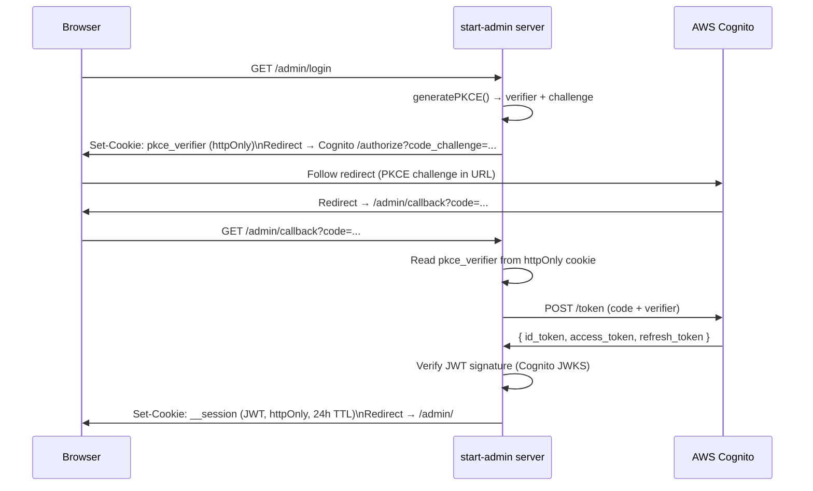

# TanStack Start

TanStack Start (built on Vinxi/Vite) powers `apps/start-admin` in the [[frontend-portfolio]] monorepo — the private admin dashboard mounted at `/admin/` on `nelsonlamounier.com`. It was chosen over Next.js specifically because of `createServerFn` — a type-safe RPC mechanism that eliminates the impedance mismatch between server and client code.

## Why TanStack Start

| Requirement | How TanStack Start meets it |
|---|---|
| Type-safe server functions | `createServerFn` — server-side functions callable from client components with full TypeScript inference; no manual `fetch` / JSON serialisation |
| Vite-native | Faster HMR than webpack; natural fit for a Vite-first toolchain |
| No SSG needed | Admin content is always dynamic — ISR/SSG adds complexity with no benefit |
| TanStack Router | File-based routing with end-to-end type safety; `useNavigate`, `useParams` are typed to the route tree |
| `@tanstack/react-form` | Type-safe form primitives with Zod validation |

## `createServerFn` — Type-Safe RPC

The defining primitive of TanStack Start. A server function is a typed async function that:
1. Runs **only on the server** (never in the browser bundle)
2. Is callable from client components as if it were a local async function
3. Handles serialisation/deserialisation transparently

```typescript
// server/articles.ts
import { createServerFn } from '@tanstack/start'

export const getArticles = createServerFn('GET', async () => {
  requireAuth()  // throws redirect if unauthenticated
  const response = await apiFetch('/api/admin/articles')
  return response.json() as Promise<Article[]>
})

// client component — no fetch, no JSON.parse, full type inference
const articles = await getArticles()
```

The `apiFetch` helper makes pod-to-pod HTTP calls to `admin-api` from the server side, implementing the [[bff-pattern]]. The browser never touches `admin-api` directly.

## Server Module Inventory

12 server modules in `src/server/`:

| Module | Functions | Notes |
|---|---|---|
| `auth.ts` | `getSessionFn`, `loginFn`, `logoutFn`, `callbackFn`, `getUserSessionFn` | Cognito PKCE OAuth; `getUserSessionFn` runs on every route load (applies CSP headers) |
| `articles.ts` | `getArticles`, `getArticle`, `createArticle`, `updateArticle`, `deleteArticle`, `publishArticle` | Auth guard on all |
| `applications.ts` | `getApplications`, `createApplication`, `updateApplication`, `deleteApplication` | CRUD via admin-api |
| `ai.ts` | `generateContent`, `publishWithAI` | Bedrock Agent publish pipeline |
| `resume.ts` | `getResume`, `updateResume` | Resume data management |
| `media.ts` | `uploadMedia`, `deleteMedia` | S3 asset management |
| `cache.ts` | `revalidateCache` | Triggers Next.js ISR purge via `/api/revalidate` |

## AWS Cognito PKCE Auth Flow



**Key security properties:**
- PKCE verifier and challenge are generated server-side — the browser never sees the verifier
- PKCE verifier stored in `httpOnly` cookie — inaccessible to JavaScript
- JWT stored in `httpOnly` cookie — not `localStorage`; XSS cannot exfiltrate it
- No implicit flow — code exchange happens server-side with the verifier

### `requireAuth()` Guard

All non-login server functions call `requireAuth()` as the first statement:

```typescript
export function requireAuth() {
  const session = getSession()
  if (!session) throw redirect({ to: '/admin/login' })
}
```

No accidental public exposure — any server function that omits `requireAuth()` fails at code review by convention.

## Security Posture

Full CSP implemented in `getUserSessionFn` (runs on every route load):

```
Content-Security-Policy:
  default-src 'self';
  script-src 'self' 'unsafe-inline' 'unsafe-eval';   ← Vite SSR requirement
  connect-src 'self' *.nelsonlamounier.com *.amazonaws.com *.amazoncognito.com;
  frame-ancestors 'none'
```

> ⚠️ `unsafe-inline` and `unsafe-eval` are required by Vite SSR. Worth auditing post-build to determine if these can be tightened in production.

Standard headers also applied: HSTS, `X-Frame-Options: DENY`, `X-Content-Type-Options: nosniff`, `Referrer-Policy`.

## Observability

| Layer | Status | Detail |
|---|---|---|
| Grafana Faro RUM | ✅ | `@grafana/faro-web-sdk` — same stack as `apps/site` |
| Prometheus metrics | ❌ | Not configured — node-level metrics cover admin pod resource usage |
| OTel distributed traces | ❌ | Server functions do not emit spans; would improve API latency visibility |

> Gap: Adding `tracer.startActiveSpan()` around `apiFetch` calls in server functions would produce Tempo traces showing `admin-api` call latency from the admin UI layer.

## Testing

Vitest (`vitest: ^3.0.5`) — appropriate for the Vite build pipeline (Jest requires Babel transforms; Vitest uses the same Vite config).

| Test File | What it covers |
|---|---|
| `__tests__/server/auth.test.ts` | JWT verification, login URL generation, PKCE flow, logout |
| `__tests__/server/articles.test.ts` | Article CRUD server functions, `requireAuth()` guard, error handling |
| `__tests__/server/applications.test.ts` | Application CRUD server functions |

All tests mock `@tanstack/react-start/server` (cookie functions) and `fetch` to avoid network calls.

## Containerisation

4-stage multi-stage Dockerfile (`apps/start-admin/Dockerfile`):

| Stage | Purpose |
|---|---|
| `base` | AL2023 + Node.js 22 |
| `deps` | Full `yarn install --immutable` (workspace) |
| `builder` | `yarn workspace start-admin build` (Vite + esbuild SSR bundle → `dist/`) |
| `runner` | Copies `dist/` + `node_modules/` + `server.js`; non-root `startadmin:nodejs` UID 1001 |

Port: `5001`. Health check: `GET /admin/` (status < 500).

Unlike [[nextjs|Next.js standalone]], Vite SSR output still requires `node_modules/` in the runner — no equivalent to `output: 'standalone'` for automatic dependency tracing.

## Tailwind v4

Both apps use Tailwind CSS v4. `apps/start-admin` uses the Vite plugin:

```typescript
// vite.config.ts
import tailwindcss from '@tailwindcss/vite'

export default defineConfig({
  plugins: [tanstackStart(), tailwindcss()],
})
```

vs `apps/site` which uses the PostCSS plugin (webpack/Next.js pipeline).

## Related Pages

- [[frontend-portfolio]] — project overview, comparative analysis with apps/site
- [[nextjs]] — `apps/site` companion app
- [[hono]] — `admin-api` BFF backend that start-admin calls pod-to-pod
- [[bff-pattern]] — BFF architecture pattern implemented via `createServerFn`
- [[observability-stack]] — Faro RUM destination; Alloy receives telemetry
- [[argocd]] — GitOps deployment controller for start-admin
- [[traefik]] — routes `/admin/*` traffic to start-admin pod
