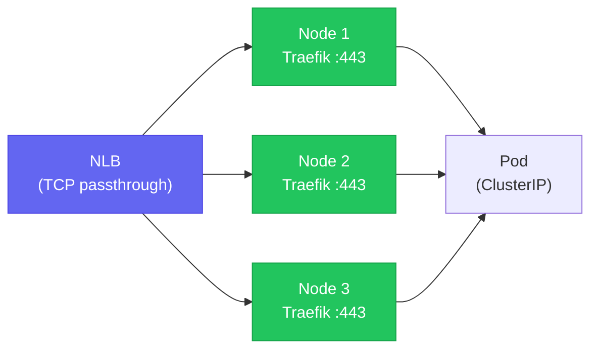

# Traefik

Ingress controller for the self-hosted Kubernetes cluster. Deployed as a **DaemonSet with `hostNetwork: true`** — a deliberate choice driven by the NLB failover model.

## Why DaemonSet + `hostNetwork`

The NLB target group registers **all cluster nodes** (both general and monitoring pools). Any node could receive inbound traffic when an EIP moves. A standard Deployment with `replicas: 1` means Traefik could be scheduled on a node that isn't the current traffic target — requests silently drop.

DaemonSet guarantees Traefik binds ports 80 and 443 on **every node's `eth0`**. The NLB health checks eliminate nodes where Traefik is unhealthy, so traffic is always delivered to a node that is actively listening.



## Helm Values (key settings)

```yaml
deployment:
  kind: DaemonSet
  dnsPolicy: ClusterFirstWithHostNet   # resolves K8s service DNS in host-net mode

hostNetwork: true                      # binds ports 80/443 directly on node eth0

tolerations:
  - key: node-role.kubernetes.io/control-plane   # runs on ALL nodes
  - key: dedicated
    value: monitoring
    effect: NoSchedule                 # runs on monitoring pool too

service:
  enabled: false                       # no K8s Service; EIP is the VIP

updateStrategy:
  type: RollingUpdate
  rollingUpdate:
    maxUnavailable: 1
    maxSurge: 0                        # two pods cannot share the same host port
```

`maxSurge: 0` is critical — with `hostNetwork: true`, two Traefik pods on the same node would both try to bind `:443`, causing a port conflict. Rolling updates proceed one node at a time.

`dnsPolicy: ClusterFirstWithHostNet` is required because `hostNetwork: true` would otherwise use the host's `/etc/resolv.conf` instead of the in-cluster CoreDNS resolver, breaking service-to-service routing.

## TLS Configuration

Traefik terminates TLS using a cert-manager-issued certificate stored as Kubernetes Secret `ops-tls-cert`.

| Traffic segment | Certificate owner | Certificate |
|---|---|---|
| Browser → CloudFront | ACM (wildcard `*.nelsonlamounier.com`) | Managed by AWS |
| CloudFront → NLB → Traefik | cert-manager (DNS-01, cross-account Route 53) | `ops-tls-cert` |
| Traefik → Pod | None (in-cluster, Calico overlay) | N/A |

Public users see the ACM wildcard cert. The `ops-tls-cert` is only visible to CloudFront (acting as origin) and to operators accessing monitoring services directly.

Monitoring services (Grafana, Prometheus) are **not** fronted by CloudFront — they're served directly via Traefik `IngressRoute`, so `ops-tls-cert` is what end-users see for those subdomains.

## Metrics and Tracing

**Prometheus metrics:** Exposed on port `9100` at `/metrics`. Scraped by the in-cluster [[observability-stack|Prometheus]].

**Distributed tracing:** Ships OTLP traces over gRPC to `tempo.monitoring.svc.cluster.local:4317` (insecure — in-cluster only). This provides request-level traces in [[observability-stack|Tempo]] alongside application traces from Next.js and the API services.

## PodDisruptionBudget — Deliberately Disabled

ArgoCD v3's PDB health check incorrectly marks DaemonSet PDBs as `Degraded` whenever `disruptionsAllowed == 0` — which happens whenever only one replica is running on a node. This is a known upstream behaviour. The Traefik PDB is deliberately not created; rolling update behaviour is controlled by `maxUnavailable: 1` in the DaemonSet update strategy.

## IP Allowlist (Monitoring Routes)

An IP allowlist Traefik middleware is created in step 7b of the [[argocd]] bootstrap, restricting access to monitoring `IngressRoute`s to operator IPs only. This prevents public exposure of Grafana and Prometheus without an additional auth layer.

## Related Pages

- [[k8s-bootstrap-pipeline]] — where Traefik is installed and configured
- [[argocd]] — ArgoCD manages Traefik via App-of-Apps after bootstrap
- [[observability-stack]] — Prometheus scrapes Traefik; Tempo receives OTLP traces
- [[calico]] — Calico overlay handles pod-to-pod routing after Traefik forwards requests
- [[argo-rollouts]] — Blue/Green promotion interacts with Traefik IngressRoute
