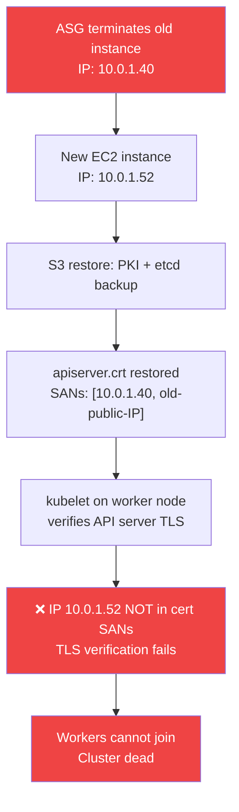

# Control Plane Certificate SAN Mismatch

Post-ASG replacement failure mode where the Kubernetes API server certificate contains Subject Alternative Names (SANs) for the old instance's IPs. The new instance has a different private IP — kubelet TLS verification fails, nodes cannot join, and the cluster is inoperative.

## Root Cause

The DR path restores the API server certificate from S3 backup. That backup was created with the previous instance's private IP (`10.0.1.40`) in the SANs. After ASG replacement, the new instance gets a new IP (`10.0.1.52`). The cert is now stale.



**Note**: The [[disaster-recovery]] `_reconstruct_control_plane()` path includes cert regeneration as step 6 when running the automated DR path. This failure occurs when the backup restore runs but `_reconstruct_control_plane()` is not triggered (e.g., partial bootstrap failure, interrupted execution).

---

## Symptoms

- `kubectl get nodes` returns connection refused or TLS errors
- Worker nodes show `NotReady` — kubelet logs show `x509: certificate is valid for 10.0.1.40, not 10.0.1.52`
- `just diagnose` Phase 3 output:
  ```
  ✗  DR: Certificate SANs  [CRITICAL]
       ⚠ MISMATCH: Cert SANs [10.0.1.40, 54.12.x.x] do NOT include current IP 10.0.1.52
  ```

---

## Diagnosis

```bash
# Step 1: Full control-plane diagnostic
just diagnose
# OR with explicit profile:
npx tsx scripts/local/control-plane-troubleshoot.ts --profile dev-account

# Step 2: Check cert SANs manually via SSM (if just diagnose unavailable)
aws ssm send-command \
  --instance-ids $(aws ssm get-parameter --name /k8s/development/instance-id --query Parameter.Value --output text) \
  --document-name AWS-RunShellScript \
  --parameters 'commands=["openssl x509 -noout -text -in /etc/kubernetes/pki/apiserver.crt | grep -A1 'Subject Alternative'"]' \
  --region eu-west-1 --profile dev-account

# Step 3: Get current instance private IP
aws ssm send-command \
  --instance-ids <INSTANCE_ID> \
  --document-name AWS-RunShellScript \
  --parameters 'commands=["TOKEN=$(curl -sX PUT http://169.254.169.254/latest/api/token -H '"'"'X-aws-ec2-metadata-token-ttl-seconds:21600'"'"') && curl -s -H \"X-aws-ec2-metadata-token: $TOKEN\" http://169.254.169.254/latest/meta-data/local-ipv4"]'
```

---

## Fix — Option A: Automated (Recommended)

```bash
# Via the --fix flag on the diagnostic script
just diagnose --fix

# Or directly:
just fix-cert
# runs: npx tsx scripts/local/control-plane-autofix.ts --profile dev-account
```

`control-plane-autofix.ts` executes the repair sequence via SSM RunCommand:
1. Runs full Phase 1–3 diagnostic — aborts if instance unreachable
2. Stop kube-apiserver static pod (`crictl rm`)
3. Remove stale `apiserver.crt` and `apiserver.key`
4. Run `kubeadm init phase certs apiserver --apiserver-cert-extra-sans=<private-IP>,<public-IP>,<hostname>`
5. Restart kubelet (`systemctl restart kubelet`)
6. Wait for node `Ready` condition (polls `/healthz`)
7. Update SSM parameter `/k8s/development/control-plane-endpoint`
8. Runs post-repair Phase 4 diagnostic automatically

`--dry-run` flag prints all commands without executing them.

---

## Fix — Option B: Manual Bash Script (Emergency Fallback)

`fix-control-plane-cert.sh` predates the TypeScript autofix and requires no Node.js:

```bash
# Run from local machine (uses SSM to execute on the instance)
bash scripts/fix-control-plane-cert.sh --profile dev-account --env development
```

**Why this exists**: Emergency fallback when TypeScript scripts fail due to Node.js version mismatch. 274 lines, minimal dependencies, easy to audit under stress.

**Key detail — IMDSv2 token-based metadata** (required because EC2 instances have `HttpTokens: required`):
```bash
TOKEN=$(curl -sX PUT http://169.254.169.254/latest/api/token \
    -H X-aws-ec2-metadata-token-ttl-seconds:21600)
PRIVATE_IP=$(curl -s -H "X-aws-ec2-metadata-token: $TOKEN" \
    http://169.254.169.254/latest/meta-data/local-ipv4)
```

**Repair steps (Bash)**:
```
1. Fetch instance ID from SSM (/k8s/development/instance-id)
2. Diagnose: extract current IPs via IMDS, dump cert SANs via openssl
3. If SAN mismatch:
   a. Delete apiserver.crt and apiserver.key
   b. kubeadm init phase certs apiserver --apiserver-cert-extra-sans=<IPs>
   c. Restart kube-apiserver static pod
   d. Restart kubelet
4. Post-fix:
   a. Label node as control-plane
   b. Remove uninitialized taint
   c. Uninstall failed aws-cloud-controller-manager Helm release
   d. Wait for node Ready
```

---

## Fix — Option C: Automated DR Path

If the full DR path is acceptable (RTO ~5–8 min, etcd restored from backup):

```bash
# Trigger full SSM Automation bootstrap
aws ssm start-automation-execution \
  --document-name <control-plane-doc-name> \
  --parameters "InstanceId=<INSTANCE_ID>,SsmPrefix=/k8s/development,S3Bucket=<scripts-bucket>" \
  --region eu-west-1 --profile dev-account
```

`_reconstruct_control_plane()` includes cert regeneration as step 6 — covers this failure mode as part of the complete DR sequence. See [[disaster-recovery]].

---

## Verification

```bash
# Confirm cert SANs now include the current IP
just diagnose --skip-k8s   # Phases 1–3 only — fast verification

# OR check nodes manually
aws ssm send-command \
  --instance-ids <INSTANCE_ID> \
  --document-name AWS-RunShellScript \
  --parameters 'commands=["export KUBECONFIG=/etc/kubernetes/admin.conf && kubectl get nodes -o wide"]'
```

Expected: All nodes `Ready`, no TLS errors in kubelet logs.

---

## Prevention

The [[operational-scripts|`ebs-lifecycle-audit.ts`]] pre-deployment check catches `DeleteOnTermination: true` before it causes an instance replacement. For the cert SAN issue specifically, there is no pre-deployment prevention — it is inherent to the ASG-managed control plane architecture. The mitigation is fast detection and automated repair.

**Future hardening**: pin the control-plane to a fixed private IP using an ENI with a static private IP allocation, eliminating the IP change on replacement. Current constraint: costs one ENI per replacement cycle but removes the cert SAN class of failures entirely.

---

## Related Pages

- [[disaster-recovery]] — the DR path (Option C above); `_reconstruct_control_plane` step 6 handles cert SANs automatically
- [[operational-scripts]] — `control-plane-troubleshoot.ts` and `control-plane-autofix.ts` implementation details
- [[kube-proxy-missing-after-dr]] — adjacent DR failure mode (kube-proxy not deployed after second-run path)
- [[aws-ssm]] — SSM RunCommand as the remote execution layer for all repair steps
- [[self-hosted-kubernetes]] — ASG-managed control-plane topology that produces this failure mode
