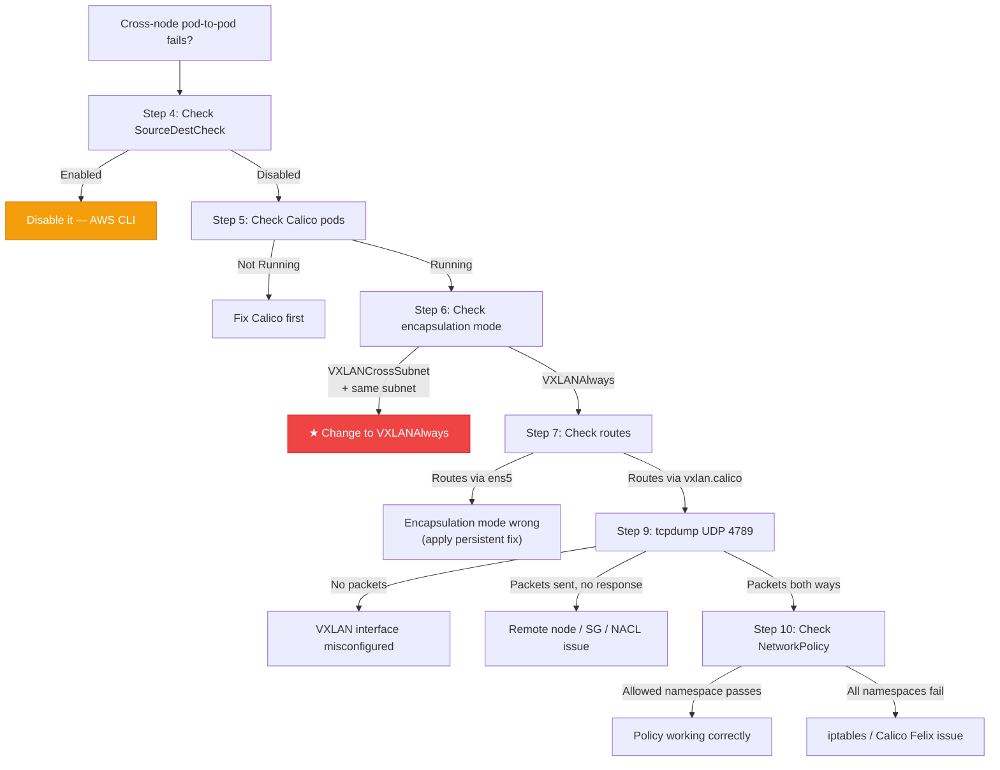

# Cross-Node Networking Troubleshooting

10-step diagnostic guide for cross-node pod networking failures on a kubeadm Kubernetes cluster running [[calico]] CNI on AWS EC2. All commands run from the control-plane node via SSM session.

## Quick Health Check

Run this one-liner first. If it returns `200`, cross-node networking is healthy and you don't need this guide.

```bash
REMOTE_POD_IP=$(kubectl get pods -n nextjs-app -l app=nextjs \
  -o jsonpath='{.items[0].status.podIP}')
echo "Testing connectivity to $REMOTE_POD_IP"
kubectl run test-curl --rm -it --restart=Never --image=curlimages/curl \
  -n kube-system -- curl -s -o /dev/null -w "%{http_code}" \
  --connect-timeout 5 http://$REMOTE_POD_IP:3000/api/health
```

| Result | Diagnosis |
|---|---|
| `200` | Cross-node networking is healthy |
| `000` | Cross-node networking is broken — follow this guide |

## Diagnostic Decision Tree



---

## Step 1 — Verify Node Status

```bash
kubectl get nodes -o wide
```

Expected: all nodes `Ready`, correct `INTERNAL-IP` values, no `NotReady` state.

> Fix `NotReady` nodes first. Cross-node networking requires all nodes healthy.

---

## Step 2 — Identify Pod Placement

```bash
# See which pods are on which nodes
kubectl get pods -A -o wide | grep -E "NAME|nextjs|traefik|calico-node"

# Verify pod IPs are in the expected /26 CIDR block per node
kubectl get pods -A -o custom-columns=\
'NAME:.metadata.name,IP:.status.podIP,NODE:.spec.nodeName' | head -20
```

Cross-node issues only affect pods on **different** nodes. Confirm the failing pods are on separate nodes before proceeding.

---

## Step 3 — Same-Node vs Cross-Node Test

The critical isolation test:

```bash
NEXTJS_POD=$(kubectl get pods -n nextjs-app -l app=nextjs -o jsonpath='{.items[0].metadata.name}')
NEXTJS_IP=$(kubectl get pod -n nextjs-app $NEXTJS_POD -o jsonpath='{.status.podIP}')
NEXTJS_NODE=$(kubectl get pod -n nextjs-app $NEXTJS_POD -o jsonpath='{.spec.nodeName}')

# Test from the SAME node
TRAEFIK_SAME=$(kubectl get pods -n kube-system -l app.kubernetes.io/name=traefik \
  --field-selector spec.nodeName=$NEXTJS_NODE -o jsonpath='{.items[0].metadata.name}')
kubectl exec -n kube-system $TRAEFIK_SAME -- wget -qO- --timeout=3 \
  http://$NEXTJS_IP:3000/api/health

# Test from a DIFFERENT node
kubectl run test-curl --rm -it --restart=Never --image=curlimages/curl \
  -n kube-system -- curl -s -o /dev/null -w "%{http_code}" \
  --connect-timeout 5 http://$NEXTJS_IP:3000/api/health
```

| Same-node | Cross-node | Diagnosis |
|---|---|---|
| ✅ | ✅ | Networking healthy |
| ✅ | ❌ | **Cross-node networking issue** — continue to Step 4 |
| ❌ | ❌ | Pod-level issue (NetworkPolicy, CNI, pod health) |

---

## Step 4 — SourceDestCheck

AWS EC2's `SourceDestCheck` must be `false` on all cluster nodes. When enabled, the hypervisor drops packets whose source/dest IPs don't match the ENI — which includes all pod IPs.

```bash
# Check all running K8s instances
aws ec2 describe-instances \
  --filters "Name=instance-state-name,Values=running" \
  --query 'Reservations[].Instances[].[InstanceId,
    Tags[?Key==`Name`].Value|[0],
    NetworkInterfaces[0].SourceDestCheck]' \
  --output table --region eu-west-1 --profile dev-account
```

Expected: all instances show `False`.

**Fix if needed:**
```bash
aws ec2 modify-instance-attribute \
  --instance-id <INSTANCE_ID> \
  --no-source-dest-check \
  --region eu-west-1 --profile dev-account
```

> In this cluster, `SourceDestCheck` is disabled by CDK in `control-plane-stack.ts` and `worker-asg-stack.ts` via `disableSourceDestCheck: true` on the LaunchTemplate. If you see it enabled, the launch template may not have applied.

---

## Step 5 — Calico CNI Health

```bash
# All calico-node pods must be Running
kubectl get pods -n calico-system -l k8s-app=calico-node -o wide

# Tigera operator
kubectl get pods -n tigera-operator

# Felix logs (per-node agent that programs iptables and VXLAN)
CALICO_POD=$(kubectl get pods -n calico-system -l k8s-app=calico-node \
  --field-selector spec.nodeName=$(hostname) -o jsonpath='{.items[0].metadata.name}')
kubectl logs -n calico-system $CALICO_POD -c calico-node --tail=50 \
  | grep -iE "error|warn|vxlan|fail"
```

Expected: one `calico-node` pod per node, all `1/1 Running`.

---

## Step 6 — Encapsulation Mode (Most Critical)

```bash
kubectl get ippools -o jsonpath='{range .items[*]}{.metadata.name}: \
  vxlanMode={.spec.vxlanMode}, cidr={.spec.cidr}{"\n"}{end}'
```

| Mode | Behaviour | AWS Single-Subnet |
|---|---|---|
| `VXLANAlways` | All cross-node traffic VXLAN-encapsulated | ✅ Works |
| `VXLANCrossSubnet` | Same-subnet nodes use direct routing | ❌ Fails (packets dropped by VPC) |
| `None` | Direct routing only | ❌ Always fails on AWS VPC |

> **Root cause** for this cluster's production outage: `VXLANCrossSubnet` was configured. Since all nodes are in a single subnet, Calico used direct routing — sending packets with pod IPs onto the VPC. AWS VPC has no route for pod IPs and silently drops them.

---

## Step 7 — Routing Table

```bash
ip route | grep 192.168
```

**VXLANAlways (correct):**
```
192.168.101.0/26 via 192.168.101.0 dev vxlan.calico onlink   ← ✅
192.168.177.0/26 via 192.168.177.0 dev vxlan.calico onlink   ← ✅
```

**VXLANCrossSubnet (broken):**
```
192.168.101.0/26 via 10.0.0.160 dev ens5   ← ❌ Direct route through ENI
192.168.177.0/26 via 10.0.0.26  dev ens5   ← ❌ Direct route through ENI
```

Routes via `ens5` (ENI) instead of `vxlan.calico` confirm the encapsulation mode is wrong.

---

## Step 8 — Security Groups and NACLs

```bash
# Get the SG attached to an instance
SG_ID=$(aws ec2 describe-instances \
  --instance-ids <INSTANCE_ID> \
  --query 'Reservations[0].Instances[0].SecurityGroups[0].GroupId' \
  --output text --region eu-west-1 --profile dev-account)

# Check inbound rules — must include self-referencing rule for VXLAN
aws ec2 describe-security-groups --group-ids $SG_ID \
  --query 'SecurityGroups[0].IpPermissions' \
  --region eu-west-1 --profile dev-account

# Check NACLs for any deny rules blocking UDP 4789
aws ec2 describe-network-acls \
  --filters "Name=vpc-id,Values=<VPC_ID>" \
  --query 'NetworkAcls[].Entries[?RuleAction==`deny`]' \
  --region eu-west-1 --profile dev-account
```

Required: self-referencing rule allowing all intra-cluster traffic (the `k8s-cluster` SG). Default NACLs allow all — any custom deny rules could block VXLAN UDP 4789.

---

## Step 9 — VXLAN Packet Capture

If routes look correct but traffic still fails, verify the tunnel is actually carrying packets:

```bash
# Check VXLAN interface config
ip -d link show vxlan.calico
# Expected: "vxlan id 4096 local 10.0.0.169 dev ens5 srcport 0 0 dstport 4789"

# Check VXLAN forwarding database (one entry per remote node)
bridge fdb show dev vxlan.calico
# Expected: "66:8d:22:d1:79:cb dst 10.0.0.160 self permanent"

# Capture packets while testing connectivity
sudo timeout 5 tcpdump -i ens5 udp port 4789 -c 5 -nn 2>&1 &
curl -s --connect-timeout 3 http://<REMOTE_POD_IP>:3000/api/health
sleep 4; wait
```

| tcpdump result | Diagnosis |
|---|---|
| VXLAN packets both directions | Tunnel works — check NetworkPolicy or pod |
| VXLAN packets sent, no response | Remote node issue (Calico, iptables, pod) |
| No VXLAN packets at all | Routing or VXLAN interface misconfigured |

---

## Step 10 — NetworkPolicy

```bash
kubectl get networkpolicy -A

# Test from an ALLOWED namespace (kube-system → should succeed)
kubectl run test-curl --rm -it --restart=Never --image=curlimages/curl \
  -n kube-system -- curl -s -o /dev/null -w "%{http_code}" \
  --connect-timeout 5 http://<POD_IP>:3000/api/health

# Test from a BLOCKED namespace (default → should return 000)
kubectl run test-curl --rm -it --restart=Never --image=curlimages/curl \
  -n default -- curl -s -o /dev/null -w "%{http_code}" \
  --connect-timeout 5 http://<POD_IP>:3000/api/health
```

| kube-system | default | Meaning |
|---|---|---|
| ✅ 200 | ❌ 000 | NetworkPolicy is working correctly |
| ✅ 200 | ✅ 200 | No restrictive policy |
| ❌ 000 | ❌ 000 | Deeper issue — CNI or routing |

> **`curl localhost` from host returns `504`** — this is expected. Traefik uses `hostNetwork: true`, so it appears on the node IP. The `nextjs-allow-traefik` NetworkPolicy allows traffic from the `kube-system` namespace selector, but `hostNetwork` traffic doesn't match namespace selectors. The production path (CloudFront → Traefik → pod) always hits the same-node Traefik, which reaches the local pod without crossing the VXLAN tunnel.

---

## Root Cause and Fix: VXLANCrossSubnet vs VXLANAlways

### Live Fix (immediate, does not survive cluster recreation)

```bash
# Patch the IP pool
kubectl patch ippool default-ipv4-ippool --type=merge \
  -p '{"spec":{"vxlanMode":"Always"}}'

# Restart calico-node to apply new routing
kubectl rollout restart daemonset calico-node -n calico-system
kubectl rollout status daemonset calico-node -n calico-system --timeout=120s

# Verify routes changed
ip route | grep 192.168
# Expected: dev vxlan.calico onlink
```

### Persistent Fix (survives cluster recreation)

The encapsulation mode is set in two places — both must be updated:

**`kubernetes-app/k8s-bootstrap/boot/steps/03_install_calico.py`** (SSM bootstrap):
```yaml
spec:
  calicoNetwork:
    ipPools:
      - cidr: 192.168.0.0/16
        encapsulation: VXLANAlways    # NOT VXLANCrossSubnet
        natOutgoing: Enabled
        nodeSelector: all()
```

**`infra/lib/common/compute/builders/user-data-builder.ts`** (CDK user-data fallback):
```yaml
spec:
  calicoNetwork:
    ipPools:
      - cidr: ${podNetworkCidr}
        encapsulation: VXLANAlways    # NOT VXLANCrossSubnet
        natOutgoing: Enabled
        nodeSelector: all()
```

### Verify After Fix

```bash
# 1. IP pool mode
kubectl get ippools -o jsonpath='{range .items[*]}{.metadata.name}: vxlanMode={.spec.vxlanMode}{"\n"}{end}'
# Expected: vxlanMode=Always

# 2. Routes
ip route | grep 192.168
# Expected: dev vxlan.calico onlink

# 3. End-to-end connectivity
kubectl run test-curl --rm -it --restart=Never --image=curlimages/curl \
  -n kube-system -- curl -s -o /dev/null -w "%{http_code}" \
  --connect-timeout 5 http://<REMOTE_POD_IP>:3000/api/health
# Expected: 200
```

---

## Common Fixes Reference

| Fix | Command |
|---|---|
| Change encapsulation mode | `kubectl patch ippool default-ipv4-ippool --type=merge -p '{"spec":{"vxlanMode":"Always"}}'` |
| Restart Calico to re-sync routes | `kubectl rollout restart daemonset calico-node -n calico-system` |
| Disable SourceDestCheck | `aws ec2 modify-instance-attribute --instance-id <ID> --no-source-dest-check` |
| Export IP pool for backup | `kubectl get ippool default-ipv4-ippool -o yaml > /tmp/ippool-backup.yaml` |

## NetworkPolicy Reference

The `nextjs-allow-traefik` NetworkPolicy allows:

| Source | Allowed | Explanation |
|---|---|---|
| Traefik pod (kube-system, same node) | ✅ | Matches `namespaceSelector: kube-system` |
| Traefik pod (kube-system, cross-node) | ✅ | VXLAN preserves source pod identity |
| Prometheus (monitoring) | ✅ | Matches `namespaceSelector: monitoring` |
| `curl localhost` from host (hostNetwork) | ❌ | Host traffic doesn't match namespace selector |
| Pods in `default` namespace | ❌ | Not in allowed namespaces |

Keep the NetworkPolicy as-is. The production traffic path never requires host-to-pod direct connectivity.

## Related Pages

- [[cluster-networking]] — full networking architecture, VPC topology, SG design
- [[calico]] — CNI installation, dual-ipBlock NetworkPolicy for hostNetwork
- [[self-hosted-kubernetes]] — cluster topology
- [[kube-proxy-missing-after-dr]] — related bootstrap networking issue on DR restore
