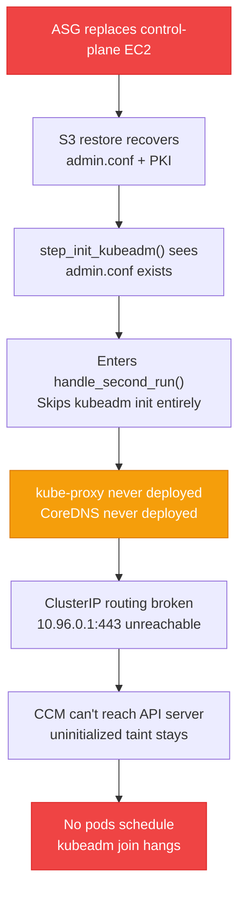

# kube-proxy Missing After DR Restore

## Problem

After the [[aws-ebs-csi|EBS CSI Driver migration]] made the data volume ephemeral (`deleteOnTermination: true`), a specific DR path leaves the cluster without `kube-proxy` — silently breaking all ClusterIP routing.

### Failure Chain



### Why This Happens

`kubeadm init` deploys `kube-proxy` and `CoreDNS` as part of the `addon` phase. On a full first-run bootstrap, this always runs. But on the **DR path**:

1. S3 restore recovers `admin.conf` from the PKI backup
2. `step_init_kubeadm()` detects `admin.conf` already exists
3. It enters `handle_second_run()` instead of running `kubeadm init`
4. `kubeadm init` — and with it, the addon deployment — is **entirely skipped**
5. `kube-proxy` and `CoreDNS` are never deployed

### Secondary: Marker File Race

Calico (`.calico-installed`) and CCM (`.ccm-installed`) marker files live under `/etc/kubernetes/`. The DR restore extracts only the `pki/` subdirectory — marker files are not in the backup. So those `skip_if` guards evaluate `false` and the steps re-install correctly.

But `kube-proxy` has **no marker file**. It's deployed entirely inside `kubeadm init` with no independent recovery path.

---

## Solution: Idempotent Addon Guards

Two guard functions added to `handle_second_run()`:

| Function | Addon | Detection | Recovery |
|---|---|---|---|
| `ensure_kube_proxy(cfg)` | kube-proxy DaemonSet | `kubectl get daemonset kube-proxy -n kube-system` | `kubeadm init phase addon kube-proxy` |
| `ensure_coredns(cfg)` | CoreDNS Deployment | `kubectl get deployment coredns -n kube-system` | `kubeadm init phase addon coredns` |

`kubeadm init phase addon` is an **official kubeadm idempotent command** — it creates the resource only if missing. Safe to run on both first-run and DR paths.

### `ensure_kube_proxy` Implementation

```python
def ensure_kube_proxy(cfg: BootConfig) -> None:
    """Verify kube-proxy DaemonSet exists; re-deploy if missing.

    On a DR restore, admin.conf is recovered from S3 but kubeadm init is
    skipped — kube-proxy never gets deployed. Without kube-proxy, ClusterIP
    routing breaks and the entire cluster fails.
    """
    result = run_cmd(
        ["kubectl", "get", "daemonset", "kube-proxy", "-n", "kube-system"],
        check=False, env=KUBECONFIG_ENV,
    )
    if result.returncode == 0 and "kube-proxy" in result.stdout:
        log_info("kube-proxy DaemonSet already present — no action needed")
        return

    log_warn("kube-proxy DaemonSet MISSING — deploying via kubeadm phase addon")

    private_ip = get_imds_value("local-ipv4")
    if not private_ip:
        raise RuntimeError("Cannot deploy kube-proxy: failed to retrieve private IP")

    run_cmd([
        "kubeadm", "init", "phase", "addon", "kube-proxy",
        f"--apiserver-advertise-address={private_ip}",
        f"--pod-network-cidr={cfg.pod_cidr}",
    ])
    log_info("✓ kube-proxy deployed")

    # Wait up to 60s for at least one Running pod
    for i in range(1, 61):
        result = run_cmd(
            ["kubectl", "get", "pods", "-n", "kube-system",
             "-l", "k8s-app=kube-proxy", "--no-headers"],
            check=False, env=KUBECONFIG_ENV,
        )
        if result.returncode == 0 and "Running" in result.stdout:
            log_info(f"kube-proxy pod running (waited {i}s)")
            return
        time.sleep(1)

    log_warn("kube-proxy pod not Running after 60s — continuing (may self-heal)")
```

### `ensure_coredns` Implementation

```python
def ensure_coredns(cfg: BootConfig) -> None:
    """Verify CoreDNS Deployment exists; re-deploy if missing."""
    result = run_cmd(
        ["kubectl", "get", "deployment", "coredns", "-n", "kube-system"],
        check=False, env=KUBECONFIG_ENV,
    )
    if result.returncode == 0 and "coredns" in result.stdout:
        log_info("CoreDNS deployment already present — no action needed")
        return

    log_warn("CoreDNS deployment MISSING — deploying via kubeadm phase addon")
    run_cmd([
        "kubeadm", "init", "phase", "addon", "coredns",
        f"--service-cidr={cfg.service_cidr}",
    ])
    log_info("✓ CoreDNS deployed")
```

### Integration Point: `handle_second_run()`

```diff
 def handle_second_run(cfg: BootConfig) -> None:
     """Handle second-run: update DNS and refresh kubeconfig."""
     ...
     publish_kubeconfig_to_ssm(cfg)

+    # On DR restore, kubeadm init is skipped because admin.conf was
+    # recovered from S3. kube-proxy and CoreDNS are never deployed.
+    # Without kube-proxy, ClusterIP routing breaks and the cluster
+    # cascades into complete failure.
+    ensure_kube_proxy(cfg)
+    ensure_coredns(cfg)
```

---

## Files Modified

| File | Change |
|---|---|
| `kubernetes-app/k8s-bootstrap/boot/steps/cp/kubeadm_init.py` | `ensure_kube_proxy()`, `ensure_coredns()`, integrated into `handle_second_run()` |
| `kubernetes-app/k8s-bootstrap/boot/steps/control_plane.py` | Matching `_ensure_kube_proxy()`, `_ensure_coredns()` in the monolithic file |
| `kubernetes-app/k8s-bootstrap/tests/boot/test_kubeadm_init.py` | 6 new test cases |

---

## Tests

```bash
cd kubernetes-app/k8s-bootstrap
python -m pytest tests/boot/test_kubeadm_init.py -v
```

| Test | Class | Verifies |
|---|---|---|
| `test_skips_when_daemonset_already_present` | `TestEnsureKubeProxy` | Short-circuits when kube-proxy exists |
| `test_deploys_when_daemonset_missing` | `TestEnsureKubeProxy` | Calls `kubeadm init phase addon kube-proxy` with correct args |
| `test_raises_when_imds_fails` | `TestEnsureKubeProxy` | `RuntimeError` when private IP unavailable |
| `test_skips_when_deployment_already_present` | `TestEnsureCoreDNS` | Short-circuits when CoreDNS exists |
| `test_deploys_when_deployment_missing` | `TestEnsureCoreDNS` | Calls `kubeadm init phase addon coredns` with correct args |
| `test_calls_ensure_guards_during_second_run` | `TestHandleSecondRunGuards` | Both guards invoked from `handle_second_run()` |

All tests use mocked `run_cmd` — no live AWS or system calls.

---

## Manual Recovery

For a cluster already affected (kube-proxy missing, CCM taint stuck):

```bash
# 1. Deploy kube-proxy
kubeadm init phase addon kube-proxy \
  --apiserver-advertise-address=$(curl -s http://169.254.169.254/latest/meta-data/local-ipv4) \
  --pod-network-cidr=192.168.0.0/16

# 2. Deploy CoreDNS
kubeadm init phase addon coredns --service-cidr=10.96.0.0/12

# 3. Wait for kube-proxy pods to start
kubectl -n kube-system get pods -l k8s-app=kube-proxy -w

# 4. Restart CCM to trigger taint removal
kubectl -n kube-system rollout restart daemonset aws-cloud-controller-manager

# 5. Verify taint removed
kubectl get nodes -o jsonpath='{.items[*].spec.taints}'
```

---

## Verification After Code Fix

1. Deploy the code fix
2. Trigger an ASG replacement of the control plane
3. Monitor CloudWatch logs for `ensure_kube_proxy` and `ensure_coredns` log lines
4. Verify workers join: `kubectl get nodes -o wide`

## Related Pages

- [[disaster-recovery]] — DR path overview, `_reconstruct_control_plane`, bootstrap token repair
- [[self-hosted-kubernetes]] — second-run bootstrap path, idempotency marker files
- [[aws-ccm]] — uninitialized taint; what breaks when CCM can't reach the API server
- [[cluster-networking]] — ClusterIP routing architecture
