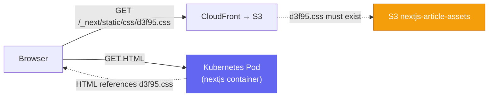
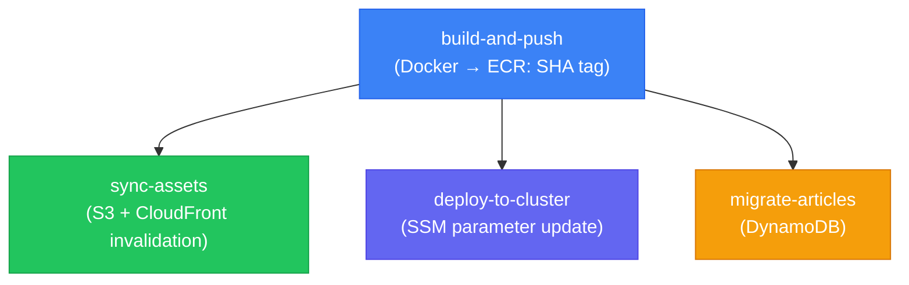

# Next.js Image and Static Asset Sync

Diagnosing and fixing discrepancies between the running Kubernetes container, ECR registry, and S3/CloudFront static assets. The core invariant: **container image and S3 assets must come from the same build**.

## The Build Alignment Problem

Next.js generates **content-hashed filenames** at build time:

```
.next/static/css/d3f953dee4df348d.css
.next/static/chunks/1255-4c9be8da1ab0fb38.js
```

The HTML served by the container references these exact filenames. If the container was built at time T1 and S3 was synced at time T2, the filenames won't match — the browser receives `404` errors for all CSS and JS.



Both the container and S3 **must be from the same build** — same `${{ github.sha }}`.

## Deployment Pipeline (Parallel Tracks)



All four jobs run from the same `${{ github.sha }}`. The container tag, S3 assets, and DynamoDB migration are always aligned within a single pipeline run.

If any track is triggered independently (manual, partial re-run), alignment breaks.

---

## Step 1 — Identify the Running Container Image

```bash
# Pod images in nextjs-app namespace
kubectl get pods -n nextjs-app -o jsonpath=\
'{range .items[*]}{.metadata.name}{"\t"}{.spec.containers[*].image}{"\n"}{end}'

# CSS hash inside the container (record for comparison with S3)
kubectl exec -n nextjs-app deploy/nextjs -- ls /app/.next/static/css/
```

The image tag should be a **SHA hash** (`7-40 hex chars`), not `:latest`. If it shows `:latest`, check Step 5 (Image Updater).

---

## Step 2 — Check ECR for Available Tags

```bash
# Last 5 images sorted by push time (run from local machine)
aws ecr describe-images \
  --repository-name nextjs-frontend \
  --query 'sort_by(imageDetails,&imagePushedAt)[-5:].{tags:imageTags,pushed:imagePushedAt}' \
  --output table --region eu-west-1 --profile dev-account

# Compare with running pod
kubectl get pods -n nextjs-app -o jsonpath='{.items[0].spec.containers[0].image}'
```

---

## Step 3 — Compare Container Assets with S3

```bash
# S3 CSS files
aws s3 ls s3://nextjs-article-assets-development/_next/static/ \
  --recursive --region eu-west-1 --profile dev-account | grep "\.css"

# Container CSS files (from SSM session)
kubectl exec -n nextjs-app deploy/nextjs -- ls /app/.next/static/css/
```

| S3 Hash | Container Hash | Status |
|---|---|---|
| `d3f953dee4df348d.css` | `d3f953dee4df348d.css` | ✅ In sync |
| `d3f953dee4df348d.css` | `4f451864e56822f1.css` | ❌ Mismatch → 404s |

---

## Step 4 — Verify CloudFront

```bash
# Test a static asset via CloudFront
curl -I https://<CLOUDFRONT_DOMAIN>/_next/static/css/<HASH>.css
```

Expected: `HTTP/2 200`, `cache-control: public, max-age=31536000, immutable`, `x-cache: Hit from cloudfront`.

Test the **container's** CSS hash against CloudFront — a `404` confirms the container is requesting files that don't exist in S3.

---

## Step 5 — Check ArgoCD Image Updater

```bash
# Image Updater logs
kubectl logs -n argocd -l app.kubernetes.io/name=argocd-image-updater --tail=30

# Annotations on the ArgoCD application
kubectl get application nextjs -n argocd \
  -o jsonpath='{.metadata.annotations}' | python3 -m json.tool
```

**Required annotations:**

| Annotation | Value |
|---|---|
| `argocd-image-updater.argoproj.io/image-list` | `nextjs=<account>.dkr.ecr.<region>.amazonaws.com/nextjs-frontend` |
| `argocd-image-updater.argoproj.io/nextjs.update-strategy` | `newest-build` |
| `argocd-image-updater.argoproj.io/nextjs.allow-tags` | `regexp:^[0-9a-f]{7,40}$` |
| `argocd-image-updater.argoproj.io/write-back-method` | `argocd` |

---

## Issue 1: CSS/JS 404s — Build Hash Mismatch

**Symptoms:** Page loads unstyled; DevTools shows `404` for `/_next/static/css/*.css`; container hash ≠ S3 hash.

**Root cause:** Container image and S3 assets came from different builds.

**Fix:**

Option A (recommended) — re-trigger the full `Deploy Frontend` pipeline via `workflow_dispatch`. Both tracks run from the same SHA.

Option B — update container to match S3 (find matching SHA from ECR timestamps, then use ArgoCD parameter override):
```bash
kubectl patch application nextjs -n argocd --type merge -p '{
  "spec": {
    "source": {
      "helm": {
        "parameters": [
          {"name": "image.tag", "value": "<MATCHING_SHA_TAG>"}
        ]
      }
    }
  }
}'
```

---

## Issue 2: Image Updater Cannot List ECR Tags

**Symptoms:** `not authorized to perform: ecr:ListImages` in Image Updater logs; pod image never updates from `:latest`; `errors=1` every cycle.

**Root cause:** Worker IAM role missing `ecr:ListImages` and `ecr:DescribeImages`.

**Fix:** Add to `worker-asg-stack.ts` CDK stack:
```typescript
launchTemplateConstruct.addToRolePolicy(new iam.PolicyStatement({
    sid: 'EcrPullImages',
    actions: [
        'ecr:GetDownloadUrlForLayer',
        'ecr:BatchGetImage',
        'ecr:BatchCheckLayerAvailability',
        'ecr:ListImages',        // ← Required for Image Updater
        'ecr:DescribeImages',    // ← Required for Image Updater
    ],
    resources: [`arn:aws:ecr:${this.region}:${this.account}:repository/*`],
}));
```

---

## Issue 3: ArgoCD Self-Heal Reverts Manual Changes

**Symptoms:** `kubectl set image` succeeds but pod reverts within seconds; ArgoCD sync triggered immediately after.

**Root cause:** ArgoCD `selfHeal: true` reverts any deviation from Git-defined state. `kubectl set image` writes to the live cluster, not to Git — ArgoCD overwrites it.

**Fix:** Use ArgoCD parameter override (modifies the ArgoCD Application spec, which IS the desired state):
```bash
kubectl patch application nextjs -n argocd --type merge -p '{
  "spec": {
    "source": {
      "helm": {
        "parameters": [
          {"name": "image.tag", "value": "<SHA_TAG>"}
        ]
      }
    }
  }
}'
```

> This is the correct permanent override. ArgoCD treats its own Application spec as authoritative — a parameter override here is not reverted.

---

## Issue 4: `:latest` Tag Never Updates (start-admin)

**Symptoms:** `start-admin` uses `tag: "latest"` in `start-admin-values.yaml`; Image Updater never updates it; pod always runs a stale image.

**Root cause:** The `allow-tags` regexp `^[0-9a-f]{7,40}(-r[0-9]+)?$` **never matches** `:latest`. Image Updater only considers tags that match the regexp when selecting the newest image. Since `:latest` doesn't match, Image Updater always reports "no new image found".

**Fix:** Push a SHA-tagged image to ECR and update `start-admin-values.yaml` to pin a real commit SHA:
```yaml
image:
  tag: "abc1234def5678"   # not "latest"
```

> This is a known open issue. The deployment test guide documents `start-admin` as **Degraded** with this root cause.

---

## Issue 5: CloudFront Cache Not Invalidated

**Symptoms:** `sync-static-to-s3.ts` logs `CloudFront distribution ID not found in SSM. Skipping invalidation.`; S3 has updated files but CloudFront serves stale versions.

**Root cause:** SSM parameter `/nextjs/<env>/cloudfront/distribution-id` doesn't exist.

**Fix:**
```bash
# Get distribution ID
aws cloudfront list-distributions \
  --query 'DistributionList.Items[*].[Id,Origins.Items[0].DomainName]' \
  --output table --profile dev-account

# Create SSM parameter
aws ssm put-parameter \
  --name "/nextjs/development/cloudfront/distribution-id" \
  --value "<DISTRIBUTION_ID>" \
  --type String \
  --region eu-west-1 --profile dev-account
```

> For `_next/static/*` assets with content-hashed names, CloudFront invalidation is rarely needed — filenames change on every build. It's useful for non-hashed routes (`/`, `/admin`, etc.).

---

## Issue 6: Pod Not Pulling Updated `:latest` Image

**Symptoms:** ECR `:latest` updated but `kubectl rollout restart` still runs old image.

**Root cause:** `imagePullPolicy: IfNotPresent` (Kubernetes default for named tags) — if the image is cached on the node, Kubernetes won't re-pull.

**Fix:**
```bash
# Force pod recreation
kubectl rollout restart deployment nextjs -n nextjs-app

# Nuclear: delete pods to force re-pull
kubectl delete pod -n nextjs-app -l app=nextjs
```

For a permanent fix, set `imagePullPolicy: Always` in Helm values — but prefer SHA-tagged images with Image Updater instead.

---

## End-to-End Validation

```bash
# 1. Container and S3 CSS hashes must match
kubectl exec -n nextjs-app deploy/nextjs -- ls /app/.next/static/css/
aws s3 ls s3://nextjs-article-assets-development/_next/static/css/ \
  --region eu-west-1 --profile dev-account

# 2. CloudFront serves the asset
curl -I https://<CLOUDFRONT_DOMAIN>/_next/static/css/<HASH>.css
# Expected: HTTP/2 200, cache-control: immutable

# 3. Browser test: no 404s in DevTools → Network tab for _next/static/*
```

## Related Pages

- [[argo-rollouts]] — Blue/Green promotion, Image Updater write-back, start-admin :latest tag bug, deployment testing workflow
- [[argocd]] — selfHeal override pattern, ArgoCD parameter overrides vs `kubectl set image`
- [[aws-cloudfront]] — CloudFront distribution, cache invalidation, `X-Origin-Verify` header
- [[github-actions]] — frontend parallel pipeline, build-and-push ∥ sync-assets ∥ deploy-to-cluster
- [[kubectl-operations]] — BlueGreen testing commands, AnalysisRun inspection, Traefik connectivity
