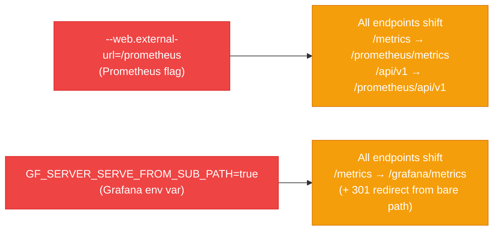

# Prometheus Scrape Target Failures

Six production issues from the [[observability-stack]], all rooted in one underlying cause: **sub-path routing**. The monitoring stack exposes Prometheus at `/prometheus` and Grafana at `/grafana` via Traefik IngressRoutes — this moves every HTTP endpoint under the prefix and is the source of most scrape configuration bugs.

## Root Cause: Sub-Path Routing



The Kubernetes Service DNS name and port stay the same. Only the **URL path** must include the prefix. Every URL reference to these services — scrape targets, datasource URLs, remote_write endpoints — must be updated accordingly.

---

## Issue 1: kubernetes-service-endpoints — Port Used as Hostname

**Symptom:**
```
Error: Get "http://9090/metrics": dial tcp: lookup 9090: no such host
Error: Get "http://9094/metrics": dial tcp: lookup 9094: no such host
```

Prometheus treats port numbers as hostnames.

**Root cause:** The relabel rule replaced `__address__` with only the annotation port:

```yaml
# BROKEN — discards the IP, sets address to just the port number
- source_labels: [__meta_kubernetes_service_annotation_prometheus_io_port]
  action: replace
  target_label: __address__
  regex: (.+)
  replacement: ${1}
```

**Fix:** Use two `source_labels` joined by `;` to preserve the IP:

```yaml
# CORRECT — joins "10.244.0.15:8080" and "9090" → extracts IP + new port
- source_labels: [__address__, __meta_kubernetes_service_annotation_prometheus_io_port]
  action: replace
  target_label: __address__
  regex: ([^:]+)(?::\d+)?;(\d+)
  replacement: ${1}:${2}
```

| Regex part | Meaning |
|---|---|
| `([^:]+)` | Capture group 1: IP address (everything before `:`) |
| `(?::\d+)?` | Non-capturing: discard existing port |
| `;` | Prometheus separator between `source_labels` |
| `(\d+)` | Capture group 2: annotation port |

Also add scheme and path annotation support:

```yaml
- source_labels: [__meta_kubernetes_service_annotation_prometheus_io_scheme]
  action: replace
  target_label: __scheme__
  regex: (https?)

- source_labels: [__meta_kubernetes_service_annotation_prometheus_io_path]
  action: replace
  target_label: __metrics_path__
  regex: (.+)
```

---

## Issue 2: Prometheus Self-Scrape Returns 404

**Symptom:**
```
Endpoint: http://localhost:9090/metrics
State:    down
Error:    server returned HTTP status 404 Not Found
```

**Root cause:** `--web.external-url=/prometheus` moves the metrics endpoint from `/metrics` to `/prometheus/metrics`. The self-scrape job used the default path.

**Fix:**
```yaml
- job_name: prometheus
  metrics_path: /prometheus/metrics   # required — default /metrics no longer exists
  static_configs:
    - targets: ["localhost:9090"]
```

**Verify:**
```bash
# Should return 404 (wrong path)
sudo kubectl run curl-test --rm -it --restart=Never \
  --image=curlimages/curl -- \
  curl -s -o /dev/null -w "%{http_code}" \
  http://prometheus.monitoring.svc.cluster.local:9090/metrics

# Should return 200 (correct path)
sudo kubectl run curl-test2 --rm -it --restart=Never \
  --image=curlimages/curl -- \
  curl -s -o /dev/null -w "%{http_code}" \
  http://prometheus.monitoring.svc.cluster.local:9090/prometheus/metrics
```

---

## Issue 3: Grafana Scrape Fails — Redirect Loop

**Symptom:**
```
Endpoint: http://grafana.monitoring.svc.cluster.local:3000/metrics
State:    down
Error:    Get "http://localhost/grafana/metrics": dial tcp [::1]:80: connect: connection refused
```

Prometheus followed a 301 redirect to `localhost:80` — which nothing listens on.

**Root cause:** With `GF_SERVER_SERVE_FROM_SUB_PATH=true`, Grafana issues a 301 redirect from `/metrics` → `http://localhost/grafana/metrics` (using `GF_SERVER_ROOT_URL` which resolves to `localhost:80` inside the pod).

**Fix:**
```yaml
- job_name: grafana
  metrics_path: /grafana/metrics   # bypass the redirect entirely
  static_configs:
    - targets: ["grafana.monitoring.svc.cluster.local:3000"]
```

---

## Issue 4: Prometheus Service-Endpoint Still 404 After Relabel Fix

**Symptom:** After fixing Issue 1, the endpoint IP:port is now correct — but still 404:
```
Endpoint: http://192.168.177.52:9090/metrics
State:    down
Error:    server returned HTTP status 404 Not Found
```

**Root cause:** The `kubernetes-service-endpoints` job auto-discovers the Prometheus Service (which has `prometheus.io/scrape: "true"`), but the Service was missing the `prometheus.io/path` annotation. The job defaulted to `/metrics` — which doesn't exist (see Issue 2).

**Fix — add the path annotation to the Prometheus Service:**
```yaml
annotations:
  prometheus.io/scrape: "true"
  prometheus.io/port: "9090"
  prometheus.io/path: "/prometheus/metrics"   # required — matches --web.external-url
```

The relabel config added in Issue 1 picks this up via:
```yaml
- source_labels: [__meta_kubernetes_service_annotation_prometheus_io_path]
  action: replace
  target_label: __metrics_path__
  regex: (.+)
```

---

## Issue 5: Next.js Metrics Not Appearing

**Symptom:** No `nextjs-app` target in Prometheus at all.

**Root cause:** No scrape job existed. This was not a bug — it was a missing feature. The Next.js app exposes metrics via `prom-client` at `/api/metrics` on port 3000.

**Fix — add scrape job:**
```yaml
- job_name: nextjs-app
  metrics_path: /api/metrics
  static_configs:
    - targets: ["nextjs.nextjs-app.svc.cluster.local:3000"]
```

The Next.js `NetworkPolicy` already permitted ingress from the `monitoring` namespace on port 3000:
```yaml
- from:
    - namespaceSelector:
        matchLabels:
          kubernetes.io/metadata.name: monitoring
  ports:
    - port: 3000
```

No NetworkPolicy change needed — cross-namespace scraping was pre-approved.

**Verify:**
```bash
sudo kubectl run curl-test --rm -it --restart=Never \
  -n monitoring --image=curlimages/curl -- \
  curl -s -o /dev/null -w "%{http_code}" \
  http://nextjs.nextjs-app.svc.cluster.local:3000/api/metrics
```

---

## Issue 6: github-actions-exporter Connection Refused

**Symptom:**
```
Endpoint: http://github-actions-exporter.monitoring.svc.cluster.local:9101/metrics
State:    down
Error:    dial tcp 10.97.235.176:9101: connect: connection refused
```

`connection refused` (not 404) means nothing is listening on the port — there are no pods.

**Root cause:** The exporter was explicitly disabled:
```yaml
# values-development.yaml
githubActionsExporter:
  replicas: 0   # Service exists, no pods backing it → connection refused
```

**Fix:**
1. Create the Kubernetes Secret:
```bash
sudo kubectl create secret generic github-actions-exporter-credentials \
  --from-literal=github-token=<PAT> \
  -n monitoring
# PAT requires: actions:read (fine-grained) or repo (classic)
```

2. Enable in values:
```yaml
githubActionsExporter:
  replicas: 1
```

---

## Related Fix: Grafana Datasource URL Returns 404

**Root cause:** Grafana datasource URL missing the `/prometheus` prefix.

```yaml
# BEFORE
url: http://prometheus.monitoring.svc.cluster.local:9090

# AFTER
url: http://prometheus.monitoring.svc.cluster.local:9090/prometheus
```

After updating and ArgoCD syncing: `kubectl rollout restart deployment grafana -n monitoring`.

---

## Related Fix: Tempo remote_write URL Returns 404

**Root cause:** Tempo's metrics_generator `remote_write` URL missing the `/prometheus` prefix.

```yaml
# BEFORE
remote_write:
  - url: http://prometheus.monitoring.svc.cluster.local:9090/api/v1/write

# AFTER
remote_write:
  - url: http://prometheus.monitoring.svc.cluster.local:9090/prometheus/api/v1/write
```

---

## Sub-Path Prefix Reference Table

Every URL that references a sub-path-routed service must include the prefix:

| Configuration | Needs Prefix? | Correct Value |
|---|---|---|
| Prometheus self-scrape `metrics_path` | Yes | `/prometheus/metrics` |
| Prometheus Service annotation `prometheus.io/path` | Yes | `/prometheus/metrics` |
| Grafana scrape `metrics_path` | Yes | `/grafana/metrics` |
| Grafana datasource URL | Yes | `...:9090/prometheus` |
| Tempo `remote_write` URL | Yes | `...:9090/prometheus/api/v1/write` |
| Next.js scrape `metrics_path` | Custom | `/api/metrics` (app-defined, not sub-path related) |
| Kubernetes Service DNS name and port | No | `prometheus.monitoring.svc:9090` (unchanged) |

> The Service acts as a TCP proxy — it doesn't inspect HTTP paths. Only the URL path portion needs the prefix.

---

## ConfigMap Change Workflow

All Prometheus and Grafana configuration lives in Kubernetes ConfigMaps. Changes require:

1. Modify the file in the Helm chart
2. Commit and push to `develop`
3. Wait for ArgoCD to sync (~1–3 minutes)
4. Manually restart the deployment:

```bash
sudo kubectl rollout restart deployment prometheus -n monitoring
sudo kubectl rollout restart deployment grafana -n monitoring
```

> ConfigMap changes **do not** automatically restart pods. The `rollout restart` command adds a `restartedAt` annotation, forcing pod recreation.

---

## Common Verification Commands

```bash
# Check all target states via API
sudo kubectl run curl-targets --rm -it --restart=Never \
  --image=curlimages/curl -- \
  curl -s http://prometheus.monitoring.svc.cluster.local:9090/prometheus/api/v1/targets \
  | python3 -m json.tool

# Test service connectivity from inside the cluster
sudo kubectl run curl-test --rm -it --restart=Never \
  --image=curlimages/curl -- \
  curl -s -o /dev/null -w "%{http_code}" <URL>

# Check service annotations
sudo kubectl get service <name> -n monitoring -o yaml | grep -A10 annotations

# View current Prometheus ConfigMap
sudo kubectl get configmap prometheus-config -n monitoring -o yaml

# Force ArgoCD hard re-sync
sudo kubectl patch application monitoring -n argocd \
  --type merge \
  -p '{"metadata":{"annotations":{"argocd.argoproj.io/refresh":"hard"}}}'
```

---

## Related Pages

- [[observability-stack]] — full LGTM stack architecture; Prometheus role
- [[promtail]] — log shipper DaemonSet; separate from Prometheus scraping
- [[traefik]] — sub-path routing via IngressRoute; root cause of all issues in this guide
- [[kubectl-operations]] — ephemeral pod pattern; rollout restart; ArgoCD sync
- [[argocd]] — manages monitoring Helm chart; ConfigMap sync workflow
